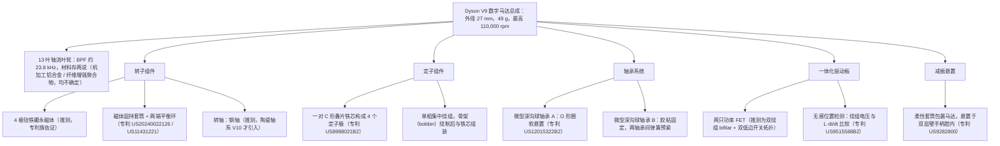
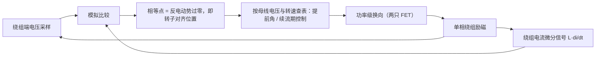
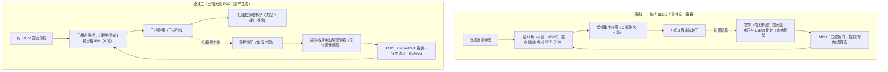
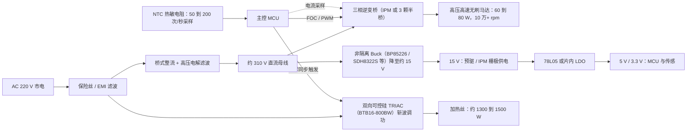
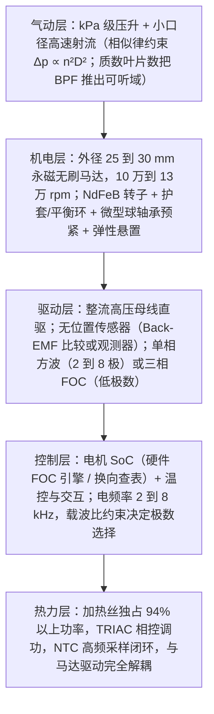

# 第 1 章 高速风筒数字马达产品调研：戴森、追觅、徕芬等

> 本章是全书的产品调研章。我们从"为什么吹风机马达必须提速到 10 万转以上"这一物理问题出发，梳理戴森数字马达（Dyson Digital Motor, DDM）二十余年的代际演进，解剖 Supersonic 吹风机所用的 V9 马达，再系统调研追觅、徕芬、小米等国产方案，对比"单相 BLDC"与"三相无感 FOC"两条驱动路线，最后抽象出高速风筒马达的共性架构，为后续章节（第 2 章电机第一性原理、第 3 章 FOC 原理、第 4 章工作过程逐步解析、第 5 章关键参数与失效管控）铺垫。
>
> 凡涉及具体产品参数，均在章末"参考资料"中给出出处编号 `[n]`；无一手来源者标注 **[估计值]** / **[推测]** / **[不确定]**。

---

## 1.1 品类演进：从传统 AC 马达到高速数字马达

### 1.1.1 传统吹风机的动力架构及其瓶颈

传统吹风机的动力核心是交流串励马达（AC universal motor，即通用电机/有刷串励电机）或低压永磁有刷直流马达，转速大致在 2 万～3 万 rpm 量级 **[估计值，行业通识]**，带动一只直径较大的轴流或离心风扇，把风"推"过加热丝。这一架构存在三个结构性瓶颈：

1. **碳刷寿命与噪声**：有刷换向器在 2 万 rpm 以上磨损加剧、电火花噪声大，转速上探受限；
2. **体积与重量**：马达+风扇组件必须塞进机头，导致整机头重脚轻，典型传统吹风机马达约 90～100 g（戴森对比口径 [11][14]）；
3. **噪音频谱落在人耳敏感区**：低转速大风扇的气动噪声基频在几百 Hz 到几 kHz，恰好是人耳最敏感的频段。

### 1.1.2 风量 vs 风压：为什么必须提速

风机（fan）设计服从相似定律（fan affinity/similarity laws）：对几何相似的叶轮，体积流量 $Q$、压升 $\Delta p$、气动功率 $P_{air}$ 与转速 $n$、叶轮直径 $D$、空气密度 $\rho$ 的关系为

$$
Q \propto n D^{3}, \qquad
\Delta p \propto \rho\, n^{2} D^{2}, \qquad
P_{air} \propto \rho\, n^{3} D^{5}.
$$

吹风机的干发效率本质上取决于**出口射流速度**（带走水分的对流换质能力）而非单纯的风量。要把空气从小口径喷嘴以速度 $v$ 喷出，风机至少要建立与出口动压同量级的压升：

$$
q = \frac{1}{2}\rho v^{2}.
$$

取 $\rho = 1.2\ \mathrm{kg/m^3}$：$v = 46\ \mathrm{m/s}$（戴森 Supersonic 宣称风速 [12]）对应动压约 $1.27\ \mathrm{kPa}$；国产机型宣称的 $60\sim65\ \mathrm{m/s}$ 对应 $2.2\sim2.5\ \mathrm{kPa}$。也就是说，高速风筒需要 **kPa 级的风压**，而传统大直径低转速风扇的压升只有百 Pa 量级，只能吹出十几 m/s 的风。

由相似律 $\Delta p \propto n^2 D^2$：**压升由叶尖速度 $u = \pi D n / 60$ 决定**。想把马达和风道塞进直径不到 30 mm 的手柄（$D$ 缩小 3～5 倍），又要把压升提高一个量级，唯一的出路就是把 $n$ 提高到 **10 万 rpm 以上**。这就是 2016 年戴森 Supersonic 之后整个品类换代的物理逻辑。

### 1.1.3 体积与重量：功率密度随转速上升

电机输出功率 $P = T\omega$。在磁负荷、电负荷与散热能力给定时，电机的连续转矩 $T$ 大体正比于转子体积（$T \propto D_r^2 L$），因此**同样的气动功率，转速越高，需要的转矩越小，电机就可以做得越小越轻**。戴森给出的对照：V9 马达直径 27 mm、重 49 g，转速"比普通吹风机马达快 8 倍、重量约一半" [11][14]。马达小到能放进手柄，整机重心从机头移到手部，这是 Supersonic 形态革命的根源。

### 1.1.4 噪音频移：把单音推出可听域

风扇最刺耳的单音噪声位于叶片通过频率（Blade Passing Frequency, BPF）及其谐波：

$$
f_{BPF} = \frac{n_{rpm}}{60}\, Z, \qquad Z = \text{叶片数}.
$$

传统吹风机（如 $n = 2.4$ 万 rpm、$Z = 7$）的 BPF 约 2.8 kHz，正落在人耳最敏感频段。而戴森 V9 取 $Z = 13$（质数，抑制与定子结构的周期性干涉），$n = 110{,}000$ rpm 时

$$
f_{BPF} = \frac{110{,}000}{60}\times 13 \approx 23.8\ \mathrm{kHz} > 20\ \mathrm{kHz},
$$

一阶叶片单音被整体推到人耳可听域之外——这是 Supersonic 主观"安静"的核心声学设计 [13]。顺带辨析：产品名 Supersonic 本义为"超音速"，而"频率超出人耳可听域"对应的术语是 ultrasonic（超声），两者并非一词；戴森官方并未说明命名由来，这一超声频段设计与命名或仅为意象上的呼应 **[不确定]**。高转速不仅没有带来更吵的主观感受，反而完成了一次**噪音频移**。

**小结**：高速数字马达换代的三条逻辑链——kPa 级风压需求 → 叶尖速度 → 小直径必须高转速；功率密度 → 高转速小型化 → 重心下移；BPF 频移 → 高转速+质数叶片 → 主观降噪。三条链都指向同一个答案：**10 万 rpm 级无刷电机**。

---

## 1.2 戴森数字马达（DDM）技术史

### 1.2.1 起点：开关磁阻电机（1999–2009）

戴森 1999 年立项自研电机，第一代 DDM X020（2003 年发布，2004 年投产）采用**开关磁阻电机（Switched Reluctance Motor, SRM）**：无刷、无永磁体、无换向器，转子是软磁叠片凸极，靠定子线圈的磁拉力拖动，用**光学传感器（optical sensor）**检测转子位置，数字控制器内置软启动、能耗管理与故障诊断（甚至有"phone home"远程诊断概念）[1][2]。SRM 转子结构简单坚固、天然适合超高速，X020 达到约 100,000 rpm（1,666 rev/s），但效率只有约 84%，低于优秀无刷永磁电机的 96% 水平 [1]。X020 用于 DC12 吸尘器（2004，日本市场）和 Airblade 干手器（2006），2004–2012 年累计产量约 100 万台。

### 1.2.2 转折：单相永磁无刷路线（2009 至今）

2009 年的 DDM V2 是路线转折点：放弃 SRM，改用**单相永磁无刷直流电机（single-phase brushless DC permanent-magnet motor）**，最高 104,000 rpm，以"世界最快家电电机"宣传，并把驱动电子与马达一体化封装 [3]。此后所有 DDM（V4/V6/V8/V9/V10/Hyperdymium）都是这条路线的迭代，演进主轴是**极数递增**（2 极 → 4 极 → 8 极）、**材料升级**（钢轴 → 陶瓷轴、PEEK+碳纤维叶轮、钕磁体）与**驱动电子升级**。所谓 "digital motor" 的 "digital"，官方定义是：定子绕组由微处理器以数字脉冲（digital pulse technology）按转子位置高频切换磁场极性来驱动转子，全程无碳刷 [5]。

### 1.2.3 代际参数表

| 代号 | 年份 | 拓扑/极数 | 转速 (rpm) | 关键参数 | 代表产品 | 来源 |
|---|---|---|---|---|---|---|
| DDM X020 | 2003 发布 / 2004 投产 | SRM，2 极凸极转子，光学位置传感 | ~100,000 | 效率约 84%；约 400 Air-Watts；碳纤维增强聚合物叶轮 | DC12 吸尘器、Airblade 干手器 | [1][2] |
| DDM V2 | 2009 | 单相永磁 BLDC，2 极 | 104,000 | 电子与马达一体化；宣称效率 84% | DC30/DC31 手持吸尘器等 | [3] |
| DDM V4 | ~2012 | 单相永磁 BLDC | 92,000 | Airblade V 版 1,000 W / Airblade dB 版 1,600 W | Airblade V / Tap 干手器 | [10] |
| DDM V6 | 2013 | 单相永磁 BLDC，4 极，霍尔+全 H 桥（逆向证实） | 110,000（逆向实测常态约 91,000 @ 340 W 输入） | 350 W | DC59/V6 系列无绳吸尘器 | [25][10] |
| DDM V8 | 2016 | 单相永磁 BLDC | 110,000 | 425 W；宣称比 V6 降噪 50% | V8 系列 | [10] |
| **DDM V9** | 2016 | 单相永磁 BLDC，**无位置传感器** | 110,000（另有 115,000 一说 [11]，以官方 110,000 为准 [12]） | **直径 27 mm，重 49 g**；13 叶轴流叶轮；3.5 kPa；13 L/s | **Supersonic 吹风机**、Airwrap | [11][12][14] |
| DDM V10 | 2018 | 单相永磁 BLDC，**8 极** | 125,000 | 525 W；约 125 g；**陶瓷轴**；PEEK+碳纤维叶轮；每秒最高切换 16,000 次 | Cyclone V10 吸尘器 | [6][5] |
| Hyperdymium™（V11 代起品牌名，hyper+neodymium） | 2019– | 单相永磁 BLDC，钕磁体+陶瓷轴 | 125,000（Digital Slim 版 120,000） | V11 增加三重扩压器降噪 | V11/V12/V15 等 | [5] |
| Gen5 Hyperdymium | 2022–2023 | 同路线迭代 | **135,000** | — | Gen5detect / Gen5outsize | [7] |
| Hyperdymium 140k | 2025 | 同路线迭代 | **140,000** | 直径 28 mm，55 AW，功率密度较前代 +34% | PencilVac（38 mm 机身） | [8] |

补充两点：其一，Dyson Zone 耳机内的微型压缩机（最高 9,750 rpm）是戴森最小马达，但不属于高速家族 [9]；其二，2025 年美国市场的"Dyson V9 Motorbar"吸尘器只是产品命名，与 2016 年的 V9 吹风机马达无关，检索资料时注意甄别 [34]。

### 1.2.4 数字验证："每秒切换 16,000 次"从何而来

单相永磁电机的电频率为

$$
f_e = \frac{n_{rpm}}{60}\, p, \qquad p = \text{极对数}.
$$

V10 为 8 极（$p=4$）、125,000 rpm：

$$
f_e = \frac{125{,}000}{60} \times 4 \approx 8{,}333\ \mathrm{Hz}.
$$

单相绕组每个电周期极性翻转 2 次，故换向次数为 $2 f_e \approx 16{,}667$ 次/秒——与官方宣传"每秒最高切换 16,000 次"量级一致，但并非严格吻合：两者相差约 4%，官方数字或为向下取整、或对应略低的工况转速（严格按 16,000 次/秒反推为 120,000 rpm）[5]。同法可得 V9（4 极，$p=2$，110,000 rpm）：$f_e \approx 3{,}667\ \mathrm{Hz}$，换向约 7,333 次/秒。这类换算是检验厂商宣传口径自洽性的基本功。

---

## 1.3 Supersonic V9 马达解剖

### 1.3.1 总体参数

| 项目 | 数值 | 备注 |
|---|---|---|
| 转速 | 最高 110,000 rpm（≈1,833 rev/s） | 官方口径 [12]；Electronics Weekly 报道为 115,000 [11]，两说并存 |
| 外径 | 27 mm | 小到可放入手柄 [12] |
| 重量 | 49 g | "比一枚鸡蛋略轻" [14] |
| 叶轮 | 13 叶轴流叶轮（axial-flow impeller） | BPF ≈ 23.8 kHz [13] |
| 压升 / 流量 | 3.5 kPa / 13 L/s | 官方 spec [12]；两者为风机曲线上不同工况点的最大值 |
| 极数 / 相数 | 4 极 / 单相 | **[推测]** 依专利族 US8988021B2 及同架构 V6 逆向 [17][25] |
| 驱动 | 市电整流供电，无位置传感器，两只 FET 驱动 | [11] |
| 开发投入 | 整机 4–5 年、约 600 台原型、103 名工程师、约 £5,000 万 | [15] |

结构框图如下（含推测项标注）：

### 1.3.2 定子

依据戴森单相高速电机的母专利族 US8988021B2（同族 US20110254483A1）：定子由**一对 C 形铁芯（two C-shaped cores）构成 4 个定子极**，导线绕制在骨架（bobbin）上形成**单相集中绕组**，再与铁芯组装 [17]。V9 与该专利族拓扑一致 **[推测：专利族+产品照片佐证，戴森未公布 V9 定子细节]**。更晚的专利 WO2023285808A1 描述了"多个铁芯+骨架+绕组子组件，用 overmould 注塑框架整合、框架带气流孔"的模块化定子 [20]。叠片牌号与厚度未公开 **[不确定]**；旁证是戴森 2022 年申请了"磁性低通滤波"专利（US20240421745A1）专门衰减 PWM 高频谐波引起的铁芯涡流损耗，说明高频铁损是这一速度域的实际痛点 [23]。

### 1.3.3 转子

- **磁极**：4 极永磁转子 **[推测：US8988021B2 明确 four-pole permanent-magnet rotor；同架构 V6 被逆向证实为 4 极单相]** [17][25]。
- **磁材**：钕铁硼（NdFeB）——戴森在 Hyperdymium 命名（hyper + neodymium）与宣传中明确使用钕磁体 [5]；V9 磁体的具体牌号与工艺未公开 **[不确定]**。
- **磁体固持**：专利 US20240022126 描述圆筒形**固持套筒（retention sleeve）**压装包覆磁体、法兰做轴向+径向约束 [22]；转子两端设**平衡环（balancing rings）**用于动平衡校正（US11431221）[21]。V9 套筒材质（碳纤维缠绕或金属）未证实 **[不确定]**。
- **转轴**：V9 时代为钢轴 **[推测]**——陶瓷轴是 V10（2018）才引入的卖点，戴森解释改用陶瓷的理由正是"钢轴在 125,000 rpm 下会有 10–20 µm 挠曲" [6]，反证 V9 及之前为钢轴。

转子的机械负荷有多苛刻？角速度 $\omega = 2\pi \times 110{,}000/60 \approx 1.15\times10^{4}\ \mathrm{rad/s}$，在叶轮外缘半径 $r = 13.5\ \mathrm{mm}$ 处的向心加速度

$$
a = \omega^{2} r \approx (1.15\times10^{4})^{2} \times 0.0135 \approx 1.8\times10^{6}\ \mathrm{m/s^2} \approx 1.8\times10^{5}\, g.
$$

旋转薄环的周向应力近似 $\sigma \approx \rho_m u^{2}$（$\rho_m$ 为材料密度，$u$ 为线速度）。叶尖速度 $u = \pi D n/60 \approx \pi \times 0.027 \times 1833 \approx 155\ \mathrm{m/s}$（马赫数约 0.45），铝合金（$\rho_m = 2700\ \mathrm{kg/m^3}$）对应约 65 MPa 的基础环向应力，再叠加叶根弯曲应力——这解释了为什么叶轮材料、磁体护套与动平衡是高速马达的三大机械命门。

### 1.3.4 叶轮

13 叶、轴流式，外径受 27 mm 外壳约束。**材料存在矛盾记载，标注 [不确定]**：前戴森设计师作品页称 V9 为 "machined impeller"（机加工，暗示铝合金）；亦有资料称选用碳纤维增强聚合物承受离心应力（该说法可能与 X020/V10 混淆）；PEEK+碳纤维复合叶轮（叶片重叠 overlapped vanes 增大做功面积）是 **V10** 的官方明确卖点，不能外推到 V9 [6]。中文拆解显示国产同级 11 万转风筒马达普遍用铝合金叶轮，可作旁证。结论：V9 叶轮最可能为精密机加工铝合金或纤维增强聚合物，无一手确证。

### 1.3.5 轴承与减振

- **轴承**：微型深沟球轴承（deep groove ball bearing）×2 + 预紧 **[推测，专利佐证]**。戴森轴承专利（US12015322B2）描述：一端轴承经 **O 形圈**软安装于框架（隔离结构噪声传递），另一端轴承胶粘固定，两轴承间设预紧弹簧（biasing element）消除游隙 [23]。是否陶瓷球、具体型号未公开 **[不确定]**。
- **整机减振**：Supersonic 结构专利（US9282800B2/US20150157106A1 家族）描述手柄双层壁结构，马达装于内壁腔体、由**柔性套筒（flexible sleeve）**包裹悬置，加进气道声学处理，阻断结构传声 [19]。

### 1.3.6 驱动板与无感换向

Electronics Weekly 对 Supersonic（HD01, 2016）的报道给出关键信息：**单相无感（sensorless）永磁无刷马达，由整流后的市电供电，由两只 FET 驱动** [11]。"两只 FET"意味着不是 4 管全 H 桥，最可能是**双绕组（bifilar winding）+ 双低边开关**的单相拓扑 **[推测]**。作为对照，电池供电的 V6/V8 吸尘器被逆向证实为**霍尔传感器 + 单相全 H 桥** [24][25][26]——即戴森并非"全系无感"，而是**电池吸尘器带霍尔、市电吹风机用无感**的混合策略。

V9 的无感位置检测方法来自专利 US9515588B2，颇具特色：**不**采用"悬挂励磁窗口测反电动势（Back Electromotive Force, Back-EMF）过零"的传统做法，而是**同时采样绕组电压信号与绕组电流微分信号（$L\,\mathrm{d}i/\mathrm{d}t$），两者相等处即对应反电动势过零（转子对齐位置）**，产生边沿后按相对时刻施加提前角换向。单绕组既做驱动又做位置测量，无需中断励磁，每半电周期可注入更多功率 [18]。

换向策略层面（US8988021 家族）：含**提前角/滞后角（advance/retard angle）与续流（freewheel）期控制**，按母线电压与转速查表调整，在效率与出力之间寻优 [17]。整机由单 MCU 同时管理马达、可控硅调功的加热丝与负离子发生器 [11]；出风口温度由玻璃珠热敏电阻监测（初代 20 次/秒，2026 年 HD19 提升至 100 次/秒），防止过热损伤头发 [16][33]。售后市场 V9 马达+驱动板组件标注直流母线约 140–180 VDC、功率 70 W **[第三方配件页信息，不确定]** [65]。需要调和的是：140–180 VDC 与 100–120 V 市电（日/美版）整流后的母线电压吻合，而 220–240 V 市电整流后母线应约 310–340 VDC——该配件页信息或仅适用于低压市电版本，不能直接外推到 220–240 V 版整机。

### 1.3.7 气动功率与马达电功率估算

用官方 spec 做一个上界估算：

$$
P_{air} \le Q_{max}\,\Delta p_{max} = 0.013\ \mathrm{m^3/s} \times 3500\ \mathrm{Pa} \approx 45.5\ \mathrm{W}.
$$

注意 $Q_{max}$ 与 $\Delta p_{max}$ 是风机曲线上两个不同工况点的最大值，实际工作点的气动功率低于此上界；计入叶轮效率与电机效率，V9 的电输入功率应在几十瓦到百瓦以内 **[估计值]**——与售后配件标注的 70 W [65]、以及米家同级马达铭牌 60 W（见 1.6 节）在量级上互相印证。这个数字揭示了高速风筒的功率真相：**马达只占整机功率的一个零头，绝大部分功率在加热丝上**（详见 1.6.3）。

### 1.3.8 制造工艺（附）

戴森新加坡马达工厂（2012–2013 投产，投资约 8,000 万美元）采用双螺旋布局全自动产线，约 50 台机器人，每条线仅 13 名操作员，**每 2～2.6 秒下线一台马达**，装配公差达 **5 µm 级**；陶瓷轴只允许机器人抓取 [27][28]。新加坡基地累计产量已超 1 亿台 [29]。V9 官方称"全自动装配（assembled autonomously）"。工艺能力本身就是高速马达的竞争壁垒——这一点在国产阵营的徕芬身上同样得到验证（见 1.4.2）。

---

## 1.4 国产方案调研：追觅、徕芬、小米、素士等

### 1.4.1 追觅（Dreame）

追觅 2018 年自研出 10 万 rpm 高速数字马达，随后相继实现 12.5 万、15 万、16 万 rpm [35]；2024 年研发成功 20 万 rpm 马达（获 Frost & Sullivan 全球首创认证），2025 年上半年实现全球首个量产落地，搭载于 Z50 Station 吸尘器 [66]——但需要甄别口径：**12.5 万以上转速主要用于无线吸尘器等清洁电器数字马达，并非吹风机** [35][66]。吹风机线：2019 年首款"追觅经典 1.0"搭载 11 万 rpm 马达；2022 年"光蕴小金管"行业首发 **13 万 rpm** 高速无刷马达（65 m/s 风速、13 L/s 风量）[36][37]；Pocket 折叠系列为 11 万 rpm、70 m/s [38]。即追觅在售吹风机马达实际为 11 万～13 万 rpm，"16 万/20 万转"是吸尘器纪录，营销上常被混用。

技术要点：创始人俞浩团队约三年突破 10 万转，马达设计遵循"五角星模型"（高功率效率/低噪音/高转速/小体积/防水），电机工作温度控制在约 110 ℃，叶轮由离心式改进为混流式 [39]。马达尺寸重量无官方数据 **[不确定；同类直白 HL9 马达直径 29 mm 可作量级参考，估计 25–30 mm 级]**。

**拆解实证（追觅 G10，2024）**：11 万 rpm、65 m/s；主控**峰岹 FU6812L**（内置硬件 FOC 引擎），配 **3 颗晶艺 LAS1M0761 半桥**驱动电机，士兰微 SDH8322S 非隔离降压辅助供电；恒温算法 200 次/秒测温、57 ℃ 控温——**标准的三相无感 FOC 路线** [40]。另一篇拆解见 FU6812L2 + 晶艺 LAS1M0669 智能功率模块（Intelligent Power Module, IPM）组合，并指出"MCU + IPM（预驱+MOS 合封）已成主流" [41]。

### 1.4.2 徕芬（Laifen）

徕芬 2021 年以 599 元的 LF03（11 万 rpm）打爆市场，早期款主控为峰岹 FU6812/61 系列 [42]；后续 SE（10.5 万 rpm）/SE 02（10.8 万 rpm，中微 CMS32M5710 + 吉林华微 SPE05M50T-C 三相 IPM）[44][45]、SE Lite（中微 CMS32M5710 + 亿晶微 EG27710 半桥）[46]；2025 年 Swift 4 搭载**第 4 代自研三相电机，11.5 万 rpm**，并改用"一体式轴承"（轴与轴承一体结构，减少摩擦与装配误差）[43]。

徕芬是国产头部品牌中**唯一明确"电机 100% 自研自产"**的：珠海超级工厂投资超 5 亿元，年产能千万台级；电机 100+ 道工序，宣称零件加工精度 0.001 mm、动平衡残余不平衡量 1 mg [55][56]。这与戴森"5 µm 装配公差、2 秒一台"的叙事同构——当马达本体 BOM 白菜化之后（见 1.4.5），**工艺与垂直整合成为新的护城河**。

### 1.4.3 小米/米家

- **米家 H501**：整机 1600 W；马达铭牌"**310 V / 60 W / 110,000 rpm**"（东莞联峰电机制造）——这是"高压母线直驱小功率高压马达"架构最直接的实证；主控凌鸥创芯 LKS32MC038Y6P8B + 凌鸥 LKS1D5005DT 高压半桥 + 晶丰明源 BP85956D 降压，加热丝用 BTB16-800BW 双向可控硅（TRIAC）调功 [47]。
- **米家 H700**：10.2 万 rpm、70 m/s、425 g [48]；**米家 H900**：10.6 万 rpm、60 m/s [49]。

### 1.4.4 其他品牌

- **素士 H5**：2 万 rpm 普通直流马达 + 1800 W 大功率加热，是"传统架构靠加热堆参数"的对照样本，**非高速马达** [51]。
- **康夫 F8**：11 万 rpm、65 m/s，峰岹 FU6812L + 华润微 CS5755MT 三相半桥 [52]。
- **小适（ShowSee）**：中微 CMS32M5710 + 华润微 CRMT5004E1 三相半桥 [53]。
- **直白 HL9**：10 万 rpm，V-max 马达直径 29 mm [50]。
- **白牌（华森等，79 元）**：宣称 11 万 rpm，拼多多销量 200 万+，全国产芯片链 [54]。
- **松下某在华型号**：拆解为峰岹 FU6812L + 芯能 XNS06H54D6 半桥——外资品牌也已采用国产芯方案 [53]。
- **戴森 HD19 Supersonic Travel（2026）**：拆解发现**凌鸥创芯 MCU + 3 颗 LKS1D5007DTH 高压单相智能功率模块**（内集成高压驱动 IC + 500 V/7 A MOSFET）、晶丰明源 BP6526B 电源芯片——国产电机芯片生态**反向进入戴森供应链**；此前 HD15 Nural（2024）已用 Microchip MCU + 2 颗 Navitas NV6247 GaNFast 氮化镓（Gallium Nitride, GaN）半桥，HD17 主控为 ST STM32L031 [30][31][32][33]。HD19 三颗半桥的确切拓扑（三相化抑或 H 桥+独立支路）拆解未明说 **[不确定]**。

### 1.4.5 参数与方案对比总表

| 品牌/型号 | 转速 (rpm) | 宣称风速 | 整机功率 | 驱动路线 | 主控 MCU | 功率级 | 来源 |
|---|---|---|---|---|---|---|---|
| 追觅 G10 | 110,000 | 65 m/s | — | 三相无感 FOC | 峰岹 FU6812L | 晶艺 LAS1M0761 ×3 | [40] |
| 追觅 光蕴小金管 | 130,000 | 65 m/s | — | 三相无感 FOC [推测，同平台] | — | — | [36][37] |
| 徕芬 LF03 | 110,000 | 22 m/s | 1600 W 级 | 三相无感 FOC | 峰岹 FU6812/61 系（早期款） | — | [42] |
| 徕芬 Swift 4 | 115,000 | 23 m/s | — | 三相（第 4 代自研电机） | [不确定] | — | [43] |
| 徕芬 SE / SE 02 | 105,000 / 108,000 | — | 1400 W | 三相无感 FOC | 中微 CMS32M5710（SE 02） | 吉林华微 SPE05M50T-C 三相 IPM | [44][45] |
| 徕芬 SE Lite | ~110,000 [推测] | — | 1400 W | 三相无感 FOC | 中微 CMS32M5710 | 亿晶微 EG27710 半桥 | [46] |
| 米家 H501 | 110,000（铭牌 310 V/60 W） | — | 1600 W | 三相无感 FOC | 凌鸥 LKS32MC038Y6P8B | 凌鸥 LKS1D5005DT 半桥 | [47] |
| 米家 H700 | 102,000 | 70 m/s | — | — | — | — | [48] |
| 米家 H900 | 106,000 | 60 m/s | — | — | — | — | [49] |
| 直白 HL9 | 100,000（马达 Φ29 mm） | — | — | — | — | — | [50] |
| 康夫 F8 | 110,000 | 65 m/s | 1600 W 级 | 三相无感 FOC | 峰岹 FU6812L | 华润微 CS5755MT 三相半桥 | [52] |
| 小适 ShowSee | ~110,000 [推测] | — | — | 三相无感 FOC | 中微 CMS32M5710 | 华润微 CRMT5004E1 三相半桥 | [53] |
| 素士 H5（对照） | 20,000 | — | 1800 W | 有刷直流（非高速） | — | — | [51] |
| 白牌华森 | 宣称 110,000 | — | — | — | — | — | [54] |
| 戴森 Supersonic HD01（对照） | 110,000 | 约 46 m/s（整机） | 1600 W | 单相无感 BLDC | 单 MCU（型号未公开） | 两只 FET | [11][12] |
| 戴森 HD19（2026） | 110,000 | — | — | 单相高压 [三相化不确定] | 凌鸥创芯 MCU | 凌鸥 LKS1D5007DTH IPM ×3 | [32][33] |

> **口径提示**：各家"风速"测试标准不一（是否带聚风嘴、测点距离、平均/峰值），徕芬 22–23 m/s 与追觅 65 m/s 不可直接横向比较 **[口径差异]**。转速则相对可比，主流量产区间为 10 万～13 万 rpm。

**成本与供应链**：2021–2022 年高速无刷电机+驱动成本尚在 200 元以上，至 2024–2025 年已降至几十元、电机单体十几元量级，直接催生 79 元白牌与 199 元以下机型 [54]。行业报告口径：2024 年全球高速吹风机产量约 948 万台、均价 102 美元；高速风筒无刷电机国产化率从 2020 年 32% 升至 2025 年 89% **[第三方报告转述，精度存疑]** [64]。轴承是少数仍依赖高端进口件的部位（日系 NMB/EZO 微型深沟球轴承为代表），徕芬以一体式轴承做差异化 [43]。

---

## 1.5 两条驱动技术路线对比：单相 BLDC vs 三相无感 FOC

高速风筒马达驱动收敛为两条路线。**路线一**是戴森开创的**单相 BLDC 方波换向**（位置检测或有霍尔、或无感，视产品而定）；**路线二**是国产阵营几乎全员采用的**三相无感磁场定向控制（Field Oriented Control, FOC）**。

### 1.5.1 原理与结构差异

**单相方波换向**：绕组只有一相，MCU 按转子位置翻转励磁极性。转矩表达为方波电流与梯形反电动势的乘积，存在**零转矩死点**——单相电机必须靠不对称气隙等设计保证停机时转子停在可自启动的位置，并靠提前角/续流精细调度来压榨效率 [17]。优点是功率器件少（H 桥 4 管，戴森 V9 甚至只用 2 管）、绕组端部短、控制算力要求低，代价是转矩脉动大、对电磁设计功力要求极高。

**三相无感 FOC**：把三相电流经 Clarke/Park 变换到与转子同步旋转的 d-q 坐标系，用 PI 电流环独立控制励磁分量 $i_d$ 与转矩分量 $i_q$，经空间矢量脉宽调制（Space Vector PWM, SVPWM）输出。表贴式永磁转子取 $i_d = 0$ 时电磁转矩为

$$
T_e = \frac{3}{2}\, p\, \psi_f\, i_q,
$$

其中 $p$ 为极对数、$\psi_f$ 为永磁磁链。需注明约定：系数 $3/2$ 基于**幅值不变（amplitude-invariant）Clarke 变换约定**（本书全书沿用此约定）；若改用功率不变约定，则无 $3/2$ 系数且 $\psi_f$ 的数值定义不同，后续第 3 章的推导将保持与此处一致。正弦电流+连续矢量控制使转矩脉动远小于方波换向，电磁噪声（相对气动噪声的占比）更低；位置信息由磁链/反电动势观测器从电流电压重构，全程无霍尔。

### 1.5.2 极数选择与频率约束

两条路线在极数上的分野值得深究。电频率 $f_e = n_{rpm}\,p/60$：

- 戴森走**高极数**（V10 为 8 极，$f_e \approx 8.3\ \mathrm{kHz}$）：方波换向每电周期只需 2 次开关事件，高电频率不构成算力负担，而高极数缩短磁路、提升转矩密度；
- 国产 FOC 走**低极数**（典型 2 极，$p=1$ **[推测，行业常规]**，110,000 rpm 时 $f_e \approx 1.83\ \mathrm{kHz}$）：FOC 需要在每个 PWM 周期完成采样-变换-调节-调制，载波比 $N = f_{PWM}/f_e$ 需保持约 10 以上才能维持电流环与观测器精度 **[工程经验]**，低极数把 $f_e$ 压在 2 kHz 量级，PWM 载波取数十 kHz 即可满足——这正是 64 MHz 级 Cortex-M0/8051+硬件 FOC 引擎能驱动 11 万转的前提。峰岹参考方案（FU6812L + FD2504S 高压预驱）能做到 80 W、**最高 20 万 rpm**（若 2 极则 $f_e \approx 3.3\ \mathrm{kHz}$），印证该路线的转速上限仍有裕量 [57]。

### 1.5.3 逐项对比

| 维度 | 单相 BLDC 方波（戴森路线） | 三相无感 FOC（国产主流） |
|---|---|---|
| 功率器件 | 2～4 管（V9 仅 2 只 FET） | 6 管（3 半桥或 1 颗 IPM） |
| 绕组/引线 | 单相，2 线 | 三相，3 线 |
| 位置检测 | 霍尔（戴森电池机型）或专利无感法（市电机型） | 观测器无感，纯电流/电压重构 |
| 极数取向 | 高极数（4→8 极），换向频率高 | 低极数（典型 2 极），压低电频率 |
| 转矩脉动/电磁噪声 | 大（方波+死点），依赖机械与声学设计补救 | 小（正弦+连续控制） |
| 效率 | 依赖提前角/续流查表调优，天花板受方波谐波损耗限制 | SVPWM 正弦驱动，铜损利用率高，$i_d=0$ 最优转矩比 |
| 算力/芯片 | 低算力 MCU 即可，但电磁设计门槛极高（专利壁垒） | 需硬件 FOC 引擎或 M0/M4 级 MCU，芯片生态成熟后成本反而更低 |
| 成本 | 器件省，但马达本体设计与工艺投入大 | 6 管 IPM 已白菜价，公模方案齐全，综合 BOM 低 |
| 可靠性 | 无霍尔版本少一个温度敏感元件；单相绕组简单 | 无霍尔；IPM 合封减少焊点；逐波限流保护完善 |
| 专利格局 | 戴森 500+ 件专利深壕 [23] | 无明显专利封锁，公模扩散极快 |
| 代表实证 | Supersonic 全系；V6/V8/V10 吸尘器 | 追觅 G10、徕芬全系、米家 H501、康夫 F8 等全部拆解样本 |

**判据链（为什么断定国产主流是三相无感 FOC）**：其一，主控芯片全部是三相 FOC 专用 SoC（峰岹 FU6812L 内置硬件 FOC 引擎、中微 CMS32M5710 支持无感双电阻采样+SVPWM 等）；其二，功率级拓扑全部是三相桥（3 颗半桥或三相 IPM）；其三，拆解照片中马达引线均为三根 [40][44][47][52][59][63]。**单相+霍尔**路线在国内仅存于极低成本方案与方案商 Demo，主流品牌拆解中无一例实证 **[基于现有拆解样本的归纳，不确定是否有遗漏]** [62]。

一个耐人寻味的注脚：戴森 2026 年的 HD19 用了 3 颗国产高压半桥 IPM [32][33]——若其驱动确已三相化 **[不确定]**，则意味着两条路线在成本重压下开始合流。

---

## 1.6 主控芯片生态与供电架构

### 1.6.1 电机 SoC 生态

高速风筒驱动芯片已形成全国产生态，格局如下：

| 厂商 | 代表型号 | 架构/特色 | 已知设计导入 | 来源 |
|---|---|---|---|---|
| **峰岹科技 Fortior**（688279.SH，品类开创者） | FU6812L / FU6812L2（LQFP48） | "8051 + ME 电机引擎"双核：FOC/MDU/LPF/PID/SVPWM 由硬件完成；片内高速运放、比较器、预驱、高速 ADC、高压 LDO；配 FD2504S（500 V 级三相预驱）参考方案达 AC220V/80 W/20 万 rpm | 追觅 G10、康夫 F8、松下、早期徕芬 | [40][41][52][57] |
| **中微半导体 Cmsemicon**（近两年上量最快） | CMS32M5710（LQFP48） | Cortex-M0 @64 MHz，64 KB Flash，1.2 Msps 高速 ADC，2 运放+2 比较器+PGA，6 通道 EPWM 带逐波限流；定位"高压高速吹风筒专用"；无感双电阻 FOC 公模 | 徕芬 SE 02/SE Lite、小适等；19 款主流机型拆解统计中出现频次最高的电机 MCU | [44][46][58][59] |
| **凌鸥创芯 LinkoSemi**（已并入晶丰明源） | LKS32MC038Y6P8B | Cortex-M0；与自家 LKS1D5005DT/LKS1D5007DTH 高压半桥/IPM 打包销售 | 米家 H501；戴森 HD19（MCU+IPM） | [47][32] |
| **灵动微 MindMotion** | MM32SPIN0230/0280 | M0 @60 MHz，1 Msps ADC，内置 2 运放 2 比较器，主打高转速低成本无感 FOC | 方案商 10 万转级公模 | [60] |
| **其利天下（方案商自研）** | KY32DQ020/KY32DS024 | M4 @120 MHz 级，12 bit 1 Msps ADC；宣称方案出货千万级、支撑 13 万 rpm | 白牌/ODM 方案 | [61] |

配套功率/电源器件生态：三相桥用吉林华微 SPE05M50T-C（500 V 三相 IPM）、晶艺 LAS1M0761/LAS1M0669 智能 IPM、华润微 CS5755MT/CRMT5004E1、芯能 XNS06H54D6、亿晶微 EG27710；辅助电源用晶丰明源 BP85226/BP85956D、士兰微 SDH8322S/SDH8302S 非隔离 Buck + 78L05 LDO；加热调功用 BTB16-800BW 双向可控硅 [44][46][47][52][63]。海外芯片（Microchip、ST、NXP、Navitas GaN）目前只出现在戴森自家机型中 [30][31][53]。

### 1.6.2 供电架构：高压母线直驱

拆解实证充分的主流架构如下：

要点：

1. **马达绕组按 310 V 母线电压设计**（高压小电流），逆变桥直接从母线取电，省去大功率 DC-DC。铁证是米家 H501 马达铭牌"额定电压 310 V、60 W、110,000 rpm" [47]；峰岹 FD2504S（500 V 预驱）与吉林华微 500 V IPM 的耐压规格亦为印证 [57][44]。"先降压再驱动低压马达"的路线在主流插电机型拆解中未见，主要存在于便携充电式产品 **[推测]**。
2. **加热丝不经过任何功率变换器**，直接挂在市电上由 TRIAC 斩波调功——加热是纯阻性负载，用最便宜的相控方式解决，与马达驱动路径完全解耦。
3. 辅助电源链：310 V → 非隔离 Buck → 15 V（预驱/IPM）→ LDO → 5 V/3.3 V（MCU）。整板不隔离，依靠外壳绝缘保证安全（Class II 思路），部分机型用光耦做交互隔离（徕芬 SE Lite 的群芯微光耦）[46]。

### 1.6.3 功率分配：马达占比不足 6%

以米家 H501 为例做功率与电流核算（220 V 市电）：

$$
P_{motor} = 60\ \mathrm{W} \;\Rightarrow\; I_{bus} \approx \frac{60}{310} \approx 0.19\ \mathrm{A}\ (母线平均);
$$

$$
P_{heater} \approx 1600 - 60 - P_{aux} \approx 1.5\ \mathrm{kW} \;\Rightarrow\; I_{heater} \approx \frac{1500}{220} \approx 6.8\ \mathrm{A}\ (\mathrm{rms}).
$$

即整机 1400～1600 W 中，**马达仅约 60～80 W（占比约 3.7%～5.7%，如 H501 例为 60/1600 ≈ 3.75%），其余 94% 以上全部是加热丝功率** [47][57]。这决定了高速风筒的工程重心：马达驱动板的功率等级其实很小（百瓦级逆变器），真正的大电流通路、发热与安规问题都在加热回路；而温控闭环（NTC 50～200 次/秒采样，追觅宣称 200 次/秒、57 ℃ 恒温出风 [40]；戴森初代 20 次/秒 → HD19 100 次/秒 [16][33]）是用户体验的胜负手。

---

## 1.7 小结：高速风筒马达的共性架构抽象

把戴森与国产方案放在一起看，尽管驱动路线分叉，产品层面的架构已高度收敛。我们把它抽象为五层，这也是本书后续章节的展开顺序：

共性结论：

1. **转速窗口收敛于 10 万～13 万 rpm**（吹风机量产口径，与 1.4.5 一致）：下限由 kPa 级压升+30 mm 直径约束决定，上限受轴承 DN 值、转子应力（$\sigma \approx \rho_m u^2$）与铁损（$f_e$ 千赫级）共同封顶。戴森吸尘器马达虽已达 13.5 万～14 万 rpm，但按本章反复强调的口径原则，不应与吹风机产品线混淆。
2. **无位置传感器是共识**：戴森用"电压 vs $L\,\mathrm{d}i/\mathrm{d}t$"专利比较法，国产用磁链观测器；霍尔仅存于戴森电池机型等特定场景。
3. **驱动电子与马达一体化/近体化**：从 2009 年 DDM V2 到今天的 MCU+IPM 合封，方向一致——缩短高频大 di/dt 回路、降低成本。
4. **极数与控制方式互为因果**：方波换向容忍高电频率故取高极数换转矩密度；FOC 受载波比约束故取低极数压低 $f_e$。这一对偶关系将在第 3 章 §3.10.1 展开定量分析。
5. **马达是"小功率、高难度"部件**：60～80 W 的功率等级，却集中了转子动力学、声学、无感控制、高频磁材四大难题；整机的功率大头（加热）反而技术平淡。
6. **竞争重心已从"能不能转起来"转向工艺与算法**：马达 BOM 降到十几元后，戴森的 5 µm 自动化装配、徕芬的 0.001 mm 精度/1 mg 动平衡、以及温控采样率（20 → 100 → 200 次/秒）成为新的差异化阵地。

后续章节将依次深入：第 2 章从电磁学与机械动力学第一性原理重建电机物理并推导 dq 模型（对应 L2/L3）；第 3 章完整展开 FOC、SVPWM 与无感观测器（L3/L4）；第 4 章沿时间轴逐步解析从上电到满速再到停机的全过程（L3/L4/L5）；第 5 章收束为关键参数手册与失效模式管控 FMEA（覆盖全部五层）。

---

## 参考资料

> 检索/核实日期：2026-07-24。中文拆解类来源（充电头网、Big-Bit 等）部分依据检索摘要引用。

**戴森代际史**

1. Electronics Weekly (2003), "Dyson sweeps up vacuum cleaner market with 100,000rpm" — https://www.electronicsweekly.com/news/archived/resources-archived/dyson-sweeps-up-vacuum-cleaner-market-with-100000rpm-2003-10/
2. Drives & Controls, "Dyson's turbocharged SR motor can phone home" — https://drivesncontrols.com/dysons-turbocharged-sr-motor-can-phone-home/
3. Electronics Weekly (2009), "Dyson vacuums 104,000rpm brushless DC technology" — https://www.electronicsweekly.com/market-sectors/power/dyson-vacuums-104000rpm-brushless-dc-technology-2009-06/
4. Dyson, "Miniaturising Motors" — https://www.dyson.co.uk/discover/news/latest/motors
5. Dyson, "Hyperdymium motor" — https://www.dyson.co.uk/vacuum-cleaners/cordless/hyperdymium-motor
6. Dyson, "V10 engineering story" — https://www.dyson.in/vacuum-cleaners/cord-free/dyson-v10-vacuum-cleaner/engineering-story
7. Pocket-lint, "Dyson Gen5detect announced" — https://www.pocket-lint.com/smart-home/news/dyson/162962-dyson-gen5detect-vacuum-announced/
8. Dyson, "PencilVac launch" — https://www.dyson.com/discover/innovation/new-machines/pencilvac-launch
9. Dyson, "Introducing Dyson Zone" — https://www.dyson.co.uk/discover/innovation/new-machines/introducing-zone
10. Wikipedia, "List of Dyson products" — https://en.wikipedia.org/wiki/List_of_Dyson_products

**Supersonic / V9 马达**

11. Electronics Weekly (2016), "Dyson aims motor expertise at hair drying" — https://www.electronicsweekly.com/news/dyson-aims-motor-expertise-at-hair-drying-2016-04/
12. Dyson for Business, "Dyson Supersonic 技术规格" — https://www.dyson.in/for-business/hair-care/dyson-supersonic
13. Good Design Awards, "Dyson Supersonic" — https://good-design.org/projects/dyson-supersonic/
14. New Atlas, "Dyson Supersonic hair dryer"（49 g 马达） — https://newatlas.com/dyson-supersonic-hair-dryer/43019/
15. Design Week, "The new Dyson Supersonic hair dryer, which cost £50 million to develop" — https://www.designweek.co.uk/issues/25-april-1-may-2016/the-new-dyson-supersonic-hair-dryer-which-cost-50-million-to-develop/
16. TechXplore, "Fast-spinning, heat-controlling hair dryer"（20 次/秒热敏采样） — https://techxplore.com/news/2016-04-fast-spinning-heat-controlling-hair-dryer-latest.html

**戴森专利**

17. US8988021B2, "Control of a brushless motor"（单相 4 极 + C 形铁芯母专利） — https://www.freepatentsonline.com/8988021.html
18. US9515588B2, "Sensorless control of a brushless permanent-magnet motor" — https://patents.google.com/patent/US9515588B2
19. US9282800B2, "Hand held appliance"（Supersonic 结构/减振） — https://patents.google.com/patent/US9282800
20. WO2023285808A1, "A brushless motor"（模块化定子） — https://patents.google.com/patent/WO2023285808A1/en
21. US11431221B2, "Brushless motor"（平衡环） — https://patents.justia.com/patent/11431221
22. US20240022126A1, "Rotor magnet retention structure" — https://patents.justia.com/patent/20240022126
23. Patsnap, "Dyson motor patent strategy: 535 filings 2005–2026"（含 US12015322B2 轴承悬置、US20240421745A1 磁性低通滤波） — https://www.patsnap.com/resources/blog/articles/dyson-motor-patent-strategy-535-filings-2005-2026/

**戴森逆向工程与拆解**

24. Hackaday.io, "Motor controller software and circuit for Dyson vacuum cleaner motors" — https://hackaday.io/page/38579-motor-controller-software-and-circuit-for-dyson-vacuum-cleaner-motors
25. hasanunlu, "Controlling Dyson V6 motor with Arduino Uno and H-bridge driver" — https://hasanunlucom.wordpress.com/2023/08/17/controlling-dyson-v6-motor-with-arduino-uno-and-h-bridge-driver/
26. GitHub, "weiliangng/DIYson"（开源复刻固件） — https://github.com/weiliangng/DIYson

**戴森制造**

27. Fast Company, "Dyson's $80 million new factory" — https://www.fastcompany.com/1671939/dysons-80-million-new-factory-dedicated-to-its-most-unsung-invention
28. Dyson on Medium, "Inside Dyson's automated motor manufacturing factory" — https://medium.com/dyson/inside-dyson-s-automated-motor-manufacturing-factory-c3fdbd13a70f
29. Dyson Singapore, "Celebrating 100 million Dyson motors made in Singapore" — https://www.dyson.com.sg/newsroom/celebrating-100-million-dyson-motors-made-in-singapore

**戴森吹风机驱动电子拆解**

30. 腾讯新闻（转载拆解），戴森 HD17（STM32L031 主控） — https://news.qq.com/rain/a/20231103A01HGM00
31. eefocus，戴森 HD15 Nural（Navitas NV6247 GaN） — https://www.eefocus.com/article/1840284.html
32. 充电头网，戴森 HD19 Supersonic Travel 拆解（凌鸥 MCU + LKS1D5007DTH） — https://www.chongdiantou.com/archives/1783912995960.html
33. 腾讯新闻，HD19 相关报道 — https://news.qq.com/rain/a/20260713A07ERK00
34. Vacuum Wars, "Dyson V9 Motorbar review"（命名甄别） — https://vacuumwars.com/dyson-v9-motorbar-review/

**追觅**

35. 新浪家居，追觅高速数字马达历程 — https://jiaju.sina.cn/news/20220822/6967424130513961315.shtml
36. 中国日报，追觅光蕴小金管 13 万转 — https://caijing.chinadaily.com.cn/a/202208/29/WS630c7229a3101c3ee7ae61d2.html
37. 驱动中国，追觅小金管发布 — https://tech.qudong.com/2022/0829/807317.shtml
38. 经济观察网，追觅 Pocket 折叠吹风机 — http://www.eeo.com.cn/2023/0818/601902.shtml
39. 投资家网，追觅自研马达与"五角星模型" — http://www.investorscn.com/2022/04/14/100215/
40. 腾讯新闻（转载充电头网），追觅 G10 拆解（FU6812L + LAS1M0761×3） — https://news.qq.com/rain/a/20241104A082MD00
41. Big-Bit，追觅风筒拆解（FU6812L2 + LAS1M0669 IPM） — https://www.big-bit.com/news/403155.html

**徕芬**

42. 电子发烧友，徕芬 LF03 方案（峰岹） — https://www.elecfans.com/kongzhijishu/sifuyukongzhi/1724121.html
43. 新浪科技，徕芬 Swift 4（11.5 万转、一体式轴承） — https://finance.sina.com.cn/tech/digi/2025-05-23/doc-inexpvrx4005477.shtml
44. 充电头网，徕芬 SE 02 拆解（CMS32M5710 + 华微三相 IPM） — https://www.chongdiantou.com/archives/382523.html
45. EDN China，徕芬 SE 02 拆解 — https://www.ednchina.com/technews/34850.html
46. 充电头网，徕芬 SE Lite 拆解 — https://www.chongdiantou.com/archives/337441.html

**小米与其他品牌**

47. 充电头网，米家 H501 拆解（马达铭牌 310 V/60 W/110,000 rpm；凌鸥方案） — https://www.chongdiantou.com/archives/351409.html
48. ZOL，米家 H700 — https://jd.zol.com.cn/783/7833293.html
49. 知乎，米家 H900 对比 — https://zhuanlan.zhihu.com/p/399585967
50. 爱活网，直白 HL9（V-max 马达 Φ29 mm） — https://www.evolife.cn/homeware/250791.html
51. 知乎，素士 H5 评测（2 万转有刷对照） — https://zhuanlan.zhihu.com/p/291252635
52. 网易（转载充电头网），康夫 F8 拆解 — https://www.163.com/dy/article/J60PPMA40511AJLQ.html
53. 新浪财经，九款高速吹风机拆解汇总 — https://finance.sina.com.cn/roll/2025-02-15/doc-ineknrny0857167.shtml
54. 腾讯新闻，"卖爆的戴森平替全是国产芯"（79 元白牌、成本演变） — https://news.qq.com/rain/a/20240809A06ONW00
55. 新浪科技，"把电机做成芯片"（徕芬珠海工厂） — https://finance.sina.com.cn/tech/roll/2026-07-18/doc-iniiemqp8345293.shtml
56. 爱范儿，徕芬工厂探访 — https://www.ifanr.com/1671565

**芯片生态与行业**

57. 知乎，峰岹 FU6812L + FD2504S 高压 FOC 方案（AC220V/80 W/20 万 rpm） — https://zhuanlan.zhihu.com/p/558737873
58. 电子发烧友，中微 CMS32M5710 — https://www.elecfans.com/d/2190810.html
59. 充电头网，"拆解 19 款主流高速吹风机"芯片统计 — https://www.chongdiantou.com/archives/1760611602106.html
60. CSDN，灵动微 MM32SPIN0230 风筒方案 — https://blog.csdn.net/EVERSPIN/article/details/134672730
61. 与非网，其利天下自研 MCU 方案 — https://www.eefocus.com/article/2012722.html
62. 知乎，"电吹风方案浅析"（单相 vs 三相路线讨论） — https://zhuanlan.zhihu.com/p/690589098
63. 充电头网，"拆解徕芬，功率器件企业成最大赢家" — https://www.chongdiantou.com/archives/1751886533245.html
64. 东方财富财富号，高速吹风机行业报告（产量/均价/国产化率，第三方转述） — https://caifuhao.eastmoney.com/news/20260622164953963322760
65. AliExpress 售后配件页，V9 马达+主板组件（母线 140–180 VDC，仅供参考） — https://www.aliexpress.com/item/1005006256110961.html

**补充**

66. 新浪科技（2025-04-11），追觅全球首创 20 万转高速数字马达量产落地（Z50 Station 吸尘器） — https://finance.sina.com.cn/tech/roll/2025-04-11/doc-inesuxcv2519211.shtml
