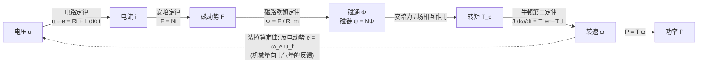
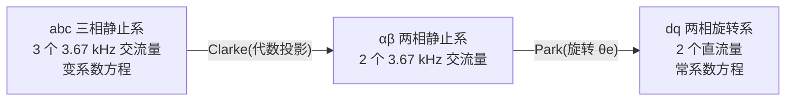
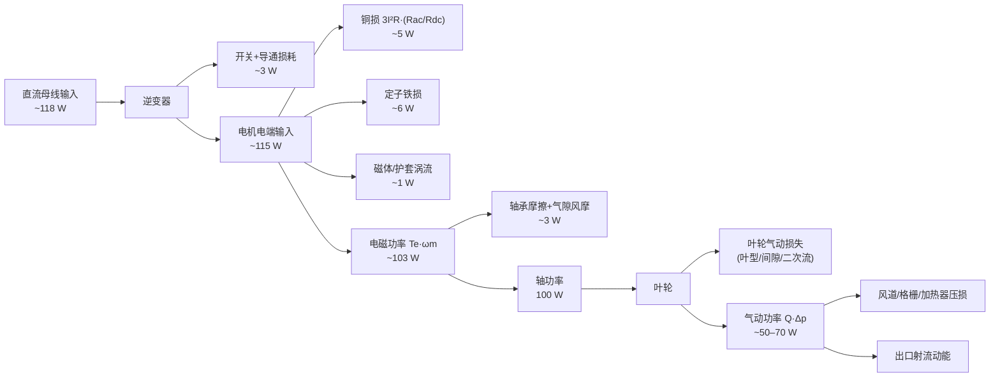

# 第 2 章 从第一性原理理解电机: 电磁学、机电能量转换与机械动力学

> 本章目标: 不依赖任何"电机学套路", 从洛伦兹力和法拉第定律出发, 一步步重建一台 11 万转/分风筒电机的完整物理图像——电压如何变成电流, 电流如何变成磁场, 磁场如何变成转矩, 转矩如何变成风。读完本章, 你应当能对后续所有 FOC 控制、损耗设计、转子动力学章节中的每一个公式回答"它从哪里来"。

## 2.0 本书参考机: 先给出全部数字

全书以一台典型的高速风筒电机为贯穿案例, 其原型是 Dyson Supersonic 所用的 V9 数字马达——公开资料显示其转速约 110 000 rpm、叶轮直径 27 mm、13 叶、整机 49 g、单相无感 BLDC 架构 [1][2][3]。本书的参考机取相同的转速与功率档位, 但采用目前国产高速风筒的主流路线: **三相永磁同步电机(Permanent Magnet Synchronous Motor, PMSM)+ 无位置传感器磁场定向控制(Field Oriented Control, FOC)**。

| 参数 | 数值 | 换算依据 |
|---|---|---|
| 额定转速 $n$ | 110 000 rpm | 设定值(对标 V9 [1][2]) |
| 机械角速度 $\omega_m$ | $2\pi n/60 = 11\,519\ \mathrm{rad/s}$ | 定义 |
| 极对数 $p$ | 2(4 极) | 高速机典型取值, 见 §2.7 |
| 电频率 $f_e$ | $np/60 = 3.67\ \mathrm{kHz}$ | 定义 |
| 电角速度 $\omega_e$ | $p\,\omega_m = 23\,038\ \mathrm{rad/s}$ | 定义 |
| 轴功率 $P$ | 60–120 W(算例取 100 W) | 设定值 |
| 额定转矩 $T$ | $P/\omega_m \approx 8.7\ \mathrm{mN\cdot m}$ @100 W | $T=P/\omega_m$ |
| 叶轮直径 | ~27 mm | 对标 V9 [2] |

请把 **8.7 mN·m** 这个数字记住——它比一枚硬币压在杠杆上的力矩还小。**超高速 + 极小转矩**, 是这类电机全部设计矛盾的根源, 也是本章反复回到的主线。

---

## 2.1 电磁学根基: 三条物理定律撑起一台电机

一台电机无论多复杂, 其physics只有三块基石: 电流受力(安培力)、磁通变化感应电压(法拉第定律)、以及描述磁场如何被建立和闭合的麦克斯韦方程组。本节只建立直观图像, 不做场论推导。

### 2.1.1 洛伦兹力与安培力: 电机是"力的机器"

运动电荷在磁场中受**洛伦兹力(Lorentz force)**:

$$\vec{F} = q\,\vec{v} \times \vec{B}$$

导线中的电流就是大量定向运动的电荷, 对一段长 $l$、载流 $I$、置于磁密 $B$ 中的直导线, 宏观合力即**安培力(Ampère force)**:

$$F = B\,I\,l \qquad (\vec{B} \perp \vec{I}\ \text{时})$$

方向由左手定则(或 $\vec{I}\times\vec{B}$ 右手系)确定。这就是电机产生转矩的微观起点: **定子绕组的每一根载流导体, 都泡在气隙磁场里受一个切向力**。

代入参考机的量级感受一下: 气隙磁密 $B_g \approx 0.4\ \mathrm{T}$(粘结钕铁硼磁环的典型水平, 见第 4 章)、导体有效长度 12 mm、瞬时电流 0.5 A, 则单根导体受力

$$F = 0.4 \times 0.5 \times 0.012 = 2.4\ \mathrm{mN}$$

几毫牛——一粒米的重量。一台电机就是把几十上百根这样的导体沿圆周排开, 让所有的"米粒之力"乘上半径、叠加成转矩。

一个更能体现第一性原理的校核角度是**气隙切应力(air-gap shear stress)**: 转矩等于作用在转子圆柱表面的等效切应力乘以表面积再乘以半径。参考机若转子直径 8 mm、有效长度 15 mm, 则 8.7 mN·m 对应的切向合力为 $T/r = 2.17\ \mathrm{N}$, 摊在 $\pi D L = 3.8\ \mathrm{cm^2}$ 的转子表面上, 切应力约

$$\sigma = \frac{T/r}{\pi D L} \approx 5.8\ \mathrm{kPa}$$

小型永磁电机可实现的气隙切应力典型为 1–10 kPa 量级[估计值], 参考机落在该区间中部——说明"110 krpm、100 W、8 mm 转子"在电磁上是一个正常而非极端的设计, 真正的困难在别处(§2.7)。

### 2.1.2 法拉第定律: 电机同时永远是发电机

**法拉第电磁感应定律(Faraday's law of electromagnetic induction)**: 回路中感应电动势等于穿过回路的磁链变化率的负值:

$$e = -\frac{d\psi}{dt}$$

其中**磁链(flux linkage)** $\psi = N\Phi$ 是磁通对匝数的加权总和。磁链变化有两种方式, 对应两种电动势:

- **变压器电势(transformer EMF)**: 线圈不动, 磁场自身随时间变化, $e = -N\,d\Phi/dt$;
- **运动电势(motional EMF / speed EMF)**: 磁场不变, 导体以速度 $v$ 切割磁力线, $e = Blv$。

对上面同一根导体(转子表面线速度 $v = \pi D n/60 = 46\ \mathrm{m/s}$, $D=8$ mm):

$$e = B l v = 0.4 \times 0.012 \times 46 \approx 0.22\ \mathrm{V/根}$$

注意一个不平凡的事实: **产生力的 $BIl$ 和产生反电动势的 $Blv$ 用的是同一个 $B$ 和同一个 $l$**。二者相乘:

$$\underbrace{e \cdot I}_{\text{导体吸收的电功率}} = (Blv)\,I = (BIl)\,v = \underbrace{F \cdot v}_{\text{导体输出的机械功率}}$$

这就是**机电能量转换(electromechanical energy conversion)**的守恒枢纽: 电磁力和反电动势是同一枚硬币的两面, 电功率经由"反电动势 × 电流"这一唯一通道转换为机械功率。任何电机——从玩具马达到 11 万转风筒——概莫能外。这个恒等式在 §2.4 会升级为 $k_t$ 与 $k_e$ 的对偶关系, 在 §2.5 会升级为 dq 系下的转矩公式推导。

### 2.1.3 麦克斯韦方程组的"电机视角"

不必展开场论, 只需知道四条方程各自在电机里扮演什么角色:

| 方程 | 直观表述 | 在电机中的角色 |
|---|---|---|
| 安培环路定律 $\oint \vec{H}\cdot d\vec{l} = \sum I$ | 电流是磁场的源 | 绕组安匝建立**磁动势**, 驱动磁通穿过气隙; 是"磁路欧姆定律"(§2.3)的理论根基 |
| 法拉第定律 $\oint \vec{E}\cdot d\vec{l} = -\dfrac{d\Phi}{dt}$ | 变化磁通感应电场 | 反电动势与变压器电势的来源; 同时也是铁心中**涡流(eddy current)**损耗的来源 |
| 磁通连续性 $\nabla\cdot\vec{B} = 0$ | 磁力线必闭合, 无磁单极 | 磁通必须经"定子齿→气隙→磁体→转子轭→气隙→定子轭"闭合成回路, 这决定了磁路设计; 漏磁无法消灭, 只能管理 |
| 电场高斯定律 $\nabla\cdot\vec{D} = \rho$ | 电荷产生电场 | 对转矩几乎无贡献; 但绕组分布电容、PWM 高 $dv/dt$ 共模电流、轴承电蚀等寄生问题源于此(第 9 章) |

一个重要的合法性说明: 电机分析普遍采用**磁准静态近似(Magnetoquasistatic, MQS)**——忽略位移电流、不考虑电磁波传播。参考机电频率 3.67 kHz 对应的电磁波波长约 $c/f_e \approx 82\ \mathrm{km}$, 而电机尺寸只有厘米级, 波动效应完全可以忽略。这就是为什么整本书可以放心使用"磁路""电感""磁链"这些集总参数, 而不必求解波动方程。

本构关系 $\vec{B} = \mu\vec{H}$ 补上最后一块: 铁磁材料的相对磁导率高达数千, 把磁通"廉价地"从绕组引导到气隙; 但它有两个代价——**饱和**(硅钢约 1.5–2 T 封顶)与**磁滞(hysteresis)**, 后者与涡流一起构成铁损, 是高速化的第一大敌(§2.7)。

---

## 2.2 从一根导线到一台电机: 旋转磁场的诞生

### 2.2.1 一根导线 → 一个线圈: 换向问题

把一根导线弯成矩形线圈置于磁场中, 两条有效边受力方向相反, 形成力偶, 转矩为

$$T = N I A B \sin\delta = m B \sin\delta, \qquad m = NIA$$

$m$ 是线圈磁矩, $\delta$ 是磁矩与磁场的夹角。问题立刻出现: 线圈转过 $\delta = 0$(对齐位置)后转矩反向, 它只会在对齐位置附近摆动。要连续旋转, 必须在恰当时刻**反转电流方向**——这就是**换向(commutation)**。

有刷直流电机用机械换向器+电刷解决; 无刷电机把问题反过来: **转子放永磁体、绕组放定子不动, 由功率电子按转子位置切换定子电流**——逆变器本质上是一个"电子换向器"。而三相正弦供电的 PMSM 走得更远: 它不是离散地"换向", 而是让定子磁场连续地、匀速地旋转, 转子永磁体被磁场"拖着"同步旋转。于是核心问题变成: **如何用静止的绕组产生旋转的磁场?**

### 2.2.2 单相绕组: 只能产生脉振磁场

一相绕组通交流电 $i_a = I_m\cos\omega t$, 在气隙中产生的磁动势基波沿圆周按 $\cos\theta_s$ 分布($\theta_s$ 为气隙圆周上的空间电角度), 幅值随时间脉动:

$$F_a(\theta_s, t) = F_m \cos\omega t \cos\theta_s$$

用积化和差把它拆开:

$$F_a = \frac{F_m}{2}\cos(\theta_s - \omega t) + \frac{F_m}{2}\cos(\theta_s + \omega t)$$

**一个脉振磁场恒等于两个幅值减半、转向相反的旋转磁场之和。** 正转波与反转波拔河, 平均转矩互相抵消——这就是单相电机没有固有起动转矩、存在"启动死点"的根本原因(Dyson V9 这类单相机必须用不对称气隙制造停靠偏置才能起动, 见第 8 章)[1]。

### 2.2.3 三相绕组: 空间 120° × 时间 120° = 匀速旋转磁场

把三套相同的绕组沿气隙圆周**空间上互差 120° 电角度**摆放, 再通以**时间上互差 120°** 的三相对称电流:

$$i_a = I_m\cos\omega t,\quad i_b = I_m\cos(\omega t - 120°),\quad i_c = I_m\cos(\omega t + 120°)$$

三相磁动势叠加(每相都按上式拆成正、反两个旋转波):

$$F(\theta_s,t) = F_m\big[\cos\omega t\cos\theta_s + \cos(\omega t{-}120°)\cos(\theta_s{-}120°) + \cos(\omega t{+}120°)\cos(\theta_s{+}120°)\big]$$

三个反转波相位互差 240°, 矢量和为零, 完全抵消; 三个正转波同相叠加:

$$\boxed{F(\theta_s,t) = \frac{3}{2}F_m\cos(\theta_s - \omega t)}$$

一个**幅值恒定**(1.5 倍单相峰值)、以电角速度 $\omega$ **匀速旋转**的磁动势波。这是十九世纪电气工程最漂亮的结果之一, 也是三相制统治电机世界的根本原因:

- **幅值恒定** → 转矩平滑, 无二倍频脉动(单相机固有 $2f_e$ 转矩脉动, 是其振噪劣势的来源);
- **匀速旋转** → 转子永磁体可与之同步锁定, 形成**同步电机(synchronous machine)**;
- 交换任意两相接线, 相序反转, 磁场反转——电子换向天然掌握转向。

旋转磁场的机械转速即**同步转速(synchronous speed)**:

$$n_s = \frac{60 f_e}{p}$$

$p$ 为**极对数(pole pairs)**——绕组沿圆周重复的周期数。参考机 $p=2$、$f_e = 3.67\ \mathrm{kHz}$, 同步转速恰为 110 000 rpm。永磁转子没有转差, 稳态下**严格**跟随旋转磁场, 转子磁极滞后定子磁场一个**功角(load angle)**, 功角大小自动平衡负载转矩——这既是同步电机的工作原理, 也是后文 I/F 开环启动能够"自同步"的物理基础(第 7 章)。

### 2.2.4 为什么可以只用两相描述三相: Clarke 变换的物理伏笔

上面的推导揭示一个深刻事实: 三相绕组的全部作用就是合成**一个**旋转磁动势矢量——两个自由度(幅值+相位, 或两个正交分量)就足以完全描述它。三相电流中本就只有两个独立量(星接无中线时 $i_a+i_b+i_c=0$)。因此任何对称多相绕组都等效于一套**正交两相绕组**。这就是 §2.5 中 Clarke 变换的物理本质: 不是数学戏法, 而是"旋转磁场只需要两个坐标"这一事实的代数表达。

---

## 2.3 关键物理量链条: 从电压到功率

电机内部的因果链条只有一条, 每个环节都有明确的物理定律把守:

注意那条虚线反馈: **转速通过反电动势反过来"顶住"电压**——这条反馈让电机成为一个天然的闭环系统, 也是 §2.4 整节的主题。

### 2.3.1 各物理量的定义、单位与关系

| 物理量 | 符号 | SI 单位 | 关键关系式 | 物理角色 |
|---|---|---|---|---|
| 电压 | $u$ | V | $u = Ri + d\psi/dt$ | 驱动器唯一能直接施加的量 |
| 电流 | $i$ | A | 由 $(u-e)$ 经 $R$、$L$ 决定 | 唯一可快速控制的电气状态; 发热 $\propto i^2$ |
| 磁动势 | $F$ | A(工程惯称"安匝") | $F = Ni$ | 磁路中的"电压源" |
| 磁阻 | $R_m$ | $\mathrm{H^{-1}}$(A/Wb) | $R_m = l/(\mu A)$ | 磁路中的"电阻", 气隙占绝对大头 |
| 磁通 | $\Phi$ | Wb | $\Phi = F/R_m$ | 磁路中的"电流" |
| 磁通密度 | $B$ | T(=Wb/m²) | $B = \Phi/A$ | 受铁心饱和封顶(硅钢 1.5–2 T) |
| 磁链 | $\psi$ | Wb(=V·s) | $\psi = N\Phi$ | 电机的"电磁状态量"; 其变化率即电压 |
| 反电动势 | $e$ | V | $e = d\psi/dt$, 幅值 $\omega_e\psi_f$ | 机电耦合的"回声"(机→电) |
| 电磁转矩 | $T_e$ | N·m | $T_e = \frac{3}{2}p\,\psi_f i_q$(SPM) | 机电耦合的"输出"(电→机) |
| 角速度 | $\omega_m$ | rad/s | $J\,d\omega_m/dt = \sum T$ | 机械状态量 |
| 功率 | $P$ | W | $P = T\omega_m$ | 最终交付 |

**磁动势与磁路欧姆定律**(Hopkinson 定律)值得单独一说: 安培环路定律沿磁通闭合路径积分, 得 $F = Ni = \Phi R_m$, 与电路的 $U = IR$ 完全同构。永磁电机磁路中, 铁心磁阻(μᵣ 数千)远小于气隙磁阻, 因此**气隙长度几乎独家决定磁路"硬度"**: 气隙越大, 同样磁体产生的气隙磁密越低, 但电枢反应(定子电流对磁场的扰动)也越弱、磁密谐波越少。高速电机普遍故意取偏大气隙(参考机量级 0.3–0.5 mm 机械气隙), 正是用磁体用量换取低谐波、低转子损耗(第 4 章详述)。

### 2.3.2 链条上的时间尺度: 为什么级联控制是合理的

链条各环节的响应时间天差地别, 这是 FOC 采用"电流内环+转速外环"级联结构的物理依据:

| 环节 | 时间常数 | 参考机量级 |
|---|---|---|
| 电流(电气时间常数 $L/R$) | 微秒~百微秒 | 低压绕组约 $40\,\mu\mathrm{H}/0.2\,\Omega = 200\ \mu\mathrm{s}$ [估计值] |
| 转速(机械时间常数 $J/B_{eq}$) | 数十毫秒 | 风机负载线性化后约 66 ms(§2.6.4)[估计值] |
| 温度(热时间常数) | 秒~分钟 | 绕组热点数十秒量级[估计值] |

三个时间尺度各差 2–3 个数量级, 内环对外环而言"瞬间完成", 外环对内环而言"冻结不动"——级联控制的教科书前提在这台电机上成立得非常干净。

---

## 2.4 反电动势: 电机的内在电压天平

### 2.4.1 本质与表达式

转子永磁体的磁链 $\psi_f$ 随转子旋转, 在每相定子绕组中交链出正弦变化的磁链, 由法拉第定律感应出**反电动势(Back Electromotive Force, BEMF)**。相反电动势幅值:

$$E = \omega_e\,\psi_f = p\,\omega_m\,\psi_f \;\equiv\; k_e\,\omega_m,\qquad k_e = p\,\psi_f$$

$k_e$ 即**反电动势常数(back-EMF constant)**。注意工程界 $k_e$ 的单位约定五花八门(相峰值 V·s/rad、线电压有效值 V/krpm……), 换算错误是新手第一大坑。以参考机高压方案($p=2$, $\psi_f = 7\ \mathrm{mWb}$, 见下文)为例:

| 约定 | 数值 | 换算 |
|---|---|---|
| $k_e$(相峰值, 每机械 rad/s) | $p\psi_f = 14\ \mathrm{mV\cdot s/rad}$ | 定义 |
| 110 krpm 时相反电动势峰值 | 161 V | $14\ \mathrm{mV\cdot s/rad} \times 11\,519\ \mathrm{rad/s}$ |
| 同转速线电压有效值 | 197 V | $161 \times \sqrt{3}/\sqrt{2}$ |
| 线有效值表示的 $k_e$ | 1.80 V/krpm | $197\ \mathrm{V}/110\ \mathrm{krpm}$ |

同一台电机, 四个"反电动势常数"数值相差一个数量级。**拿到任何电机参数表, 第一件事是确认 $k_e$ 的约定。**

### 2.4.2 为什么反电动势决定"电压天花板"和最高转速

稳态下电机相电压方程(超前于 §2.5 的严格推导, 先看主项):

$$U \approx \underbrace{E}_{\omega_e\psi_f,\ \text{主项}} + \underbrace{IR}_{\text{电阻压降}} + \underbrace{j\omega_e L I}_{\text{电抗压降}}$$

转速越高, $E$ 越大; 当 $E$ 加上压降逼近逆变器能输出的最大相电压 $U_{max}$ 时, 驱动器再也"推不动"电流, 转矩崩塌——这就是**电压天花板**。SVPWM 线性区最大相电压幅值为

$$U_{max} = \frac{U_{dc}}{\sqrt{3}}$$

于是最高转速(忽略压降的一阶估计):

$$n_{max} \approx \frac{60}{2\pi p}\cdot\frac{U_{max}}{\psi_f}$$

**转速上限 = 母线电压 ÷ 磁链**。这一个除式统治了整个电压等级与绕组设计。用参考机两条供电路线算一遍(设计留 10% 电压裕量, 覆盖 $IR$、$\omega_e L i_q$ 压降与母线波动; 以下为自洽算例, 电感、电阻为[估计值]):

| | 高压直驱路线(市电整流) | 低压路线(适配器) |
|---|---|---|
| 母线电压 $U_{dc}$ | 310 V | 36 V |
| $U_{max} = U_{dc}/\sqrt{3}$ | 179 V | 20.8 V |
| 可用电压(90%) | 161 V | 18.7 V |
| 按 110 krpm 反解 $\psi_f$ | $\le 161/23\,038 \approx 7.0\ \mathrm{mWb}$ | $\le 0.81\ \mathrm{mWb}$ |
| 100 W 所需 $i_q$(峰值) | $\dfrac{8.68\ \mathrm{mN\cdot m}}{1.5\times2\times7\ \mathrm{mWb}} = 0.41\ \mathrm{A}$ | $3.6\ \mathrm{A}$ |
| 相电流有效值 | ≈0.29 A(计损耗后 0.3–0.6 A) | ≈2.6 A(计损耗后 3 A 以上) |

两条路线的磁链相差 8.6 倍——这就是绕组匝数比。**同一副定转子铁心, 换一套匝数就从 310 V 电机变成 36 V 电机**: 匝数 $N\uparrow$ 则 $\psi_f \propto N$、电流 $\propto 1/N$、电感 $\propto N^2$, 槽满率与电流密度不变时铜损基本不变。绕组匝数本质上是一个"变压器变比", 它不改变电机的功率能力, 只改变电压/电流的交换比例。高压路线电流小、导线细, 天然适合多股细线并绕以抑制高频交流铜损(§2.7); 代价是安规与高 $dv/dt$ 问题(第 6 章)。

风筒的正确设计姿势(而非"弱磁硬顶"): 转速上限是产品定义死的, 因此**按最高转速把 $\psi_f$ 设计到恰好吃满电压、留 5–10% 裕量, 全程不进弱磁**。持续深弱磁意味着注入无功的去磁电流, 徒增铜损且有失控风险(第 9 章)。

### 2.4.3 $k_t = k_e$ 对偶: 你不可能只要转矩不付电压

由 §2.1.2 的功率守恒恒等式, 电磁功率 $P_{em} = T_e\omega_m$ 必须等于"反电动势 × 电流"的总和。用 §2.5 将推出的记号(幅值不变约定): $P_{em} = \frac{3}{2}E\,i_q = \frac{3}{2}p\psi_f\omega_m i_q$, 故

$$T_e = \frac{3}{2}p\,\psi_f\,i_q = k_t\,i_q, \qquad k_t = \frac{3}{2}p\,\psi_f = \frac{3}{2}k_e$$

**转矩常数与反电动势常数由同一个 $p\psi_f$ 决定**(3/2 因子只是三相求和与坐标变换约定的产物, 换用功率不变约定则严格 $k_t = k_e$)。物理含义: 每安培换多少转矩, 就必然每 rad/s 付多少伏特, 汇率就是磁链。想要"低速大转矩、高速不顶电压"的电机是不存在的——只能靠齿轮箱改变机械汇率, 或靠弱磁临时"调低"有效磁链。风筒不需要齿轮箱的原因也在此: 负载(叶轮)本来就要 11 万转, 电机直驱恰好工作在自己的高速小转矩甜区。

---

## 2.5 PMSM 的 dq 数学模型: 完整推导

本节是全书控制部分的数学地基。目标: 从三相物理方程出发, 经 Clarke、Park 两步变换, 抵达 dq 电压方程与转矩方程, 并看清每一项的物理身份。

**模型假设**(工程上对参考机均成立): 三相绕组对称、气隙磁场正弦分布(粘结磁环径向充磁天然近似正弦, 见第 4 章)、磁路不饱和(参数为常数)、忽略铁损对电流动态的影响、忽略温度对 $R$、$\psi_f$ 的影响(热效应在第 5 章单独处理)。

### 2.5.1 三相静止坐标系(abc)方程

每相电压 = 电阻压降 + 磁链变化率:

$$u_x = R_s i_x + \frac{d\psi_x}{dt},\qquad x\in\{a,b,c\}$$

磁链由两部分构成——定子电流的自感/互感磁链, 加上转子磁体交链过来的磁链:

$$\begin{bmatrix}\psi_a\\\psi_b\\\psi_c\end{bmatrix} = \mathbf{L}(\theta_e)\begin{bmatrix}i_a\\i_b\\i_c\end{bmatrix} + \psi_f\begin{bmatrix}\cos\theta_e\\\cos(\theta_e - 120°)\\\cos(\theta_e + 120°)\end{bmatrix}$$

$\theta_e$ 是转子电角度。麻烦在于电感矩阵 $\mathbf{L}(\theta_e)$: 若转子有凸极性(d、q 方向磁阻不同), 它包含随 $2\theta_e$ 变化的项——**一个变系数、强耦合的微分方程组**, 直接设计控制器几乎不可能。接下来的两步变换就是为了消掉 $\theta_e$ 依赖。

### 2.5.2 Clarke 变换: 三相 → 两相静止(αβ)

依据 §2.2.4 的物理事实(旋转磁场只有两个自由度), 把三相量投影到正交静止坐标系。本书采用**幅值不变(amplitude-invariant)约定**:

$$\begin{bmatrix}f_\alpha\\ f_\beta\end{bmatrix} = \frac{2}{3}\begin{bmatrix}1 & -\tfrac{1}{2} & -\tfrac{1}{2}\\[2pt] 0 & \tfrac{\sqrt3}{2} & -\tfrac{\sqrt3}{2}\end{bmatrix}\begin{bmatrix}f_a\\ f_b\\ f_c\end{bmatrix}$$

星形连接无中线时 $i_a + i_b + i_c = 0$, 零序恒为零, 实际计算只需两相电流采样:

$$i_\alpha = i_a,\qquad i_\beta = \frac{i_a + 2i_b}{\sqrt3}$$

变换后, 三相对称正弦电流变成 αβ 平面上一个**匀速旋转、幅值等于相电流峰值**的电流矢量——Clarke 变换就是给旋转磁动势矢量建立直角坐标。

### 2.5.3 Park 变换: 静止 → 旋转(dq)

αβ 系里各量仍以 $f_e = 3.67\ \mathrm{kHz}$ 高速旋转。Park 变换让坐标系本身跟着转子转: **d 轴对准转子磁链方向, q 轴超前 90° 电角度**:

$$\begin{bmatrix}f_d\\ f_q\end{bmatrix} = \begin{bmatrix}\cos\theta_e & \sin\theta_e\\ -\sin\theta_e & \cos\theta_e\end{bmatrix}\begin{bmatrix}f_\alpha\\ f_\beta\end{bmatrix}$$

在与转子同速旋转的观察者眼里, 稳态正弦量全部变成**直流量**——PI 调节器从此可以无静差地工作。这就是 FOC 的全部秘密: **把交流电机变成直流电机来控制**。

### 2.5.4 dq 电压方程的推导

用复矢量记法最快看清结构。αβ 系电压方程 $\;\vec{u}_{\alpha\beta} = R_s\vec{i}_{\alpha\beta} + \dfrac{d\vec{\psi}_{\alpha\beta}}{dt}$, 而 dq 量与 αβ 量的关系为 $\vec{f}_{\alpha\beta} = \vec{f}_{dq}\,e^{j\theta_e}$。代入并对乘积求导:

$$\frac{d}{dt}\left(\vec{\psi}_{dq}e^{j\theta_e}\right) = \left(\frac{d\vec{\psi}_{dq}}{dt} + j\omega_e\vec{\psi}_{dq}\right)e^{j\theta_e}$$

两边同乘 $e^{-j\theta_e}$:

$$\vec{u}_{dq} = R_s\vec{i}_{dq} + \frac{d\vec{\psi}_{dq}}{dt} + j\omega_e\vec{\psi}_{dq}$$

旋转坐标系"额外生出"的 $j\omega_e\vec{\psi}_{dq}$ 项, 正是**运动电势**——坐标系旋转把磁链的空间旋转显式化为一个电压项。dq 系下磁链表达式极其干净(d 轴对准磁体, 凸极性表现为 $L_d \ne L_q$):

$$\psi_d = L_d i_d + \psi_f,\qquad \psi_q = L_q i_q$$

按实部($d$)、虚部($q$)展开, 得到**dq 电压方程**:

$$\boxed{\begin{aligned}
u_d &= R_s i_d + L_d\frac{di_d}{dt} - \omega_e L_q i_q\\[4pt]
u_q &= R_s i_q + L_q\frac{di_q}{dt} + \omega_e\left(L_d i_d + \psi_f\right)
\end{aligned}}$$

逐项点名:

| 项 | 身份 | 参考机 110 krpm 量级(低压方案, $L\approx40\ \mu\mathrm{H}$, $R\approx0.2\ \Omega$ [估计值]) |
|---|---|---|
| $R_s i$ | 电阻压降 | $0.2\times3.6 \approx 0.7\ \mathrm{V}$ |
| $L\,di/dt$ | 电感储能项(动态才出现) | 稳态为 0 |
| $\omega_e L_q i_q$、$\omega_e L_d i_d$ | **交叉耦合项**: q 轴电流在 d 轴生电压, 反之亦然 | $23\,038\times40\ \mu\mathrm{H}\times3.6 \approx 3.3\ \mathrm{V}$ |
| $\omega_e\psi_f$ | 反电动势 | $23\,038\times0.81\ \mathrm{mWb} \approx 18.7\ \mathrm{V}$ |

看清力量对比: 满速时反电动势项占据可用电压的 90% 以上, 耦合项也远大于电阻项, **PI 调节器实际负责的只是百分之几的残差**。若不把 $\omega_e\psi_f$ 和耦合项作为前馈直接补上, 两个电流环会通过 $\omega_e L i$ 深度纠缠, 在 $\omega_e = 23\,038\ \mathrm{rad/s}$ 下 PI 根本无法独立镇定 d、q——这就是第 7 章"前馈解耦是高速 FOC 的生死线"的模型根源。

### 2.5.5 转矩方程的推导: 从功率平衡到 $T_e$

幅值不变约定下, 三相瞬时电功率在 dq 系表示为(3/2 因子来自三相求和):

$$P_{elec} = \frac{3}{2}\left(u_d i_d + u_q i_q\right)$$

把电压方程代入并分拣:

$$P_{elec} = \underbrace{\frac{3}{2}R_s\left(i_d^2 + i_q^2\right)}_{\text{铜损}} + \underbrace{\frac{3}{2}\left(L_d i_d\frac{di_d}{dt} + L_q i_q\frac{di_q}{dt}\right)}_{\text{磁场储能变化率}} + \underbrace{\frac{3}{2}\omega_e\left(\psi_d i_q - \psi_q i_d\right)}_{\text{机电转换功率 } P_{em}}$$

只有第三项跨越机电边界。$P_{em} = T_e\,\omega_m = T_e\,\omega_e/p$, 故

$$T_e = \frac{3}{2}p\left(\psi_d i_q - \psi_q i_d\right)$$

代入磁链表达式, 得到 PMSM 转矩方程的最终形态:

$$\boxed{T_e = \frac{3}{2}p\left[\psi_f\,i_q + \left(L_d - L_q\right)i_d\,i_q\right]}$$

两项各有名分:

- **永磁转矩(magnet torque)** $\frac{3}{2}p\psi_f i_q$: 磁体磁场与 q 轴电流相互作用, 与 $i_q$ 严格线性——FOC 的"转矩油门";
- **磁阻转矩(reluctance torque)** $\frac{3}{2}p(L_d - L_q)i_d i_q$: 转子凸极性导致磁阻随位置变化产生的转矩, 只在 $L_d \ne L_q$(内置式 IPM)时存在。

参考机转子是表贴/环形粘结磁体结构, 磁体磁导率接近空气, d、q 磁路几乎对称, $L_d \approx L_q$(**表贴式永磁电机, Surface-mounted PM, SPM**), 磁阻转矩项归零:

$$T_e = \frac{3}{2}p\,\psi_f\,i_q$$

因此最优电流策略退化为最简单的 **$i_d = 0$ 控制**: 全部电流预算给 $i_q$, 每安培转矩最大, 铜损最小。这也顺带解释了第 7 章的一个结论——高频注入(HFI)类无感算法依赖凸极性, 在这类 $L_d \approx L_q$ 的转子上先天无信号可用。

> **约定警告**: 若使用功率不变(power-invariant)Clarke 变换(系数 $\sqrt{2/3}$), 转矩公式无 3/2 因子: $T_e = p[\psi_f i_q + (L_d-L_q)i_d i_q]$, 且此时的 $i_q$ 数值是幅值不变约定的 $\sqrt{3/2}$ 倍。混用两套约定是电机软件最经典的 1.5 倍/1.22 倍神秘误差来源。本书全程使用幅值不变约定。

---

## 2.6 机械动力学: 转矩平衡与风机负载的立方定律

### 2.6.1 转矩平衡方程

转子加叶轮是一个单惯量旋转体, 牛顿第二定律的旋转形式:

$$J\frac{d\omega_m}{dt} = T_e - T_L - B\,\omega_m$$

| 项 | 含义 | 单位 | 参考机量级 |
|---|---|---|---|
| $J$ | 转动惯量(转子+叶轮) | kg·m² | ~$1\times10^{-7}$ [估计值] |
| $T_e$ | 电磁转矩 | N·m | ≤ ~10 mN·m |
| $T_L$ | 负载(气动)转矩 | N·m | 110 krpm 时 8.7 mN·m |
| $B\omega_m$ | 粘性摩擦(轴承+风摩) | N·m | 通常并入 $T_L$ 一起标定 |

### 2.6.2 风机负载特性: $T_L \propto \omega^2$, $P \propto \omega^3$

叶轮属于**风机类负载(fan load)**。由风机相似定律(fan affinity laws, 由气动相似性导出): 几何相同的叶轮, 流量、压升、功率随转速与直径的标度为

$$Q \propto n D^3,\qquad \Delta p \propto \rho\, n^2 D^2,\qquad P \propto \rho\, n^3 D^5$$

固定叶轮, 即得**平方转矩、立方功率**:

$$T_L = k_f\,\omega_m^2,\qquad P_L = k_f\,\omega_m^3$$

参考机在 110 krpm 消耗 100 W, 反解 $k_f = T/\omega_m^2 \approx 6.5\times10^{-11}\ \mathrm{N\cdot m\cdot s^2}$。

### 2.6.3 立方定律对风筒的三重意义

**其一: 小叶轮必须高转速——这是整个"高速数字马达"品类存在的理由。**
$P \propto n^3 D^5$ 中直径的五次方是残酷的: 要在缩小叶轮的同时维持气动功率, 转速必须按 $n \propto D^{-5/3}$ 暴涨。一阶估算(忽略雷诺数效应): 传统吹风机 60 mm 级叶轮缩到 27 mm(缩至 0.45 倍), 转速须提高 $(60/27)^{5/3} \approx 3.8$ 倍——若原来 30 000 rpm, 就是约 113 000 rpm。**11 万转不是炫技, 是 27 mm 叶轮交出足够风量的物理必然。** 而叶轮小型化的收益是握持部直径与整机重量的彻底改观(V9 整机 49 g [1][3]), 以及把叶片通过频率(Blade Passing Frequency, BPF)推出可听域: $13\ \text{叶} \times 1833\ \mathrm{Hz}(转频) \approx 23.8\ \mathrm{kHz}$ [2]——高速化顺手解决了最刺耳的窄带噪声。代价同样真实: 叶尖线速度 $\pi \times 0.027 \times 110\,000/60 \approx 156\ \mathrm{m/s}$(约 0.45 马赫), 气动噪声与叶轮强度设计难度陡增(第 10 章)。

**其二: 转速就是功率旋钮, 且是"三倍灵敏"的旋钮。**
$dP/P = 3\,d\omega/\omega$: 转速调高 10%, 功率上升 33%; 反过来, 转速波动 1% 就是功率波动 3%。风筒的风量档位控制 = 转速闭环控制, 而恒转速精度直接决定风量与噪声的一致性——这是第 7 章转速环设计指标的来源。

**其三: 低速负载趋零, 启动天然友好。**
$T_L \propto \omega^2$ 意味着 10% 转速时负载转矩只有满载的 1%。I/F 开环启动只需克服摩擦与惯量, 用很小的电流斜坡即可稳健带起转子(第 7 章); 堵转与重载启动这些工业驱动的噩梦, 在风机负载上天然不存在。

### 2.6.4 稳态工作点、稳定性与动态量级

稳态即 $T_e = T_L(\omega)$: 电机转矩能力曲线与负载抛物线的交点。风机负载曲线随 $\omega$ 陡峭上升, 满足稳定判据 $\partial(T_e - T_L)/\partial\omega < 0$ 且裕度极大——工作点扰动后自回复, 不存在失稳性飞车(飞车只可能来自控制角度错误, 见第 9 章)。

在工作点附近线性化, 等效阻尼 $B_{eq} = dT_L/d\omega = 2k_f\omega_m \approx 1.5\times10^{-6}\ \mathrm{N\cdot m\cdot s/rad}$, 机械时间常数

$$\tau_m = \frac{J}{2k_f\omega_m} \approx \frac{1\times10^{-7}}{1.5\times10^{-6}} \approx 66\ \mathrm{ms}\ \text{[估计值]}$$

几个衍生数字勾勒这台电机的"动态性格"[均为基于上述 $J$ 的估计值]:

- 满速储能 $\frac{1}{2}J\omega_m^2 \approx 6.6\ \mathrm{J}$——不到一节 AA 电池百分之一的能量, 断电后转子秒级自由停车, 无需制动;
- 以 5 mN·m 平均净转矩加速, 0→110 krpm 仅需 $J\omega_m/T \approx 0.23\ \mathrm{s}$——"一按即满风"的用户体验有物理基础;
- $\tau_m \approx 66\ \mathrm{ms}$ 对 $\tau_e \approx 200\ \mu\mathrm{s}$(§2.3.2), 转速环带宽取几 Hz 到几十 Hz 即绰绰有余, 与电流环(kHz 级)自然解耦。

---

## 2.7 高速化的物理代价: 每一条标度律都在涨价

前几节的物理在任何转速下都成立; 本节回答"把 $\omega$ 拉到 11 519 rad/s 时, 哪些量按什么幂次恶化"。这是后续第 4(电磁与损耗)、5(热)、10(转子动力学与轴承)各章的总纲。

### 2.7.1 电频率: 一切电磁代价的汇率

$$f_e = \frac{n\,p}{60}$$

| 极对数 $p$ | 110 krpm 时 $f_e$ | 评注 |
|---|---|---|
| 1(2 极) | 1.83 kHz | 频率最低; 每极磁通大→轭厚、端部长 |
| 2(4 极) | 3.67 kHz | 参考机取值, 频率与体积的折中 |
| 3(6 极) | 5.5 kHz | 铁损与 PWM 载波比双重不可承受 |

工频电机 50 Hz, 参考机 3.67 kHz——**73 倍的频率汇率**, 所有随 $f$ 增长的损耗按相应幂次涨价。这就是高速机几乎只用 $p=1,2$ 的原因: 铁损压不住, 且逆变器载波比要求 $f_{PWM} \gtrsim 10 f_e$(第 6 章), $p$ 再大 PWM 频率就无法实现。

### 2.7.2 铁损: $\propto f^{1.5\sim2}$

铁损按 Bertotti 三项分解(单位质量)[20]:

$$p_{Fe} = \underbrace{k_h f B_m^\alpha}_{\text{磁滞}\ \propto f} + \underbrace{\frac{\pi^2\sigma d^2}{6\rho_m}f^2B_m^2}_{\text{经典涡流}\ \propto f^2 d^2} + \underbrace{k_{exc}f^{1.5}B_m^{1.5}}_{\text{附加损耗}}$$

涡流项同时随频率平方**和片厚平方**增长, 这给出两条对策: 片厚从 0.35 mm 减到 0.10 mm, 涡流项降为 1/12; 同时把齿轭磁密从工频机的 1.5–1.7 T 主动压到 0.6–1.0 T, 用铁换损耗。工程规则: 电频率超过 400 Hz 就应使用 ≤0.2 mm 冲片, 数 kHz 必须 0.1 mm 级 [6]——参考机层面意味着 0.1 mm 高硅钢(如 6.5% Si 的 10JNEX900 [5][7])或非晶合金(损耗更低但饱和磁密低、脆、难加工 [7][8])。即便如此, 定子铁损仍通常是这类电机总损耗的最大单项(设计目标控制在功率的 3–8% [估计值], 见第 4 章)。

### 2.7.3 交流铜损: 趋肤与邻近效应

**趋肤深度(skin depth)** $\delta = \sqrt{\rho/(\pi f\mu_0)} \approx 66/\sqrt{f[\mathrm{Hz}]}\ \mathrm{mm}$(铜, 20 °C):

| 频率 | $\delta$(20 °C) |
|---|---|
| 3.67 kHz(基波) | 1.09 mm |
| 40 kHz(PWM 纹波) | 0.33 mm |
| 100 kHz | 0.21 mm |

单看基波似乎无碍(线径远小于 $2\delta$), 但多层绕组的**邻近效应(proximity effect)**按 Dowell 模型随层数平方恶化 [20], 叠加低电感电机较大的 PWM 纹波电流, 实际 $R_{ac}/R_{dc}$ 可达 1.5–3。对策是多股细漆包线并绕(股径 ≤0.2–0.3 mm)乃至利兹线(第 4 章)。

### 2.7.4 离心应力: $\sigma \propto \rho v^2 \propto \omega^2 r^2$

薄环近似下磁体环向应力 $\sigma_\theta \approx \rho v^2$。参考机转子表面线速度 46 m/s(D=8 mm), 磁体密度 7500 kg/m³:

$$\sigma_\theta \approx 7500 \times 46^2 \approx 16\ \mathrm{MPa}$$

绝对值不大, 但烧结钕铁硼抗拉强度仅约 80 MPa 且是脆性材料, 考虑温度、公差与疲劳后仍必须**护套预压**固持(过盈校核: 最高转速+最高温度下磁体不脱空, 静止室温下护套不屈服, 第 10 章)[9]。对比之下, 大功率高速电机转子线速度可达 200–300 m/s 极限——风筒尺度下**离心强度不是瓶颈**, 这是小尺寸的红利之一。

### 2.7.5 临界转速与动平衡: $e_{per} = G/\omega$

- **弯曲临界转速**: 转轴一阶弯曲固有频率 $f_{c1} \propto 1/L^2$(尺寸缩小时急剧升高)。风筒转子轴径 ~3 mm、跨距 ~30 mm, 估算一阶弯曲在 5–7 kHz(≥300 000 rpm)[估计值], 远高于 1.83 kHz 的转频——**刚性转子**, 又一项小尺寸红利。真正靠近运行区的是轴承-支承刚体模态; 采用橡胶圈弹性支承时刻意把它压到低频, 启动时快速穿越, 稳态运行于刚体模态之上、弯曲模态之下(第 10 章)。
- **动平衡**: ISO 21940-11 [20] 许用残余不平衡度 $e_{per} = G/\omega$——**转速越高, 允许的质心偏移越小**。110 krpm 下 G1.0 级要求 $e_{per} = 1.0/11\,519 \approx 0.087\ \mu\mathrm{m}$, G0.4 级仅 0.035 μm: 质心偏离轴线不得超过**头发丝直径的千分之一**。这必须靠双面动平衡工艺(激光/微钻去重)加弹性支承吸收残余来实现。

### 2.7.6 轴承 DN 值

$$DN = d_{内径}[\mathrm{mm}] \times n[\mathrm{rpm}] = 3 \times 110\,000 = 330\,000$$

普通钢保持架+普通油脂深沟球轴承的指导极限约 250 000 DN [10]——参考机超限 30%, 必须上高速方案: 陶瓷球混合轴承(Si₃N₄, 离心力小、温升低)、冠形树脂保持架、P4 级精度、低噪高速脂、波形弹簧预紧。牙科手机同尺寸轴承以此路线(加油雾润滑)做到 30 万转以上 [11], 风筒的脂润滑 330 kDN 属"可行但寿命敏感"区, 且油脂寿命随温度指数衰减——这把轴承问题和整机热设计焊在了一起(第 5、10 章)。

### 2.7.7 汇总: 高速化代价一览

| 物理效应 | 标度律 | 110 krpm 后果 | 核心对策 |
|---|---|---|---|
| 铁损 | $\propto f^{1.5\sim2}$ | 总损耗最大单项 | 0.1 mm 薄片/高硅钢, 低磁密设计, 低极对数 |
| 交流铜损 | $R_{ac}/R_{dc}$ 随频率/层数上升 | 可达直流铜损 1.5–3 倍 | 多股细线并绕, 少层绕组 |
| 磁体涡流 | 谐波频率 ↑ | 转子发热难散 | 粘结磁体, 大气隙, 高 $f_{PWM}$ |
| 离心应力 | $\propto \omega^2 r^2$ | ~16 MPa(可控) | 护套过盈预压 |
| 不平衡响应 | $F \propto me\omega^2$, $e_{per} = G/\omega$ | 亚 μm 级平衡要求 | 双面动平衡+弹性支承 |
| 轴承 | DN = 330 k | 超普通脂润滑极限 | 混合陶瓷轴承+高速脂+预紧 |
| 风磨损耗 | $\propto \omega^3 r^4 L$ | 0.1–0.5 W(尚小) | 尺寸小的红利 |
| 逆变器 | $f_{PWM} \ge 10 f_e$ → 40–100 kHz | 开关损耗、死区占比 ↑ | 快管/GaN, 死区补偿(第 6 章) |

---

## 2.8 能量流与效率: 从插座到头发的每一瓦

最后把全章串成一条能量河流。以参考机 100 W 轴功率工况为例(**除注明外均为[估计值], 用于建立量级感, 非实测数据**):

| 环节 | 效率(典型量级) | 主导物理 | 详述章节 |
|---|---|---|---|
| 逆变器 | 95–98% | 开关损耗 $\propto f_{PWM}$、导通损耗、死区 | 第 6 章 |
| 电机(电→轴) | 85–90% | 铁损>铜损>转子涡流>机械损[估计值] | 第 4、5 章 |
| 叶轮(轴→气动) | 50–70% [估计值] | 叶型效率、叶尖间隙泄漏、小尺寸低雷诺数不利 | 第 10 章 |
| 风道(气动→出口射流) | 与结构强相关[不确定] | 格栅/滤网/加热丝压损 | 第 10 章 |

三点观察值得记住:

1. **损耗的绝对值不大, 但密度惊人。** 电机本体约 12–15 W 损耗, 塞在一个直径 ~28 mm 的圆柱里, 且被自己吹出的热风包围——高速小电机的热设计难度从来不在瓦数, 在瓦特每立方厘米(第 5 章)。尤其铁损集中在定子、磁体涡流集中在"最怕热"的转子(钕铁硼 $H_{cJ}$ 随温度陡降, 退磁风险见第 9 章)。
2. **效率链最薄弱的一环不是电, 是气动。** 电气链路(逆变器×电机)可做到 80–88%, 而厘米级叶轮的气动效率受低雷诺数与叶尖间隙比拖累, 通常显著低于大风机。这解释了行业竞争的焦点为什么从"电机效率"迁移到"叶轮与风道的气动设计"。
3. **风机负载没有能量回收问题。** 减速时叶轮自身的气动阻力(∝ω²)就是天然刹车, 转子储能仅 ~6.6 J, 母线泵升电压风险很小(第 9 章)——与电动车驱动完全不同的性格。

---

## 2.9 本章小结: 十条主线

1. 电机的全部物理浓缩为一条恒等式 $eI = Fv$: **力与反电动势同源共生**, 机电能量经"反电动势 × 电流"这一唯一通道转换。
2. 空间互差 120° 的三相绕组 × 时间互差 120° 的三相电流 = 幅值恒定 1.5 倍、匀速旋转的磁动势波; 反转波的完全抵消是三相制平滑转矩的来源, 也是单相机启动死点的反面教材。
3. 物理量链条"电压→电流→磁动势→磁通/磁链→转矩→转速→功率"中, 驱动器只握有电压一个抓手; 转速经反电动势反馈回电压端, 构成电机的天然闭环。
4. $E = k_e\omega$ 决定电压天花板: $n_{max} \approx \dfrac{60\,U_{dc}}{2\pi p\sqrt{3}\,\psi_f}$; 绕组匝数是"变压器变比", 310 V 与 36 V 方案的磁链相差 8.6 倍而功率能力相同。
5. $k_t = \frac{3}{2}k_e$(幅值不变约定): 每安培的转矩与每 rad/s 的电压是同一个 $p\psi_f$, 不可分开定制。
6. dq 模型把 3.67 kHz 交流问题变成直流问题: $u_d = R i_d + L_d\dot{i}_d - \omega_e L_q i_q$, $u_q = R i_q + L_q\dot{i}_q + \omega_e(L_d i_d + \psi_f)$; 110 krpm 时反电动势与耦合项占电压 90% 以上, 前馈解耦是生死线。
7. $T_e = \frac{3}{2}p[\psi_f i_q + (L_d - L_q)i_d i_q]$; 表贴/磁环转子 $L_d \approx L_q$, 磁阻转矩归零, 最优策略即 $i_d = 0$。
8. 风机负载 $T_L \propto \omega^2$、$P \propto \omega^3$; $P \propto n^3D^5$ 的相似律注定 27 mm 叶轮必须 11 万转; 转速是三倍灵敏的功率旋钮; 低速负载趋零使启动天然容易。
9. 高速化按标度律涨价: 铁损 $\propto f^{1.5\sim2}$、离心应力 $\propto \omega^2r^2$、许用偏心 $\propto 1/\omega$、DN 值 330 k 超普通轴承极限——但小尺寸同时赠予刚性转子与低离心应力两项红利。
10. 能量链"插座→逆变器→电机→叶轮→射流"中, 电气环节效率 80–88%, 气动环节 50–70%[估计值]——最难啃的一瓦在空气里, 不在铜和铁里。

下一章我们将把本章的磁路与损耗物理落到具体的电磁设计上: 极槽配合、磁体选型、绕组与叠片, 以及它们如何在 3.67 kHz 的频率汇率下讨价还价。

---

## 参考资料

1. Electronics Weekly – Dyson aims motor expertise at hair drying(V9: 单相无感、约 11 万 rpm、市电整流驱动): https://www.electronicsweekly.com/news/dyson-aims-motor-expertise-at-hair-drying-2016-04/
2. New Atlas – Dyson Supersonic hair dryer(110 000 rpm、13 叶、27 mm 叶轮): https://newatlas.com/dyson-supersonic-hair-dryer/43019/
3. Coroflot – Dyson Supersonic V9 Motor(整机 49 g): https://www.coroflot.com/mattsteel/Dyson-Supersonic-V9-Motor
4. MDPI Actuators – Design of a High-Speed Slotless PMSM Considering Air-Gap Airflow: https://www.mdpi.com/2076-0825/14/11/530
5. AIP Advances – Performance comparison of slotless SPMSM(10JNEX900 高硅钢应用): https://pubs.aip.org/aip/adv/article/13/2/025039/2877005/Performance-comparison-analysis-and-process
6. Ruixin – Motor Stator Laminations: Materials & Thickness(>400 Hz 用 ≤0.2/0.1 mm 冲片): https://www.ruixinmould.com/news/industry-news/motor-stator-laminations-materials-thickness-manufacturing.html
7. PMC – Study of High-Silicon Steel(10JNEX900 与非晶 2605SA1 对比): https://pmc.ncbi.nlm.nih.gov/articles/PMC9736568/
8. Hitachi Metglas 2605SA1 非晶合金数据手册: https://pearl-hifi.com/06_Lit_Archive/15_Mfrs_Publications/Hitachi/Hitachi_Amorphous_Core_SA1_Final.pdf
9. KIT – Sleeves for high-speed PM rotors(高速永磁转子护套): https://publikationen.bibliothek.kit.edu/1000125982/128560422
10. Bearing Works – Maximum Speed / DN value 指南(普通脂润滑深沟球轴承约 250 000 DN): https://www.bearingworks.com/technical-data/maximum-speed.php
11. NSK – Miniature precision bearings for dental drills(牙科手机 3 mm 内径轴承 >300 krpm): https://www.nsk.com/eu-en/company/news/2021/miniature-precision-bearings-for-dental-drills/
12. ISO 21940-11:2016, Mechanical vibration — Rotor balancing — Part 11: Procedures and tolerances for rotors with rigid behaviour(原 ISO 1940-1)。
13. Bertotti, G., "General properties of power losses in soft ferromagnetic materials," IEEE Transactions on Magnetics, vol. 24, no. 1, 1988.
14. Dowell, P. L., "Effects of eddy currents in transformer windings," Proceedings of the IEE, vol. 113, no. 8, 1966.
15. Fitzgerald, A. E., Kingsley, C., Umans, S. D., Electric Machinery(《电机学》), McGraw-Hill —— 本章 §2.1–2.3 的经典教科书参照。
16. Krause, P. C. 等, Analysis of Electric Machinery and Drive Systems, Wiley-IEEE Press —— 坐标变换与 dq 建模的标准参考。

> 说明: 文中标注[估计值]的数字为按第一性原理或行业典型值推算的量级参考, 未经对具体产品的实测验证; 标注[不确定]者依赖具体结构无法给出通用数值。所有转速/频率/转矩/电压换算均按参考机参数自洽推得, 可用 §2.0 表格独立复核。
