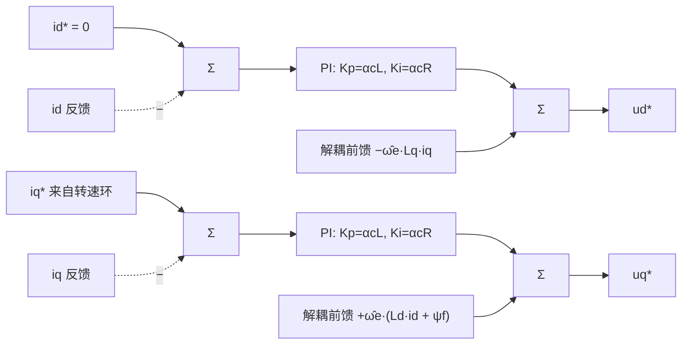
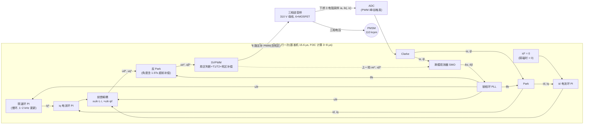
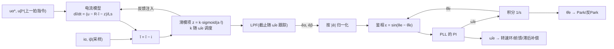
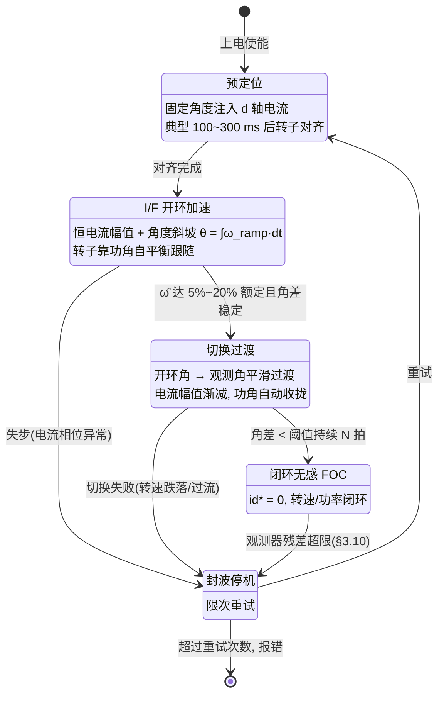

# 第 3 章 磁场定向控制（FOC）原理：从坐标变换到无感观测器

> 本章是全书的控制理论核心章。我们从"为什么 10 万转风筒不能满足于方波驱动"讲起，完整推导磁场定向控制（Field Oriented Control, FOC）的坐标变换、dq 数学模型、电流环 PI 整定与前馈解耦、空间矢量脉宽调制（Space Vector PWM, SVPWM），然后进入本品类的灵魂问题——**无位置传感器控制**：滑模观测器（Sliding Mode Observer, SMO）、锁相环（Phase-Locked Loop, PLL）、磁链/龙伯格观测器，以及 I/F 开环启动与闭环切换。最后专门讨论 10 万 rpm 带来的高速特有问题（载波比、死区、一拍延迟、弱磁），并以单相 BLDC 路线作为对照组收尾。
>
> 全章统一使用一台"基准机"贯穿所有数值计算（表 3-1）。凡涉及具体产品参数均给出处 `[n]`；电机本体参数（R、L、ψf）无公开数据，为按物理自洽性反推的 **[估计值]**，仅用于展示计算方法与数量级。

---

## 3.0 基准机与记号约定

为了让全章数值可复算、可交叉验证，先定义一台与第 1 章调研结论一致的三相高压无感 FOC 基准机（对应米家 H501 铭牌 310 V / 60 W / 110 000 rpm 一类的国产主流方案 [13]，功率按 100 W 轴功率取整便于计算）：

**表 3-1 本章基准机参数**

| 参数 | 符号 | 取值 | 来源/校验 |
|---|---|---|---|
| 额定转速 | $n$ | 110 000 rpm | 品类典型值 [2][13] |
| 极对数 | $p$ | 2（4 极） | 高速机典型（第 1 章） |
| 电频率 | $f_e = np/60$ | **3.667 kHz** | 换算 |
| 机械角速度 | $\omega_m = 2\pi n/60$ | 11 519 rad/s | 换算 |
| 电角速度 | $\omega_e = p\,\omega_m$ | **23 038 rad/s** | 换算 |
| 轴功率 | $P$ | 100 W | 设定 |
| 额定转矩 | $T = P/\omega_m$ | **8.7 mN·m** | 换算 |
| 母线电压 | $U_{dc}$ | 310 V DC（市电整流） | Dyson/国产高压路线 [1][13] |
| PWM 频率 | $f_{PWM}$ | 64 kHz（$T_s$ = 15.6 μs） | 载波比要求，见 §3.10 |
| 永磁磁链 | $\psi_f$ | 6.5 mWb **[估计值]** | 由电压预算反推，见 §3.4；第 4 章计入母线纹波谷值后精化为 6.0 mWb |
| 相电阻 | $R$ | 15 Ω **[估计值]** | 高压细线多匝绕组量级 |
| 相电感 | $L_d \approx L_q = L$ | 5 mH **[估计值]** | 同上 |
| 额定相电流 | $I_{rms}$ | ≈ 0.32 A（幅值 0.45 A） | 由转矩方程解出，见 §3.4 |

记号约定：

- 电角度 $\theta_e$ 定义为转子 d 轴（永磁体 N 极磁通方向）相对 a 相绕组轴线的夹角，$\theta_e = p\,\theta_m$；q 轴沿旋转方向**超前** d 轴 90° 电角度；
- 全章坐标变换采用**幅值不变**约定（§3.3.3），故功率与转矩表达式带 3/2 系数；
- 上标 `*` 表示给定值（指令），戴帽 `^` 表示观测/估计值。

---

## 3.1 为什么需要 FOC：与六步换相的对比

### 3.1.1 六步换相是什么

方波驱动，即**六步换相**（six-step commutation / trapezoidal control），是无刷电机最古老、最便宜的驱动方式：任意时刻只给两相通电（120° 导通），第三相悬空，依据转子位置（霍尔信号或悬空相反电动势过零）每 60° 电角度切换一次通电组合，一个电周期共 6 步。电流指令是"方波"——期望每相电流为正负各 120° 的矩形块。

它对**反电动势为梯形波**的电机（经典 BLDC）在理想条件下能产生恒定转矩。但风筒用高速电机为了压低转子涡流损耗普遍采用环形磁体径向充磁或近似正弦的气隙磁场设计（第 1 章），反电动势接近**正弦**——正弦机配方波电流，问题立刻显现。

### 3.1.2 转矩脉动：定量分析

设三相反电动势为正弦：$e_a = E\sin\theta_e$，$e_b = E\sin(\theta_e - 120°)$，$e_c = E\sin(\theta_e + 120°)$。某一步中电流 $+I$ 从 a 相流入、从 b 相流出，则电磁功率 $P_e = (e_a - e_b)I$，转矩

$$
T_e = \frac{(e_a - e_b)I}{\omega_m} = \frac{EI}{\omega_m}\left[\sin\theta_e - \sin(\theta_e - 120°)\right] = \frac{\sqrt{3}\,EI}{\omega_m}\cos(\theta_e - 60°).
$$

该组合在 $\theta_e - 60° \in [-30°, +30°]$ 区间内导通，转矩在 $\cos(\pm 30°) = 0.866$ 与 $\cos 0° = 1$ 之间波动：**峰-峰脉动约 13.4%（相对平均值约 ±7%），频率为 $6f_e$**。这是"正弦机配方波"的理论下限，还没算换相过程。

实际更糟的是**换相转矩凹陷**。换相瞬间电流要从一相转移到另一相，转移速率受电感限制，转移时间量级为

$$
t_{comm} \approx \frac{L\,I}{U_{avail}},
$$

其中 $U_{avail}$ 是母线电压扣除反电动势后的裕量。代入基准机 [估计值]：$L$ = 5 mH、$I$ = 0.45 A、满速时线反电动势幅值 $\sqrt{3} \times 150 \approx 260$ V、$U_{avail} \approx 310 - 260 = 50$ V，得 $t_{comm} \approx 45\ \mu s$——而 $f_e$ = 3.667 kHz 时**每步只有 $1/(6f_e) = 45.5\ \mu s$**。换相还没完成，下一次换相就到了：方波电流形状根本无法建立，电流波形失控地介于方波与正弦之间，转矩凹陷可达百分之几十。这不是调参能解决的，是六步换相在 kHz 级电频率下的结构性失效。

### 3.1.3 效率：谐波电流白白发热

120° 方波电流的傅里叶分解含 5、7、11、13…次谐波，各次幅值为基波的 $1/h$。定量地：幅值 $I$ 的 120° 方波，总有效值 $I\sqrt{2/3} = 0.816I$，基波有效值 $(\sqrt 6/\pi)I = 0.780I$，**电流总谐波畸变率（Total Harmonic Distortion, THD）约 31%**。谐波电流不产生平均转矩，却按平方贡献铜损——仅此一项铜损就比纯正弦电流多约 10%。更麻烦的是 5/7 次电流谐波在气隙中形成相对转子 $6f_e$ 旋转的磁场，在磁体与护套中感应涡流：$6f_e = 22$ kHz 的转子涡流损耗对散热困难的小转子是实打实的温升（转子损耗机理见第 2 章 §2.7）。第 1 章调研结论：方波路线整机效率比三相 FOC 低 5～10 个百分点。

### 3.1.4 噪音：风筒对高频啸叫极度敏感

吹风机贴着用户耳朵工作，声学是产品力的核心指标（第 1 章 §1.1.4 的 BPF 频移设计）。电磁噪声方面：

- 六步换相的 $6f_e$ 转矩脉动在满速时为 22 kHz（勉强出可听域），但**每次启停加速都要扫过整个可听频段**——$6f_e$(Hz) $= 0.2\,n$(rpm)，即转速在 10 000～25 000 rpm 区间时脉动频率恰好落在人耳最敏感的 2～5 kHz，主观感受是一声上扬的"啸叫滑音"；
- 方波驱动悬空相的电压阶跃（每 60° 一次的 $dv/dt$ 冲击）激励定子齿与机壳的结构模态；
- FOC 的正弦电流从原理上消除了 $6f_e$ 电磁转矩脉动的主项，残余脉动来自死区与齿槽（§3.10.2），可以进一步补偿。载波 $f_{PWM}$ = 64 kHz 远超可听域，PWM 载波音不可闻。

### 3.1.5 对比小结

**表 3-2 六步换相 vs FOC（针对正弦反电动势高速机）**

| 维度 | 六步换相（方波） | 三相 FOC（正弦） |
|---|---|---|
| 电流波形 | 方波（高 $f_e$ 下失控畸变） | 正弦，闭环受控 |
| 转矩脉动 | 理论 ±7% @ $6f_e$ + 换相凹陷（可达数十%） | 原理上恒转矩，残余为死区/齿槽项 |
| 铜损 | 谐波多 ~10%，且换相畸变加剧 | 最低（同转矩下电流有效值最小） |
| 转子涡流损耗 | 5/7 次谐波显著 | 小（仅 PWM 纹波） |
| 噪声 | 加速时 $6f_e$ 扫过可听域 | 显著更安静 |
| 位置信息需求 | 每 60° 一个换相点（粗） | 连续高精度角度（无感观测器） |
| 算力/成本 | 极低 | 需 M4F/M7 级 MCU + 6 管逆变器 |

结论：六步换相把"简单"作为卖点，但在 $f_e$ 接近 4 kHz 的 10 万转应用中其物理前提（电流可在一步内完成换相并保持平顶）已经不成立。**当前国产 10 万转风筒的主流方案是三相无感 FOC**（第 1 章拆解统计），单相方波路线作为极致成本的对照组保留到 §3.11 讨论。

---

## 3.2 FOC 核心思想：把交流机"变成"直流机

他励直流电机为什么好控制？因为机械换向器 + 电刷把电枢磁动势**始终锁定在与主磁场空间正交的位置**，于是转矩就是两个标量的乘积：

$$
T = k\,\Phi\, I_a,
$$

磁通 $\Phi$（励磁绕组）与转矩电流 $I_a$（电枢绕组）天然解耦，各管各的。

永磁同步电机（Permanent Magnet Synchronous Motor, PMSM）没有换向器，三相绕组里流的是交流。FOC 的全部思想可以浓缩成一句话：

> **用数学变换代替机械换向器**——把三相交流量投影到一个随转子同步旋转的直角坐标系（dq 坐标系）上，其中 d 轴（direct axis，直轴）对准转子永磁磁通方向，q 轴（quadrature axis，交轴）与之正交。在这个坐标系里，稳态的正弦电流变成了**直流量**：$i_d$ 只影响磁通（等效励磁电流），$i_q$ 只产生转矩（等效电枢电流）。

于是控制问题退化为两个直流量的调节问题：

- 表贴式永磁电机（Surface-mounted PM, SPM，$L_d = L_q$，风筒环形磁体转子即属此类）令 $i_d^* = 0$——不需要额外励磁（永磁体已经提供），也不产生磁阻转矩，$i_d = 0$ 恰好就是单位电流最大转矩（Maximum Torque Per Ampere, MTPA）；
- $i_q^*$ 由转速环（或功率环）给出，直接正比于转矩。

实现这个思想需要回答三个问题，构成本章主线：

1. **变换怎么做？**——Clarke 与 Park 变换（§3.3）；
2. **变换之后的系统长什么样、怎么控制？**——dq 模型与电流环（§3.4、§3.5），电压指令如何加到电机上——SVPWM（§3.6）；
3. **变换需要的转子角度 $\theta_e$ 从哪来？**——无感观测器（§3.8）与启动策略（§3.9）。

---

## 3.3 Clarke 变换与 Park 变换

### 3.3.1 几何图景

三相绕组轴线在空间互差 120°。三相电流共同产生一个合成电流空间矢量 $\vec{i}_s$；三相对称正弦供电时，$\vec{i}_s$ 幅值恒定、以电角速度 $\omega_e$ 匀速旋转。坐标变换做的事就是换个坐标系描述这同一个矢量：

```
 (a) Clarke: 三相 abc → 静止直角坐标 αβ        (b) Park: 静止 αβ → 旋转 dq

        b轴                β                       β         q     ← q轴超前d轴90°
          ╲                ↑                       ↑       ╲     ↗ d ← 锁定转子N极
           ╲               │    i_s                │  i_s   ╲  ↗
            ╲              │   ↗ (幅值恒定,        │   ↗     ╲↗
             ╲             │  /   以ωe旋转)        │  /     ↗ ╲
              ╲            │ /                     │ /   ↗ θe  ╲
   ────────────●───────────┼───────→ α ≡ a轴       │/ ↗____________→ α
              ╱            │                       ●
             ╱             │            在αβ系看: i_s旋转, iα iβ 是正弦
            ╱              │            在dq系看: 坐标系与 i_s 同步旋转,
          c轴              │                      id iq 是直流 —— 这就是FOC
```

- **Clarke 变换**（也称 αβ 变换、3s/2s 变换）：把 120° 布置的三相量投影到正交的 α–β 静止轴上，α 轴与 a 相轴线重合。三相冗余（对称系统 $i_a + i_b + i_c = 0$），两个自由度足够；
- **Park 变换**（2s/2r 变换）：把 αβ 矢量再投影到与转子同步旋转的 d–q 轴上。旋转坐标系"追上"了矢量，正弦量变直流量。

### 3.3.2 完整矩阵

**Clarke 变换**（含零序分量的完整形式，幅值不变约定）：

$$
\begin{bmatrix} i_\alpha \\ i_\beta \\ i_0 \end{bmatrix}
= \frac{2}{3}
\begin{bmatrix}
1 & -\tfrac{1}{2} & -\tfrac{1}{2} \\[2pt]
0 & \tfrac{\sqrt{3}}{2} & -\tfrac{\sqrt{3}}{2} \\[2pt]
\tfrac{1}{2} & \tfrac{1}{2} & \tfrac{1}{2}
\end{bmatrix}
\begin{bmatrix} i_a \\ i_b \\ i_c \end{bmatrix}.
$$

三相三线制电机无零序电流通路（$i_0 \equiv 0$），且 $i_c = -i_a - i_b$，故工程实现只需采样两相，化简为

$$
i_\alpha = i_a, \qquad i_\beta = \frac{i_a + 2 i_b}{\sqrt{3}}.
$$

反 Clarke 变换（用于把 $u_\alpha, u_\beta$ 还原为三相调制波）：

$$
u_a = u_\alpha,\qquad
u_b = \frac{-u_\alpha + \sqrt{3}\, u_\beta}{2},\qquad
u_c = \frac{-u_\alpha - \sqrt{3}\, u_\beta}{2}.
$$

**Park 变换**（θe 为 d 轴相对 α 轴的电角度）：

$$
\begin{bmatrix} i_d \\ i_q \end{bmatrix}
=
\begin{bmatrix}
\cos\theta_e & \sin\theta_e \\
-\sin\theta_e & \cos\theta_e
\end{bmatrix}
\begin{bmatrix} i_\alpha \\ i_\beta \end{bmatrix},
$$

反 Park 变换：

$$
\begin{bmatrix} u_\alpha \\ u_\beta \end{bmatrix}
=
\begin{bmatrix}
\cos\theta_e & -\sin\theta_e \\
\sin\theta_e & \cos\theta_e
\end{bmatrix}
\begin{bmatrix} u_d \\ u_q \end{bmatrix}.
$$

Park 变换只是一次旋转，是正交变换，不改变矢量长度；约定差异全部集中在 Clarke 的系数上。

### 3.3.3 幅值不变 vs 功率不变：一个高发事故点

Clarke 变换的前置系数有两种主流约定，**混用是电机软件移植中最经典的 1.5 倍错误来源**：

**表 3-3 两种 Clarke 约定对比**

| | 幅值不变（$\tfrac{2}{3}$ 系数） | 功率不变（$\sqrt{2/3}$ 系数） |
|---|---|---|
| 变换系数 | $\tfrac{2}{3}$（零序行 $\tfrac12$） | $\sqrt{\tfrac{2}{3}}$（零序行 $\tfrac{1}{\sqrt 2}$），矩阵正交归一 |
| αβ 矢量幅值 | = 相电流**幅值**（物理直观） | = 相电流幅值 × $\sqrt{3/2}$ |
| 功率表达式 | $P = \tfrac{3}{2}(u_d i_d + u_q i_q)$ | $P = u_d i_d + u_q i_q$（无系数，故名） |
| 转矩表达式 | $T_e = \tfrac{3}{2}p[\psi_f i_q + (L_d - L_q) i_d i_q]$ | $T_e = p[\psi_f i_q + (L_d - L_q) i_d i_q]$ |
| 逆变换系数 | 1（$i_a = i_\alpha$） | $\sqrt{2/3}$ |
| 典型使用场景 | 嵌入式电机控制固件库的主流选择（电流环给定直接对应相电流幅值，便于限流保护） | 理论分析文献常用（能量关系简洁） |

本书全部采用**幅值不变**约定。移植代码或代入文献公式时，务必先核对：转矩公式里有没有 3/2？电流限幅对应的是相电流幅值还是 $\sqrt{3/2}$ 倍？此外还要核对两个符号约定：q 轴超前还是滞后 d 轴（本书超前）、$\theta_e$ 从 a 轴还是从 α 轴起算（本书两者重合）。

---

## 3.4 dq 数学模型与转矩方程

### 3.4.1 电压方程

对 Clarke+Park 变换后的 PMSM，dq 坐标系电压方程为

$$
\begin{aligned}
u_d &= R i_d + L_d \frac{di_d}{dt} \;\underbrace{-\;\omega_e L_q i_q}_{\text{交叉耦合}}\\[4pt]
u_q &= R i_q + L_q \frac{di_q}{dt} \;\underbrace{+\;\omega_e L_d i_d}_{\text{交叉耦合}} \;\underbrace{+\;\omega_e \psi_f}_{\text{反电动势}}
\end{aligned}
$$

物理解读：每条轴各自是一个 R–L 一阶系统（这是我们想要的"直流机"部分），但旋转坐标系带来了两类**速度电压**项——d、q 轴之间通过 $\omega_e L i$ 互相耦合，q 轴还叠加了运动反电动势 $\omega_e\psi_f$。

### 3.4.2 转矩方程与基准机核算

$$
T_e = \frac{3}{2}p\left[\psi_f i_q + (L_d - L_q)\, i_d i_q\right]
\;\xrightarrow{\;\text{SPM: } L_d = L_q\;}\;
T_e = \frac{3}{2}p\,\psi_f\, i_q.
$$

用基准机做一遍完整自洽核算（这套核算方法本身就是设计流程）：

1. **电压预算定磁链**：SVPWM 线性区最大相电压幅值 $U_{max} = U_{dc}/\sqrt{3} = 179$ V（§3.6.4）。按"满速不弱磁、留 5～10% 电压裕量"的设计准则（§3.10.4）反推：取 $\psi_f = 6.5$ mWb **[估计值]**，则满速反电动势幅值 $\omega_e \psi_f = 23\,038 \times 0.0065 \approx 150$ V（本章按标称母线 310 V 做预算；第 4 章 §4.7 进一步计入满载母线纹波谷值 ≈282 V，将 $\psi_f$ 精化为 6.0 mWb——两章各自内部自洽，差异即"是否计入纹波"这一层预算精度）；
2. **转矩定电流**：$i_q = \dfrac{T_e}{1.5\,p\,\psi_f} = \dfrac{8.7\times 10^{-3}}{1.5 \times 2 \times 0.0065} \approx 0.45$ A（幅值），即相电流有效值 ≈ 0.32 A——与第 1 章高压路线拆解推算的 0.3～0.6 A 一致；
3. **电压核算**（满速稳态，$i_d = 0$）：

$$
\begin{aligned}
u_d &= -\omega_e L_q i_q = -23\,038 \times 0.005 \times 0.45 \approx -51\ \mathrm{V},\\
u_q &= R i_q + \omega_e \psi_f = 15 \times 0.45 + 150 \approx 157\ \mathrm{V},\\
|u| &= \sqrt{51^2 + 157^2} \approx 165\ \mathrm{V} < 0.95\,U_{max} = 170\ \mathrm{V}. \checkmark
\end{aligned}
$$

4. **功率闭合校验**：定子端输入电功率 $\tfrac32 u_q i_q = 1.5 \times 157 \times 0.45 \approx 105$ W = 轴功率 100 W + 铜损 $\tfrac32 R i_q^2 \approx 4.5$ W。✓（其中电磁（气隙）功率 $\tfrac32 \omega_e \psi_f i_q \approx 100$ W = 输入电功率 − 铜损；铁损、风摩损耗从轴侧另计。）

### 3.4.3 高速的第一个下马威：速度电压项巨大

把上面各项的量级排个序：

**表 3-4 基准机满速时 dq 电压各项量级**

| 项 | 表达式 | 数值 | 占 $U_{max}$ |
|---|---|---|---|
| 反电动势 | $\omega_e\psi_f$ | ≈150 V | **84%** |
| 交叉耦合 | $\omega_e L i_q$ | ≈51 V | 29% |
| 电阻压降 | $R i_q$ | ≈6.7 V | 4% |

普通工频伺服里电流环 PI 可以把耦合项当"慢扰动"靠反馈压掉；这里**交叉耦合项比电阻压降大近 8 倍、与控制量本身同数量级**，而电流环带宽还追不上 $\omega_e$（下节）。所以在高速 FOC 中，$\omega_e L_q i_q$、$\omega_e(L_d i_d + \psi_f)$ 必须作为**前馈解耦项**显式补偿，这不是锦上添花，是系统能不能稳的问题。

---

## 3.5 电流环：PI 整定、带宽与前馈解耦

### 3.5.1 被控对象与 PI 整定（内模法）

解耦之后（假设前馈完全抵消速度电压项），每轴被控对象是一阶惯性环节：

$$
G(s) = \frac{i(s)}{u(s)} = \frac{1}{Ls + R}.
$$

PI 控制器 $C(s) = K_p + K_i/s = K_p\dfrac{s + K_i/K_p}{s}$。按**内模法/零极点对消**整定：令控制器零点对消电机极点，$K_i/K_p = R/L$，则开环变成纯积分 $K_p/(Ls)$，闭环为一阶低通，带宽 $\alpha_c = K_p/L$（rad/s）。于是得到教科书级简洁的整定公式：

$$
\boxed{\;K_p = \alpha_c L, \qquad K_i = \alpha_c R\;}
$$

**整定只需要 R 和 L 两个参数**——它们可在产线上用静止注入自动辨识，这是 FOC 工程化友好的关键一环。

### 3.5.2 带宽怎么选

带宽上限由数字控制的延迟决定。采样 + 计算 + PWM 保持的总延迟约 1.5 $T_s$（§3.10.3），要保住相位裕度，经验约束为

$$
\alpha_c \le \frac{2\pi f_{PWM}}{10 \sim 20}.
$$

基准机 $f_{PWM}$ = 64 kHz → $\alpha_c \le 2\pi \times (3.2 \sim 6.4\ \mathrm{kHz})$。取 $\alpha_c = 2\pi \times 3\ \mathrm{kHz} \approx 18\,850$ rad/s，则

$$
K_p = 18\,850 \times 0.005 \approx 94\ \mathrm{V/A}, \qquad
K_i = 18\,850 \times 15 \approx 2.8\times 10^5\ \mathrm{V/(A\cdot s)}.
$$

现在注意一个普通伺服工程师会震惊的比值：

$$
\frac{\alpha_c}{\omega_e} = \frac{18\,850}{23\,038} \approx 0.82.
$$

**电流环带宽低于电机基波电角频率**（常规工频机该比值是几十）。这在旋转坐标系下依然可行——因为 dq 系中被跟踪量是直流——但意味着三件事：

1. 凡是以 $\omega_e$ 频率出现的耦合与扰动（速度电压项、观测角误差引起的 dq 串扰），反馈通道**管不了**，必须前馈/结构性解决；
2. 电流环对给定的动态响应（≈0.35/3 kHz ≈ 120 μs 上升时间）相对一个电周期（273 μs）并不快，转矩指令阶跃时电流矢量的过渡轨迹会明显偏摆；
3. PI 参数中 R、L 的准确性比低速应用更敏感。

### 3.5.3 前馈解耦

把 §3.4.1 的速度电压项直接搬到控制器输出侧：

$$
\begin{aligned}
u_d^* &= \underbrace{\left(K_p + \frac{K_i}{s}\right)(i_d^* - i_d)}_{\text{PI}} \;-\; \hat\omega_e L_q i_q,\\[2pt]
u_q^* &= \left(K_p + \frac{K_i}{s}\right)(i_q^* - i_q) \;+\; \hat\omega_e (L_d i_d + \psi_f).
\end{aligned}
$$



工程要点：

- **抗积分饱和（anti-windup）**：输出受 $U_{max}$ 限幅时必须停止/回退积分（反算法 back-calculation 或钳位法），否则退饱和时大幅超调，高速下直接表现为过流或失步；
- **电压限幅的轴优先级**：$\sqrt{u_d^2 + u_q^2} \le U_{max}$ 越限时，正常运行优先保 $u_q$（转矩），弱磁运行优先保 $u_d$（磁场，否则弱磁失效电压反而更超）；
- **复矢量视角**：更严格地，dq 系被控对象是复传递函数 $G(s) = 1/[L(s + j\omega_e) + R]$，极点在 $-R/L - j\omega_e$。基准机 $R/L = 3000$ rad/s 而 $\omega_e = 23\,038$ rad/s——极点几乎纯虚，普通 PI 的实零点对消不掉它。前馈解耦是对该极点的近似补偿（依赖参数准确），**复矢量电流调节器**（complex vector PI）则把控制器零点也做成复数：

$$
C(s) = K_p + \frac{K_i + j\,\hat\omega_e K_p}{s},
$$

  实现上就是两轴积分器互相交叉馈入（$\hat\omega_e K_p$ 项），对参数误差鲁棒性显著优于纯前馈，是高 $\omega_e/\alpha_c$ 比场合的推荐做法 [15]。载波比进一步吃紧时还应在**离散域**直接设计（对被控对象做含 ZOH 的精确离散化再配置极点），避免连续域设计离散化后极点漂移不稳。

---

## 3.6 SVPWM：空间矢量脉宽调制

电流环输出的是电压指令 $u_\alpha^*, u_\beta^*$，需要通过三相逆变器（6 只开关管组成 3 个半桥）加到电机上。SVPWM 直接从"合成电压空间矢量"的角度分配开关状态，是 FOC 的标准搭档。

### 3.6.1 八个基本矢量

每个半桥非上即下（上管开记 1，下管开记 0），三相共 $2^3 = 8$ 种状态。以 $(S_a S_b S_c)$ 标记：

**表 3-5 八个基本电压矢量**

| 矢量 | $S_a S_b S_c$ | 空间角度 | 幅值 | 类型 |
|---|---|---|---|---|
| $V_0$ | 000 | — | 0 | 零矢量 |
| $V_1$ | 100 | 0° | $\tfrac{2}{3}U_{dc}$ | 有效矢量 |
| $V_2$ | 110 | 60° | $\tfrac{2}{3}U_{dc}$ | 有效矢量 |
| $V_3$ | 010 | 120° | $\tfrac{2}{3}U_{dc}$ | 有效矢量 |
| $V_4$ | 011 | 180° | $\tfrac{2}{3}U_{dc}$ | 有效矢量 |
| $V_5$ | 001 | 240° | $\tfrac{2}{3}U_{dc}$ | 有效矢量 |
| $V_6$ | 101 | 300° | $\tfrac{2}{3}U_{dc}$ | 有效矢量 |
| $V_7$ | 111 | — | 0 | 零矢量 |

6 个有效矢量顶点构成正六边形，两个零矢量位于原点：

```
              V3(010)          V2(110)
                  ●─────────────●
                 ╱ ╲    Ⅱ     ╱ ╲
                ╱   ╲        ╱   ╲          Uref 在扇区Ⅰ内:
               ╱     ╲      ╱     ╲           由 V1 作用 T1、
              ╱  Ⅲ    ╲    ╱   Ⅰ   ╲          V2 作用 T2、
             ╱         ╲  ╱    _↗Uref         零矢量补足 T0
   V4(011) ●──────────[V0,V7]──────────● V1(100)
             ╲         ╱  ╲           ╱      内切圆(半径Udc/√3)
              ╲  Ⅳ    ╱    ╲    Ⅵ   ╱        = 线性调制区边界
               ╲     ╱      ╲     ╱
                ╲   ╱        ╲   ╱
                 ╲ ╱    Ⅴ     ╲ ╱
                  ●─────────────●
              V5(001)          V6(101)
```

### 3.6.2 扇区判断

给定 $u_\alpha^*, u_\beta^*$，先确定参考矢量落在哪个扇区。无需反正切，构造三个中间量并取符号：

$$
B_0 = u_\beta^*,\qquad
B_1 = \frac{\sqrt{3}\,u_\alpha^* - u_\beta^*}{2},\qquad
B_2 = \frac{-\sqrt{3}\,u_\alpha^* - u_\beta^*}{2},
$$

令 $A = [B_0 > 0]$、$B = [B_1 > 0]$、$C = [B_2 > 0]$（真取 1），$N = A + 2B + 4C$：

| $N$ | 3 | 1 | 5 | 4 | 6 | 2 |
|---|---|---|---|---|---|---|
| 扇区 | Ⅰ | Ⅱ | Ⅲ | Ⅳ | Ⅴ | Ⅵ |

（$B_0, B_1, B_2$ 恰是三个虚拟线电压，整套判断只有乘法与比较，适合 3～8 μs 的 ISR 预算。）

### 3.6.3 作用时间计算

设参考矢量幅值 $U_{ref}$、在所处扇区内相对起始有效矢量的夹角 $\gamma \in [0°, 60°]$。按伏秒平衡，用相邻两个有效矢量 $V_x$（作用 $T_1$）与 $V_{x+1}$（作用 $T_2$）合成：

$$
T_1 = \frac{\sqrt{3}\,T_s\,U_{ref}}{U_{dc}}\sin(60° - \gamma),\qquad
T_2 = \frac{\sqrt{3}\,T_s\,U_{ref}}{U_{dc}}\sin\gamma,\qquad
T_0 = T_s - T_1 - T_2,
$$

$T_0$ 由零矢量填充。若解出 $T_1 + T_2 > T_s$（过调制），需等比缩放或采用过调制策略（§3.10.4）。

七段式对称序列（扇区Ⅰ为例）：

$$
\underbrace{V_0}_{T_0/4} \to \underbrace{V_1}_{T_1/2} \to \underbrace{V_2}_{T_2/2} \to \underbrace{V_7}_{T_0/2} \to \underbrace{V_2}_{T_2/2} \to \underbrace{V_1}_{T_1/2} \to \underbrace{V_0}_{T_0/4}
$$

每次状态切换只动一个半桥（开关次数最少），波形中心对称（谐波最低），且与中心对齐 PWM 的定时器结构天然匹配——电流采样放在计数器峰/谷（零矢量中点），避开开关噪声（第 1 章 §1.6 驱动电子部分）。

实现捷径：SVPWM 等价于在三相正弦调制波上注入共模零序分量 $u_{com} = -\tfrac{1}{2}(\max(u_a,u_b,u_c) + \min(u_a,u_b,u_c))$（min-max 注入），三行代码完成，与查表法结果一致。

### 3.6.4 母线利用率：为什么必须用 SVPWM

- **SPWM**（正弦 PWM）：每相调制波不能超出载波范围，最大相电压幅值 $U_{dc}/2$；
- **SVPWM**：线性区边界是六边形内切圆，最大相电压幅值

$$
U_{max} = \frac{2}{3}U_{dc}\cos 30° = \frac{U_{dc}}{\sqrt{3}} \approx 0.577\,U_{dc},
$$

比 SPWM 提高 $\dfrac{U_{dc}/\sqrt 3}{U_{dc}/2} = \dfrac{2}{\sqrt 3} \approx 1.155$，即 **15.5%**。

这 15.5% 对本应用不是"优化"而是"生死线"：基准机满速需求电压 165 V（§3.4.2），而 310 V 母线下 SPWM 只能给 155 V——**方案根本闭合不了**；SVPWM 的 179 V 才留出 8% 裕量。反过来说，同样的电压需求若用 SPWM，就得把 $\psi_f$（匝数）设计得更低、电流更大，铜损与管耗全线上升。高速高压小电流的风筒方案对母线利用率的敏感度远高于普通调速应用。

---

## 3.7 完整 FOC 框图与执行时序

把前几节串起来，一个完整的无感 FOC 周期（每个 PWM 周期执行一次，基准机 15.6 μs）：



信号流按因果顺序：**采样 → Clarke → Park →（观测器并行）→ 电流环 PI + 前馈 → 反 Park → SVPWM → 逆变器 → 电机**。几个时序要点：

- ADC 由 PWM 定时器峰/谷硬件触发（零矢量中点采样），本拍算出的占空比在**下一拍**载波更新生效——这就是 §3.10.3 要补偿的一拍延迟的来源;
- 电流环 ISR 必须在一个 $T_s$ 内完成全部计算，M4F/170 MHz 级 MCU（含 CORDIC 类三角硬件加速）典型耗时 3～8 μs，ISR 占用率控制在 60% 以内（第 1 章方案调研）；
- 转速环/功率环是慢环（风机负载惯量小但转速指令平缓），按 1/10～1/50 的频率降频执行即可；风筒还常叠加功率限制逻辑——风机负载 $P \propto n^3$，堵转风道时转速上升需限功率。

---

## 3.8 无位置传感器技术

### 3.8.1 为什么 10 万转风筒几乎都是无感的

FOC 需要连续的 $\theta_e$。10 万转风筒不装位置传感器，是多重约束共同决定的：

1. **环境**：电机紧贴发热丝风道，磁体与绕组温度高（第 1 章热设计部分），霍尔 IC 的工作温度与寿命成问题；
2. **精度与延迟**：$f_e$ = 3.667 kHz 时 1° 电角度只对应 0.76 μs，开关式霍尔的迟滞、安装偏差与信号延迟折算成角度误差在高速下不可接受；光电/磁编码器在此转速与成本下不可行；
3. **成本与可靠性**：省去传感器、引线、连接器，25 mm 直径电机的装配空间与防尘可靠性都受益；
4. **可行性**：高速恰恰是无感观测器的舒适区——反电动势 $\propto \omega_e$，转得越快信号越强。难的是零低速，而风机负载低速轻载，用开环 I/F 即可跨过（§3.9）。

（对照：Dyson V9 单相路线同样无感——反电动势/算法换相、每秒最多 1900 次调整、2 FET 驱动 [1]；国产单相方案则常用 1 只锁存霍尔换相。方波/单相换相只要每 60°/180° 一个基准沿，180° 分辨率的锁存霍尔或简单无感算法即可胜任；三相 FOC 需要连续角度，观测器复杂得多。两条路线的差别不在"有感 vs 无感"，而在对位置信息分辨率的需求量级完全不同。）

### 3.8.2 反电动势模型：观测器的共同基础

SPM 在 αβ 静止系的电流方程：

$$
\frac{d}{dt}
\begin{bmatrix} i_\alpha \\ i_\beta \end{bmatrix}
= \frac{1}{L_s}\left(
\begin{bmatrix} u_\alpha \\ u_\beta \end{bmatrix}
- R\begin{bmatrix} i_\alpha \\ i_\beta \end{bmatrix}
- \begin{bmatrix} e_\alpha \\ e_\beta \end{bmatrix}
\right),
\qquad
\begin{bmatrix} e_\alpha \\ e_\beta \end{bmatrix}
= \psi_f\,\omega_e
\begin{bmatrix} -\sin\theta_e \\ \cos\theta_e \end{bmatrix}.
$$

反电动势 $e_{\alpha\beta}$ 里同时编码了角度（相位）与转速（幅值 $\psi_f\omega_e$）。$u_{\alpha\beta}$ 用上一拍的指令电压代替实测（省电压采样，但把死区误差引了进来，见 §3.10.2），$i_{\alpha\beta}$ 是实测——于是 $e_{\alpha\beta}$ 成为"可以被观测出来的隐变量"。各种无感方案的差别只在**怎么把 $e$ 从模型残差里提取出来**。

### 3.8.3 滑模观测器（SMO）与抖振抑制

SMO 复制电流模型，用一个高增益开关项把观测电流"压"到实测电流上：

$$
\frac{d\hat i_{\alpha\beta}}{dt} = \frac{1}{L_s}\left(u_{\alpha\beta}^* - R\,\hat i_{\alpha\beta} - z_{\alpha\beta}\right),
\qquad
z_{\alpha\beta} = k\cdot \mathcal{H}\!\left(\hat i_{\alpha\beta} - i_{\alpha\beta}\right).
$$

- 取增益 $k > \max|e_{\alpha\beta}| = \psi_f\omega_{e,max}$ 时满足滑模到达条件，误差在有限时间内收敛到滑模面 $\hat i = i$ 上；此后由**等效控制原理**，开关项的低频分量就是反电动势：$z_{eq} \approx e_{\alpha\beta}$。注意 $|e|$ 随转速从 0 长到 150 V，**k 应随 $\hat\omega_e$ 自适应调度**，全程用满速大增益会白白放大低速抖振；
- **抖振（chattering）**：理想开关函数 $\mathcal{H} = \mathrm{sign}$ 使 $z$ 含强烈高频开关分量。经典对策是**边界层软化**——用 sigmoid 函数代替 sign：

$$
\mathcal{H}(x) = \frac{2}{1 + e^{-a x}} - 1,
$$

  斜率 $a$ 权衡：太小则边界层内退化为高增益线性观测器（丧失滑模的鲁棒性），太大则抖振重现 [6][7]；
- **低通滤波与相位补偿**：$z$ 仍需 LPF 提取 $\hat e$，一阶 LPF 对频率为 $f_e$ 的反电动势引入相位滞后 $\Delta\theta_{LPF} = \arctan(\omega_e/\omega_c)$。这在高速下是主要角度误差源：若截止频率固定为 2 kHz，满速时滞后 $\arctan(3667/2000) = 61°$——完全不可用。工程标准做法是**让截止频率跟踪转速**（如 $\omega_c = \hat\omega_e$，滞后恒为 45°）再按已知滞后精确补偿，或者干脆用下节的 PLL 替代"LPF + 反正切"，把滤波与角度提取合并成一个可分析的环节 [4][6][12]。

### 3.8.4 PLL 提取角度与转速

对 $\hat e_\alpha = -E\sin\theta_e$、$\hat e_\beta = E\cos\theta_e$（$E = \psi_f\omega_e$），构造鉴相误差：

$$
\varepsilon = \frac{-\hat e_\alpha \cos\hat\theta_e - \hat e_\beta \sin\hat\theta_e}{\sqrt{\hat e_\alpha^2 + \hat e_\beta^2}}
= \sin(\theta_e - \hat\theta_e) \approx \theta_e - \hat\theta_e,
$$

送入 PI 得 $\hat\omega_e$，再积分得 $\hat\theta_e$，构成二阶锁相环：



设计要点：

- **归一化必不可少**：不除以 $|\hat e|$，鉴相增益就正比于 $E = \psi_f\omega_e$——从 I/F 切换点（5% 转速）到满速环路增益漂移 20 倍，带宽随之漂移，无法整定 [4][6]；
- 带宽选取：PLL 带宽 ≪ 电流环带宽、≫ 转速动态。风机负载取数百 Hz 量级即可；太宽则把 SMO 抖振与死区谐波直接漏进角度，太窄则加速时跟踪滞后；
- 加速跟踪误差可量化：二阶 PLL 对频率斜坡输入的稳态角误差为 $\dot\omega_e/K_{i,pll}$。基准机 2 s 从 0 加速到满速时 $\dot\omega_e \approx 11\,500\ \mathrm{rad/s^2}$，取 PLL 自然频率 $2\pi\times200$ Hz（$K_{i,pll} = \omega_n^2 \approx 1.6\times10^6$），误差仅 0.007 rad ≈ 0.4°——可忽略，也说明风筒场景 PLL 无需加速度前馈;
- PLL 输出的 $\hat\omega_e$ 天然是滤波后的转速，直接喂给转速环与前馈解耦，省一个测速差分环节。

高速微型 PMSM 上 SMO 类无感方案的有效性已有到 40 krpm 的文献验证 [5]，10 万转量级的风筒方案（峰岹、中微等专用 MCU/ASIC）在量产中普遍采用 SMO+PLL 或磁链观测器路线 [12][13]（第 1 章芯片生态调研）。

### 3.8.5 龙伯格观测器与磁链观测器

**龙伯格观测器（Luenberger observer）**：把反电动势增广为状态（利用 $\dot e_{\alpha\beta} \approx \omega_e \begin{bmatrix} 0 & -1\\ 1 & 0\end{bmatrix} e_{\alpha\beta}$，即幅值缓变的旋转矢量），对 $[i_{\alpha\beta}, e_{\alpha\beta}]$ 建立四阶线性观测器，用固定/调度增益把观测极点配置在电机极点左侧数倍处。**无开关项、无抖振、频域特性干净**，高速段角度精度优于带滤波的 SMO；代价是对 R、L 参数失配敏感（SMO 的开关鲁棒性正是它的卖点），温升导致 R 变化 30% 时需在线修正或靠 PLL 的积分特性兜底。

**磁链观测器（flux observer）**：绕开微分方程，直接积分定子电压方程得定子磁链，再减去电枢磁链，剩下的就是转子磁链——其方向就是 d 轴：

$$
\psi_{r,\alpha\beta} = \int\left(u_{\alpha\beta} - R\,i_{\alpha\beta}\right)dt - L_s\, i_{\alpha\beta},
\qquad
\hat\theta_e = \mathrm{atan2}(\psi_{r,\beta},\, \psi_{r,\alpha}).
$$

纯积分器有直流漂移问题，工程上用带截止极低的高通/可编程积分器替代并补偿相移。它的美妙之处在于**转速越高越准**（$u$ 项主导，$Ri$ 误差占比 $\propto 1/\omega_e$，基准机满速时电阻项只占 4%），且分子分母同除 $\omega_e$ 后角度不依赖转速——与 I/F 低速开环是天作之合。多家风筒方案的"磁链法"即此路线的变体。

**表 3-6 三类反电动势/磁链观测器对比**

| | SMO + PLL | 龙伯格（增广 EMF） | 磁链观测器 |
|---|---|---|---|
| 结构 | 非线性开关 + 二阶 PLL | 四阶线性 | 一阶积分 + atan2/PLL |
| 参数敏感度 | 低（滑模鲁棒性） | 高（R、L） | 高速段低（R 项占比小） |
| 抖振/噪声 | 有，需 sigmoid+滤波 | 无 | 无（漂移需处理） |
| 高速精度 | 好（需滞后补偿） | 好 | **最好** |
| 计算量 | 低 | 中 | 低 |
| 量产案例 | 多（专用 FOC 芯片主流之一） | 有 | 多 |

### 3.8.6 为什么 HFI 在超高速应用中没有位置

**高频注入（High Frequency Injection, HFI）**依靠转子凸极性（$L_d \ne L_q$）：往 d 轴（或旋转）注入高频电压 $f_{inj}$，从电流响应的调制中解出角度。它是零低速无感的主流方案，但对 10 万转风筒**双重不适用**：

1. **频带没有插入空间**：HFI 要求 $f_e \ll f_{inj} \ll f_{PWM}$（注入频率既要与基波清晰分离，又要留出解调带宽，通常 $f_{inj} \ge 5\sim10 f_e$ 且 $\le f_{PWM}/10$ 量级）。基准机 $f_e$ = 3.667 kHz、$f_{PWM}$ = 40～100 kHz——需要 $f_{inj}$ 在 20～40 kHz 以上、同时远低于载波，这个窗口不存在；
2. **没有凸极可测**：风筒转子是环形磁体/表贴结构，凸极率 $L_q/L_d \approx 1$（第 2 章 §2.5），信号本身就近乎为零。

另外注入分量带来附加铜损/铁损，且 $f_{inj}$ 落在可听域时产生纯音啸叫——对声学敏感的风筒是硬伤。所幸风机负载低速极轻（$T \propto n^2$），零低速无感精度根本不重要，I/F 开环即可覆盖，HFI 无用武之地。**HFI 属于低速大凸极场合（如 IPM 压缩机零速带载启动），与本应用的需求恰好互补而非竞争。**

---

## 3.9 启动策略：预定位 → I/F 开环 → 闭环切换

反电动势观测器在零低速失效（信号 $\propto \omega_e$ 淹没在噪声、死区误差中），必须设计一段"盲飞"程序把转子带到观测器可用的转速。行业标准三段式：



### 3.9.1 预定位（rotor pre-alignment）

以固定电角度（如 $\theta = 0$）注入 30%～50% 额定电流于 d 轴，转子被磁拉力拖到对齐位置——初始角度从"未知"变成"已知"，且无 180° 歧义（d 轴定位是稳定平衡点）。等待时间 100～300 ms 量级 **[典型值]**，须覆盖转子摆动衰减（小惯量转子摆动频率高、衰减快）。替代方案是短脉冲磁饱和法检测初始位置（不动转子、无延迟），但 SPM 饱和信号微弱，风筒场景收益有限——转一下再启动没有任何代价（对比：不允许反转的压缩机才必须做初始位置检测）。

### 3.9.2 I/F 开环电流-频率协同加速

给定**恒定电流幅值** + **角度按预设斜坡自转**：$\theta_{ol} = \int \omega_{ramp}\,dt$，电流矢量以受控幅值、受控频率旋转，转子像同步电机一样跟随。其稳定性来自**功角自平衡**：转子滞后角（功角 $\delta$）增大 → 电磁转矩 $\propto \sin\delta$ 增大 → 把转子拉回来；只要负载转矩不超过 $\delta = 90°$ 的牵出转矩，系统自稳定。

风机负载是 I/F 的理想客户：$T_{load} \propto n^2$，低速几乎零负载。定量校核基准机：切换点取 10% 转速（11 krpm），负载转矩仅 $8.7\ \mathrm{mN\cdot m} \times 0.1^2 = 0.087\ \mathrm{mN\cdot m}$；0.5 s 匀加速到该转速的惯性转矩 $J\dot\omega_m \approx 1.5\times10^{-7} \times 2300 \approx 0.35\ \mathrm{mN\cdot m}$ **[估计值，J 按转子+叶轮 ~1.5×10⁻⁷ kg·m² 估]**——合计不足额定转矩 5%。I/F 电流按需求的 1.2～2 倍留裕量 [7]，实际设定值仍远低于额定电流，启动既不发热也不啸叫。

### 3.9.3 切换判据与过渡

观测器在 I/F 段就并行运行（只算不用）。满足以下条件即可切换：

1. $\hat\omega_e$ 与 $\omega_{ramp}$ 之差稳定在阈值内（观测器已锁定）；
2. 反电动势幅值核验：$|\hat e| \approx \psi_f\hat\omega_e$（幅值对不上说明观测的是噪声）——基准机 10% 转速时 $|e| \approx 15$ V，在 310 V 系统上信噪比充足；
3. 角度差 $\Delta\theta = \theta_{ol} - \hat\theta_e$ 稳定（它近似等于当前功角减去观测误差）。

过渡手法（可组合）：

- **角度渐变**：$\theta = \theta_{ol} + \lambda(t)(\hat\theta_e - \theta_{ol})$，$\lambda: 0 \to 1$ 在数十毫秒内斜坡完成，避免电流矢量跳变；
- **电流渐减**：切换后把电流幅值从 I/F 设定值斜坡降到转速环接管的水平，功角在此过程中自动收拢到闭环工作点 [7]。

### 3.9.4 失败模式

| 失败模式 | 机理 | 对策 |
|---|---|---|
| 斜坡过陡失步 | 惯性+负载转矩超过牵出转矩，$\delta$ 越过 90° 后转矩反而下降，转子振荡失步 | 降低 $\dot\omega_{ramp}$ 或加大 I/F 电流；失步检测（电流相位异常/转速不升）后重试 |
| 切换过早 | 反电动势信噪比不足，$\hat\theta_e$ 错误 → 切换瞬间转矩跳变甚至反向，转速跌落 | 提高切换转速阈值；加幅值核验判据 |
| 切换过晚 | I/F 电流开环大电流运行时间长，绕组发热；且负载 $\propto n^2$ 增长，固定 I/F 电流裕量变薄反而在高速段失步 | 切换窗口设计在 5%～20% 额定转速 [7] |
| 预定位失败 | 轴承卡滞/异物、初始位置恰在不稳定平衡点附近摆动未衰减 | 延长定位时间、二次定位（两个相差 90° 的角度先后定位）、堵转检测 |
| 反向风倒转启动 | 风道有外部气流使叶轮预旋转（正转或反转） | 启动前先做反电动势检测（tacho 检测）：转子已在转则直接闭环捕获（catch spin / 顺风启动），反转则先刹车 |

最后一条值得展开：吹风机在用户甩动、风口对吹时叶轮可能已在旋转。成熟方案在预定位之前先开观测器"听"一段反电动势——已顺转则跳过 I/F 直接闭环捕获，反转则先零矢量/短路制动到静止。这是量产固件与教科书流程的典型差异点。

---

## 3.10 高速特有问题

本节是 10 万转与普通 FOC 应用的分水岭。所有问题都源自同一个事实：**电周期只有 273 μs，而数字控制的最小时间颗粒（$T_s$ = 10～25 μs）不再是"无穷小"**。

### 3.10.1 载波比不足：后果与对策

载波比 $N_c = f_{PWM}/f_e$。工程要求 $N_c \ge 10\sim20$（工程经验准则，理由如下）：

| $f_{PWM}$ | $N_c$ @ 3.667 kHz | 每 PWM 周期转子转过的电角度 |
|---|---|---|
| 40 kHz | 10.9 | 33.0° |
| 64 kHz | 17.5 | 20.6° |
| 96 kHz | 26.2 | 13.8° |

$N_c$ 不足的后果链条：

- **电压矢量阶梯化**：SVPWM 每 $T_s$ 更新一次，输出矢量在电周期内只有 $N_c$ 个离散方位（64 kHz 时 17.5 步/圈，每步 20.6°），合成电压偏离理想圆轨迹，产生低次边带谐波 → 电流畸变、转矩脉动、附加损耗；
- **采样稀疏**：每电周期只有 $N_c$ 个电流采样点，观测器对反电动势正弦的重构误差增大，离散积分（前向欧拉）的截断误差 $\propto (\omega_e T_s)^2$ 不再可忽略（$\omega_e T_s = 0.36$ rad）；
- **控制相位裕度坍塌**：延迟折算角度巨大（下节）。

这也解释了第 1 章的两个调研结论：**极对数不能超过 2**（p=3 时 $f_e$ = 5.5 kHz，64 kHz 载波比掉到 11.6），以及 $f_{PWM}$ 普遍取 48～96 kHz——上探受开关损耗与死区占比限制（310 V 硬开关、64 kHz 已是超结 MOSFET 的舒适区上缘），下探受载波比限制，窗口其实很窄。

对策汇总：

1. **双更新（double update）**：中心对齐 PWM 在计数器峰与谷各触发一次采样+计算，控制频率 $2f_{PWM}$，载波比等效翻倍，开关损耗不变——高速方案标配；
2. **过采样**：一个 PWM 周期内多点 ADC 采样做平均/重构，抑制纹波混叠进观测器（低感电机纹波大，尤其重要）；
3. **精确离散化**：观测器与电流调节器按含 ZOH 的精确离散模型设计（或至少 Tustin + 预畸变），代替连续域设计+欧拉离散；
4. **角度外推**：输出电压用于反 Park 的角度按 $\hat\theta_e + \hat\omega_e \Delta t$ 外推到电压实际作用的时刻（与下节合并处理）。

### 3.10.2 死区与逆变器非线性补偿

互补半桥必须插入死区 $t_d$ 防直通。死区期间输出电压由电流方向（续流二极管）决定，与指令无关，等效为每相平均电压误差：

$$
\Delta U \approx (t_d + t_{on} - t_{off})\, f_{PWM}\, U_{dc}\cdot \mathrm{sign}(i).
$$

代入基准机：$t_d$ = 300 ns、$f_{PWM}$ = 64 kHz、$U_{dc}$ = 310 V → $\Delta U \approx 6.0$ V。三个层面的危害：

- **对基波**：6 V 相对满速相电压 157 V 约 4%，但它是与电流反相的**方波**误差——含 5/7/11 次谐波，映射到 dq 系是 $6f_e$（=22 kHz）转矩脉动；加速过程中同样扫过可听域，是 FOC 方案残余电磁噪声的主要来源；
- **对观测器**：观测器用**指令电压**代替实测电压（§3.8.2），死区误差全额进入模型。低速时反电动势小（10% 转速时仅 15 V），6 V 误差占 40%——这正是 I/F 切换不能太早的电路层原因；
- **对小电流**：额定相电流只有 0.45 A 幅值，过零附近死区期间电流可能提前衰减到零（双管皆断、二极管全关），出现**零电流钳位**（zero-current clamping）畸变，电流波形过零平顶。

对策分硬件与软件：

- 硬件：缩短死区——快开关 MOSFET 配合优化驱动可到 100～200 ns，GaN 可 <100 ns，误差正比缩小；
- 软件：**基于电流极性的死区补偿**——按 $\mathrm{sign}(i)$ 把 $\Delta U$ 反向加到指令上；电流过零附近极性判断易抖，需加滞环或按电流幅值线性过渡；更精细的方案在线辨识 $t_{on}/t_{off}$ 与管压降，把整条逆变器非线性 V-I 特性建成查找表补偿。

### 3.10.3 一拍延迟与角度补偿

数字控制的固有时序：第 $k$ 拍采样 → 本拍计算 → 占空比在第 $k+1$ 拍装载生效 → 电压在第 $k+1$ 拍内以 PWM 平均的方式作用（重心在拍中点）。总延迟：

$$
\tau = \underbrace{T_s}_{\text{计算+装载}} + \underbrace{0.5\,T_s}_{\text{PWM 保持(ZOH)}} = 1.5\,T_s.
$$

低速应用无感觉；基准机满速时折算电角度

$$
\Delta\theta = 1.5\,\omega_e T_s = 1.5 \times 23\,038 \times 15.6\times10^{-6} \approx 0.54\ \mathrm{rad} = 31°.
$$

**电压矢量落后指令 31°**：q 轴电压有 $\sin 31° \approx 51\%$ 泄漏到 d 轴（q 轴自身幅值损失 $1-\cos 31° \approx 14\%$），且泄漏方向随旋转方向与运行点变化，dq 环路间产生强耦合，轻则电流环振铃，重则失稳——"高速 FOC 不补延迟必振"是行业共识（Bae & Sul 对全数字同步系电流环延迟补偿的经典分析 [14]）。

补偿极其便宜：反 Park 使用超前角

$$
\theta_{out} = \hat\theta_e + 1.5\,\hat\omega_e T_s,
$$

一次乘加。更完整的做法把观测器的滤波滞后一并纳入，形成**角度补偿总表**：

**表 3-7 基准机满速角度误差源汇总（$f_{PWM}$ = 64 kHz）**

| 误差源 | 表达式 | 数值 | 补偿方式 |
|---|---|---|---|
| 计算一拍 + ZOH 半拍 | $1.5\,\omega_e T_s$ | 31° | 反 Park 角度超前，精确 |
| SMO 后级 LPF | $\arctan(\omega_e/\omega_c)$ | 45°（取 $\omega_c = \omega_e$） | 已知相移直接加回，精确 |
| PLL 加速跟踪 | $\dot\omega_e / K_{i,pll}$ | ≈0.4°（2 s 加速） | 可忽略/加速度前馈 |
| 死区等效角误差 | 随工况 | 数量级 1°~5° **[估计值]** | 死区补偿后残余 |

前两项合计 76°——**超过 90° 的大半**。不补偿时转矩常数崩塌甚至反转；全部按解析式补偿后残余误差可压到几度以内。这张表是高速无感 FOC 调试的核心 checklist。

### 3.10.4 弱磁：什么时候需要、为什么尽量不用

电压极限（忽略电阻项）：$\omega_e\sqrt{(\psi_f + L_d i_d)^2 + (L_q i_q)^2} \le U_{max}$。转速升高使左边超限时，注入负 $i_d$ 削弱 d 轴磁链，即**弱磁（field weakening / flux weakening）**：

$$
i_d = \frac{\sqrt{(U_{max}/\omega_e)^2 - (L_q i_q)^2} - \psi_f}{L_d} \;(<0).
$$

触发判据通常不用解析式而用**电压闭环**：当 $\sqrt{u_d^{*2} + u_q^{*2}} \ge k_v U_{max}$（$k_v$ = 0.9～0.95）时，超出量经 PI 生成负 $i_d^*$——对参数失配鲁棒。

但风筒的正确姿势是**设计上避开弱磁**（第 5 章 §5.6.1）：风机负载转速上限固定、无恒功率宽调速需求，直接按"满速反电动势 + 阻抗压降 ≤ $U_{max}$ 留 5～10% 裕量"选 $\psi_f$（§3.4.2 的电压预算正是这么做的）。弱磁只在两种边界工况短暂介入：母线电压跌落（市电低压、低压路线电池末端），或短时超速档。理由：

- 持续弱磁电流是纯损耗（SPM 的 $i_d$ 不产转矩），$i_d^2 R$ 直接加热绕组；
- 深弱磁下若驱动突然封波，失去 $i_d$ 的去磁作用，反电动势瞬间恢复全值，能量经体二极管不受控整流回灌母线——校核条件是**线反电动势峰值** $\sqrt{3}\,\psi_f\omega_e$ 不得超过母线电压。本设计 $\sqrt{3} \times 150 \approx 260$ V < 310 V，封波天然安全；反之若靠深弱磁把 $\psi_f$ 设计得很大来"榨转矩"，就必须校核封波瞬态（第 5 章 §5.4.3 母线过压）；
- 大去磁 $i_d$ 叠加高磁体温度有不可逆退磁风险（第 5 章 §5.2.1）。

过调制作为轻量替代：瞬态电压不足时允许参考矢量短时越出内切圆（最小相位误差投影到六边形边界），换取动态响应，稳态仍回线性区——比进弱磁便宜。

---

## 3.11 对照组：单相 BLDC 路线的控制

作为 FOC 的反面教材兼成本标杆，单相方案值得单独一节——它证明了控制的"简单"可以用电磁与声学设计的"极致"来赎买（Dyson V9 [1][2][3]），也解释了为什么后来者普遍改走三相 FOC。

### 3.11.1 拓扑与换相

- **拓扑**：单相全桥（4 管）双向励磁；或双线并绕（bifilar）绕组 + 2 只低边管——两套反向绕组轮流单向导通，省掉高侧驱动与自举电路，Dyson V9 即此"2 FET"方案 [1]。代价是任意时刻只有一半铜在干活，铜利用率减半；
- **换相**：每半电周期（180° 电角度）翻转一次励磁方向，位置信息只需 180° 分辨率。通用低成本做法（多见于国产单相方案）是 1 只锁存霍尔检测转子磁极极性；Dyson V9 则做成单相无感——由算法从反电动势推断翻转时刻，每秒最多 1900 次调整 [1]。没有坐标变换、没有电流矢量控制，调速靠 PWM 占空比调平均电压，控制器可以是 ASIC 或 8 位 MCU；
- **固有转矩脉动**：单相机瞬时功率 $p(t) = e(t)i(t)$ 以 $2f_e$ 脉动（没有三相互补），基准参数下 $2f_e$ = 7.3 kHz——恰在人耳敏感区，只能靠机械/声学设计（高刚度定子、隔振、13 叶质数叶轮把 BPF 推到 23.8 kHz [2]）压制主观感受。

### 3.11.2 相位提前角：单相世界的"弱磁"

高速下绕组电感使电流建立滞后于电压：若在位置基准（霍尔沿或反电动势过零）处才翻转励磁，电流峰值赶不上反电动势峰值，转矩打折且尾电流产生负转矩。对策是**相位提前角（phase advance / commutation advance）**：按转速查表把换相时刻提前一个角度——有霍尔方案由定时器从霍尔沿/过零基准沿倒计时，无感方案（Dyson 路线）由算法直接给出提前后的翻转时刻——让电流在反电动势峰值窗口内建立完成。其效果等价于给电流引入一个去磁分量——正是 FOC 中 $i_d < 0$ 弱磁/超前角控制的单相离散化版本。提前角随转速近似线性增大，量产固件按转速-负载二维查表标定。

### 3.11.3 启动死点与不对称气隙

单相机的先天缺陷：电磁转矩每电周期有两个零点，若转子恰好停在零点位置则无论怎么通电都无起动转矩（"死点"）。解法是**不对称/渐变气隙**（锥形气隙）：气隙沿圆周渐变引入磁阻转矩，使转子自然停靠位置偏离电磁转矩零点，保证上电总有确定方向的起动转矩 [8][10][11]。代价是齿槽转矩增大、振动噪声上升、有反向抖动再正转的启动体验风险 [9]——与三相 I/F "方向确定、平滑无感"的启动品质形成对照。

### 3.11.4 路线对比总表

**表 3-8 单相 BLDC vs 三相无感 FOC（风筒场景）**

| | 单相 BLDC（180° 换相） | 三相无感 FOC |
|---|---|---|
| 功率器件 | 2～4 管，可 ASIC 集成，**成本最低** | 6 管 + M4F 级 MCU |
| 位置信息 | 180° 分辨率即可：1 只锁存霍尔或无感算法（V9 [1]） | 无传感器，观测器连续角度 |
| 电流波形 | 方波/受 L 限制的畸变波 + 提前角 | 闭环正弦 |
| 效率 | 低 5～10 个百分点（第 1 章调研） | 高 |
| 转矩脉动/噪声 | $2f_e$ 脉动 + 死点设计带来的齿槽 | 小，残余为死区项 |
| 启动 | 依赖不对称气隙，存在死点/反转风险 | 预定位 + I/F，方向确定 |
| 调速品质 | 粗（占空比开环+简单闭环） | 恒速/恒功率/软启动全可控 |
| 依赖的补偿手段 | 相位提前角查表 | 前馈解耦、延迟/死区补偿、观测器 |
| 代表 | Dyson V9（依赖顶级电磁+声学设计兜底）[1][2] | 国产 10 万转风筒主流（第 1 章）[12][13] |

一句话总结：**单相路线把复杂度压进电磁设计与声学工程，三相 FOC 路线把复杂度收进软件**。在 MCU 价格塌方、FOC 专用芯片成熟的今天，软件复杂度是三条路线中最便宜的复杂度——这就是品类集体转向三相无感 FOC 的产业逻辑。

---

## 3.12 本章小结

把全章压缩成一张因果链：

1. $f_e$ = 3.667 kHz 使方波换相的物理前提崩塌（换相时间 ≈ 换相周期），且谐波损耗与扫频啸叫不可接受 → **必须 FOC**；
2. FOC = Clarke/Park 把交流问题变直流问题；**幅值不变约定下转矩带 3/2 系数**，约定混用是移植事故高发点；
3. 高速使速度电压项（$\omega_e\psi_f$ 占电压预算 84%）远大于电阻项，电流环带宽（$\alpha_c \approx 0.8\,\omega_e$）追不上基波 → **前馈解耦 + 复矢量调节器**是必需品而非选配；
4. SVPWM 的 $2/\sqrt{3}$ 母线利用率在本应用是方案能否闭合的门槛，不是锦上添花；
5. 无感 = SMO/磁链观测器 + PLL；反电动势 $\propto \omega_e$ 决定了"高速容易低速难"，低速用 I/F 开环绕过，HFI 因频带与凸极双重缺失而出局；
6. 10 万转的分水岭在于 $\omega_e T_s$ 不再是小量：**1.5 拍延迟 31°、LPF 滞后 45°、死区 6 V**——每一项都必须解析补偿，这是高速 FOC 与教科书 FOC 的本质区别;
7. 弱磁在风筒里是保护性边界逻辑，不是常态工作区：正确做法是用电压预算设计 $\psi_f$ 避开它。

下一章将进入这些控制算法的载体——驱动电子硬件（功率级、采样、MCU 选型）与固件工程实现。

---

## 参考资料

**产品与产业**

1. Electronics Weekly – Dyson aims motor expertise at hair drying（V9：单相无感换相架构、市电整流直驱、2 FET 方案）— https://www.electronicsweekly.com/news/dyson-aims-motor-expertise-at-hair-drying-2016-04/
2. New Atlas – Dyson Supersonic hair dryer（110 000 rpm、13 叶、Φ27 mm）— https://newatlas.com/dyson-supersonic-hair-dryer/43019/
3. Coroflot – Dyson Supersonic V9 Motor（结构图片）— https://www.coroflot.com/mattsteel/Dyson-Supersonic-V9-Motor
12. 知乎 – 峰岹 FU6812L + FD2504S 高压无感 FOC 方案（AC220V/80 W/20 万 rpm 风筒参考设计）— https://zhuanlan.zhihu.com/p/558737873
13. 充电头网 – 米家 H501 高速吹风机拆解（马达铭牌 310 V / 60 W / 110 000 rpm，凌鸥无感 FOC 方案）— https://www.chongdiantou.com/archives/351409.html

**无感观测器与启动**

4. ScienceDirect – Composite sliding mode observer with PLL for sensorless SPMSM（SMO+PLL 归一化与相位补偿）— https://www.sciencedirect.com/science/article/abs/pii/S0142061522005129
5. ScienceDirect – Sliding-mode sensorless drive for high-speed micro PMSM（至 40 krpm 实验验证）— https://www.sciencedirect.com/science/article/abs/pii/S0019057813001602
6. Imperix – Back-EMF Sliding-Mode Observer implementation notes（sigmoid 抖振抑制、LPF 补偿工程实现）— https://imperix.com/doc/implementation/sensorless-motor-control
7. ResearchGate – Sensorless Field-Oriented Control using Sliding Mode Observer for BLDC Motor（含 I/F 启动与切换讨论）— https://www.researchgate.net/publication/385734656_Sensorless_Field-Oriented_Control_FOC_using_Sliding_Mode_Observer_for_BLDC_Motor

**单相 BLDC 路线**

8. ResearchGate – A Novel Air-Gap Profile of Single-Phase PM BLDC Motor for Starting Torque Improvement and Cogging Torque Reduction — https://www.researchgate.net/publication/224155432_A_Novel_Air-Gap_Profile_of_Single-Phase_Permanent-Magnet_Brushless_DC_Motor_for_Starting_Torque_Improvement_and_Cogging_Torque_Reduction
9. MDPI Electronics – Design and Performance Analysis of a Single-Phase BLDC Motor — https://doi.org/10.3390/electronics15030683
10. US Patent 7,345,440 – Method for starting single-phase BLDCM having asymmetrical air gap — https://image-ppubs.uspto.gov/dirsearch-public/print/downloadPdf/7345440
11. US Patent 10,299,559 – Single-phase permanent magnet motor and hair dryer using the same — https://image-ppubs.uspto.gov/dirsearch-public/print/downloadPdf/10299559

**控制理论经典文献（无 URL，按标准书目引用）**

14. B.-H. Bae, S.-K. Sul, "A compensation method for time delay of full-digital synchronous frame current regulator of PWM AC drives," *IEEE Transactions on Industry Applications*, 2003.（数字延迟 1.5 拍角度补偿的经典分析）
15. F. Briz, M. W. Degner, R. D. Lorenz, "Analysis and design of current regulators using complex vectors," *IEEE Transactions on Industry Applications*, 2000.（复矢量电流调节器）
16. S.-K. Sul, *Control of Electric Machine Drive Systems*, Wiley-IEEE Press, 2011.（dq 建模、电流环整定、无感控制系统性论述）
17. D. W. Novotny, T. A. Lipo, *Vector Control and Dynamics of AC Drives*, Oxford University Press, 1996.（坐标变换与矢量控制基础）

> 注：本章基准机的 R、L、$\psi_f$、J 等电机本体参数无公开数据，均为按母线电压、功率、转速与电压裕量约束反推的 **[估计值]**，用于展示计算方法；工程应用请以实测辨识值为准。转速/极对数/电频率、功率/电压/电流的全部换算关系已在文中交叉自洽校验。
