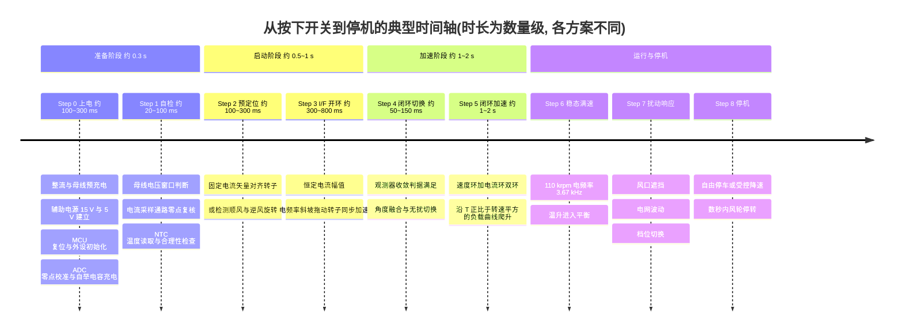
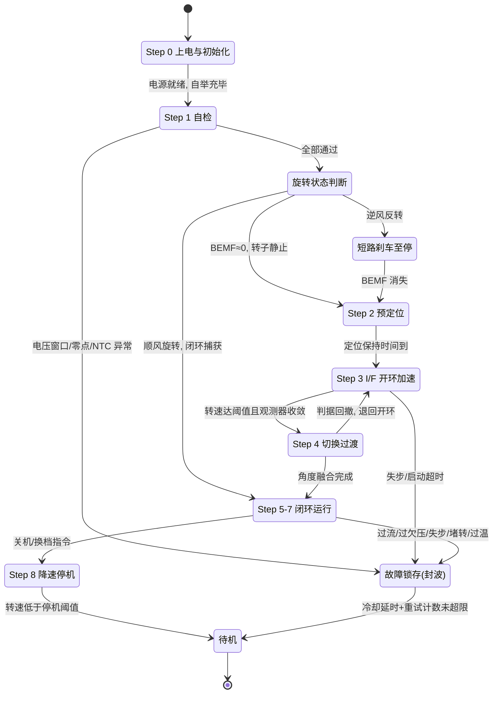

# 第 4 章 从按下开关到满速运行: 高速马达工作过程逐步解析

> 前两章分别回答了"这类产品是什么"(第 1 章)与"电机的物理从哪里来"(第 2 章)。本章换一个视角: **把时间轴拉开, 从用户按下开关的那一毫秒讲到 110 000 rpm 稳态, 再讲到关机停转**。以一台典型的"310 V 母线直驱 + 三相永磁同步电机 + 无位置传感器磁场定向控制(Field Oriented Control, FOC)"高速风筒为对象——这正是米家 H501、追觅 G10、徕芬 SE 等国产主流机型经拆解证实的架构 [1][2][13]——把整个过程切成 9 个步骤。每一步都回答三个问题:
>
> 1. **发生了什么(物理)**: 电容、绕组、转子、气流在做什么;
> 2. **控制器在算什么(算法)**: MCU 的每一段代码为什么存在;
> 3. **关键信号波形与量级**: 如果你把示波器挂上去, 应该看到什么。
>
> 凡涉及具体产品的参数均在章末"参考资料"给出出处 `[n]`; 无一手来源的数值标注 **[估计值]** / **[设定值]**(为使算例闭合而选定、与公开量级相符的教学参数)。全章所有数值相互自洽, 建议读者带计算器阅读。

---

## 4.0 全程鸟瞰: 参考机参数、时间轴与九个步骤

### 4.0.1 本章参考机与推演参数

沿用第 2 章的参考机(110 krpm / 2 对极 / 100 W 轴功率), 本章补齐驱动侧参数。其中 $\psi_f$、$R$、$L$ 等电机参数并非某一实测机型的数据, 而是**按 310 V 母线电压预算反推、保证全章算例闭合的教学参数**, 量级与公开拆解和参考设计一致(米家 H501 马达铭牌 310 V / 60 W / 110 000 rpm [2]; 峰岹 FU6812L+FD2504S 参考方案 AC 220 V / 80 W / 最高 20 万 rpm [3])。

| 参数 | 符号 | 数值 | 性质 |
|---|---|---|---|
| 额定转速 | $n$ | 110 000 rpm | 设定值(对标 V9 [6][7]) |
| 极对数 | $p$ | 2(4 极) | 设定值 |
| 电频率 | $f_e = np/60$ | **3.67 kHz** | 换算 |
| 机械/电角速度 | $\omega_m$ / $\omega_e$ | 11 519 / 23 038 rad/s | 换算 |
| 轴功率 / 额定转矩 | $P$ / $T_n$ | 100 W / 8.7 mN·m | 换算($T=P/\omega_m$) |
| 永磁磁链 | $\psi_f$ | 6.0 mWb | [设定值, §4.7 反推] |
| 相电阻 / 同步电感 | $R$ / $L_d\!=\!L_q$ | 15 Ω / 5 mH | [估计值, 高压绕组多匝细线] |
| 转动惯量(含叶轮) | $J$ | $3\times10^{-7}\ \mathrm{kg\cdot m^2}$ | [估计值, §4.6] |
| 母线电压(220 V 整流) | $U_{dc}$ | 峰值 311 V, 纹波谷值 ≈280 V | 换算(§4.1/§4.7) |
| 母线电解电容 | $C_{bus}$ | 100 μF / 450 V | [估计值] |
| PWM 频率 / 死区 | $f_{PWM}$ / $t_d$ | 64 kHz / 300 ns | [设定值, 常见 48–96 kHz] |
| 电流采样 | — | 双电阻下桥采样 + 片内运放 | 主流方案之一 [4] |
| I/F 启动电流幅值 | $I_{IF}$ | 0.4 A | [设定值, §4.4] |

再强调一个全局事实: 整机 1400–1600 W 中**马达只占约 60–120 W(4–8%), 其余全部是加热丝**; 加热丝不经过整流桥和逆变桥, 直接挂在市电上由可控硅调功 [1][2]。因此本章的"电力电子"只需处理 ~120 W, 这是理解后面所有电容、电流量级的前提。

### 4.0.2 时间轴总览

从按键到满速, 量产机型整个流程约 **1–3 s** [估计值]; 上面各步时长按比例伸缩, 部分步骤(如自检与辅助电源建立)相互重叠。

---

## 4.1 Step 0 上电: 从市电到"万事俱备"

### 4.1.1 发生了什么(物理)

用户插入插头、按下开关后, 功率路径上依次发生:

1. **市电整流**。AC 220 V(50 Hz)经保险丝、EMI 滤波(X 电容 + 共模电感)进入整流桥, 输出脉动直流, 峰值 $\sqrt{2}\times 220 \approx 311\ \mathrm{V}$。注意这条整流通路**只喂马达和控制电路**(~120 W); 1400 W 级加热丝在整流桥之前就分走了, 由可控硅直接斩市电 [1][2]。
2. **母线电容预充电(pre-charge)**。母线电解电容(参考机取 100 μF/450 V [估计值])初始电压为零, 直接接通会产生仅受线路阻抗限制的浪涌电流。小功率马达母线的通行做法是串一只功率热敏电阻(NTC)或绕线电阻限流: 取冷态 10 Ω [估计值], 最坏在电压峰值合闸时浪涌峰值约 $311/10 \approx 31\ \mathrm{A}$, 时间常数 $\tau = RC \approx 0.7\ \mathrm{ms}$——电容在**第一个半波内就充到接近峰值**。稳态马达母线电流仅 ~0.4 A(§4.7), 限流电阻上的持续损耗 $I^2R < 1\ \mathrm{W}$ [估计值], 因此这一级往往不设继电器旁路。
3. **辅助电源建立**。310 V 母线经非隔离 Buck(拆解实证: 晶丰明源 BP85226/BP85956D、士兰微 SDH8322S 等 [1][2][13])降到 ~15 V 给栅极驱动/IPM 供电, 再经 78L05 类 LDO 得到 5 V/3.3 V 给 MCU。15 V 轨爬升到栅驱欠压闭锁(Undervoltage Lockout, UVLO, 典型阈值 8–10 V [估计值])以上之前, 功率管不允许动作。
4. **MCU 上电复位**。电源监测(POR/BOR)释放复位, 典型几毫秒后开始执行代码。

### 4.1.2 控制器在算什么(算法)

上电初始化代码的每一行都对应一个后患:

| 初始化动作 | 具体内容 | 不做的后果 |
|---|---|---|
| 时钟与看门狗 | 内部 RC 起振 → PLL 倍频至主频(如 CMS32M5710 为 64 MHz M0 [4]); 配置窗口看门狗 | 程序跑飞时逆变桥失控 |
| PWM 安全态 | 6 路 PWM 先置于"全关"输出; 配置中心对齐(center-aligned)计数、互补输出、死区 $t_d\approx300\ \mathrm{ns}$–1 μs; 刹车输入(BKIN)与硬件比较器联动 | 任一瞬间的桥臂直通即炸管 |
| ADC 初始化与自校准 | 启动片内偏移校准; 分配通道(两相电流、$U_{dc}$、母线电流、NTC×2); 触发源绑定 PWM 计数器峰/谷, 使采样点落在零矢量中点、避开开关噪声 | 电流采样混入开关毛刺, FOC 无法工作 |
| 模拟前端配置 | 片内运放/PGA 增益(采样电阻 0.2–0.5 Ω、增益 8–16 [估计值]), 逐波限流(cycle-by-cycle current limit)比较器阈值(如对应 ±1.5 A 峰值 [设定值]) | 失去微秒级硬件保护, MOSFET 出安全工作区 |
| **电流零点校准** | 在 PWM 未输出、绕组零电流时, 对每相采样通道取 N≈256 点平均, 记为偏置(理论值为运放偏置中点, 如 2.5 V@5 V 系统); 偏离窗口(如 ±2% 满量程)即判故障 | 零点漂移直接变成 dq 电流的直流误差 → 转矩脉动与观测器角度偏差 |
| **自举电容充电** | 高压半桥的高侧驱动靠自举(bootstrap)电容供电, 而它只有在下管导通时才能从 15 V 轨充电。先把三个下管持续(或以高占空比)导通 1–10 ms, 给自举电容(典型 100 nF–1 μF)充满 | 第一个 PWM 周期高侧管欠压半开通, 大概率炸管 |

### 4.1.3 关键信号与量级

| 信号 | 形态 | 量级 |
|---|---|---|
| $U_{dc}$ | 阶跃充电(τ≈0.7 ms)后跟随整流包络 | 0 → ~311 V 峰值 |
| 浪涌电流 | 单个窄尖峰 | 峰值 ≤~31 A、亚毫秒 [估计值] |
| 15 V / 5 V 轨 | 先后爬升, 相差数 ms–数十 ms | Buck 启动软起 |
| 自举电容电压 | 下管导通期间指数充至 ~15 V | 1–10 ms |
| 相电流 | 恒为零(桥臂全关) | 0 A |

---

## 4.2 Step 1 自检: 不见母线不发波

自检在物理上"什么都没发生"——转子静止、桥臂关断——但它决定这台机器敢不敢开始发波。典型检查表:

| 检查项 | 方法 | 参考判据 [估计值] | 失败动作 |
|---|---|---|---|
| 母线电压窗口 | ADC 读 $U_{dc}$(经电阻分压) | 200 V < $U_{dc}$ < 380 V 方可启动; 运行中欠压/过压阈值另设 | 拒绝启动 / 封波 |
| 母线纹波形态 | 观察 100 Hz 纹波幅度 | 纹波异常大提示电容老化失容 | 记录/降额(可选项) |
| 电流通路零点 | 复核 Step 0 的偏置校准结果 | 三相偏置一致性、窗口内 | 判采样通路故障, 拒绝启动 |
| 功率管状态 | 依方案而异: 低成本方案仅依赖逐波限流被动保护; 讲究的固件对各下管发亚微秒试探脉冲、看 shunt 电流响应判短路 | 无异常电流 | 判桥臂短路, 锁存故障 |
| NTC 读取 | 电机绕组端部 NTC 与功率板 NTC 各一 | 阻值在 −20~120 °C 对应窗口内(开路/短路可辨) | 超温或断线拒绝启动 |

值得强调的工程直觉: **欠压比过压更容易炸管**。若 15 V 栅驱轨不足, MOSFET 半开通工作在线性区, 几十毫秒即热失效——这就是 UVLO 和"母线电压窗口"都必须在发波前确认的原因。

此阶段控制器还做一件为下一步铺垫的事: **持续运行反电动势(Back Electromotive Force, BEMF)检测**——桥臂全关时相端电压即感应电动势的分压。若检测到明显交流分量, 说明转子正被风道里的自然气流吹转(见 §4.3 的"顺风/逆风启动")。

---

## 4.3 Step 2 转子预定位(或初始位置检测)

### 4.3.1 发生了什么(物理)

无位置传感器系统在静止时是"盲"的: 反电动势为零, 无从得知转子朝向。最朴素也最主流的解法是**预定位(alignment)**: 向绕组注入一个方向固定的电流矢量, 建立一个静止的定子磁场, 把转子"吸"到已知角度上——像指南针被磁铁掰正。

转子被吸向平衡点的过程是一个欠阻尼二阶系统。电流幅值取 $I_{align}=0.4\ \mathrm{A}$ [设定值]时, 小角度下的电磁转矩刚度为

$$
k_\delta = \frac{\partial T}{\partial \theta_{m}} = p \cdot \frac{3}{2}p\,\psi_f I_{align} = 2 \times \frac{3}{2}\times 2 \times 0.006 \times 0.4 \approx 1.44\times10^{-2}\ \mathrm{N\cdot m/rad}
$$

对应机械振荡频率

$$
f_{osc} = \frac{1}{2\pi}\sqrt{\frac{k_\delta}{J}} = \frac{1}{2\pi}\sqrt{\frac{1.44\times10^{-2}}{3\times10^{-7}}} \approx 35\ \mathrm{Hz}
$$

阻尼只来自轴承摩擦与磁体涡流, 很弱, 转子会以 ~35 Hz 摆动 2–3 个周期后稳住——这就是许多风筒启动瞬间那一声轻微"嗒"的来源, 也是预定位时长取 **100–300 ms**(≥3–5 个振荡周期)的依据。为减小声与机械冲击, 电流通常以斜坡而非阶跃加到 $I_{align}$。

预定位有一个原理性盲区: 若转子恰好停在与注入矢量相差 180° 电角度的不稳定平衡点上, 转矩为零、定位失败(概率极低, 且任何微扰即脱离)。更完备的**初始位置检测(Initial Position Detection, IPD)**用六方向电压脉冲注入、比较电流峰值差异(磁饱和使 d 轴电感随磁极极性微变)来直接判角度——但风筒转子普遍是表贴/粘结磁环结构, 凸极率 ≈1, 饱和信号微弱, 而风机负载又完全允许"先定位再启动", 所以**量产风筒几乎都用预定位而非 IPD** [估计值, 行业通行做法]。

### 4.3.2 顺风与逆风: 预定位前的岔路

风筒的风道是开放的, 挂在墙上时穿堂风可能把叶轮吹得慢速旋转:

- **顺风(正向旋转)**: 若 Step 1 检测到的 BEMF 幅值与频率足够, 可跳过定位和开环, 用测得的 BEMF 直接初始化观测器、**闭环捕获(catch spin / 顺风启动)**;
- **逆风(反向旋转)**: 必须先刹停——常用三下管同时导通的**短路刹车**(见 §4.9), 待 BEMF 消失再进入预定位。直接对反转的转子做 I/F 拖动会以失步或过流告终。

### 4.3.3 关键信号与量级

| 信号 | 形态 | 量级 |
|---|---|---|
| 相电流 | 直流, 斜坡上升后恒定, 三相按矢量方向分配(如 $i_a=0.4$, $i_b=i_c=-0.2$ A) | 0.4 A, 100–300 ms |
| 转子机械角 | 欠阻尼二阶振荡收敛 | ~35 Hz 摆动 2–3 周 |
| 绕组损耗 | $\frac{3}{2}I_{align}^2R \approx 3.6\ \mathrm{W}$, 持续 0.2 s, 温升可忽略 | ~0.7 J |
| 声学 | 单次低频"嗒"声 | — |

---

## 4.4 Step 3 I/F 开环启动: 把转子"拖"起来

### 4.4.1 发生了什么(物理)

**I/F 启动(current-frequency startup)**: 电流环闭环(幅值受控), 角度开环(由固件生成斜坡)。控制器让一个幅值恒定为 $I_{IF}$ 的电流矢量按 $\theta_{ramp}=\int\omega_{ramp}\,dt$ 匀加速旋转, 转子像同步电机一样被磁场拖着走。

这套机制能自稳的原因是**功角自平衡**。设电流矢量领先转子 d 轴的电角度为功角 $\delta$, 则电磁转矩

$$
T_e = \frac{3}{2}p\,\psi_f I_{IF}\sin\delta
$$

若转子落后了, $\delta$ 增大、转矩自动增大把它拉回来; 反之亦然——在 $|\delta|<90^\circ$ 内这是一个负反馈。转子的真实位置由负载自动决定: $\sin\delta = T_{load}/T_{max}(I_{IF})$。

参考机的数字: 斜坡目标取 15% 额定转速(16 500 rpm, $f_e=550\ \mathrm{Hz}$), 用时 0.5 s [设定值], 需要的转矩为

$$
T_{need} = \underbrace{J\frac{d\omega_m}{dt}}_{3\times10^{-7}\times\frac{1728}{0.5}\approx1.04\ \mathrm{mN\cdot m}} + \underbrace{T_n\Big(\frac{n}{n_N}\Big)^2}_{8.7\times0.15^2\approx0.20\ \mathrm{mN\cdot m}} \approx 1.2\ \mathrm{mN\cdot m}
$$

——**惯量项主导, 气动负载几乎为零**(风机负载 $T\propto\omega^2$ 在低速段的红利)。而 $I_{IF}=0.4$ A 可提供 $T_{max}=\frac{3}{2}\times2\times0.006\times0.4=7.2\ \mathrm{mN\cdot m}$, 稳态功角仅

$$
\delta = \arcsin\frac{1.2}{7.2} \approx 9.6^\circ
$$

裕量约 6 倍, 正落在经验规则"启动电流取负载需求的 1.2–2 倍再加惯量裕量"覆盖的安全区内。注意此时电流矢量几乎贴着转子 d 轴——绝大部分电流在励磁而非产生转矩, 效率极低, 但低速段总功率本来就小(<2 W), 无关紧要; 这个"浪费"恰恰是后面无扰切换的抓手(§4.5)。

### 4.4.2 失步风险: 这一阶段唯一会失败的方式

| 失步机理 | 物理解释 | 对策 |
|---|---|---|
| 频率斜坡过陡 | $T_{need}>T_{max}$, 要求 $\delta>90^\circ$, 负反馈变正反馈, 转子滑极 | 斜坡加速度按 $J$ 与 $I_{IF}$ 校核, 留 3 倍以上裕量 |
| 功角振荡(hunting)发散 | 功角动力学是弱阻尼二阶系统, 固有频率与 §4.3 同源(0.4 A 下 ~35 Hz); 斜坡加速度突变或电流幅值突变会激起振荡 | 用 S 形(加加速度受限)频率斜坡; 避开在固有频率附近长时间驻留 |
| 电流幅值过小 | 静摩擦/轴承脂低温变稠时 $T_{max}$ 不够 | 低温工况加大 $I_{IF}$(NTC 联动) |
| 逆风未处理 | 对反转转子强行拖动 | §4.3.2 的刹停流程 |

失步的信号特征非常鲜明: 相电流幅值不变(电流环还在忠实工作), 但**电流与反电动势的相对相位开始以拍频滑动**, 观测器估计的 BEMF 幅值与 $\hat\omega\psi_f$ 严重不符, 转矩平均值跌为零、转速掉回去。固件以此判据停机重试。

### 4.4.3 关键信号与量级

| 信号 | 形态 | 量级 |
|---|---|---|
| 相电流 | 恒幅正弦"鸟鸣"(chirp), 频率 0→550 Hz 线性上扫 | 幅值 0.4 A |
| 转速 | 跟随斜坡, 叠加 ~35 Hz 微幅功角振荡 | 0→16 500 rpm / 0.5 s |
| 相端电压 | 幅值随频率近似线性增长($\omega_e\psi_f$ 项 + $I_{IF}R$ 项) | 数 V → ~25 V |
| 声学 | 扫频音(基频 0→550 Hz 及 PWM 边带) | 启动"嗖"声的主体 |

---

## 4.5 Step 4 观测器收敛与闭环切换: 惊险的一跳

### 4.5.1 发生了什么(物理)

I/F 拖到 15% 转速时, 反电动势幅值已达

$$
E = \hat\omega_e\psi_f = 0.15\times23\,038\times0.006 \approx 21\ \mathrm{V}
$$

而系统里最主要的电压"噪声"——死区畸变——的量级为(§4.7.3 详述)

$$
\Delta U \approx t_d\,f_{PWM}\,U_{dc} = 300\ \mathrm{ns}\times64\ \mathrm{kHz}\times310\ \mathrm{V} \approx 6\ \mathrm{V}
$$

信号畸变比约 3.5:1, 加上死区补偿后, 基于电压模型的观测器已有足够的信噪比工作。**这就是切换阈值取 10–20% 额定转速的第一性依据**: 不是"转得够快", 而是"BEMF 比死区畸变大得足够多"。

### 4.5.2 控制器在算什么(算法)

滑模观测器(Sliding-Mode Observer, SMO)+ 锁相环(Phase-Locked Loop, PLL)从 I/F 一开始就在后台空转 [8][9][10][11]: 对 $\alpha\beta$ 电流建观测方程, 滑模项收敛后其等效控制量即反电动势估计 $\hat e_\alpha=-\psi_f\omega_e\sin\theta_e$、$\hat e_\beta=\psi_f\omega_e\cos\theta_e$; PLL 以误差 $\varepsilon=-\hat e_\alpha\cos\hat\theta-\hat e_\beta\sin\hat\theta$(按 $|\hat e|$ 归一化)驱动 PI 得 $\hat\omega_e$, 积分得 $\hat\theta$。固件持续核对一组**收敛判据**, 在滑窗(如 50 ms)内全部满足才允许切换:

1. $|\hat e|$ 与 $\hat\omega_e\psi_f$ 的偏差 < 阈值(BEMF 幅值自洽性);
2. $\hat\omega_e$ 与 $\omega_{ramp}$ 偏差 < 阈值(转速自洽性);
3. $\hat\theta$ 与 $\theta_{ramp}$ 的差值**稳定**(不要求为零——见下);
4. PLL 误差 $\varepsilon$ 的方差 < 阈值(锁定质量)。

**切换瞬间的角度差从哪来?** I/F 稳态下电流矢量贴着转子 d 轴($\delta\approx10^\circ$), 而闭环 FOC 要求电流沿 q 轴——两个参考系相差接近 $90^\circ-\delta\approx80^\circ$ 电角度。若粗暴地把参考系瞬间从 $\theta_{ramp}$ 跳到 $\hat\theta$, 电流矢量瞬间转过 80°, 等效于转矩阶跃 + 电流环给定阶跃, 会打出一个数倍于稳态的电流尖峰, 轻则听见"咔"声, 重则触发过流。工程上的三板斧:

1. **电流幅值渐减**: 切换前把 $I_{IF}$ 沿斜坡降低, 由 $\sin\delta=T_{load}/T_{max}(I)$ 可知 $\delta$ 自动增大、电流矢量**自己滑向真实 q 轴**, 参考系差随之缩小——这是最优雅的一步, 物理上等于"把浪费的励磁电流退掉";
2. **角度融合**: 切换后的一小段时间(数十 ms)内使用 $\theta = \theta_{ramp} + \lambda(t)(\hat\theta-\theta_{ramp})$, $\lambda$ 从 0 线性升到 1, 角度差被斜坡而非阶跃吸收;
3. **无扰切换(bumpless transfer)**: 速度环 PI 的积分器用切换瞬间的实际 $i_q$ 预置, 电流环给定从当前值出发, 避免控制量跳变。

### 4.5.3 关键信号与量级

| 信号 | 形态 | 量级 |
|---|---|---|
| $\hat\theta-\theta_{ramp}$ | 从 ~80° 电角度沿斜坡收敛到 0 | 数十 ms |
| $i_q$(新参考系) | 从 ~0.4 A(原 $I_{IF}$ 的投影)平滑滑到速度环需求(~0.05 A @15% 转速) | 无尖峰为佳; 未做抑制时尖峰可达 2–3 倍 [估计值] |
| $|\hat e|$ | 与 $\hat\omega\psi_f$ 曲线重合 | ~21 V @切换点 |
| 声学 | 处理得好则无感; 处理不好有一声"咔" | — |

---

## 4.6 Step 5 闭环加速至满速: 沿 $T\propto\omega^2$ 爬坡

### 4.6.1 控制器在算什么(算法): 双环结构与带宽阶梯

切换完成后, 系统进入教科书式的**速度环 + 电流环双闭环**(峰岹参考方案为功率环+速度环变体 [3]):

| 环路 | 执行频率 | 闭环带宽 [估计值] | 说明 |
|---|---|---|---|
| PWM / 电流采样 | 64 kHz | — | 中心对齐, 零矢量中点采样 |
| 电流环(dq 双通道) | 64 kHz(或 32 kHz) | 2–4 kHz | 内模法 $K_p=\alpha_cL,\ K_i=\alpha_cR$; 带前馈解耦与 1.5 拍延迟补偿 |
| PLL / 观测器 | 与电流环同步 | 数百 Hz | 角度与转速估计 |
| 速度环 | 1–4 kHz | 50–150 Hz | 输出 $i_q^*$, 带限幅 $i_{q,max}=0.72\ \mathrm{A}$(1.5 倍) [设定值] |
| 转速给定斜坡 | 100 Hz–1 kHz | — | S 形曲线, 决定"体感启动速度" |

带宽按 ~10 倍逐级隔离, 是级联结构稳定的前提。

### 4.6.2 发生了什么(物理): 风机负载下的加速动力学

风机负载 $T_{load}=k\omega_m^2$, 其中 $k = T_n/\omega_{mN}^2 = 8.7\times10^{-3}/11\,519^2 = 6.6\times10^{-11}\ \mathrm{N\cdot m\cdot s^2}$。若速度环把 $i_q$ 顶到限幅(恒转矩 $T_{max}=1.5T_n=13.1\ \mathrm{mN\cdot m}$), 运动方程

$$
J\frac{d\omega_m}{dt} = T_{max} - k\omega_m^2
$$

有解析解 $\omega_m(t) = \omega_f\tanh(t/\tau)$, 其中 $\omega_f=\sqrt{T_{max}/k}=14\,100\ \mathrm{rad/s}$, $\tau = J\omega_f/T_{max}=0.32\ \mathrm{s}$。代入可得**理论上从静止加速到 110 krpm 只需约 0.37 s**。量产机型实际取 1–3 s, 不是做不到快, 而是刻意用给定斜坡压制: 一是启动声品质(扫频音太快会很"贼"), 二是限制叶轮启停循环的离心应力冲击与轴承冲击, 三是压低启动段的母线电流峰值。

加速过程中各量的走向(设给定斜坡 1.5 s、近似匀加速 $\dot\omega_m\approx6500\ \mathrm{rad/s^2}$):

- $i_q$: 由 $T=J\dot\omega_m+k\omega_m^2$ 折算, 从 ~0.11 A(纯惯量项 $J\dot\omega_m\approx2.0\ \mathrm{mN\cdot m}$)**近似抛物线上升**至接近满速时的峰值 ~0.59 A($T\approx10.7\ \mathrm{mN\cdot m}$), 到达给定后回落到稳态 0.48 A;
- 轴功率: $P=T\omega_m\propto$ 接近 $\omega^3$, 最后 30% 转速段消耗了大部分能量——**加速的"苦"全在末段**;
- 母线电流: 跟随输入功率, 从 <0.05 A 爬到峰值 ~0.45 A [估计值], 稳态 0.39 A;
- 母线电压: 100 Hz 纹波谷随负载加深, 从空载的近乎平顶到满载谷值 ~280 V(§4.7.2);
- 电压裕量: 相电压幅值 $|u|\approx\sqrt{(Ri_q+\omega_e\psi_f)^2+(\omega_eL i_q)^2}$ 随转速近似线性增长, 调制比(定义 $m=|u|/(U_{dc}/\sqrt3)$)一路爬向满速的 ~0.9——**弱磁不需要, 但裕量必须在设计时留好**(§4.7.1)。

### 4.6.3 关键信号与量级

| 信号 | 形态 | 量级 |
|---|---|---|
| 转速 | S 形爬升 | 16.5 k → 110 krpm, 1–2 s |
| $i_q$ | 抛物线上升→峰值→回落 | 0.11 → 0.59 → 0.48 A |
| 相电流频率 | 550 Hz → 3.67 kHz 扫频 | 恒滞后转速零拍 |
| 母线电流(均值) | 近似 $\propto\omega^3$ 爬升 | <0.05 → ~0.45 → 0.39 A |
| 声学 | 扫频音上行; 13 叶叶轮的叶片通过频率 $f_{BPF}=13n/60$ 在 ~92 krpm(约 84% 转速)处越过 20 kHz 移出可听域 | 加速末段主观上反而"变安静" |

---

## 4.7 Step 6 稳态满速运行: 一张自洽的工作点快照

### 4.7.1 稳态工作点推演(全部可手算复核)

这是全章的锚点。推演顺序: 电压预算 → $\psi_f$ → $i_q$ → 功率闭合。

**(1) 电压预算定磁链。** SVPWM 线性区最大相电压幅值 $U_{max}=U_{dc}/\sqrt3$。关键细节: **必须用母线纹波谷值而非峰值做预算**——满载时 $U_{dc}$ 谷值 ≈280 V(见下), $U_{max}=162\ \mathrm{V}$。按"最高转速不弱磁、留 ~5% 裕量"的原则(第 3 章/§5.8 设计准则), 反推 $\psi_f=6.0\ \mathrm{mWb}$:

$$
u_q = Ri_q + \omega_e\psi_f = 15\times0.483 + 23\,038\times0.006 \approx 145.5\ \mathrm{V}
$$
$$
u_d = -\omega_eL_qi_q = -23\,038\times0.005\times0.483 \approx -55.6\ \mathrm{V}
$$
$$
|u| = \sqrt{u_q^2+u_d^2} \approx 155.7\ \mathrm{V} \quad(= 0.96\,U_{max,\text{谷}} ,\ m\approx0.91\ \text{@均值 296 V})
$$

注意 $u_d$ 并不小: 高速下交叉耦合项 $\omega_eLi_q$ 达 56 V, 这就是第 3 章强调前馈解耦的原因——PI 若靠误差慢慢积出这 56 V, 电流环早就振了。

**(2) 转矩定电流。** SPM 的 $T_e=\frac{3}{2}p\psi_f i_q$:

$$
i_q = \frac{8.7\times10^{-3}}{1.5\times2\times0.006} \approx 0.483\ \mathrm{A(幅值)}\ \Rightarrow\ I_{rms}=\frac{0.483}{\sqrt2}\approx0.34\ \mathrm{A}
$$

**(3) 功率闭合校核。** 逆变器输出电功率 $P_e=\frac{3}{2}u_qi_q = 105.4\ \mathrm{W}$; 铜损 $\frac{3}{2}i_q^2R=5.25\ \mathrm{W}$; 二者之差 100.1 W 恰等于 $T\omega_m=100\ \mathrm{W}$ ✔(dq 模型不含铁损, 铁损与机械损耗在此模型中表现为轴上的等效阻转矩)。计入铁损 ~5.5 W(总损耗最大单项, 3–8% 经验区间取中 [估计值])、风摩与轴承 ~1.5 W [估计值]、逆变器 ~2 W [估计值]:

$$
P_{in} \approx 100 + 5.25 + 5.5 + 1.5 + 2 \approx 114\ \mathrm{W},\qquad \eta_{motor} \approx \frac{100}{112} \approx 89\%\ \text{[估计值]}
$$

$$
I_{dc} = \frac{114}{\bar U_{dc}\approx296} \approx 0.39\ \mathrm{A}
$$

**(4) 母线纹波自洽。** 100 μF 电容在两个整流峰之间(≈8 ms 放电窗口)支撑 0.39 A:

$$
\Delta U \approx \frac{I_{dc}\,\Delta t}{C} = \frac{0.39\times8\times10^{-3}}{100\times10^{-6}} \approx 31\ \mathrm{V}\ \Rightarrow\ U_{dc}\in[280,311]\ \mathrm{V}
$$

——正是第 (1) 步用的谷值, 环闭合。若把电容减半, 谷值跌到 ~250 V, $U_{max}=144\ \mathrm{V}<|u|$, 满速将保不住: **母线电容的下限不是由纹波指标、而是由最高转速的电压预算决定的**。这个 31 V 的 100 Hz 纹波同时解释了固件里的一行代码: SVPWM 占空比计算必须用**每周期实测的 $U_{dc}$ 做归一化(电压前馈)**, 否则 100 Hz 纹波将直接调制转矩。

### 4.7.2 稳态快照总表

| 物理量 | 数值 | 备注 |
|---|---|---|
| 转速 / 电频率 | 110 000 rpm / 3.67 kHz | 电周期 273 μs |
| 载波比 $f_{PWM}/f_e$ | 64/3.67 ≈ **17.4** | 每电周期 17 个采样点, 满足 ≥10 但不奢侈 |
| 1.5 拍延迟角 | $1.5\,\omega_eT_s = 1.5\times23\,038\times15.6\ \mathrm{\mu s}\approx0.54\ \mathrm{rad}\approx$ **31°** | 不补偿电流环必振 |
| 死区电压畸变 | ~6 V(300 ns×64 kHz×310 V) | 需死区补偿, 否则注入 5/7 次谐波 |
| $i_q$ / 相电流 RMS | 0.483 A / 0.34 A | $i_d^*=0$(SPM 无 MTPA 增益) |
| $u_q$ / $u_d$ / $|u|$ | 145.5 / −55.6 / 155.7 V | 调制比 ~0.91 |
| 反电动势(相, 幅值) | $\omega_e\psi_f\approx138\ \mathrm{V}$ | 线-线峰值 ≈239 V |
| 母线电压 / 电流 | 280–311 V(100 Hz 纹波) / 0.39 A | 无 PFC, 功率因数 ~0.5–0.6 [估计值] |
| 电磁转矩 | 8.7 mN·m | 微小转矩大转速 |
| 电机输入 / 效率 | ~112 W / ~89% [估计值] | 损耗: 铁 5.5 + 铜 5.25 + 机械 1.5 W |
| PWM 电流纹波 | $\sim U_{dc}T_s/4L\approx0.24\ \mathrm{A_{pp}}$(最劣占空比) | 5 mH 电感的代价与红利 |

### 4.7.3 温升平衡

稳态热平衡的量级极具启发性: 电机总损耗 ~12 W, 而流过它的风量 13 L/s(参考追觅小金管口径)对应的对流"运热能力"为

$$
\rho c_p Q = 1.2\times1005\times0.013 \approx 15.7\ \mathrm{W/K}
$$

即全部电机损耗只把穿堂风加热不到 1 K——**电机自身发热对出风温度的贡献可以忽略, 也说明只要风在流动, 电机就"淹"在冷却介质里**。真正的温度约束是局部热阻: 绕组端部热点温升 40–60 K [估计值], 与追觅宣称的"电机工作温度控制在约 110 °C"量级吻合 [1](环境+加热腔回传+自热)。整机层面, 加热丝出风由 NTC 以约 200 次/秒采样、恒定在 57 °C 左右(追觅宣称值 [1]); 电机腔靠风道隔热与自身进风冷却, 与加热腔解耦——**电机的头号热威胁不是运行, 而是停机后的热风倒灌**(§4.9.3)。

---

## 4.8 Step 7 工况扰动响应: 三个经典场景

### 4.8.1 进风口被部分遮挡(负载突变)

**物理**: 头发/手掌堵住进风格栅时, 系统阻力曲线陡增, 工作点沿风机特性曲线左移: 流量骤减、压升上升。对这类小型混流/离心叶轮, **轴功率随流量减小而下降**——被堵住的风机反而"变轻了"(与吸尘器吸口密封时电流下降同理)。负载转矩可在几十毫秒内下降 20–40% [估计值]。

**控制**: 恒速控制下, 转速先出现 +1~2% 的瞬时超调(负载突减、转矩过剩), 速度环(带宽 ~100 Hz)在 20–50 ms 内把 $i_q$ 下调到新平衡; 母线电流同步下降。若堵转程度进入叶轮失速/喘振区, $i_q$ 上会叠加数十至数百 Hz 的宽带波动, 声音变"闷"且粗糙——高档机型据此(电流方差 + NTC 出风温度)判断风道异常, 联动**降低加热档**防止出风口过温, 这也是"风量低 → 自动降热功率"保护逻辑的日常触发场景。

**波形签名**: $i_q$ 台阶式下降且方差增大; 转速毛刺后回平; 出风 NTC 温度爬升触发可控硅导通角回缩。

### 4.8.2 电网电压波动

市电 ±10%(198–242 V)使母线峰值在 280–342 V 间移动。三层影响、三种响应:

1. **SVPWM 电压前馈**(逐周期用实测 $U_{dc}$ 归一化)把电压波动在电流环之前就消化掉——±10% 波动下转速几乎无感;
2. **欠压边界**: 参考机在 −10% 市电时满载谷值 ≈250 V, $U_{max}\approx144\ \mathrm{V}<|u|=156\ \mathrm{V}$, 调制饱和——固件的选择只有三个: 接受转速跌落(风机负载下约随电压比例回落)、短暂注入 $-i_d$ 弱磁(多耗铜损换电压), 或触发欠压降速。严谨的量产设计会**按最低规格市电的纹波谷值做 §4.7.1 的电压预算**, 参考机为教学清晰按额定市电设计, 此差异请读者留意;
3. **加热丝**: $P\propto V^2$, ±10% 电压即 ∓19–21% 热功率——波动的主要受害者是出风温度而不是马达, 恒温靠 NTC 闭环把可控硅导通角补回来 [1][2]。

### 4.8.3 用户切换档位(加热档影响母线)

按下加热档的瞬间, 可控硅开始向 1400 W 加热丝放电流(纯电阻, 冷态电阻略低于热态, 浪涌温和)。加热丝**不在直流母线上**, 但与整流桥共享电源线与插座内阻: 6.8 A(1500 W/220 V)的热丝电流在 ~0.4 Ω 线路阻抗 [估计值]上压降 ~3 V, 母线包络下移 ~1%; 若采用周波通断(burst)控温, 母线包络会以通断周期轻微"呼吸"。这些对有电压前馈的 FOC 都是毛毛雨——示波器上可见, 转速上不可闻。真正的耦合发生在热学: 加热档提高整机腔温, 电机 NTC 温度缓慢爬升数摄氏度 [估计值]。

---

## 4.9 Step 8 降速与停机

### 4.9.1 自由停车(coast): 风机负载是天然刹车

松开开关后最简单的做法: 封波(六管全关), 让气动阻力刹车。运动方程 $J\dot\omega_m=-k\omega_m^2$ 的解给出

$$
t(\omega_0\!\to\!\omega) = \frac{J}{k}\Big(\frac{1}{\omega}-\frac{1}{\omega_0}\Big)
$$

代入参考机: **降到半速 0.40 s, 降到 10% 转速 3.6 s**; 再往下气动阻力 $\propto\omega^2$ 迅速失效, 由轴承摩擦(~0.05–0.1 mN·m [估计值])在数秒内收尾。总体听感: 音调迅速下坠、随后长长的低吟——正是多数风筒的关机声。

**安全校核**: 封波后电机变发电机, 相端出现线-线峰值 $\sqrt3\,\omega_e\psi_f\approx239\ \mathrm{V}$ 的反电动势——**低于母线电压最低值(−20% 市电时 ≈249 V)**, 六个体二极管不会导通, 不存在不受控整流回馈。这是高压母线路线的天然红利; 若是 24–48 V 低压路线, 同样的校核就是生死线(第 3 章 §7.6)。

### 4.9.2 主动刹车: 能量往哪儿去是唯一的问题

需要快速停机(如检测到逆风反转前的刹停、或跌落保护)时有两种手段:

**(a) 回馈刹车(负 $i_q$)**: 动能经逆变器泵回母线。参考机满速动能

$$
E_k = \frac{1}{2}J\omega_m^2 = \frac{1}{2}\times3\times10^{-7}\times11\,519^2 \approx 19.9\ \mathrm{J}
$$

而 100 μF 母线电容从 310 V 充到 400 V 只能吸收

$$
\Delta E = \frac{1}{2}C(400^2-310^2) \approx 3.2\ \mathrm{J}
$$

——**六分之一的转子动能就足以把母线打到危险区**(整流桥反向截止, 能量出不去)。所以回馈刹车必须由母线电压外环限幅: $U_{dc}$ 逼近阈值就自动放缓刹车转矩, 让多数能量仍由风阻耗散。风筒惯量小、气动刹车快, 这个问题远比电动工具温和, 但代码里那个"刹车时盯住 $U_{dc}$"的判断不能省。

**(b) 短路刹车(三下管全开)**: 动能全部耗散在绕组电阻里, 母线零回馈。刹车电流受电机自身阻抗限制:

$$
I_{sc} = \frac{\omega_e\psi_f}{\sqrt{R^2+(\omega_eL)^2}} \xrightarrow{\ 110\ \mathrm{krpm}\ } \frac{138}{\sqrt{15^2+115^2}} \approx 1.2\ \mathrm{A}
$$

约 2.5 倍额定电流, 短时可承受; 刹车转矩在 $\omega_e=R/L=3000\ \mathrm{rad/s}$(约 14 300 rpm)处达到峰值 $\frac{3}{4}p\psi_f^2/L\approx10.8\ \mathrm{mN\cdot m}$——**短路刹车低速最狠、高速偏软**, 与气动刹车(高速最狠)正好互补, 所以工程上常见"高速段自由停车 + 低速段短路刹车收尾"的组合。

### 4.9.3 停机之后: 热风倒灌

风一停, 加热丝与加热腔的余热失去对流压制, 沿风道向电机腔回传("热浸", heat soak)。这是磁体(NdFeB 的 $H_{cJ}$ 随温度陡降)与轴承油脂(>70–80 °C 后寿命随温度指数衰减)在整个生命周期里遭遇的最高温度时刻之一, 也是第 3 章强调选 SH/UH 磁体牌号与风道隔热的场景依据。部分机型在关机后维持低速送冷风数秒以冲淡热浸 [估计值, 依机型而异]。

---

## 4.10 全程状态机: 把九个步骤装进固件

前述所有步骤在固件中收敛为一个主状态机, 故障处理贯穿始终(阈值均为参考量级):

与状态机并联运行的保护(任何状态可触发 FLT): 硬件逐波限流(μs 级, 保 MOSFET)、软件 I²t(保绕组)、母线过压/欠压、观测器残差失步判据、NTC 分级降载, 以及独立于软件的比较器→PWM 刹车输入硬联锁。

### 本章小结: 九步一表

| 步骤 | 时长量级 | 物理主角 | 算法主角 | 一个必记数字 |
|---|---|---|---|---|
| 0 上电 | ~0.3 s | 电容预充/自举 | ADC 校准, PWM 安全态 | 母线 311 V 峰值 |
| 1 自检 | <0.1 s | 静止 | 电压窗口/零点/NTC | 启动窗口 200–380 V [估计值] |
| 2 预定位 | 0.1–0.3 s | 转子 35 Hz 摆动收敛 | 固定矢量 0.4 A | 定位≥3 个振荡周期 |
| 3 I/F | 0.3–0.8 s | 功角自平衡拖动 | 恒流 + 频率斜坡 | 功角裕量 ~6 倍 |
| 4 切换 | 50–150 ms | BEMF 21 V ≫ 死区 6 V | 收敛判据 + 无扰切换 | 阈值 10–20% 转速 |
| 5 加速 | 1–2 s | $T\propto\omega^2$ | 双环 + 给定斜坡 | 理论极限 0.37 s |
| 6 稳态 | 持续 | 温升平衡 | 前馈解耦 + 电压前馈 | $i_q$=0.48 A, 谷值 280 V |
| 7 扰动 | ms–s | 风路/电网/热耦合 | 前馈 + 联动保护 | 堵风反而"变轻" |
| 8 停机 | 3–10 s | 气动刹车 | 母线限幅/短路刹车 | 动能 20 J vs 电容 3.2 J |

---

## 参考资料

1. 充电头网(腾讯新闻转载), 追觅 G10 高速吹风机拆解: 峰岹 FU6812L 主控、晶艺 LAS1M0761 半桥×3、士兰微 SDH8322S, 200 次/秒测温、57 °C 恒温. https://news.qq.com/rain/a/20241104A082MD00 ; https://www.chongdiantou.com/archives/387894.html
2. 充电头网, 米家 H501 吹风机拆解: 马达铭牌 310 V / 60 W / 110 000 rpm(东莞联峰), 凌鸥 LKS32MC038 + LKS1D5005DT, BP85956D 降压, BTB16-800BW 可控硅加热. https://www.chongdiantou.com/archives/351409.html
3. 知乎, 峰岹 FU6812L + FD2504S 高压无感 FOC 吹风机方案: AC 220 V、80 W、最高 20 万 rpm、双闭环. https://zhuanlan.zhihu.com/p/558737873
4. 电子发烧友, 中微半导体 CMS32M5710 高速风筒专用 MCU: M0 @64 MHz、1.2 Msps ADC、运放/比较器/逐波限流、无感双电阻 FOC. https://www.elecfans.com/d/2190810.html
5. 充电头网, 拆解 19 款主流高速吹风机汇总(方案统计). https://www.chongdiantou.com/archives/1760611602106.html
6. Electronics Weekly, "Dyson aims motor expertise at hair drying"(V9: 市电整流直驱、单相无感). https://www.electronicsweekly.com/news/dyson-aims-motor-expertise-at-hair-drying-2016-04/
7. New Atlas, Dyson Supersonic(110 000 rpm、13 叶、27 mm). https://newatlas.com/dyson-supersonic-hair-dryer/43019/
8. Imperix, Back-EMF Sliding-Mode Observer 实现笔记(SMO+PLL 结构与相位补偿). https://imperix.com/doc/implementation/sensorless-motor-control
9. ScienceDirect, "Sliding-mode sensorless drive for high-speed micro PMSM"(至 40 krpm 实验验证). https://www.sciencedirect.com/science/article/abs/pii/S0019057813001602
10. ScienceDirect, "Composite SMO with PLL for sensorless SPMSM". https://www.sciencedirect.com/science/article/abs/pii/S0142061522005129
11. ResearchGate, "Sensorless FOC using Sliding Mode Observer for BLDC"(含 I/F 启动与切换讨论). https://www.researchgate.net/publication/385734656_Sensorless_Field-Oriented_Control_FOC_using_Sliding_Mode_Observer_for_BLDC_Motor
12. Big-Bit, 追觅风筒拆解: FU6812L2 + 晶艺 LAS1M0669 智能 IPM, "MCU+IPM 已成主流". https://www.big-bit.com/news/403155.html
13. EDN China, 徕芬 SE 02 拆解: CMS32M5710 + 吉林华微 SPE05M50T-C 三相 IPM + BP85226DF. https://www.ednchina.com/technews/34850.html

> 本章与第 2 章共用参考机参数(110 krpm / p=2 / 100 W / T=8.7 mN·m); 驱动侧参数($\psi_f$=6.0 mWb, R=15 Ω, L=5 mH, J=3×10⁻⁷ kg·m², C=100 μF, f_PWM=64 kHz)为按电压/功率预算自洽反推的教学设定值, 已在文中逐一标注, 不对应任何具体量产机型。
