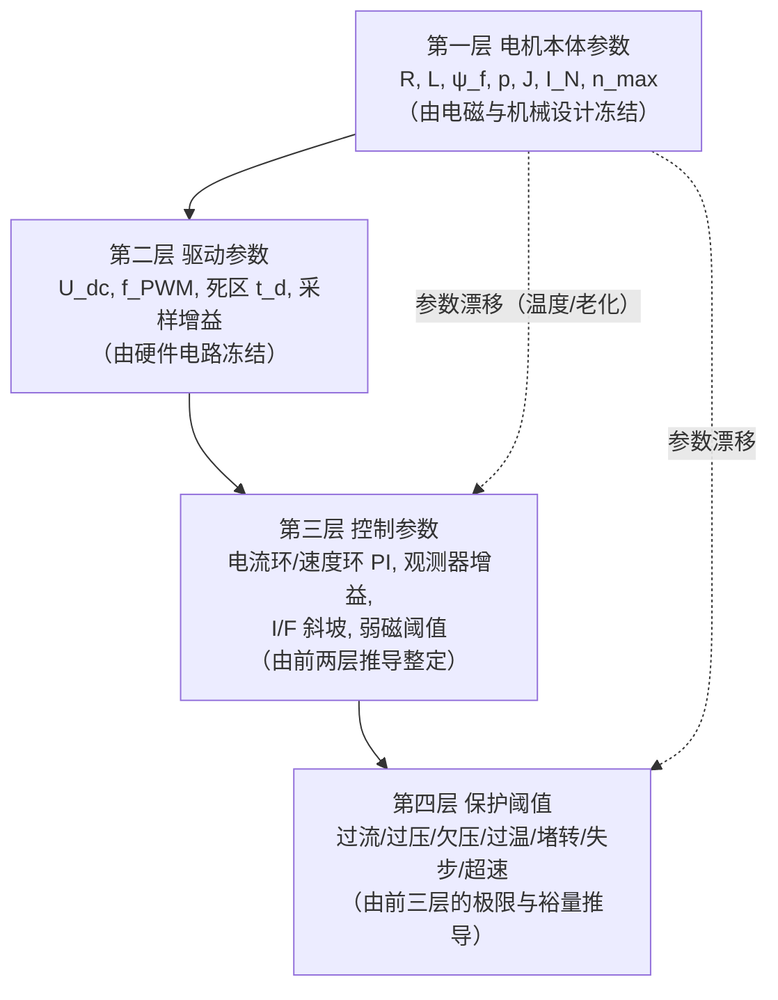
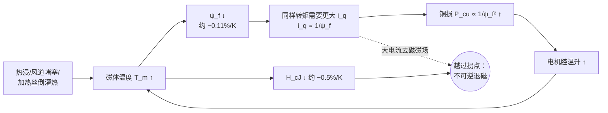
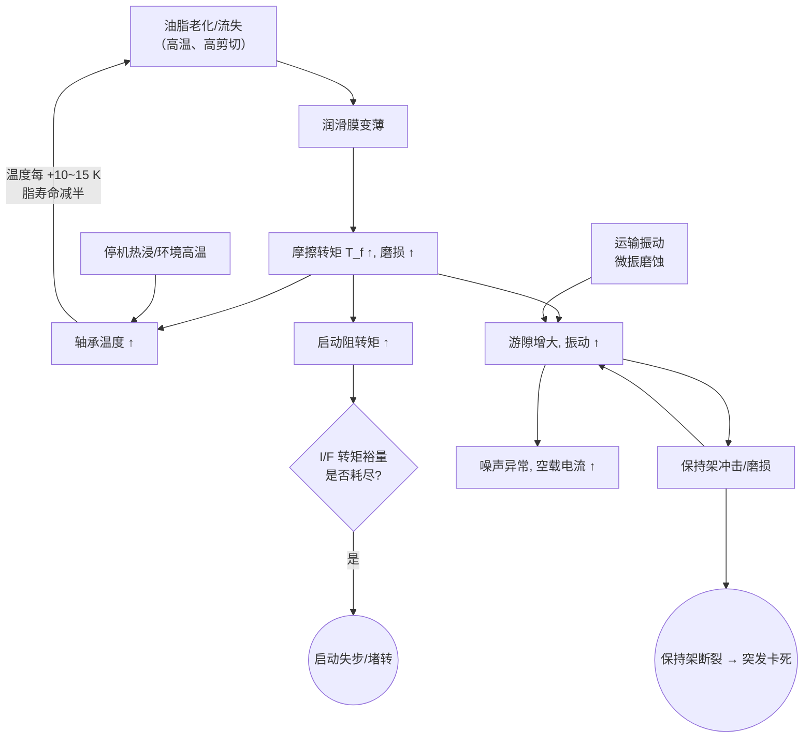
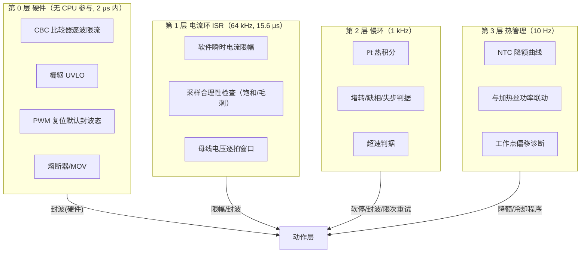
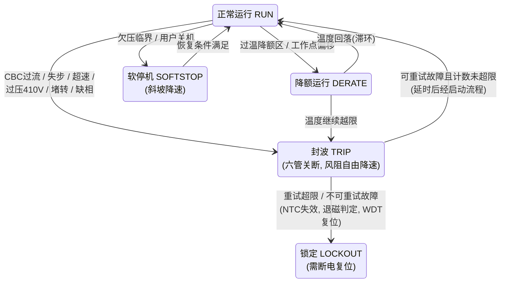

# 第 5 章 关键参数手册与失效模式管控（FMEA）

> 前四章回答了"高速风筒马达是什么、为什么这样设计、控制器怎么算、启动到满速经历了什么"。本章回答工程落地的最后两个问题：**这台机器由哪些参数定义（设错会怎样、怎么测怎么整定）**，以及**它会以哪些方式坏（怎么预防、怎么探测、坏的瞬间软硬件该做什么）**。前者收敛为一份四层结构的关键参数手册（§5.1），后者收敛为一份按子系统展开的失效模式与影响分析（Failure Mode and Effects Analysis, FMEA）表（§5.3）与逐项展开的保护策略设计（§5.4）。§5.5、§5.6 把视角从单机扩展到量产：产线下线测试（End-of-Line test, EOL）、参数自校准与寿命试验，以及可靠性设计裕量的系统盘点。
>
> 全章沿用第 2–4 章的参考机（110 000 rpm / p=2 / 100 W 轴功率 / 310 V 母线 / 64 kHz PWM）。电机本体电磁参数（$R$、$L$、$\psi_f$、$J$）无公开量产数据，是按电压/功率预算自洽反推的教学设定值，均已标注 **[估计值]** 或 **[设定值]**；FMEA 的 S/O/D 评分为示例性工程判断，标注 **[示例评分]**，不代表任何真实机型的现场统计。凡引用具体产品或行业数据均给出处 `[n]`（见章末参考资料）。

---

## 5.0 参数的四层结构：为什么要有"参数手册"

一台无感磁场定向控制（Field Oriented Control, FOC）风筒马达的全部行为，由四类参数逐层决定，且**依赖方向是单向的**：

这张图解释了本章的组织逻辑，也解释了大量现场故障的根源：**第三、四层的数值全部是第一、二层的函数**。电流环增益 $K_p=\alpha_c L$ 里有 $L$，观测器的反电动势（back-EMF, BEMF）模型里有 $R$ 和 $\psi_f$，堵转判据里有额定电流，退磁校核里有磁体温度——所以当第一层参数因温度或老化**漂移**时（铜电阻 +0.39%/K、钕铁硼剩磁约 −0.11%/K [行业典型值]），第三、四层若不跟随，控制品质与保护有效性会一起劣化。这就是 §5.2 参数失效链与 §5.5.2 参数自学习存在的理由。

**参考机参数速查**（与第 4 章一致；其中 $\psi_f$ 第 3 章按标称母线初算为 6.5 mWb、第 4 章按纹波谷值精化为 6.0 mWb，本章沿用后者）：110 000 rpm，$p=2$，$f_e=3.667\ \mathrm{kHz}$，$\omega_e=23\,038\ \mathrm{rad/s}$，$\omega_m=11\,519\ \mathrm{rad/s}$，轴功率 100 W，额定转矩 8.7 mN·m；$U_{dc}=310\ \mathrm{V}$，$f_{PWM}=64\ \mathrm{kHz}$；$\psi_f=6.0\ \mathrm{mWb}$、$R=15\ \Omega$、$L_d\approx L_q=5\ \mathrm{mH}$、$J=3\times10^{-7}\ \mathrm{kg\cdot m^2}$ **[估计值]**。坐标变换取幅值不变约定，转矩 $T_e=\tfrac{3}{2}p\psi_f i_q$。

---

## 5.1 关键参数总表（核心交付物）

以下四张表是本章第一份核心交付物。"典型值"栏针对 10 万 rpm 级、310 V 高压直驱、60–120 W 的国产主流方案（米家 H501 铭牌 310 V/60 W/110 000 rpm 是该量级最直接的公开实证 [1]）；参考机取值在括号中给出。

### 5.1.1 电机本体参数

| 符号 | 定义 | 典型值（110 krpm 级） | 它决定了什么 | 设错 / 漂移的后果 | 如何测量与整定 |
|---|---|---|---|---|---|
| $R$ | 相电阻（星形，每相，20 °C） | 数 Ω～数十 Ω，高压细线多匝绕组（参考机 15 Ω **[估计值]**） | 铜损与效率；电流环 $K_i=\alpha_c R$；观测器电压模型 $\boldsymbol e=\boldsymbol u-R\boldsymbol i-L\dot{\boldsymbol i}$ | 设小→观测器低速角度超前、I²t 低估绕组发热；温漂 +39%/100 K 不跟随→低速切换窗口判断失效 | 四线毫欧计；或静止 d 轴注入直流测 $U/I$（顺带消除引线/管压降需两点法）；在线辨识见 §5.5.2 |
| $L_d,L_q$ | dq 轴电感（表贴机 $L_d\!\approx\!L_q\!=\!L$） | 有槽机 mH 级（参考机 5 mH），无槽机仅几十 μH | 电流纹波幅值；电流环 $K_p=\alpha_c L$；交叉耦合前馈 $\omega_e L i$；去磁工作点 | 设大→电流环过冲振荡；设小→带宽不足、解耦残差大；影响 SMO 收敛与弱磁计算 | LCR 表 1–10 kHz 测线-线电感（星形取 $L_{ll}/2$），转子转多个位置取均值并核对凸极率；或电压阶跃法 $L=U\Delta t/\Delta i$ |
| $\psi_f$（$k_e$） | 永磁磁链幅值 / 反电动势常数 | 参考机 6.0 mWb，即相 BEMF 幅值 6.0 mV·s/rad；折算线-线有效值 **1.54 V/krpm**；满速相 BEMF 幅值 138 V | 转矩常数 $K_t=\tfrac{3}{2}p\psi_f=18\ \mathrm{mN\cdot m/A}$；电压预算（满速调制度 0.87）；观测器 BEMF 归一化；失步判据基准 | 设错→转矩/速度标定整体偏移、切换判据失准；高温退磁漂移→正反馈发热链（§5.2.1） | **拖动法**：外部动力拖至 5–20 krpm，示波器测开路线电压：$\psi_f=\sqrt{2}\,U_{ll,rms}/(\sqrt{3}\,\omega_e)$；EOL 逐台核对一致性（§5.5.1） |
| $p$ | 极对数 | 1 或 2（参考机 2，即 4 极） | 电频率 $f_e=np/60$；载波比可行性；转速换算 | 设错则转速直接错 $p$ 倍，观测器无法锁定 | 拖动法数电周期 / 机械圈数之比；充磁观察膜 |
| $J$ | 转子系统转动惯量（含叶轮） | $10^{-7}$ kg·m² 量级（参考机 $3\times10^{-7}$ **[估计值]**） | 速度环增益 $K_{p\omega}=J\alpha_s/K_t$；I/F 斜坡加速度上限；刹车能量 $E_k=\tfrac12 J\omega_m^2\approx20\ \mathrm{J}$ | 设大→速度环迟钝；设小→速度环过冲、I/F 斜坡校核失真 | 自由停车减速法（已知风阻模型 $J\dot\omega=-k\omega^2$ 拟合）；或扭摆法；或已知转矩的加速法 |
| $I_N$ / $I_{pk}$ | 额定 / 峰值相电流（幅值） | 参考机 0.48 A / 约 1.5 A（RMS 0.34 A） | 热设计基准；软件限幅与 I²t 参数；逐波限流阈值锚点 | 额定设高→绕组慢性过热老化；峰值设高→退磁与 MOSFET 安全工作区（Safe Operating Area, SOA）风险 | 热平衡试验定 $I_N$（绕组热点达绝缘等级限值反推）；$I_{pk}$ 由退磁校核与功率管 SOA 取小者 |
| $n_{max}$ | 最高工作转速 | 100–115 krpm（在售国产机型主流 [1][4]） | 叶轮应力与模态校核基准；轴承 DN 值；超速保护阈值锚点 | 设计裕量被侵占；超速阈值随之失效 | 由叶轮 120% 超速试验（§5.6.3）、轴承 DN、电压预算三者共同封顶 |

### 5.1.2 驱动参数

| 符号 | 定义 | 典型值 | 它决定了什么 | 设错 / 漂移的后果 | 如何测量与整定 |
|---|---|---|---|---|---|
| $U_{dc}$ | 直流母线电压 | 市电整流约 310 V（220 V AC），随电网 ±20% 波动约 250–370 V | 电压极限圆 $U_{max}=U_{dc}/\sqrt{3}=179\ \mathrm{V}$；BEMF 设计上限；管子耐压选型 | 采样分压电阻漂移→过/欠压保护误动作或漏动作 | 电阻分压 + ADC，全温标定分压比；欠压/过压窗口见 5.1.4 |
| $f_{PWM}$ | PWM 载波频率 | 40–100 kHz（参考机 64 kHz，$T_s=15.6\ \mu s$） | 载波比 $f_{PWM}/f_e\ge10\!\sim\!20$（64 k/3.667 k ≈ 17）；电流纹波与磁体涡流损耗；开关损耗；电流环带宽上限 | 设低→每电周期采样点不足、观测器相位误差陡增；设高→开关损耗与死区占比恶化 | 由载波比下限与开关损耗预算夹逼；与电流环 ISR 同步设计 |
| $t_d$ | 死区时间 | 100–500 ns（参考机 300 ns） | 桥臂直通安全；死区电压畸变 $\Delta U\approx t_d f_{PWM} U_{dc}\approx6\ \mathrm{V}$，占低速相电压主导 | 设短→直通炸管；设长→5/7 次谐波、转矩脉动、低速观测器角误差、I/F→闭环切换失败 | 由管子开关时间 + 驱动延迟裕量确定；配合电流极性死区补偿（第 3 章） |
| $R_{sh}$, $G$ | 电流采样电阻与放大增益 | 参考机 0.2 Ω × 增益 5 = 1.0 V/A，3.3 V ADC 满量程约 ±1.65 A **[设定值]** | 电流分辨率与信噪比；逐波限流比较器阈值的伏值；满量程须覆盖 $I_{pk}$ | 增益漂移→转矩标定漂移；零漂→ $f_e$ 频率转矩脉动与观测器抖动（§5.2.3）；满量程不足→过流时饱和失明 | 满量程取 2–4 倍额定峰值；零漂上电自校准 + 运行中零矢量窗口跟踪（§5.5.2） |
| $t_{spl}$ | 采样时刻 | 中心对称 PWM 的零矢量中点 | 避开开关噪声；单/双电阻方案的最小可测窗口 | 采样撞上开关沿→毛刺被当真电流，保护误触发 | 与 ADC 触发硬件级联（MCU 高级定时器），示波器核对采样点位置 |

### 5.1.3 控制参数

| 符号 | 定义 | 典型值（参考机推导值） | 它决定了什么 | 设错 / 漂移的后果 | 如何测量与整定 |
|---|---|---|---|---|---|
| $K_p^i,K_i^i$ | 电流环 PI（内模法 $K_p=\alpha_c L,\ K_i=\alpha_c R$） | 带宽 $\alpha_c=2\pi\times2\ \mathrm{kHz}$ 时 $K_p\approx63\ \mathrm{V/A}$、$K_i\approx1.9\times10^5\ \mathrm{V/(A\cdot s)}$ | 转矩响应；对死区/BEMF 扰动的抑制；须配合前馈解耦与 $1.5\omega_e T_s$ 延迟补偿（第 3 章） | 带宽过高（$>2\pi f_{PWM}/10$）→振荡；过低→高速下电流跟不上给定、深度依赖前馈 | 由 $L,R$ 计算后阶跃响应实测校核（给定阶跃看超调与整定时间） |
| $K_{p\omega},K_{i\omega}$ | 速度环 PI | 带宽 30–50 Hz（$\ll$ 电流环 1/10）；$\alpha_s=2\pi\times40$ 时 $K_{p\omega}=J\alpha_s/K_t\approx4.2\times10^{-3}\ \mathrm{A/(rad/s)}$ | 恒速刚度（挡风口时的转速跌落）；给定斜坡跟随 | 过高→与观测器带宽打架、转速振荡啸叫；过低→负载扰动转速塌陷 | 由 $J,K_t$ 计算，实测挡板扰动响应整定；输出限幅 = 软件电流限幅 |
| $k_{smo}$, $\alpha_{pll}$ | 滑模观测器（Sliding-Mode Observer, SMO）增益与锁相环（Phase-Locked Loop, PLL）带宽 | $k_{smo}\ge1.2\times\max\|e\|\approx165\ \mathrm{V}$ **[设定值]**；PLL 带宽 200–800 Hz，阻尼 0.7–1 | 角度估计收敛速度与噪声的折中；PLL 滞后须按 $\hat\omega_e$ 相位补偿 | SMO 增益过小→高速段失锁；PLL 带宽过高→噪声进速度环；未按 $\|\hat e\|$ 归一化→增益随转速漂移 | 从低速向高速逐段扫描验证 $\hat\theta$ 误差（对拖平台或注入已知角度扰动） |
| $I_{IF}$, $\dot\omega_{ramp}$ | I/F 启动电流幅值与频率斜坡 | 0.4 A、0→15% 额定转速（550 Hz 电频率）/0.5 s（第 4 章，转矩裕量约 6 倍） | 启动成功率、启动声品质、启动段发热 | 电流过小或斜坡过陡→功角越过 90° 失步；过大→预定位"嗒"声、启动过热 | 按 $T_{need}=J\dot\omega_m+k\omega_m^2$ 校核，留 ≥3 倍转矩裕量；高低温、逆风工况实测启动成功率 |
| $n_{sw}$ | 闭环切换阈值 | 13–20% 额定转速 | BEMF 信噪比（须显著大于死区畸变 ≈6 V）与观测器收敛判据（第 4 章四判据） | 过低→带着错角度切换，电流尖峰/失步；过高→I/F 段发热与噪声时间变长 | 以"BEMF 幅值 ≥ 3–5 倍死区畸变"为第一性依据反推 |
| $m_{fw}$ | 弱磁使能阈值（调制度） | 额定点调制度 0.87，留 13% 电压裕量；$m>0.95$ 才允许弱磁 **[设定值]** | 正常设计**不进弱磁**（第 3 章）：按最高转速设计 $\psi_f$ 使电压自然够用；弱磁仅兜底电网低压 | 弱磁逻辑错误是"飞车"经典诱因（§5.4.8）；持续深弱磁→铜损增大 + 失控风险 | 设计期核对 $\sqrt{(R i_q+\omega_e\psi_f)^2+(\omega_e L i_q)^2}<0.9\,U_{max}$；实测低电网电压拉偏 |

### 5.1.4 保护阈值

| 符号 | 定义 | 典型值（参考机 **[设定值]**） | 它决定了什么 | 设错 / 漂移的后果 | 如何整定 |
|---|---|---|---|---|---|
| $I_{cbc}$ | 硬件逐波限流（Cycle-by-Cycle current limit, CBC）比较器阈值 | ±1.5 A（≈3.1 倍额定幅值），响应 <2 μs | MOSFET SOA 与磁体抗退磁的最后防线 | 过高→炸管/退磁；过低→启动与切换瞬态误触发 | 取 min(管子脉冲电流降额, 0.5×最高温退磁电流)，并 >2 倍启动峰值 |
| $I_{avg}$ / I²t | 软件平均过流 / 热积分 | 幅值 0.6 A（1.25 倍额定）持续 >10 s 判故障；I²t 按绕组热时间常数 τ≈30 s **[估计值]** | 绕组与磁体的慢热保护 | 过松→绝缘慢性老化；过紧→挡风口等正常扰动误停机 | 由热平衡试验反推绕组热点-电流曲线 |
| $U_{ov}$ | 母线过压 | 380 V 起刹车限幅 / 410 V 封波（电容 450 V） | 刹车能量回馈与电网浪涌下保电容与管子 | 过高→电容超压；过低→正常刹车频繁中断 | 低于电容额定 10%、高于最高电网整流峰值 |
| $U_{uv}$ | 母线欠压 | <190 V 封波，>210 V 恢复（滞环） | 防电网跌落时调制度饱和失控；配合栅驱欠压闭锁（Undervoltage Lockout, UVLO，8–10 V） | 无滞环→电压临界时反复启停振荡 | 由最低电网电压（220 V −20%）整流值下留裕量 |
| $T_{w}$, $T_{pcb}$ | 绕组 / 功率级过温 | 绕组：95 °C 起降额、115 °C 关加热丝、125 °C 封波；功率级：85 °C 降额、105 °C 封波 | 绝缘寿命、油脂寿命、磁体退磁裕量、管子结温 | NTC 开路未检出→保护失明（§5.4.7 窗口检测） | 由绝缘等级/磁体牌号/油脂拐点减去测点-热点温差 |
| — | 堵转判据 | $\hat n<10\%\,n_N$ 且电流达限幅，持续 >0.5 s；重试 ≤3 次 | 防止静止满流烧绕组（0.6 A 静止铜损 8.1 W，无风冷时约 1.4 K/s 温升 **[估计值]**） | 时间窗过长→绕组过热；过短→重载启动误判 | 由静止热模型定时间窗上限 |
| — | 失步判据 | $\big|\,\|\hat e\|-\hat\omega_e\psi_f\big|/(\hat\omega_e\psi_f)>0.3$ 持续 20 ms；或 $\hat\omega$ 单拍跳变 >20%；或电流预测残差超限 | 失步后电流矢量乱转，等效堵转+转矩脉动 | 漏判→绕组过热+啸叫；误判→正常扰动停机 | 对拖平台注入突加负载/角度扰动标定阈值 |
| $n_{os}$ | 超速（飞车）阈值 | $\hat n>115\%\,n_N$ 立即封波（叶轮按 120% 超速试验校核） | 叶轮应力 ∝ $n^2$，超速是最高机械风险 | 阈值高于叶轮试验转速→包容失效风险 | 低于叶轮验证转速、高于最大正常过冲 |

**封波安全性自校核**（高压路线的天然优势）：封波后转子自由旋转，反电动势经体二极管整流不得向母线泵电。参考机 120% 超速时线-线 BEMF 峰值 $\sqrt{3}\times1.2\,\omega_e\psi_f\approx287\ \mathrm{V}<310\ \mathrm{V}$ 母线——二极管不导通，封波在全转速域安全。低压（24–48 V）路线此项必须逐一校核，往往不成立，封波前需先泄能。

---

## 5.2 参数失效链：单点漂移如何演变成系统故障

参数手册是静态的；失效是动态的。真实故障几乎从不是"某参数突然错了"，而是一条**因果链**：某物理量缓慢漂移 → 控制/保护参数与现实脱节 → 工作点恶化 → 加速漂移。本节解剖三条最重要的链。

### 5.2.1 磁体热退磁正反馈链

钕铁硼剩磁温度系数约 −0.11%/K，内禀矫顽力 $H_{cJ}$ 温度系数约 −0.5%/K [行业典型值]。恒转速运行时气动转矩由叶轮决定，于是 $i_q=T/(\tfrac{3}{2}p\psi_f)\propto1/\psi_f$，铜损 $P_{cu}\propto i_q^2\propto1/\psi_f^2$——**磁链每跌 1%，铜损涨约 2%**，而铜损又加热磁体：

把环路线性化可以判断它是否收敛。设磁体到冷却气流的热阻为 $R_{th}$，环路增益

$$
\lambda=\frac{\partial(\Delta T)}{\partial T_m}=2\,|\alpha_{Br}|\,R_{th}\,P_{cu}
$$

参考机正常送风时 $R_{th}\approx5\ \mathrm{K/W}$ **[估计值]**、$P_{cu}=\tfrac{3}{2}I^2R\approx5.2\ \mathrm{W}$，$\lambda\approx0.06\ll1$——环路深度收敛，日常运行安全。但**失去风冷**（堵转、风道堵塞、停机热浸）时 $R_{th}$ 增大数倍、$P_{cu}$ 同时增大，$\lambda$ 逼近 0.3 以上，平衡温度急剧抬升；一旦叠加大电流（堵转限幅电流的去磁磁场），工作点越过 $H_{cJ}$ 拐点即**不可逆退磁**——此后 $\psi_f$ 永久变小，正反馈链在下次开机时以更高的起点重演，直至过温保护成为常客、整机报废。这条链解释了三件事：为什么磁体必须选 SH/UH 耐温牌号并做风道隔热（第 1、4 章；追觅宣称其马达工作温度控制在约 110 °C [14]）；为什么堵转判据必须限时（5.1.4）；为什么 EOL 要逐台测 $k_e$（§5.5.1）——$k_e$ 偏低就是退磁或充磁不良的直接指纹。

### 5.2.2 轴承磨损失效链

参考机轴承 DN 值 = 3 mm × 110 000 rpm = 330 000，已超普通脂润滑深沟球轴承约 250 000 DN 的指导极限 [8]，必须依赖高速脂 + 树脂保持架 + 高精度等级（牙科手机路线 [9]）。这意味着轴承是**先天裕量最薄**的子系统，其失效链有两个相互咬合的正反馈环：

工程含义：(a) 轴承劣化在**启动段**最先暴露——I/F 阶段按 6 倍转矩裕量设计（第 4 章），裕量被摩擦转矩逐渐吃掉，故"冷机第一次启动偶发失败"是轴承寿命末期的典型前兆；(b) 空载电流与噪声频谱是产线与售后都可用的无损探测量（§5.5.1）；(c) 对固件而言，轴承失效最终以**堵转或失步**面目出现，保护动作复用 §5.4.4/§5.4.6。

### 5.2.3 电参数漂移链：采样零漂与电阻温漂

两条"电子侧"慢漂移链，危害不在瞬间烧毁，而在于**控制品质与保护可信度的隐性劣化**：

- **电流采样零漂**：运放失调随温度漂移，等效在 $\alpha\beta$ 电流上叠加直流偏置 $\delta i$。经 Park 变换后它变成 dq 系中频率为 $f_e$ 的交流扰动 → 转矩以 3.667 kHz 脉动（恰落在人耳最敏感的 2–5 kHz 可闻频段内，表现为随转速变化的纯音啸叫，调制边带同样可闻）、观测器角度以同频抖动、速度环输出纹波。增益失配则产生 $2f_e$ 分量。更危险的是它直接平移 I²t 与堵转判据的输入。对策是双重校准（§5.5.2）。
- **绕组电阻温漂**：铜 +0.39%/K，20→120 °C 时 $R$ 从 15 Ω 涨到约 21 Ω（+39%）。观测器电压模型中 $R\boldsymbol i$ 项在低速段与 BEMF 同量级，$R$ 失配直接转化为角度误差——最坏发生在**热机重启**：机器刚停转、绕组还烫，此时 I/F→闭环切换用的还是冷态 $R$，切换失败率上升。反过来,这个物理也可被利用：$R$ 的在线辨识值就是一支免费的绕组温度计，$T_w\approx20+\frac{R/R_{20}-1}{0.00393}$（$R/R_{20}=1.39$ 即对应约 119 °C），见 §5.5.2。

---

## 5.3 FMEA：按子系统的失效模式与影响分析

### 5.3.1 方法与评分约定

FMEA 按 AIAG-VDA FMEA 手册（2019）的框架执行：对每个失效模式评三个 1–10 分的维度——**严重度**（Severity, S）、**发生度**（Occurrence, O）、**可探测度**（Detection, D，分数越高越难探测），三者之积为**风险顺序数**（Risk Priority Number, RPN = S×O×D）。本书采用的简化标尺：

| 分值 | S 严重度 | O 发生度（设计寿命内） | D 可探测度 |
|---|---|---|---|
| 1–2 | 无感知的性能劣化 | 极罕见（<0.01%） | 产线必检出 + 在线实时监测 |
| 3–4 | 可感知（噪声/风量下降），可用 | 罕见（0.01–0.1%） | 产线可检出或在线可监测 |
| 5–6 | 功能明显受损或提前停机 | 偶发（0.1–1%） | 仅间接征兆（电流/噪声趋势） |
| 7–8 | 整机失效，不可修 | 较常见（1–5%） | 出厂难筛出，在线征兆微弱 |
| 9–10 | 安全相关（起火/碎片/触电） | 常见（>5%） | 无有效探测手段 |

处置规则 **[设定值]**：RPN>125 或 S≥9 且 O≥3 的条目必须落实设计整改并复评；S≥9 者无论 RPN 均须有独立的硬件级保护兜底。**下表 S/O/D 为 [示例评分]**——展示方法与相对排序，不代表任何真实机型的现场失效率。

### 5.3.2 FMEA 总表（核心交付物）

| # | 子系统 | 失效模式 | 机理 | 影响 | S | O | D | RPN | 预防措施（设计/工艺） | 探测手段（产线/在线） | 软硬件保护动作 |
|---|---|---|---|---|---|---|---|---|---|---|---|
| 1 | 转子/磁体 | 高温不可逆退磁 | 热浸+大电流去磁场叠加，越过 $H_{cJ}$ 拐点（§5.2.1） | $k_e$↓→电流↑→效率↓、过热失控，整机性能永久劣化 | 8 | 4 | 4 | 128 | SH/UH 牌号、风道隔热、最坏工况去磁校核、CBC 限流锚定退磁电流 | EOL 测 $k_e$；在线 $\|\hat e\|/\hat\omega_e$ 与出厂值比对 | 过温降额/停机；退磁判定后禁止重启并报错 |
| 2 | 转子/磁体 | 磁体/护套脱粘松脱 | 胶层高低温循环老化，离心+温度应力 | 扫膛、突发卡死 | 9 | 2 | 5 | 90 | 过盈护套+胶双保险（§5.6.3）、超速+温度循环验证 | EOL 振动频谱、空载电流；在线振动异常 | 堵转/过流判据触发封波 |
| 3 | 轴承 | 油脂枯竭/老化 | 330 kDN 高剪切+高温，寿命随温度指数衰减（§5.2.2） | 摩擦/噪声↑→最终卡死；**品类寿命瓶颈** | 7 | 6 | 4 | **168** | 高速脂、树脂保持架、电机腔隔热、预紧优化、脂量控制 | EOL 空载电流与噪声谱；在线 $i_q$ 长期趋势 | 堵转判据停机；启动失败计数报维护 |
| 4 | 轴承 | 保持架磨损断裂 | 贫油+离心力+振动冲击 | 突发卡死，可能连带扫膛 | 8 | 3 | 6 | 144 | 冠形树脂保持架选型、预紧防打滑 | 突发性强，在线仅前兆噪声 | CBC 过流+堵转封波 |
| 5 | 轴承 | 微振磨蚀（false brinelling） | 运输/仓储振动下静止微动 | 早期噪声、振动超标 | 4 | 4 | 4 | 64 | 包装缓冲、适度预紧 | 售后噪声谱（特征频率） | 无（品质问题） |
| 6 | 轴承 | 电蚀 | PWM 共模电压经寄生电容放电 | 滚道搓板纹→噪声、寿命降 | 4 | 3 | 6 | 72 | 轴承座接地/绝缘、降低共模 dv/dt | 拆解金相；在线难 | 无 |
| 7 | 绕组/定子 | 匝间短路 | 高 dv/dt+死区尖峰侵蚀漆膜、热老化 | 局部环流急热→烧毁、冒烟 | 8 | 3 | 5 | 120 | F 级以上漆包线、浸漆、匝间耐压验证、压低 dv/dt | EOL 匝间浪涌测试、三相阻抗对称性 | I²t/过流停机；热熔断器兜底 |
| 8 | 绕组/定子 | 相线断路/焊点脱开 | 振动疲劳、工艺不良 | 缺相运行，转矩脉动、无法启动 | 6 | 3 | 3 | 54 | 引线应力释放、焊点工艺管控 | EOL 三相电阻；在线缺相检测（§5.4.5） | 缺相判定→停机报错 |
| 9 | 绕组/定子 | 叠片短路/毛刺铁损异常 | 冲片毛刺、叠压绝缘破损 | 铁损↑、效率↓、局部热点 | 5 | 3 | 5 | 75 | 0.1–0.2 mm 薄片工艺管控 [13] | EOL 空载功率超差 | 过温降额 |
| 10 | 叶轮 | 叶片疲劳断裂 | 启停离心低周疲劳+叶片模态共振高周疲劳+热风蠕变 | 碎片飞出（由壳体包容）、剧烈失衡 | 9 | 2 | 6 | 108 | 120% 超速验证、模态避开叶片通过频率、耐温材料（PPS/PEEK） | EOL 噪声谱；在线振动/噪声异常 | 失衡→电流异常→停机；壳体包容设计 |
| 11 | 叶轮 | 叶轮压装/胶接松脱 | 过盈量不足、温度循环 | 失衡；负载丢失→转速飞升 | 8 | 2 | 4 | 64 | 过盈量与胶工艺管控、超速验证 | 在线"功率-转速"合理性校验（负载丢失检测，§5.4.8） | 超速/负载丢失→封波 |
| 12 | 功率级 | MOSFET 击穿短路 | 过压、SOA 超限、UVLO 失效致半开通 | 桥臂直通、烧板，起火风险 | 9 | 3 | 2 | 54 | 电压降额（§5.6.1）、UVLO、死区、CBC | CBC 比较器微秒级检出 | CBC 封波；输入熔断器兜底 |
| 13 | 功率级 | 自举供电失压 | 高调制度下自举电容得不到刷新 | 上管欠驱动、线性区发热 | 7 | 3 | 5 | 105 | 自举刷新策略（最小零矢量时间）、UVLO | 在线难，表现为效率劣化 | 驱动 IC UVLO 封上管 |
| 14 | 功率级 | 母线电解电容老化 | 高温下电解液蒸发，ESR↑容量↓ | 纹波↑、欠压误判、寿命终结 | 5 | 4 | 4 | 80 | 105 °C 品、电压降额、寿命计算（§5.6.1） | EOL 纹波抽检；在线母线纹波监测 | 欠压保护兜底 |
| 15 | 采样电路 | 电流采样零漂/增益漂移 | 运放失调温漂、分流电阻温漂 | $f_e$/2$f_e$ 转矩脉动、观测器抖动、保护阈值平移（§5.2.3） | 6 | 5 | 5 | **150** | 低漂移运放、上电+运行双重自校准（§5.5.2） | 自校准超差即报错 | 偏置超 ±3% 量程→拒绝启动 |
| 16 | 采样电路 | NTC 开路/短路 | 引线疲劳、焊点失效 | **过温保护失明**（隐性烧毁）或误停机 | 7 | 3 | 3 | 63 | 上下拉窗口电路：开路/短路读值落在窗口外 | 上电自检即检出 | 传感器故障→按最坏温度处理（降额运行或拒启动） |
| 17 | 采样电路 | 母线分压电阻漂移/开路 | 高阻值电阻老化 | 虚假过/欠压，误封波或漏保护 | 5 | 2 | 3 | 30 | 分压用两只串联（单点开路仍可判）、精度选型 | 上电与整流理论值交叉核对 | 读值越窗→拒绝启动 |
| 18 | 控制算法 | 观测器参数失配（R/L/ψf 漂移） | 温度/老化漂移未跟随（§5.2.3） | 低速角误差↑、切换失败率↑、效率降 | 5 | 5 | 5 | 125 | 参数自学习（§5.5.2）、观测器鲁棒化设计 | 切换失败计数、残差统计 | 切换失败→退回 I/F 重试 |
| 19 | 控制算法 | I/F 斜坡失步 | 摩擦散差、低温脂变硬、斜坡裕量不足 | 启动失败（可重试） | 4 | 4 | 2 | 32 | 斜坡按 ≥3 倍转矩裕量校核、低温启动加大 $I_{IF}$ | 启动失败计数 | 失步判定→封波→限次重试 |
| 20 | 控制算法 | 飞车（角度错误/弱磁逻辑错误） | 观测角反相使转矩失控、弱磁误触发 | 超速，叶轮应力超限 | 9 | 2 | 3 | 54 | 不依赖弱磁的电压设计（§5.1.3）、给定限幅 | 独立超速判据（§5.4.8） | $\hat n>115\%$ 立即封波 |
| 21 | 控制算法 | 软件跑飞/ISR 超时 | 电磁干扰、栈溢出 | PWM 冻结在错误状态 | 8 | 2 | 3 | 48 | 看门狗、PWM 硬件默认安全态（复位即封波） | 看门狗超时事件记录 | WDT 复位→进入故障锁定 |
| 22 | 散热 | 风道隔热失效/热浸超标 | 密封老化、热风倒灌（第 4 章） | 磁体+油脂长期超温，触发链 1/3 | 7 | 4 | 5 | 140 | 隔热结构、停机延时冷风吹扫 | NTC 温度统计、寿命试验验证 | 过温降额；关机冷风程序 |
| 23 | 散热 | 进风口滤网堵塞 | 毛发绒毛累积（使用端） | 风量↓、整机过热、链 1 加速 | 6 | 6 | 3 | 108 | 可拆洗滤网、提示设计 | 在线工作点偏移检测（同转速 $i_q$ 持续偏低=负载变轻+温度偏高） | 降加热功率→提示清洁→停机 |

### 5.3.3 RPN 排序的启示

按 [示例评分] 排序，前六名依次是：**轴承油脂寿命（168）> 电流采样漂移（150）> 保持架断裂（144）> 热浸超温（140）> 磁体退磁（128）> 观测器参数失配（125）**。这个排序与品类的工程共识吻合：10 万转风筒的可靠性瓶颈不在"会不会炸机"（功率级失效 S 高但 O、D 都低，硬件保护成熟），而在**轴承-热-磁体这条机械/热慢性劣化主线**，以及**采样与参数漂移这条控制品质暗线**。前者靠选型裕量+散热设计+寿命试验（§5.5.3、§5.6），后者靠自校准与自学习（§5.5.2）——这正是后两节的内容。另注意四条 S=9 的条目（磁体松脱、叶轮断裂、MOSFET 短路、飞车）全部配有独立于主控算法的兜底：CBC 硬件比较器、壳体包容、熔断器、独立超速封波。**高严重度靠"独立层"兜底、高 RPN 靠"设计整改"消解**，是 FMEA 落地的基本纪律。

---

## 5.4 保护策略设计详解

### 5.4.1 分层保护架构

保护的第一设计原则是**分层**：每层有自己的时间尺度、探测手段与动作权限，快层保器件、慢层保寿命，任何一层失效由更快的一层兜底。

### 5.4.2 过流：硬件逐波限流 + 软件平均限流

**双层结构，各保一物。**

- **硬件 CBC（保 MOSFET）**：分流电阻电压经片内比较器（峰岹 FU6812、中微 CMS32M5710 等风筒 SoC 均集成此路径 [3][4]）与阈值比较，超限即在**本 PWM 周期内**直接切除驱动脉冲，下周期自动恢复——响应 <2 μs，不经过任何软件。阈值取三个约束的最小值：管子脉冲电流降额值、最高磁体温度下退磁电流的 50% **[设计准则]**、采样链饱和点以内；同时须高于启动/切换瞬态峰值（约 2 倍额定 **[估计值]**）以免误触发。参考机取 ±1.5 A。
- **软件平均过流 / I²t（保绕组与磁体）**：绕组热时间常数（数十秒）远长于 PWM 周期，瞬时值无法表征热危险。慢环累积 $\int(i^2-I_N^2)\,dt$，超过 $(I_{lim}^2-I_N^2)\tau_{allow}$ 判故障；等效地，参考机允许 1.25 倍额定电流持续约 10 s **[设定值]**。I²t 的输入依赖零漂校准（§5.5.2）——这是 FMEA #15 高 RPN 的原因之一。

### 5.4.3 母线过压与欠压

- **过压的两个来源**：(a) 主动刹车能量回馈——参考机满速动能约 20 J，而 100 μF 电容从 310 V 充到 400 V 只吸收 3.2 J（第 4 章），故回馈刹车必须由**母线电压外环限幅**：$U_{dc}$ 到 380 V 即自动收窄刹车转矩，让风阻消化其余能量；风筒惯量小、气动刹车快，通常**不需要**独立泄放电阻，但"刹车时盯住 $U_{dc}$"的软件限幅环不可省。(b) 电网浪涌——由压敏电阻（Metal Oxide Varistor, MOV）+ 输入熔断器承接。410 V 为封波红线（电容 450 V 降额）。
- **欠压的两级**：母线 <190 V 封波（防调制度饱和后电流失控与观测器失锁），>210 V 滞环恢复；更底层的是栅极驱动 15 V 轨的 UVLO（8–10 V 阈值）——驱动电压不足时 MOSFET 半开通工作在线性区，是"没过流也烧管"的经典机理，必须由驱动 IC 硬件闭锁。

### 5.4.4 堵转判据

物理图景：转子被卡住（异物、轴承卡死、扫膛）时观测器无 BEMF 可用，电流环仍忠实地把电流顶到限幅。判据取"**低速 + 满流 + 持续**"三条件与：

$$
\hat n<10\%\,n_N \;\;\wedge\;\; |i_s|\ge0.95\,I_{lim} \;\;\wedge\;\; \text{持续}\;t>0.5\ \mathrm{s}
$$

时间窗由静止热模型封顶：0.6 A 限幅电流静止铜损 $\tfrac{3}{2}\times0.6^2\times15\approx8.1\ \mathrm{W}$，无风冷时绕组温升约 1.4 K/s **[估计值]**——0.5 s 的判据窗口只带来 <1 K 额外温升，安全。判定后封波、间隔数秒重试，**限 3 次**后锁定报错：区分"瞬时异物"（重试可恢复）与"轴承卡死"（重试只会重复加热，见链 5.2.2）。注意与启动流程解耦：I/F 段本身就是低速大电流，堵转判据在 I/F 阶段应换用"频率斜坡进行而 $\hat\omega$ 不跟随"的失步形式判据。

### 5.4.5 缺相检测

- **运行中**：滑窗计算三相电流 RMS，某相持续（>100 ms）低于三相均值的 30% 即判缺相 **[设定值]**。缺相后两相电流被迫增大且转矩脉动剧增，不及时停机会触发链式过热。
- **启动前主动自检**：预定位阶段依次沿三个电角度方向注入短电流脉冲，核对三相都有响应——把缺相从"运行中被动发现"提前到"上电即检出"，可探测度 D 从 5 降到 3，这正是 FMEA 中降 RPN 最便宜的手段（改探测，不改设计）。
- 单相机对照：检测对象换为霍尔信号丢失（单相路线见第 1 章 §1.5、第 3 章 §3.11）。

### 5.4.6 失步检测

失步（loss of synchronization）= 观测角与真实角脱钩，电流矢量相对转子乱转，平均转矩趋零、瞬时电流异常。无位置传感器系统探测失步只能靠**模型自洽性残差**，三个互补判据（任一满足即判）：

1. **BEMF 幅值自洽**：SMO 输出的 $\|\hat e\|$ 应等于 $\hat\omega_e\psi_f$；偏差 >30% 持续 20 ms 判失步。这是最物理的判据——失步后估计角乱转，$\hat e$ 不再是干净的旋转矢量。
2. **电流预测残差**：用 dq 模型一步预测电流并与实测比较，残差 RMS 超 3σ 门限。
3. **速度合理性**：$\hat\omega$ 单拍跳变 >20%，或风机负载下出现动力学不可能的加速度（$|\dot{\hat\omega}|>T_{max}/J$）。

动作：**立即封波**（不能试图"抢救"——错误角度下继续发波等于随机转矩），让风阻降速，转入重启流程。高压路线封波全域安全（§5.1.4 校核）。

### 5.4.7 NTC 过温降额曲线

负温度系数热敏电阻（Negative Temperature Coefficient thermistor, NTC）两点布置：绕组端部（电机热点）与功率管/PCB 铜箔旁。风筒的独特之处是**电机保护必须与加热丝联动**——整机 1400–1600 W 中加热丝占约 95%（第 1 章 [1][2]），电机腔的最大热威胁是热风倒灌，所以降额的第一动作永远是**先降加热丝功率**（同时也就降低了对风量的需求），而不是降电机：

| 绕组 NTC 读数 $T_w$ | 动作 **[设定值示例]** |
|---|---|
| < 95 °C | 正常运行 |
| 95–115 °C | 线性降额：加热丝功率乘以 $k=\dfrac{115-T_w}{115-95}$，电机维持转速 |
| ≥ 115 °C | 加热丝关断，电机全速冷风吹扫 |
| ≥ 125 °C | 电机封波停机，报过温故障 |
| NTC 读值越出物理窗口 | 判传感器开路/短路，按最坏温度处理：拒绝加热、限功率运行 |

分级阈值的依据链：125 °C 封波点 = F 级绝缘（155 °C，IEC 60085）− 测点到热点温差（约 15 K **[估计值]**）− 裕量；同时覆盖 SH 磁体（150 °C 级）与油脂寿命拐点（>70–80 °C 后每 +10–15 K 寿命减半，润滑脂寿命经验规律）。功率级 NTC 对应取 85 °C 降额 / 105 °C 封波。关机后热浸是磁体与油脂的最高温时刻（第 4 章），部分机型以数秒低速冷风吹扫对抗 [估计值, 依机型而异]。

### 5.4.8 飞车与超速保护

"飞车"（runaway）指转矩失控导致转速冲破设计上限，三个经典诱因：观测角错误（接近反相时转矩符号颠倒且正反馈）、弱磁逻辑误触发（本设计正常不进弱磁，§5.1.3）、速度给定溢出（软件 bug）。防御纵深三层：

1. **设计层**：电压预算按最高转速留 13% 裕量、不依赖弱磁；速度给定硬限幅。
2. **算法层**：$\hat n>115\%\,n_N$ 立即封波。该判据必须**独立于速度环**（直接取 PLL 频率寄存器比较，不经过给定/反馈差），防止"速度环自己疯了"时既当运动员又当裁判。
3. **机械层**：叶轮按 120% 超速试验验证（§5.6.3），115% 软件红线 < 120% 验证转速，包容顺序正确。

附属判据——**负载丢失检测**：风机负载满足 $P\propto n^3$（等效 $T\propto n^2$），若同转速下 $i_q$ 骤降 30% 以上，说明叶轮松脱或断裂（FMEA #11），此时转速将被速度环"稳住"而看不出异常，唯有功率-转速合理性校验能抓住它——判定后立即停机，防止无负载转子在下一次给定阶跃时冲速。

### 5.4.9 故障处理状态机

所有保护动作收敛为四级响应，与第 4 章主状态机对接：

设计要点：(a) **封波是万能安全态**——高压路线已校核 120% 超速下 BEMF 不向母线泵电；(b) 可重试与不可重试故障必须区分，重试计数存非易失存储器，防止用户反复上电绕过保护；(c) MCU 复位（含看门狗）后 PWM 外设的硬件默认态必须是封波，这属于第 0 层硬件保证，不依赖任何软件初始化顺序。

---

## 5.5 量产管控：EOL 测试、参数自校准与寿命试验

### 5.5.1 产线 EOL 测试项

单机设计正确≠百万台一致。徕芬公开宣称其电机产线做到零件加工精度 0.001 mm、动平衡 1 mg [7]——量产高速马达的竞争力一半在产线。典型 EOL 序列（判据均为 **[设定值示例]**）：

| 序 | 测试项 | 方法 | 判据 | 拦截的失效模式（FMEA#） |
|---|---|---|---|---|
| 1 | 三相电阻与对称性 | 毫欧计 | $R$ 在标称 ±7%，相间偏差 <2% | 匝数错、焊点不良（#7#8） |
| 2 | 匝间/对地耐压 | 浪涌匝间测试 + 对地 500 V | 波形面积差与放电判据 | 匝间绝缘缺陷（#7） |
| 3 | 反电动势波形与 $k_e$ | 外拖至 5–20 krpm，录三相开路电压 | $k_e$ 在标称 ±5%；波形 THD <3%；三相幅值差 <2% | 充磁不良/退磁/装配偏心（#1） |
| 4 | 动平衡 | 双面平衡机，去重或点胶 | G0.4–G1.0 级：110 krpm、10 g 转子对应残余不平衡 ≤0.9 mg·mm（偏心 0.087 μm）[15] | 失衡→轴承寿命/噪声（#3#5） |
| 5 | 空载电流与空载功率 | 额定转速空载（或标准风道）运行 | 与批次均值偏差 <±15% | 轴承预紧异常、扫膛、铁损异常（#3#9） |
| 6 | 振动噪声频谱 | 麦克风/加速度计，FFT | 总声压级限值 + 特征峰限值：转频 1×/2×（失衡/不对中）、叶片通过频率（13 叶 × 1833 Hz ≈ 23.8 kHz 量级 [6]）、轴承特征频率族 | 轴承/叶轮/装配缺陷（#3#4#10） |
| 7 | 启动成功率 | 连续 20 次冷启动（含逆风工况） | 100% 成功且时间一致 | I/F 裕量不足、摩擦异常（#19#3） |
| 8 | 满速工作点 | 额定电压满速运行 | 转速、母线电流、调制度落在窗口内 | 综合性能偏移 |
| 9 | 温升抽检（非全检） | 热平衡运行测绕组温升（电阻法） | 热点低于绝缘等级限值−裕量 | 散热装配缺陷（#22） |

其中第 3 项（$k_e$ 一致性）值得强调：它同时是**性能标定**（转矩常数）、**质量指纹**（充磁/装配）与**寿命基线**（在线退磁监测以出厂值为基准, §5.4 链 1）——一测三用，是 EOL 性价比最高的项目。

### 5.5.2 参数自学习与自校准

固件内建三层校准，对抗 §5.2.3 的漂移链：

1. **电流零漂校准（每次上电）**：功率级封波状态下连续采样 N=64 点求均值作为各相 ADC 偏置；偏置超出满量程 ±3% 判采样链故障、拒绝启动。**运行中**在零矢量窗口以极慢时间常数继续跟踪温漂（此时下桥全导通，相电流流经分流电阻，取三相和恒为零的约束校正共模漂移）。
2. **相电阻在线辨识（每次启动）**：预定位阶段本就注入 d 轴直流（第 4 章），顺手用两点电压/电流差分测 $R=\Delta u_d/\Delta i_d$（差分消去逆变器死区与管压降的非线性项）。所得 $R$ 立即更新电流环 $K_i$、观测器模型与 I²t 模型，并折算绕组温度 $T_w=20+\dfrac{R/R_{20}-1}{0.00393}$ ——热机重启时（§5.2.3 场景）这一步直接决定切换成功率，还免费提供了第二路绕组测温冗余（与 NTC 交叉核对，覆盖 FMEA #16）。
3. **磁链慢速自学习（运行中）**：满速稳态下 $\hat\psi_f=\|\hat e\|/\hat\omega_e$，以分钟级时间常数低通后与出厂标定值比对：偏差 −5% 内视为正常热漂移（磁体温度每升 45 K 约 −5%），持续超过 −8% 报"疑似退磁"并限制功率——把 FMEA #1 的可探测度 D 从 4 压到 2。

电感 $L$ 温漂很小通常不在线辨识；死区补偿表可在产线标定一次（逐管测 $u$-$i$ 非线性），属工厂校准而非在线自学习。

### 5.5.3 寿命与环境试验

| 试验 | 方法 | 加速依据 / 判据 **[设定值示例]** | 针对的失效主线 |
|---|---|---|---|
| 整机寿命（轴承主导） | 额定工况连续运行 + 高温环境加速 | 脂寿命温度加速（每 +10–15 K 减半, 经验规律）；目标等效实际吹风时长 ≥500 h（按每天 10 min 用 8 年量级折算 [估计值]）；期间监测空载电流与噪声谱漂移 | FMEA #3#4#5 |
| 开关机循环 | 自动化启停（含加热档切换） | 1–3 万次 [估计值, 覆盖设计寿命内启停次数]；校核叶轮低周疲劳与浪涌/预充电路 | #10#12#14 |
| 高低温循环 | −40↔+85 °C 循环 100 次（存储态）+ 高低温工作极限测试 | 循环后全项 EOL 复测通过 | #2#11（胶层/过盈配合）、焊点 |
| 高温高湿 | 85 °C/85%RH 500 h | 绝缘电阻与耐压复测 | #7、PCB 腐蚀 |
| 叶轮超速 | 120% $n_{max}$（132 krpm）保持 1 min，抽检 | 无裂纹、复测动平衡不漂移 | #10#11 |
| 跌落与振动 | 整机 1 m 跌落、随机振动（模拟运输） | 复测 EOL 项 4–7 | #5#8 |
| 热浸滥用 | 满功率加热运行后立即断电（禁用冷风吹扫）反复 | 磁体 $k_e$ 复测漂移 <2% | #1#22 |

寿命试验的核心产出不是"通过/不通过"，而是**失效率-时间曲线与失效模式谱**——它们回填 FMEA 的 O 列，驱动下一轮设计迭代。这就是 FMEA 是"活文档"的含义。

---

## 5.6 可靠性设计裕量盘点

### 5.6.1 电气裕量

| 项目 | 最坏应力 | 器件能力 | 裕量/降额比 | 评注 |
|---|---|---|---|---|
| MOSFET 电压 | 410 V（刹车限幅红线 + 尖峰余量） | 500–650 V 超结管（风筒方案实证 500 V 级 IPM/预驱 [2][4]） | 63–82% | 500 V 管用到 82% 偏紧，尖峰须实测；650 V 从容 |
| 母线电解电容 | 400 V（过压限幅点） | 450 V | 89% | 电解电容常规降额建议 ≤80–90%，此处贴上限，靠 §5.4.3 限幅环兜底 + 105 °C 品与纹波电流降额补偿 |
| MOSFET 电流 | CBC 1.5 A | 脉冲电流数 A 级（500 V 小电流管） | 数倍 | 高压小功率路线电流裕量天然充裕 |
| 采样链量程 | ±1.5 A（CBC 阈值） | ±1.65 A 满量程 | 91% | 保证过流瞬间不饱和"失明" |
| 栅驱电源 | UVLO 8–10 V | 15 V 轨 | — | 欠压闭锁硬件兜底 |
| 电压利用率 | 满速调制度 0.87 | 线性区上限 1.0 | 13% | 覆盖电网 −10% 波动不失控；再低进入受控降速 |

### 5.6.2 热裕量

| 部件 | 最坏工作温度（估计） | 材料能力 | 裕量 | 评注 |
|---|---|---|---|---|
| 磁体 | 约 110–120 °C（含热浸尖峰）[14][估计值] | SH 牌号 150 °C 级 / UH 180 °C 级 [行业通用牌号数据] | ≥30 K | 且须联合去磁电流校核拐点（§5.2.1）；普通 N 牌号（80 °C 级）在本品类必然退磁，不可用 |
| 绕组绝缘 | 热点 <140 °C（125 °C NTC 封波点 + 约 15 K 测点-热点温差，§5.4.7） | F 级 155 °C（IEC 60085） | 约 15 K | 绝缘寿命经验上温度每 +8–10 K 减半，15 K 真实热点裕量约合 2–3 倍寿命 |
| 轴承油脂 | 连续目标 ≤80 °C，热浸尖峰更高 | 高速脂上限 120–150 °C 级，但**寿命拐点 70–80 °C** | 最薄弱项 | 裕量以"寿命"而非"耐受"计——设计上靠电机腔隔热与冷风吹扫压温度，而非选更耐温的脂 |
| 功率管结温 | 由 105 °C 板温封波推算 | 150 °C 结温 | >30 K | 小电流下损耗低，非瓶颈 |

### 5.6.3 机械裕量

| 项目 | 应力 | 能力 | 裕量 | 评注 |
|---|---|---|---|---|
| 磁体离心应力 | 薄环近似 $\sigma_\theta\approx\rho v^2\approx13\ \mathrm{MPa}$（Φ8 mm 粘结磁环, 46 m/s, $\rho\approx6000\ \mathrm{kg/m^3}$） | 粘结 NdFeB 抗弯/抗拉仅约 35–70 MPa 且脆（烧结约 80 MPa） | 名义 3–5 倍 | 但脆性材料不吃名义裕量：仍须护套预压，校核"最高转速+最高温度下接触压力 >0"与"室温静止护套环向应力 < 屈服/安全系数"（第 2 章 §2.7.4 [10]） |
| 叶轮超速 | 额定 110 krpm（叶尖 156 m/s） | 120% 超速验证 132 krpm（应力 1.44 倍） | 44%（应力） | 软件超速红线 115% < 验证转速 120%，次序正确；塑料叶轮另校核热风蠕变 |
| 转子一阶弯曲临界转速 | 110 krpm | 估算 ≥300 krpm（第 2 章 §2.7 **[估计值]**） | $n\le0.37\,n_c$ | 远优于 0.7 的通行准则；刚体模态由弹性支承阻尼管理 |
| 轴承 DN | 330 000 | 普通脂润滑指导极限约 250 000 [8] | **负裕量** | 唯一"超纲"项：靠高速脂+树脂保持架+P4 级+（高端）陶瓷球专项选型消化 [9][18]，并以寿命试验闭环验证——这再次印证 FMEA 把轴承排为头号风险 |

三张表合起来读，结论清晰：**电气与静强度裕量充裕，热与轴承是真正的钢丝**。这与 §5.3.3 的 RPN 排序、§5.2 的两条失效主链互相印证——一份合格的 FMEA，其结论应当能从参数表与物理链条独立推出，三者互为交叉验证。

---

## 本章小结

1. 参数分四层且依赖单向：本体 → 驱动 → 控制 → 保护；控制与保护参数全是本体/驱动参数的函数，因此**参数漂移管理（自校准/自学习）与参数设定本身同等重要**。
2. 两条失效主链主宰品类可靠性：磁体"热-退磁-铜损"正反馈链（失去风冷时环路增益抬升数倍）与轴承"油脂-摩擦-温度"双正反馈链（330 kDN 先天超纲）。
3. FMEA 的纪律：高 RPN 靠设计整改消解（轴承选型、隔热、自校准），高严重度（S≥9）靠独立硬件层兜底（CBC、壳体包容、熔断器、独立超速封波），探测手段的改进（启动自检、负载丢失检测、$k_e$ 基线比对）是降 RPN 最便宜的杠杆。
4. 保护按时间尺度分四层：<2 μs 硬件层保器件、64 kHz ISR 层保瞬态、1 kHz 慢环保判据、10 Hz 热层保寿命；封波是全域安全态（高压路线 120% 超速 BEMF 287 V < 310 V 母线，已校核）。
5. 量产的三根支柱：EOL（$k_e$ 一致性一测三用、动平衡 0.9 mg·mm 级）、自校准（零漂、R 在线辨识兼作绕组温度计、$\psi_f$ 退磁监测）、寿命试验回填 FMEA 的 O 列形成闭环。

---

## 参考资料

1. 充电头网. 米家高速吹风机 H501 拆解（310 V/60 W/110 000 rpm 铭牌、凌鸥方案）. https://www.chongdiantou.com/archives/351409.html
2. 知乎. 峰岹科技高压 FOC 吹风机方案（FU6812L+FD2504S, 80 W, 最高 20 万 rpm）. https://zhuanlan.zhihu.com/p/558737873
3. 腾讯新闻（转载充电头网）. 追觅 G10 高速吹风机拆解（FU6812L、无感 FOC、200 次/秒测温）. https://news.qq.com/rain/a/20241104A082MD00
4. 充电头网. 拆解 19 款主流高速吹风机主控芯片统计. https://www.chongdiantou.com/archives/1760611602106.html
5. Electronics Weekly. Dyson aims motor expertise at hair drying（V9：单相无感、约 11 万 rpm、市电整流）. https://www.electronicsweekly.com/news/dyson-aims-motor-expertise-at-hair-drying-2016-04/
6. New Atlas. Dyson Supersonic（110 000 rpm、13 叶、Φ27 mm）. https://newatlas.com/dyson-supersonic-hair-dryer/43019/
7. 新浪科技. 徕芬"把电机做成芯片"（珠海工厂、加工精度 0.001 mm、动平衡 1 mg）. https://finance.sina.com.cn/tech/roll/2026-07-18/doc-iniiemqp8345293.shtml
8. Bearing Works. Maximum Speed / DN 值指南（脂润滑深沟球轴承约 250 000 DN 指导极限）. https://www.bearingworks.com/technical-data/maximum-speed.php
9. NSK. Miniature precision bearings for dental drills（Φ3 mm 内径 30 万 rpm 级路线）. https://www.nsk.com/eu-en/company/news/2021/miniature-precision-bearings-for-dental-drills/
10. KIT. Sleeves for high-speed PM rotors（护套材料与应力）. https://publikationen.bibliothek.kit.edu/1000125982/128560422
11. ScienceDirect. Sliding-mode sensorless drive for high-speed micro PMSM. https://www.sciencedirect.com/science/article/abs/pii/S0019057813001602
12. Imperix. Back-EMF Sliding-Mode Observer 实现笔记. https://imperix.com/doc/implementation/sensorless-motor-control
13. Ruixin. Motor Stator Laminations: Materials & Thickness（>400 Hz 用 ≤0.2/0.1 mm 冲片）. https://www.ruixinmould.com/news/industry-news/motor-stator-laminations-materials-thickness-manufacturing.html
14. 投资家网. 追觅高速数字马达研发历程（工作温度约 110 °C）. http://www.investorscn.com/2022/04/14/100215/
15. ISO 21940-11:2016. Mechanical vibration — Rotor balancing — Part 11: Procedures and tolerances for rotors with rigid behaviour（刚性转子平衡品质等级）.
16. IEC 60085. Electrical insulation — Thermal evaluation and designation（绝缘耐热等级 B/F/H）.
17. AIAG & VDA. FMEA Handbook, 1st ed., 2019（S/O/D 评分与风险处置框架）.
18. 美蓓亚（NMB）中文官网（微型高速轴承供应商）. https://www.minebeamitsumi.com.cn/
19. G. Bertotti. General properties of power losses in soft ferromagnetic materials. IEEE Trans. Magn., 1988；P. L. Dowell. Effects of eddy currents in transformer windings. Proc. IEE, 1966.

> 说明：钕铁硼温度系数（$B_r$ 约 −0.11%/K、$H_{cJ}$ 约 −0.5%/K）、牌号最高工作温度（N 约 80 °C / SH 约 150 °C / UH 约 180 °C）与铜电阻温度系数（0.393%/K @20 °C）为行业通用材料数据；本章所有保护阈值、EOL 判据、S/O/D 评分为方法示例 **[设定值/示例评分]**，落地时须按具体机型的热模型、退磁校核与产线统计重新整定。
