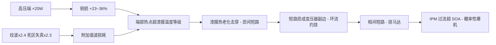
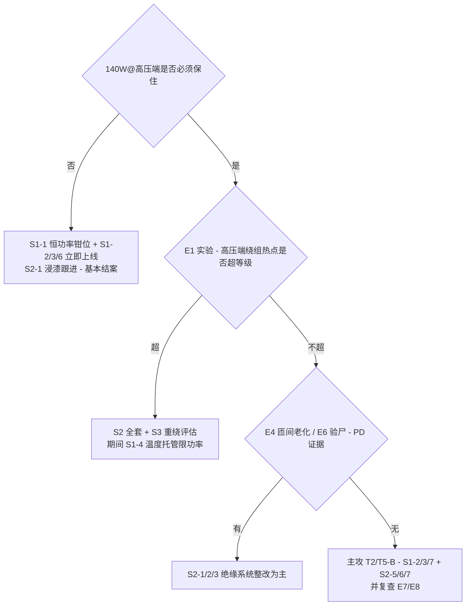

# 第 6 章 案例分析：旅行款宽电压高速吹风机的"高压烧马达 / IPM 爆机"

> 本章是一个真实工程案例的第一性原理归因。案例机是一台旅行款高速吹风机：体积约为家用款的 2/3，转速仍 ≥110 000 rpm，支持 100–240 V 全球宽电压；马达在低压端约 120 W、高压端约 140 W；绕组规格"1685"——线径 Φ0.16 mm、每齿 85 匝、三相 6 组集中绕组、星形连接。故障现象：**高压端易烧马达，且概率性伴随 IPM 烧毁并有"pop"爆炸声；低压端从未烧过**。本章用第 2 章的物理量链条、第 3 章的 FOC 电压预算、第 5 章的失效链与 FMEA 方法，把这组现象拆到根因，并给出分层应对策略。
>
> 本章所有推导数值均基于案例给定条件 + 明示假设，凡非给定条件一律标注 **[估计值]**；章末附"需确认数据清单"，代入实测值后本章全部计算可直接复算修正。

---

## 6.0 案例档案

### 6.0.1 已知条件（案例给定）

| 项目 | 数值 | 备注 |
|---|---|---|
| 产品形态 | 旅行款，约家用款 2/3 体积 | 散热面积、铜量、铁量同步缩水 |
| 额定转速 | ≥110 000 rpm | 与家用款持平 |
| 输入电压 | 100–240 VAC 宽电压 | 全球通用，单一绕组硬扛全范围 |
| 马达功率（低压端） | ≈120 W | 100–120 VAC 时 |
| 马达功率（高压端） | ≈140 W | 220–240 VAC 时，多 10–20 W |
| 绕组规格 | "1685"：Φ0.16 mm 漆包线，85 匝/齿 | 三相、6 齿集中绕组、星形 |
| 马达出身 | 低功率设计向高功率"向上兼容" | **未重绕**，线径偏细 |
| 故障现象 A | 高压端烧马达，低压端从未发生 | 电压强相关 |
| 故障现象 B | 概率性连带 IPM 烧毁，伴"pop"爆响 | 声学特征 = 封装内电弧爆裂 |

### 6.0.2 本章推导假设（待实测修正）

| 假设 | 取值 | 依据 |
|---|---|---|
| 极对数 $p$ | ~~2（4 极）~~ → **实测 1（2 极）** | 初稿按品类通行假设，后经规格书证实为 2 极，$f_e$=1.83 kHz——勘误详见第 8 章 §8.2.1，**对本章归因结论无影响** |
| 6 齿接法 | 每相 2 齿串联（$a=1$） | 常见做法；并联情形对电流密度结论**无影响**（见 §6.1.3）**[估计值]** |
| 平均匝长 | ≈25 mm | 2/3 尺寸集中绕组量级 **[估计值]** |
| PWM 频率 $f_{PWM}$ | 48 kHz；死区 $t_d$ ≈ 0.8 μs | 品类典型 **[估计值]** |
| 低压端满速策略 | 电压受限，约 104.5 krpm 运行（120 W） | 由 $P\propto\omega^3$ 与 120/140 W 反推，见 §6.1.2 |
| 电机相电感 $L$ | ~~≈2 mH~~ → **实测相值 $L_q$=0.635 mH、$L_d$=0.30 mH**（第 8 章）；母线电容 ≈100 μF **[估计值]** | 实测电感更小 → 纹波机理（#2#3）比本章推演**更严重** |

---

## 6.1 第一性原理：宽电压对这台机器意味着什么

### 6.1.1 母线电压范围——所有麻烦的总根源

市电整流后 $U_{dc}\approx\sqrt2\,V_{ac}$（第 4 章 §4.1）：

| 输入 | $U_{dc}$（空载峰值） | 说明 |
|---|---|---|
| 90 VAC（100 V −10%） | ≈127 V | 全范围下限 |
| 100–120 VAC 标称 | 141–170 V | "低压端"，从未烧机 |
| 220–240 VAC 标称 | 311–339 V | "高压端"，烧机集中区 |
| 264 VAC（240 V +10%） | ≈373 V | 全范围上限，最恶劣角点 |

**核心比值：高低压端母线之比 ≈ 2.4 : 1**（339/141）。同一套绕组、同一套功率级、同一套控制参数要横跨这个范围——后文每一条失效机理都以这个 2.4 为放大系数的起点。

### 6.1.2 绕组匝数被"锁死"在低压端——宽电压单绕组的结构性矛盾

反电动势天平（第 2 章 §2.4）要求：**最高转速的反电动势必须装进最低母线电压里**。绕组匝数（决定 $k_e$、$\psi_f$）只能按低压端设计：

- 低压端满调制（$m\approx0.95$）时最大相电压幅值 $U_{max}=0.95\times141/\sqrt3\approx77$ V —— 匝数按此定。规格书实测证实（第 8 章 §8.2.2）：$\psi_f$=5.7 mWb（$p$=1），满速反电动势幅值 $E_{peak}\approx65.7$ V，恰好贴着 140 VDC 母线的天花板设计；对比 310 V 专用设计（满速 $E_{rms}$ 可达 ~110 V），**本机反电动势只有其一半不到，同功率下相电流约为高压专用设计的 2 倍以上、铜损 4 倍以上**；
- 于是同样功率下，**相电流约为高压专用设计的 2 倍、铜损约 4 倍**——这是宽电压单绕组方案先天付出的代价，与做工无关；
- 到了高压端（339 V），调制比跌到 $m\approx0.38\sim0.44$：逆变器只用了母线电压的四成，**其余六成电压全部变成 PWM 斩波应力**（纹波、死区失真、开关损耗、dv/dt），由马达和 IPM 共同承担。

由 $P\propto\omega^3$（第 2 章 §2.6）反推两个工作点：

$$\frac{\omega_{high}}{\omega_{low}}=\left(\frac{140}{120}\right)^{1/3}\approx1.053,\qquad \frac{T_{high}}{T_{low}}\approx1.053^2\approx1.108$$

即低压端约 104.5 krpm / 120 W（电压顶格），高压端 110 krpm / 140 W（+5.3% 转速、+10.8% 转矩与电流、**+23% 铜损**；若两端同转速则为 +17% 电流、+36% 铜损——真实值在 23%～36% 之间）。
**【第 11 章复查修正】**后续 PQ 实测（第 8 章）表明两端**同为 110 krpm 恒转速**，功率差 ~20 W 几乎全部是斩波损耗（纹波交流铜损、高频铁损、磁体涡流、死区谐波与板损，第 11 章逐项拆账），基波铜损两端基本相同。本段的转速差推演保留作方法演示，其"基波铜损 +23~36%"的归因权重下调，多出损耗的主责移交高频/纹波项——这不改变 T1 的"绝对裕量不足"结论（J≈40 A/mm² 与 130 °C 等级是绝对量），但低压↔高压的**差异**归因以第 11 章为准。

### 6.1.3 电流密度：这套绕组本来就贴着悬崖跑

按 §6.0.2 假设复算（方法即第 3 章 §3.4.2 电压预算法）：

- 高压端满速相反电动势 $E_{rms}\approx51$ V **[估计值]**；相电阻（每相 2×85 匝串联、Φ0.16 mm）$R_{20}\approx3.6\ \Omega$，热态（150 °C）≈5.5 Ω **[估计值]**；
- 电机端输入 ≈133 W（扣驱动损耗）时，迭代解得 $I_{rms}\approx0.80$ A，铜损 $\approx10$ W；低压端 $I_{rms}\approx0.72$ A，铜损 ≈8 W；
- **电流密度 $J = I/A_{cu} \approx 0.80/0.0201 \approx 40\ \mathrm{A/mm^2}$ [估计值，±30%]**。

三个必须写在墙上的事实：

1. **$J$ 与串并联方式无关**——并联支路使每股电流减半但股数减半后每股截面不变，$J$ 只由"总铜量 × 所需功率"决定。所以"6 组怎么接的"不影响这个结论，**铜就是不够**。
2. 强迫风冷微电机的电流密度工程上限约 20–25 A/mm²（一般设计 8–15，第 2 章 §2.7）**[经验值]**。本机 ≈40 意味着：**这套绕组的生存完全押在气流带走热量的速度上**，任何损耗增量、气流减量、谐波污染都在直接切安全裕量。
3. 全机铜量仅约 **2.3 g [估计值]**（6×85 匝 ×25 mm×0.0201 mm²）。高压端 10 W 铜损摊到 2.3 g 铜上是 **4.3 W/g** 的损耗密度（低压端 3.5 W/g）——这解释了为什么"多 20 W"这么致命：铜太少，没有热容缓冲，温升对损耗增量极其敏感。

这正是"低功率马达向上兼容"的定量画像：原始功率下 $J$ 或许在 30 A/mm² 以内勉强可活，功率上探 + 尺寸缩 2/3 之后，裕量已经为负。

---

## 6.2 为什么"低压不烧、高压烧"：应力–电压缩放全表

把所有随母线电压或随"+20 W"缩放的应力列成一张表——**这张表就是本案的归因地图**：

| # | 应力项 | 缩放律 | 低压端→高压端倍数 | 作用对象 |
|---|---|---|---|---|
| 1 | 基波铜损 | $\propto I^2$，$I\propto T\propto\omega^2$ | ×1.23（同速则 ×1.36） | 绕组热点 |
| 2 | PWM 电流纹波 $\Delta I$ | $\propto U_{dc}/(L f_{PWM})$ | **×2.4** | 交流铜损、铁损、磁体涡流 |
| 3 | PWM 频段损耗（纹波致） | $\propto \Delta I^2$ | **×5.8** | 磁体/护套发热 → 退磁链 |
| 4 | 死区电压失真占比 | $\propto U_{dc}/U_1$ | 9% → 20%（×2.3） | 电流 THD、观测器角度误差 |
| 5 | 开关损耗 | $\approx\propto U_{dc}\times I$ | ×2.7 | IPM 结温 |
| 6 | 开关 dv/dt 与桥臂串扰 | $\propto U_{dc}$（同驱动） | ×2.4 | 米勒误开通 → 直通风险 |
| 7 | 故障电弧能量 $\tfrac12CU_{dc}^2$ | $\propto U_{dc}^2$ | **×5.8**（1.0 J→5.7 J，@100 μF）| "pop"爆响的能量来源 |
| 8 | 短路电流上升率 di/dt | $\propto U_{dc}/L_{fault}$ | ×2.4 | 保护抢时间失败 → 超 SOA |
| 9 | 绕组绝缘电应力 / 局部放电 | 阈值效应（PDIV） | 低压端远低于阈值；高压端 339 V+过冲逼近 | 匝间漆膜电蚀 |
| 10 | 磁体温升（2+3+环境叠加） | 复合 | 显著恶化 | $\psi_f\downarrow$ → 电流再增（正反馈） |

读表结论：**低压端每一项都有 2.3～5.8 倍的天然豁免**。"低压从未烧过"不是低压端设计得好，而是低压端根本没有承受这些应力——它既不能证明绕组热设计充足，也不能证明保护体系有效。高压端则是十项应力同时到位，其中 #1 是慢性主犯，#2–#4 是放大器，#9 是概率性独立杀手，#5–#8 决定 IPM 是"安静地死"还是"爆响地死"。

---

## 6.3 Top 归因排序

按"机理强度 × 与现象吻合度"排序。每条给出因果链与验证手段（验证方案汇总见 §6.5）。

### T1（主因）：绕组热过载 → 漆膜热击穿 → 匝间短路

- **机理**：§6.1.3 的 J≈40 A/mm² 绕组在低压端已贴极限；高压端铜损 +23～36%、再叠加 #2#3#4 的谐波损耗与更热的机内环境，端部热点越过漆膜等级（本机规格书实测为 B 级 130 °C，第 8 章）。漆膜失效 → 匝间短路 → 短路匝在 1.83 kHz 交变磁场里像短路的变压器副边，感应环流瞬时功率密度极高，局部熔穿扩大为相间短路。
- **与现象吻合度：极高。** 完美解释电压选择性（应力全在高压端）、"以前低功率没问题"（原功率点 J 低一档）、慢性+概率性混合发生（热老化是累积过程，个体公差决定先后）。
- **快速验证**：热态电阻法测绕组平均温升（$T = T_0 + (R/R_0-1)/0.00393$，第 5 章 §5.5.2）；两电压端各跑温度饱和实验对比热点；烧毁样机端部普遍性褐变支持本因。

### T2（放大器）：高母线低调制比下的控制质量退化

- **机理**（第 3 章 §3.10 在本案的实例化）：
  1. **死区失真占比 9%→20%**：等效误差电压 $\tfrac4\pi U_{dc}t_d f_{PWM}$ 随母线放大 2.4 倍，而所需基波电压不变——电流 5/7 次谐波、过零钳位平顶，全部变成马达里的无效热；
  2. **观测器角度误差**：无感 FOC 用"指令电压"重构磁链（第 3 章 §3.8），20% 的电压失真直接污染角度估计——角度偏差 δ 使同样转矩需要 $1/\cos\delta$ 倍电流，铜损再乘 $1/\cos^2\delta$；
  3. **电流环增益未按 $U_{dc}$ 归一化的风险**：若固件输出占空比而增益按某一电压端整定——按低压端整定则高压端环路增益 ×2.4，电流欠阻尼振铃，峰值应力加大；按高压端整定则低压端迟钝（表现为低压端启动/加速偏弱，可作旁证）；
  4. **单电阻采样窗口**（若为单电阻方案）：$m\approx0.4$ 时有效矢量时间缩短，最小采样窗补偿不足 → 高压端专属的电流重构畸变。
- **吻合度：高（作为 T1 的放大器）。** 它不直接烧机，但让高压端的每一瓦损耗雪上加霜，并能制造概率性失步→过流事件。
- **快速验证**：两电压端各抓相电流波形对比 THD 与包络平稳度；示波器看过零附近平顶；阶跃负载看电流环振铃差异。

### T3（概率性独立杀手）：绝缘电应力 / 局部放电（PD）

- **机理**：高压端母线 339 V + 关断过冲（10–30%）后，绕组端部承受 ~400 V 级、dv/dt 陡峭的重复脉冲。Φ0.16 mm 细线通常为薄漆膜（若为 1 级漆膜更甚）；集中绕组端部匝与匝随机交叠，**首末匝可能直接相邻**——匝间承受的脉冲分压最高。若线圈未浸漆，匝间空气隙中的场强可能超过起始放电电压（PDIV，典型漆包线对 500–700 Vpk 量级且随温度下降 **[经验值]**）：局部放电不击穿但**电蚀**漆膜，数十到数百小时后突然匝间短路——**与温度无关、纯电压选择性、概率性**。
- **吻合度：中高。** 独立解释"没测到明显过热的个体也烧"；低压端 141 V 连 PDIV 的一半都不到，天然免疫。
- **快速验证**：匝间冲击耐压试验（脉冲对比法）分别在新机 / 高压老化后做，波形衰减异常即漆膜已蚀；确认漆包线等级（1 级/2 级膜）与有无浸漆——**若无浸漆，此因概率大幅上调**。

### T4（加速器）：磁体过热与瞬态退磁正反馈

- **机理**（第 5 章 §5.2.1 失效链的实例化）：#3 项磁体涡流损耗高压端 ×5.8，旅行机转子更小散热更差 → 磁体温升 → $\psi_f$ 下降 → 同功率电流上升 → 铜损、纹波再增 → 更热。此外每次失步/过流瞬态的去磁性电流冲击叠加高温，可造成**部分不可逆退磁**——之后这台机器在同工况下永久性电流偏大，成为"下一次必烧"的候选。**【第 8 章 §8.7 实测更新】**磁体证实为烧结 42SH：≤120 °C 时电流冲击单独致退磁的可能性低（膝点净空约为电枢场的 5~10 倍），本链的主导腿是**温度**（$H_{cJ}$ 每 20→120 °C 砍半）；烧结环导电性同时证实了涡流加热机理。
- **快速验证**：高压端压力测试前后测反电动势波形与 $k_e$（第 5 章 §5.5.1 EOL 方法），下降 >3% 即已退磁；烧机样本若测得 $k_e$ 偏低而绕组尚可，本因实锤。

### T5：IPM 爆机（"pop"）的两条路径判别

| | 路径 A：次生死亡（被马达拖死） | 路径 B：原生死亡（高压端自身失效） |
|---|---|---|
| 触发 | 马达匝间/相间短路瞬间 | 米勒串扰直通、关断过冲超压、结温超限 |
| 机理 | 故障回路电感坍缩，di/dt=U_dc/L 高压端 ×2.4，比较器盲区+响应延迟内电流冲过器件 SOA | dv/dt×2.4 越过门极米勒安全线；373 V 角点逼近器件耐压减振铃裕量；开关损耗 ×2.7 推高结温 |
| "pop"来源 | 母线电容 5.7 J（339 V@100 μF）经击穿点灌入 → 硅片熔融电弧 → 封装气化爆裂。**同样故障在低压端只有 1.0 J，往往安静失效**——这解释了为什么爆响只在高压端 | 同左 |
| 验尸特征 | 马达已短路（测相电阻不平衡/对地）+ IPM 单臂炸 | 马达完好 + IPM 上下管同臂双炸（直通特征）或单管击穿点在边缘（过压特征）|
| 对策侧重 | 治马达（T1–T4）+ 加快保护 | 治驱动：门极、缓冲、降 dv/dt、选带短路保护的 IPM |

**先做验尸分流**：统计爆机样本中"马达同时短路"的比例。比例高 → 主战场在马达（T1/T3），IPM 是陪葬；比例低 → 驱动侧独立整改优先级上调。

---

## 6.4 马达本体硬件完整分析

逐子系统过一遍旅行机相对家用机的变化与检查项（√ = 本案重点）：

### 6.4.1 绕组铜（√√√）

| 检查项 | 现状/风险 | 判据与建议 |
|---|---|---|
| 电流密度 | ≈40 A/mm² **[估计值]**，超强迫风冷上限 | 实测 R、I 复算；目标 ≤25 |
| 线径/并绕 | Φ0.16 单线 | 槽满率允许则改 Φ0.18–0.19 或双线并绕 Φ0.13×2（铜面积 +32%）|
| 匝数 85 | 被低压端反电动势锁死，**不能减** | 动匝数必须联动重做电压预算（§6.1.2）|
| 端部形态 | 集中绕组端部堆叠，热点与电场应力都在这里 | 端部整形、绑扎；热电偶实测热点-NTC 温差 |
| 出线与槽口 | 细线在槽口/引出点易振动磨损 | 套管+点胶固定；验尸时重点看烧点是否集中槽口（是→机械磨损因，另案处理）|

### 6.4.2 绝缘系统（√√√）

| 检查项 | 风险 | 建议 |
|---|---|---|
| 漆膜等级与厚度 | 1 级膜在 400 V 级脉冲下 PD 裕量不足 | 升 2 级膜 + 温度等级 ≥180（N 级）；确认供应商批次一致性 |
| 浸漆/灌封 | 无浸漆 = 匝间存空气隙 = PD 温床 + 热阻大 | **真空浸漆或滴浸**：同时提升 PDIV、降热阻 20–40%、抗振——本案性价比最高的单项硬件改进 |
| 相间/对地绝缘 | 集中绕组相邻齿属不同相，齿间距小 | 相间绝缘纸/骨架挡墙检查；对地按 2×U+1000 V 耐压抽测 |
| 匝间检测 | 产线是否有匝间冲击测试？ | EOL 增加匝间脉冲对比测试（第 5 章 §5.5.1 追加项）|

### 6.4.3 转子与磁体（√√）

| 检查项 | 风险 | 建议 |
|---|---|---|
| 磁体牌号耐温 | 高压端转子更热；SH（150 °C）可能不够 | 复核热平衡后必要时升 UH（180 °C）；或降低转子损耗使 SH 够用 |
| 磁体涡流 | 纹波 ×2.4 → 涡流损耗 ×5.8 | 烧结整环 → 粘结磁体或轴向分段；护套改低电导材料 |
| 退磁校核 | OCP 限值电流 + 最高磁体温度联合工况 | 按第 5 章 §5.2.1 方法校核去磁工作点；EOL 与售后均测 $k_e$ |
| 动平衡 | 2/3 尺寸转子对不平衡更敏感（G 等级同、半径小）| 维持 G0.4–G1.0；烧机高温可能使平衡胶失效——验尸顺带查 |

### 6.4.4 定子铁心（√）

- 电频率 1.83 kHz（2 极，第 8 章勘误），但高压端纹波磁密叠加使铁损上浮；旅行机铁量少、损耗密度高。0.2 mm 冲片建议评估 0.127/0.1 mm 或更高牌号（第 2 章 §2.7.2 收益倍率）。

### 6.4.5 轴承与机构（√）

- 机内环境温度高压端整体上移：油脂寿命每 +10–15 K 减半（第 5 章 §5.5.3）——高压端烧机前的高温运行也在同步透支轴承；
- 高 dv/dt 下共模电流经轴承放电（EDM）在微电机上概率低但非零，若验尸见轴承滚道搓板纹再深究；
- 叶轮：140 W 工况排气温度更高，塑料叶轮蠕变校核（第 5 章 §5.6.3）。

### 6.4.6 热路与风道（√√）

- 2/3 尺寸 = 表面积约 (2/3)² ≈ 44% 缩水而损耗只多不少——**热设计是被动挨打的一方**；
- 确认气流是否真实掠过绕组端部与转子区（很多机型主风道不经过马达内腔，靠传导+微弱旁路风）；
- 排风再吸入（用户手挡出风口）工况在高压端 140 W 下重新做温升角点实验；
- **NTC 位置**：若现状只测出风口/加热丝区而绕组无测点——马达其实处于无温度保护裸奔状态（本案高危疑点），见 §6.6 S1-4/S2-4。

---

## 6.5 归因判别实验方案

目标：用最少的实验把 T1–T5 分开。全部实验在 90 / 120 / 230 / 264 VAC 四点做，形成随电压的趋势线而非单点结论。

| # | 实验 | 读数 | 判别 |
|---|---|---|---|
| E1 | 热电偶阵列温度饱和实验（端部×2、槽内、磁体邻近、IPM 壳、NTC 现位）| 各点稳态温度 vs 电压 | 端部热点高压端越级 → **T1 实锤**；NTC 与热点温差 >20 K → 保护盲区实锤 |
| E2 | 相电流波形对比（电流探头）| THD、过零平顶、包络振荡、纹波幅值 | 高压端 THD 显著劣化 → **T2**；包络低频振荡 → 环路增益未归一 |
| E3 | 热态电阻法 | 停机瞬间 R 衰减外推绕组平均温升 | 与 E1 交叉验证铜温 |
| E4 | 匝间冲击对比测试（新机 vs 高压老化 200 h 后）| 冲击波形衰减一致性 | 老化后劣化 → **T3 实锤**（配合确认漆膜等级/浸漆状态）|
| E5 | $k_e$/反电动势前后对比（高压压力测试前后）| 幅值降与波形畸变 | 降 >3% → **T4 实锚** |
| E6 | 爆机样本验尸统计 | 马达短路比例、IPM 炸点形貌（单臂/同臂双管/边缘）| 按 §6.3 T5 表分流路径 A/B |
| E7 | 门极信号高压端审查（373 V 角点，冷/热态）| 关断时对管 $V_{GS}$ 米勒平台抬升量 | 抬升逼近阈值 → **T5-B 直通风险实锤** |
| E8 | 保护链路时延实测 | 比较器阈值→封波的全链路延迟；对照 IPM 数据手册 SOA/短路耐受时间 | 延迟 × 高压端 di/dt > SOA → 保护体系对高压端无效的定量证明 |

**验尸读图速查**：端部大面积均匀褐变=热老化（T1）；针尖状单点击穿+周边完好=PD 电蚀（T3）；烧点集中槽口/出线=机械磨损；相电阻不平衡+IPM 单臂炸=路径 A；马达完好+同臂双管炸=路径 B 直通。

---

## 6.6 应对策略：三层部署

### S1 固件层（不动 BOM，数周可落地）

| # | 措施 | 针对 | 要点与参考实现 |
|---|---|---|---|
| S1-1 | **全电压恒功率钳位**：闭环限制电控输入功率 ≤120–125 W，与电压无关 | T1 根因 | 功率由 $\tfrac32(u_di_d+u_qi_q)$ 或母线电压×电流实时计算并作为速度环外层限幅。一行看懂：**高压端多出来的 20 W 正是压垮绕组的 20 W——不要它，问题解除大半**。若 140 W 是产品硬指标，则以 S1-4 温度托管代替一刀切 |
| S1-2 | **母线电压前馈 + 增益调度**：占空比 = 电压指令/实测 $U_{dc}$（逐周期）；电流环增益 ∝ $1/U_{dc}$ 归一 | T2 | ST MCSDK 的 bus voltage compensation、VESC 的 duty-voltage 归一均为成熟先例；整定后在 90/264 VAC 双角点做电流阶跃验证 |
| S1-3 | **死区补偿**：按电流极性加补偿电压，过零带内平滑过渡 | T2 | 第 3 章 §3.10.2 方法；TI/ST/Microchip（AN1078 系）均有参考实现；补偿后高压端 THD 应显著回落 |
| S1-4 | **绕组温度软观测 + 分级降额**：在线估计相电阻 $R$（慢速注入或稳态辨识）反推铜温，超限逐级降功率 | T1/T4 | TI InstaSPIN 的 Rs_online（SPRUHJ1）与 VESC 的分层温度限幅（MOSFET/马达双温度墙）是最值得抄的两个开源级实现；无 NTC 硬件时这是唯一的真绕组温度保护 |
| S1-5 | **I²t 软件热像**：绕组双节点热模型（铜→铁→环境），按 E1 实验标定 | T1 | 与 S1-4 互备；对堵风口等慢过载有效 |
| S1-6 | **保护链路复核**：CBC 逐波限流阈值对照 IPM 在 373 V 下的 SOA；失步检测（观测器残差，第 5 章 §5.4.6）触发后**封波自由停车 + 冷却计时**，禁止对热机盲目重启；N 次故障锁存 | T5-A | 高压端 di/dt ×2.4 意味着同样的比较器延迟放过更多电流——阈值应随 $U_{dc}$ 下调或换更快路径 |
| S1-7 | **$f_{PWM}$ 随母线调度**：高压端提载波（如 48→64 kHz）压纹波 | T2/T4 | 用 IPM 开关损耗换马达纹波损耗——先按 E1/E2 数据算净收益再上 |
| S1-8 | **上电匝间自检**：预定位脉冲阶段比较三相电流上升斜率对称性，检出早期匝间短路即锁机报故障 | T5-A | 把"马达带病运行拖炸 IPM"这条路掐断；单电阻方案同时按 AN1299 类方法补最小采样窗 |

### S2 低成本硬件层（BOM 微调，1–2 个改版周期）

| # | 措施 | 针对 |
|---|---|---|
| S2-1 | **真空浸漆/滴浸**——一项动作同时抬升 PDIV（T3）、降热阻 20–40%（T1）、抗振固定（机械磨损） | T1/T3，**本层首选** |
| S2-2 | 漆包线升级：2 级膜、N 级（200 °C）温度等级；PD 若证实则用耐电晕线 | T1/T3 |
| S2-3 | 相间绝缘纸/骨架挡墙补强，出线套管点胶 | T3 |
| S2-4 | 绕组端部贴装 NTC（真热点测温），联动 S1-4 降额曲线 | T1 |
| S2-5 | 门极整改：开通/关断电阻分离（慢开快关）、米勒钳位或负压关断（驱动支持时）、缩短门极回路 | T5-B |
| S2-6 | RC 缓冲 + 母线钳位（MOV/TVS），复核 373 V 角点关断过冲与电容纹波电流温升 | T5-B |
| S2-7 | 换带内建短路保护（desat 类）且短路耐受 ≥5 μs 的 IPM 型号 | T5-A/B |

### S3 设计迭代层（下一版马达）

- **重绕**：提槽满率 + 双线并绕/加线径把 $J$ 压到 ≤25 A/mm²（匝数按 §6.1.2 电压预算重新联算，保住低压端满速）；
- **转子降损**：磁体分段或粘结化、低电导护套、必要时升 UH 牌号；
- **铁心**：0.127/0.1 mm 薄冲片；
- **热路**：风道确保掠过端部绕组，NTC 进入马达腔；
- **产品定义兜底选项**：高压端转速回退与低压端一致（统一 120 W）——**零硬件成本，直接消灭本案**，商业上是否可接受由产品侧决策。

### 决策树

---

## 6.7 小结：这个案例教科书在哪

1. **宽电压单绕组的先天税**：匝数被最低电压锁死 → 高压端永远运行在低调制比 + 高电流区，纹波、死区失真、开关应力、故障能量全按 2.4 倍及其平方缴税（§6.2 表）——宽电压产品立项时就该把这张表放在桌上。
2. **"向上兼容"吃掉的是看不见的裕量**：功率 +17% 表面无害，落到 2.3 g 铜上是 +23～36% 的损耗、落在已经 40 A/mm² 的电流密度上就是漆膜寿命的断崖（§6.1.3）。
3. **"低压不烧"是豁免不是合格证**（§6.2）。
4. **IPM 爆响是能量学签名**：$\tfrac12CU_{dc}^2$ 差 5.8 倍，决定同样的故障在低压端安静、在高压端放炮（T5）——先验尸分流，再决定治马达还是治驱动。
5. **最高性价比动作排序**：S1-1 恒功率钳位（固件、当天可验证）→ S2-1 浸漆（一石三鸟）→ S1-4 在线温度托管（InstaSPIN Rs_online / VESC 式分层限幅）→ 门极与保护链路复核。

### 需确认数据清单（代入后本章可精确复算）

实测相电阻/电感/$k_e$、串并联接法与漆包线等级、有无浸漆；两电压端的实测转速/输入功率/相电流波形；$f_{PWM}$、死区、单/双电阻采样、电流环整定所用电压端；IPM 型号与 OCP 全链路延迟；NTC 位置；爆机样本的马达短路比例与炸点形貌照片。

## 参考资料

1. TI, *InstaSPIN-FOC and InstaSPIN-MOTION User's Guide* (SPRUHJ1)——FAST 观测器与 Rs_online 在线电阻/温度估计。https://www.ti.com/lit/pdf/spruhj1
2. VESC 开源电机控制器固件（vedderb/bldc）——母线电压归一、MOSFET/马达双温度墙分层限幅、I²t 限制的工程实现范本。https://github.com/vedderb/bldc
3. ST, X-CUBE-MCSDK 电机控制 SDK 文档——母线电压补偿、死区补偿、无感 FOC 参考实现。
4. Microchip, AN1078《Sensorless FOC of PMSM》与 AN1299《Single-Shunt Three-Phase Current Reconstruction》。
5. IEC 60317 系列（漆包线规格，1 级/2 级漆膜定义）；IEC 60034-18-41（变频供电绕组无局放绝缘系统评定）；IEC TS 61934（电气绝缘局部放电测量）。
6. 各 IPM 厂商应用笔记（Infineon/onsemi/士兰微等）：短路耐受时间、desat 保护、米勒钳位与门极设计准则。
7. 本书第 2 章 §2.4/§2.7、第 3 章 §3.4/§3.8/§3.10、第 4 章 §4.7、第 5 章 §5.2/§5.4/§5.5/§5.6——本章全部方法的出处。

> 本章数值推导基于 §6.0.2 假设，均已标注 **[估计值]**；结论的定性排序对假设不敏感（±30% 参数摄动下 T1–T5 排序不变），定量值请以"需确认数据清单"实测后复算为准。
