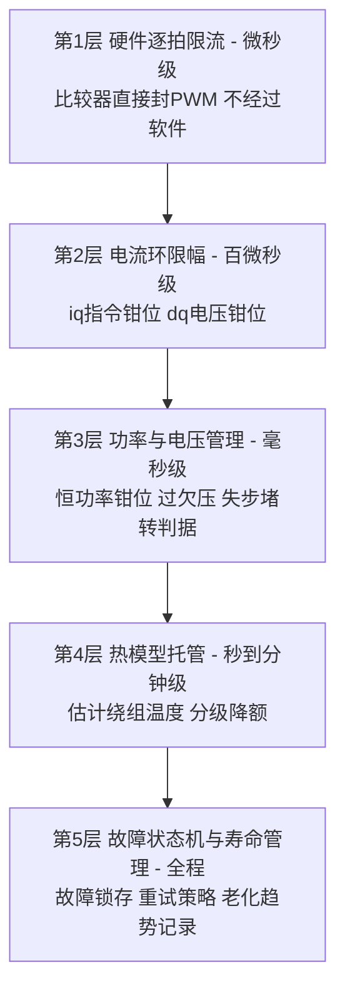

# 第 7 章 单片机上的软件防线：FOC 参数整定、热模型与个体差异管控

> 第 6 章回答了"为什么烧"；本章回答"**在单片机上具体怎么办**"。读者设定为刚接手电控的工程师：每个参数都从物理含义讲起，给出"怎么算初值 → 怎么代入本机 → 怎么验证 → 设错了什么症状"的完整闭环。全章延续第 6 章案例机（Φ27 旅行机，实测线间电阻 12 Ω ±10%，最大 140 W），并用新数据先做一次复核。
>
> 心法先行：**焦虑的反义词是秩序**。电机不会无缘无故烧——它只在某个物理量越过某条边界时烧。本章的全部内容就是把每条边界找出来、写进代码、再逐条验证。做完这件事，这台机器就从"黑盒"变成"可控系统"。

---

## 7.0 用新数据复核：这台马达到底有多极限

### 7.0.1 先澄清 12 Ω 的口径

万用表在马达两个引线端子间测到的是**线间电阻**。星形接法下线间电阻 = 2 × 相电阻：

$$R_{线间}=12\ \Omega\ \Rightarrow\ R_{ph}\approx 6\ \Omega\ (25\ ^\circ\mathrm{C})，个体公差 \pm10\%$$

（若供应商规格书写明 12 Ω 是"每相"，则下文所有铜损数值 ×2——结论只会更严峻。按 Φ27 尺寸与 Φ0.16 mm×85 匝的几何反算，线间 12 Ω / 相 6 Ω 与绕组几何自洽，采用此口径。）

铜的电阻温度系数 α ≈ 0.393%/K：

| 绕组温度 | $R_{ph}$ | 相对冷态 |
|---|---|---|
| 25 °C | 6.0 Ω | ×1.00 |
| 120 °C | 8.2 Ω | ×1.37 |
| 130 °C | 8.5 Ω | ×1.41 |

**这个公式反过来用就是免费的绕组温度计**（§7.3.3）：$T = T_0 + \dfrac{R/R_0-1}{0.00393}$。

### 7.0.2 复核损耗与效率

沿用第 6 章工作点（高压端 140 W 输入、$I_{rms}\approx0.8$ A **[估计值]**），代入实测电阻：

| 项目 | 120 W 点（低压端） | 140 W 点（高压端） |
|---|---|---|
| 相电流 $I_{rms}$ | ≈0.72 A | ≈0.80 A |
| 铜损（热态 8.2 Ω） | ≈12.8 W | **≈15.7 W** |
| 铁损+磁体+机械 **[估计值]** | ≈9 W | ≈11 W |
| 轴功率 | ≈95 W | ≈108 W |
| 电机本体效率 | ≈80% | **≈78%** |

你担心的"多出的十几二十瓦大部分变成热"定量化：120→140 W 多投入 20 W，其中约 **5–6 W 直接变成新增损耗**（且集中在最热的绕组与转子上），只有约 13–14 W 变成风。效率本身（≈78%）在这个尺寸不算异常，**真正的问题是损耗的绝对值压在多小的散热面积上**：

### 7.0.3 与供应商 Φ29/125 W 基准的对比——"是不是设计太过极限了？"

供应商经验：Φ29 马达通常额定 125 W。散热能力大致随表面积 $\propto D^2$ 缩放：

$$\text{功率密度比}=\frac{140/27^2}{125/29^2}\approx 1.29$$

**本机按功率密度算，比供应商自家产品线的额定极限还高约 25–30%。** 再叠加绝缘与结构件耐温等级只有 120–130 °C（E/B 级——高速电机行业通行至少 F 级 155 °C，讲究的用 H 级 180 °C，见第 5 章 §5.6.2）：

> **回答你的问题：是的，140 W@Φ27 + 120/130 °C 耐温体系，这个组合在硬件上就是过限设计。** 软件防线不是锦上添花，而是这台机器能不能安全出货的**必要条件**；同时按第 6 章 S2/S3 推进硬件补课（浸漆、耐温等级、必要时限功率定版）。
>
> 一个用供应商自己的尺子量出来的建议：按 Φ29→125 W 的功率密度折算，Φ27 的"同等安全功率"约 **105–110 W**；考虑软件热保护到位后可上探，**短期建议高压端与低压端统一钳在 120 W**，是否恢复 130–140 W 由 §7.3 热模型 + 第 6 章 E1 实验的实测数据决定——让数据而不是焦虑做决定。

---

## 7.1 软件防线的分层架构：先建立框架再填参数

所有保护按"反应速度"分五层，**内层快而简单粗暴，外层慢而聪明**。记住这张图，后面所有参数都能挂到某一层上：



| 层 | 看什么 | 多快 | 动作 | 对应参数（§7.2 编号）|
|---|---|---|---|---|
| 1 | 相电流瞬时值 | <1 μs（不经软件）| 本拍封波（CBC）| P1 |
| 2 | $i_d,i_q$ 与指令 | 每个电流环周期 | 指令/输出钳位 | P2–P4 |
| 3 | $U_{dc}$、功率、观测器残差 | 1–10 ms | 限功率、降速、封波停机 | P5–P8 |
| 4 | 估计绕组/磁体/IPM 温度 | 100 ms–10 s | 分级降功率、锁机冷却 | P9–P11 |
| 5 | 故障计数、参数漂移 | 全程+跨开机 | 锁存、报障、预警售后 | P12 |

**设计铁律**：任何一层失效，外/内层必须能兜住。例如热模型（第 4 层）算错了，第 1 层限流仍保证不会瞬间炸管——这叫纵深防御，也是你"确保安全"目标的工程表述。

---

## 7.2 十二个必须亲手整定的参数

每个参数按统一格式：**物理含义 → 初值公式与本机代入 → 验证方法 → 设错症状**。本机代入使用规格书实测值（第 8 章）：$R_{ph}$=6.1 Ω（冷）/8.4 Ω（热）、**$p$=1（2 极）**、**$L_q$=0.635 mH、$L_d$=0.30 mH（相值）**、$\psi_f$=5.7 mWb、$f_{PWM}$=48 kHz **[估计值]**、110 krpm 时 $\omega_e=\omega_m$=11 519 rad/s、$f_e$=1.83 kHz。

### P1 硬件逐拍限流阈值 $I_{trip}$

- **含义**：最后一道命门。相电流瞬时值越过它，比较器直接封当拍 PWM，不给软件反应机会。
- **定值**：取三者最小——① IPM 数据手册脉冲电流限（373 V 角点降额后）；② 磁体最高温度下的去磁电流（向供应商索要，第 5 章 §5.2.1）；③ 正常峰值电流的 2～2.5 倍。本机正常峰值 ≈1.13 A（0.8 A rms），**初值取 2.5 A [估计值]**，拿到①②后收紧。
- **验证**：探头监视下人为堵转触发一次，确认封波时延与电流尖峰。
- **设错**：太高＝IPM 裸奔（第 6 章 T5-A）；太低＝启动/负载突变误触发。

### P2 电流采样零漂与增益标定

- **含义**：FOC 的地基。零漂 10 mA 的误差在 0.8 A 满量程上就是 1.2% 的转矩脉动与观测器角度误差。
- **做法**：每次上电、PWM 未发波时采样 N=64 次取平均作为零点；增益用产线已知电流源标定一次写入 flash（个体差异管控的第一项，§7.4）。
- **设错症状**：低速电流波形不对称、观测器角度周期性摆动、同批机器性能离散。

### P3 电流环 PI（含 $U_{dc}$ 归一化）

- **含义**：让实际电流在百微秒级贴住指令。被控对象是 $R$-$L$ 电路，**教科书整定公式**（零极点对消）：
$$K_p = L\cdot\omega_{cc},\qquad K_i = R\cdot\omega_{cc}$$
$\omega_{cc}$ 为目标带宽（rad/s）。带宽选择：$f_{cc}\ge(1.5\sim3)f_e$ 且 $f_{cc}\le f_{PWM}/10$。本机 $f_e$=1.83 kHz、$f_{PWM}$=48 kHz → 取 $f_{cc}\approx$ **4 kHz**（载波比 26，比初稿假设的 4 极从容一倍）。
- **本机代入**（凸极机 d/q 轴**分开整定**，用各自电感）：$\omega_{cc}=2\pi\times4000\approx25\,100$；$K_{p,q}=L_q\omega_{cc}=0.635\text{m}\times25\,100\approx$ **16 V/A**，$K_{p,d}=0.30\text{m}\times25\,100\approx$ **7.5 V/A**；$K_i=R\,\omega_{cc}=6.1\times25\,100\approx1.53\times10^5$ V/(A·s)（两轴同）。
- **关键一步——电压归一化**：PI 输出是"伏特"，写占空比寄存器前必须除以**当拍实测** $U_{dc}$。这一除就是第 6 章 S1-2 的母线前馈：环路增益从此与 90–264 VAC 无关。不做的症状：按低压端调好的机器到高压端电流振铃（第 6 章 T2-3）。
- **加前馈解耦**：$u_d^{ff}=-\omega_e L_q i_q$、$u_q^{ff}=+\omega_e(L_d i_d+\psi_f)$（第 3 章 §3.5，凸极机用各自电感）。本机主项是反电动势前馈 $\omega_e\psi_f\approx65.7$ V，交叉耦合项 $\omega_e L_q i_q\approx11\,519\times0.635\text{m}\times1.2\approx8.8$ V 为辅——都加上，PI 只负责纠小偏差。
- **验证**：低压母线 + 堵转下打 $i_q$ 阶跃，看上升时间 ≈ $2.2/\omega_{cc}$≈90 μs、超调 <10%。

### P4 电流指令上限 $i_{s,max}$

- **含义**：第 2 层的钳位值，稳态热约束的直接体现。
- **定值**：由铜损预算反推。若热模型允许持续铜损 13 W（热态）：
$$I_{rms,max}=\sqrt{\frac{13}{3\times8.2}}\approx0.73\ \mathrm{A}\ \Rightarrow\ i_{s,max}=\sqrt2\times0.73\approx1.0\ \mathrm{A（幅值）}$$
瞬态（启动/加速）可放宽至 1.3–1.5 倍、限时数秒（由热模型积分兜底）。
- **注意**：这里用**个体实测 R**（§7.4），公差 ±10% 直接改变答案 ±5%。

### P5 恒功率钳位 $P_{max}(U_{dc})$——本案最重要的单个参数

- **含义**：直接砍掉"高压端多出的 20 W"（第 6 章 T1 根因）。
- **实现**（二选一或并用）：
  - 电控侧：$P_{elec}=\tfrac32(u_d i_d+u_q i_q)$ 实时计算，超限则收 $i_q$ 指令（外环慢钳位，时间常数 ~10 ms）；
  - 简化版：$i_{q,max}=\dfrac{P_{max}}{1.5\,p\,\psi_f\,\omega_m}$ ——随转速动态计算 $i_q$ 上限，一行代码。本机代入（$p$=1、$\psi_f$=5.7 mWb、110 krpm）：$i_{q,max}=120/(1.5\times0.0057\times11\,519)\approx$ **1.22 A（幅值）**。
- **定值**：短期 $P_{max}$=120 W 全电压统一；热模型验证后再议上探（§7.0.3）。
- **验证**：90/264 VAC 两角点各测输入功率，应相等（差 <3%）。

### P6 母线电压阈值与管理

- 过压封波：整流峰值 373 V（264 VAC）之上留纹波与刹车回馈余量 → **≈400 V 报警、≈420 V 封波 [估计值]**（须低于母线电容与 IPM 耐压的 90%）；
- 欠压：低于 ≈110 V（90 VAC 谷值再留 10%）先降功率后停机——否则同功率下电流上冲，低压端也能烧；
- 所有电压相关逻辑用**滤波后**的 $U_{dc}$ 判故障、用**当拍**的 $U_{dc}$ 做归一化（P3）——两个用途、两种滤波，别共用一个变量。

### P7 死区与死区补偿

- 死区 $t_d$ 按 IPM 手册最小安全值（通常 0.5–1 μs），**不要**为保险随手加大——第 6 章 T2-1 算过：高压端死区失真占比已达 20%，死区每多 0.1 μs，失真多 2.5%。
- 补偿：按电流极性加 $\pm\tfrac{t_d}{T_s}U_{dc}$ 的修正电压，过零 ±50 mA 带内线性过渡（防抖振）。
- **验证**：高压端抓相电流，补偿前后过零平顶应明显消失，THD 回落到低压端水平。

### P8 启动三参数：I/F 电流、频率斜坡、切换转速

- I/F 电流：能克服最大静摩擦并留 50% 裕量，本机 ≈0.4–0.5 A **[估计值]**。**注意堵转全热**：此电流在零转速下全部变铜损（3×0.35²×6≈2.2 W 虽小，但无风冷），限时 3–5 s 不切换即报启动失败；
- 频率斜坡：受"转子跟随能力"限制，$\dot\omega \le \tfrac{T_{IF}}{J}$ 的 30–50%（第 3 章 §3.9）；
- 切换转速：BEMF ≥ 3–5 倍死区失真电压（第 5 章 §5.1.3 的整定依据链）→ 本机约 **15–20% 额定转速**处切闭环。
- **设错症状**：切换瞬间电流尖峰（提前了）、启动啸叫抖动（斜坡太陡）、偶发启动失败堵转（电流太小）。

### P9 观测器与 PLL 带宽

- SMO/磁链观测器增益与 PLL 带宽随转速**调度**（第 3 章 §3.8）：PLL 带宽取 $f_e/10$ 量级、随 $\omega_e$ 线性放大；固定带宽的症状是"低速丢角度、高速角度滞后"。
- 角度滞后补偿：采样-输出一拍半延迟 $\Delta\theta=1.5T_s\omega_e$（110 krpm、48 kHz、$p$=1 时约 **21°电角度**，不补必然角度偏差大增——第 3 章 §3.10.3）。
- **凸极机专用修正（规格书实测 $L_q/L_d\approx2.1$，第 8 章）**：表贴电机的标准 SMO 模型在凸极机上有系统性角度误差，观测器必须改用**扩展反电动势（Extended EMF, EEMF）模型**（把凸极项归并进等效反电动势后再提取角度）；副产品是低速位置检测多了一个可靠选项——凸极比 2.1 足以支持高频注入（HFI），可替代或校验 I/F 盲启。
- **验证**：全转速段扫频，监视 $i_d$ 稳态值——角度准则 $i_d\approx0$；$i_d$ 系统性偏离即角度误差。

### P10 失步/堵转判据

- 失步：观测器残差（估计 BEMF 与量测差）超阈值持续 >10 ms，或 $i_q$ 顶格而转速不升持续 >100 ms；
- 堵转：转速 <5% 额定且电流 >80% 限值持续 >0.5 s；
- **动作**：立即封波自由停车（风机负载自己会停），冷却计时 30 s 后允许重试，**连续 3 次锁存报障**——严禁对热机无限重试（第 6 章 T5-A 的经典诱因）。

### P11 热模型阈值与降额曲线（详见 §7.3）

- 分级示例（绝缘 130 °C 体系，热点-估计点温差按 15 K 计）：

| 估计绕组温度 | 动作 |
|---|---|
| <95 °C | 满功率（当前定义的 $P_{max}$）|
| 95–105 °C | 线性降至 100 W |
| 105–115 °C | 线性降至 80 W + 用户可感提示（如档位限制）|
| >115 °C | 封波，锁定至 <70 °C |

- 数值直接由耐温体系决定：**你们 120/130 °C 的器件等级对应热点红线只能设在 ~115 °C**——这就是硬件过限如何压缩软件空间的直观体现；换 F/H 级绝缘后此表整体上移 25–50 K，产品力立刻回来。

### P12 故障状态机与跨开机记录

- 每类故障（过流/过压/欠压/堵转/失步/过温/自检失败）独立计数 + EEPROM/flash 记录；
- 重试策略按故障类型区分：过温→冷却后自动恢复；过流/失步→3 次锁存；自检失败→直接锁存；
- 每次开机记录冷态 R 与环温（§7.4.3）——这是老化预警的数据源。

---

## 7.3 热模型：把"温度拟合"落到代码

这是你提到的"仿真/拟合马达温度"的工程实现。原理就一句话：**温度是损耗功率的积分，积分器我们有的是**。

### 7.3.1 模型结构：双节点 RC 网络

电路类比（第 2 章 §2.8 的能量流反过来用）：损耗=电流源，热容=电容，热阻=电阻，温度=电压。

$$C_{cu}\frac{dT_{cu}}{dt}=P_{cu}-\frac{T_{cu}-T_{fe}}{R_{th,cf}},\qquad
C_{fe}\frac{dT_{fe}}{dt}=P_{fe}+\frac{T_{cu}-T_{fe}}{R_{th,cf}}-\frac{T_{fe}-T_{amb}}{R_{th,fa}}$$

节点 1 = 绕组铜（快，时间常数十秒级），节点 2 = 定子铁+结构（慢，分钟级），$T_{amb}$ 用机内 NTC（没有就用出风口 NTC 加偏移，精度降一档但可用）。

### 7.3.2 离散化与代码

100 ms 周期任务，前向欧拉足够（时间常数 >> 步长）：

```c
/* ---- 每 100 ms 执行；单位: W, K, s ---- */
/* 1. 用当前估计温度更新热态电阻(温度-电阻耦合闭环) */
R_hot = R0_calib * (1.0f + ALPHA_CU * (Tcu - T_CALIB));   /* R0_calib: 本机个体标定值 */

/* 2. 损耗估计(幅值不变约定: P_cu = 1.5*(id^2+iq^2)*R) */
P_cu = 1.5f * (id_flt*id_flt + iq_flt*iq_flt) * R_hot;
P_fe = KFE * we_flt * we_flt;                 /* 铁损~f^2 近似, KFE 由标定试验拟合 */

/* 3. 双节点热网络积分 */
Tcu += (DT/C_CU) * (P_cu - (Tcu - Tfe)/RTH_CF);
Tfe += (DT/C_FE) * (P_fe + (Tcu - Tfe)/RTH_CF - (Tfe - Tamb)/RTH_FA);

/* 4. 慢速锚定: 用在线电阻辨识把积分漂移拉回真值(见7.3.3), 每10s一次 */
if (rs_est_valid) {
    Tcu_meas = T_CALIB + (Rs_online/R0_calib - 1.0f)/ALPHA_CU;
    Tcu += K_ANCHOR * (Tcu_meas - Tcu);       /* K_ANCHOR ~0.1 */
}

/* 5. 查降额表输出 P_max_thermal → 与 P5 恒功率钳位取小 */
P_max_now = min(P_MAX_SPEC, derate_lut(Tcu));
```

### 7.3.3 两条温度通道互校——"陀螺仪+磁力计"结构

- **通道 A（快、相对）**：上面的 RC 积分模型——响应快但参数不准会漂；
- **通道 B（慢、绝对）**：电阻测温 $T=T_0+\dfrac{R/R_0-1}{\alpha}$——绝对准（物理定律）但只能慢速获得。R 的来源按实现难度递增任选：
  1. **停机瞬间法**（最简单）：封波后立即用预定位小电流（0.2 A、50 ms）测 V/I 得热态 R——每次用户关机白拿一个数据点；
  2. **周期注入法**：运行中在 $i_d$ 上叠加小幅低频方波（±50 mA、10 Hz），由 $\Delta u_d/\Delta i_d$ 解出 R（对转矩无扰动，$i_d$ 不产生转矩）；
  3. **观测器融合法**：TI InstaSPIN 的 Rs_online 思路——用磁链观测器的冗余信息在线分离 R，无需注入。
- 通道 B 以小增益持续校正通道 A（代码第 4 步）：积分模型提供毫秒级动态，电阻法钉住绝对值——**这套结构对参数误差和个体差异天然免疫**，是本章最值得花时间做好的东西。

### 7.3.4 模型参数从哪来：一次标定实验

对 2–3 台样机做一次阶跃实验即可拟合全部参数：恒功率点运行至温度饱和，全程记录（热电偶贴端部 + 停机瞬间电阻法交叉验证）→ 升温曲线拟合出 $C_{cu},R_{th,cf}$（快时间常数段）与 $C_{fe},R_{th,fa}$（慢段）；不同风量档各做一组——**堵风口时 $R_{th,fa}$ 会变大 2–5 倍 [估计值]**，模型里按风档/堵转检测切换热阻值。
配套一个聪明的免费检测：EOL 时标定本机正常风道下的 $P(\omega)$ 曲线存 flash；运行中比对实测功率。**方向要按本机 PQ 实测来**（第 8 章 §8.3 事实二）：这台 13 叶叶轮"越堵越费电"——出风被堵时同转速功率**上升**约 25–30 W 且穿透气流（散热）崩塌，因此判据是"实测功率显著**高于**标定曲线 = 堵塞"，立即降额/降速，比等温度爬上来早 30 秒发现问题。

---

## 7.4 个体差异管控：让每台机器用自己的参数保护自己

你观察到的"马达与马达之间会有差异"是真问题：R ±10%（已知）、$k_e/\psi_f$ ±3–5%、L ±10–15%、采样链增益 ±2–3%、NTC ±3–5 K **[典型值]**。最坏方向叠加时，**最坏个体的铜损可比典型个体高 25–30%**——用一套全局参数保护所有机器，要么冤枉好个体（保护过严性能打折）、要么放过坏个体（烧的就是它们）。解法是三层：

### 7.4.1 产线层：EOL 分选 + 个体参数写入

| 测什么 | 怎么测（秒级，可自动化）| 用途 |
|---|---|---|
| 冷态 R（三个线间两两测）| 微欧计或驱动板自测 | 写入 flash 作 $R_{0,calib}$；三相不平衡 >3% 直接拦截（匝间隐患）|
| $k_e$/反电动势 | 外拖或自转降速录 BEMF | 写入 flash；偏低 >4% 拦截（磁体弱）|
| 空载电流@固定转速 | 驱动板自测 | 轴承/装配异常筛查 |
| 采样零漂与增益 | 已知电流源 | 写入 flash（P2）|

**原则：性能规格（$P_{max}$=120 W）全局统一，保护阈值（$i_{s,max}$、热模型 R0）逐台用自己的标定值换算。** 一台 R 偏高 8% 的机器会自动获得低 4% 的电流限值——公差被软件消化，而不是被漆膜消化。

### 7.4.2 上电层：每次开机 3 秒自学习

1. 电流零漂校准（发波前，P2）；
2. 冷态 R 快测（预定位电流顺带完成：固定矢量下 $R_{ph}=\tfrac23 V/I$，星形单进双出回路）＋ NTC 环温 → 得到今日的 $(R_0,T_0)$ 基准对，热模型从真实初值出发；
3. 三相 R 对称性比对 → 早期匝间短路在**上电就拦截**，不给它拖炸 IPM 的机会（第 6 章 S1-8）。

### 7.4.3 运行与寿命层：慢自适应 + 趋势预警

- $\psi_f$ 慢跟踪：稳态时 $\hat\psi_f=(u_q-R i_q)/\omega_e$，限幅 ±10% 缓慢更新——磁体温度变化被自动吸收，P5 的 $i_{q,max}$ 换算始终用当前真值；
- **跨开机趋势记录**（P12 的数据变成产品力）：每次开机的 $(R_0,T_0)$ 存滚动日志。R 逐月缓慢上升 = 绕组/连接老化；$k_e$ 缓慢下降 = 退磁进行中 → 提前自动降额 + App/售后预警。**让潜在故障机"慢慢变弱"而不是"突然爆炸"——这就是把安全做成用户体验。**

---

## 7.5 失效在哪一步引入、哪道防线接住

把第 4 章的九步工作过程 × 本章防线做成一张对照表（工程评审可直接用作 checklist）：

| 阶段（第 4 章）| 典型失效引入 | 接住它的防线 | 关键参数 |
|---|---|---|---|
| 上电/自检 | 母线异常、采样通路坏、匝间已短路 | 自检不过不发波；三相 R 比对 | P2、P6、§7.4.2 |
| 预定位 | 定位电流过大过久发热 | 限流限时 | P8 |
| I/F 开环 | 失步、堵转全热 | 斜坡限制+超时故障 | P8、P10 |
| 切换闭环 | 角度误差电流尖峰 | 切换判据+CBC 兜底 | P8、P9、P1 |
| 加速 | 电流顶格时间过长 | 瞬态限流限时+热模型积分 | P4、P11 |
| 稳态满速 | **本案主战场**：高压端热积累、纹波损耗 | 恒功率钳位+热模型降额+死区补偿 | **P5、P11、P7** |
| 扰动（堵风口/电网波动）| 散热骤降/母线波动 | 风机曲线校验+电压管理 | §7.3.4、P6 |
| 降速/停机 | 回馈过压 | 过压阈值+受控降速率 | P6 |
| 跨生命周期 | 老化、退磁、参数漂移 | 趋势记录+自适应+预警 | P12、§7.4.3 |

---

## 7.6 调试与验证顺序：从小白到可控的路线图

**不要一上来就整机满速。** 按下面顺序，每步有明确通过判据，走完你对这台机器的每个环节都亲手验证过一遍——这是消除焦虑的唯一真办法：

1. **台架准备**：隔离变压器 + 可调限流直流源（先 24–48 V 母线调试！）+ 电流探头 + 差分电压探头。高压（>50 V）实验必须差分探头 + 单手操作规程；
2. **采样标定**（P2）：零漂 <±5 mA，增益误差 <2%；
3. **开环发波**：低压母线、固定小矢量，验证三相波形对称、死区正常；
4. **电流环阶跃**（P3）：堵转下 $i_q$ 阶跃，上升 ~90 μs、无振铃；换 90/264 VAC 等效母线各一遍验证归一化；
5. **I/F 启动**（P8）：反复 20 次启动成功率 100%；
6. **闭环全转速扫描**（P9）：$i_d$ 全程 |·|<5% 额定电流；
7. **保护逐项故障注入**——**每一条保护都必须被真实触发过一次才算存在**：人为堵转、拔一相、母线拉偏、加热枪烤 NTC、模拟失步……记录每项的触发值与响应时间，做成表格归档；
8. **热模型标定与对拍**（§7.3.4）：模型估温 vs 热电偶实测，全工况误差 <±8 K；
9. **四电压角点（90/120/230/264 VAC）× 三工况（正常/半堵风口/全堵）矩阵**：温度饱和实验，全部落在 P11 降额表控制之内；
10. **寿命摸底**：高压角点连续开关机循环 + 高温环境运行（第 5 章 §5.5.3），期间监控 R 与 $k_e$ 趋势。

---

## 7.7 小结

1. **新数据坐实了第 6 章的判断**：本机功率密度超供应商自家极限 25–30%，且耐温体系（120/130 °C）低于行业惯例两个等级——硬件过限，软件防线是出货的必要条件，硬件补课（浸漆、升绝缘等级、或定版限功率）应并行推进。
2. **五层防线是框架**（§7.1），**十二个参数是血肉**（§7.2）——每个参数都有公式、本机代入值和验证方法，按 §7.6 顺序逐个点亮。
3. **热模型 = RC 积分（快）+ 电阻测温（准）互校**（§7.3）——这是"温度拟合"的正解，参数一次标定实验可得，且对个体差异免疫。
4. **个体差异用"三层标定"消化**（§7.4）：产线写入、上电自学习、运行慢自适应+趋势预警——保护阈值跟个体走，性能规格跟产品走。
5. 你要的"理解它、确保安全、变成可控的好产品"翻译成工程语言就是：**每条物理边界都被找到、写进代码、并被故障注入实验验证过**。这份清单是有限的（本章 12+9 项），逐项做完，焦虑自然消解。

## 参考资料

1. TI, *InstaSPIN-FOC User's Guide*（SPRUHJ1）——Rs_online 在线电阻辨识与观测器实现。https://www.ti.com/lit/pdf/spruhj1
2. VESC 固件（vedderb/bldc）——`conf` 中 l_current_max / l_watt_max / t_motor_start_decrease 等分层限幅与温度降额的完整开源范本，建议对照阅读其 `mc_interface.c`。https://github.com/vedderb/bldc
3. ST X-CUBE-MCSDK——电流环整定向导、母线电压补偿、启动参数整定的图形化参考。
4. Microchip AN1078 / AN2520——无感 FOC 与启动切换的分步实现说明。
5. 电机温度在线估计综述类文献（热网络模型 + 电阻测温融合），及各 MCU 厂商"motor thermal protection"应用笔记。
6. 本书第 2 章 §2.4/§2.6/§2.8、第 3 章 §3.5/§3.8–§3.10、第 4 章全章、第 5 章 §5.1/§5.4/§5.5、第 6 章全章——本章所有公式与判据的推导出处。

> 本章 [估计值] 项：L、$f_{PWM}$、铁损系数、各保护初值。按 §7.6 流程实测替换后，P1–P12 全部初值可精确复算。第 6 章"需确认数据清单"仍然有效，其中最优先的三项：**相电感 L 实测、IPM 型号与手册、NTC 的实际位置**。
