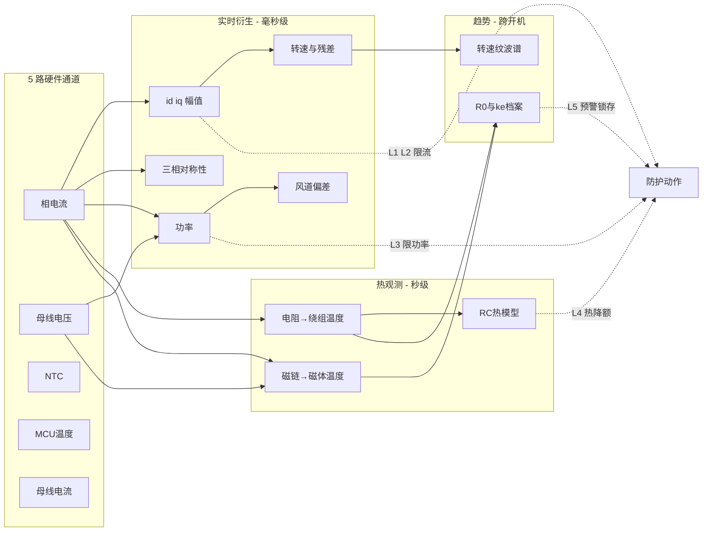

# 第 9 章 可观测量全景：把每一个能看见的物理量都变成防线

> 一条朴素的原则贯穿本章：**你只能保护你能看见的东西——防护体系的上限由可观测性决定**。这台机器的硬件观测通道其实很寒酸：几路电流采样、一路母线电压、一两颗 NTC，没有编码器、没有磁体温度计、没有振动传感器。但物理定律把所有量耦合在一起：电阻里藏着铜温、磁链里藏着磁体温度、功率-转速曲线里藏着风道状态、三相对称性里藏着绝缘状态、转速纹波里藏着轴承状态。**5 个硬件通道，衍生出 20+ 个软件观测量，每一个都能挂一道防护**。本章把它们全部枚举成矩阵——这张矩阵可以直接作为固件的保护需求文档。
>
> 数值沿用第 7、8 章实测参数：$R_{ph}$=6.1 Ω、$L_d/L_q$=0.30/0.635 mH、$\psi_f$=5.7 mWb（25 °C）、$p$=1、110 krpm、磁体红线 120 °C、绕组红线 110–115 °C、$P_{max}$=120 W。

---

## 9.1 第一层：直接测量量（硬件通道）

| # | 观测量 | 来源 | 本机正常范围 | 越界含义 | 防护动作（层级，第 7 章 §7.1）|
|---|---|---|---|---|---|
| D1 | 相电流瞬时值 $i_a,i_b,i_c$ | 采样电阻 + 运放/比较器 | 峰值 ≤1.2 A | >2.5 A：短路/失步/直通 | 硬件比较器逐拍封波（L1，不经软件）|
| D2 | 母线电压 $U_{dc}$ | 电阻分压 | 120–373 V（85–265 VAC）| >400 V：回馈/电网浪涌；<110 V：欠压 | 过压封波、欠压先降功率后停机（L3）；同时逐拍用于 PWM 归一化（P3）|
| D3 | NTC 温度（功率板/电机区/出风口，视实装）| NTC 分压 | <85 °C（板）/<95 °C（电机区）| 散热失效、堵塞后期 | 分级降额→封波锁定（L4）|
| D4 | MCU 结温 | 片内传感器 | <105 °C | 控制器自身过热 | 降额/停机（L4）|
| D5 | 母线电流 $I_{dc}$（若有 DC 母线采样电阻）| 采样电阻 | ≤1.3 A @100 VAC | 功率异常的独立旁证 | 与 D1 派生功率交叉校验（L3）|

**就这么多。下面所有观测量都是从这 5 路信号+物理模型里"无中生有"算出来的。**

## 9.2 第二层：实时衍生观测量（毫秒级）

| # | 观测量 | 计算方法 | 本机正常值 | 越界含义 | 防护动作 |
|---|---|---|---|---|---|
| S1 | $i_d,i_q$ | Clarke/Park（第 3 章）| $i_d\approx0$、$i_q\le$1.22 A | $i_q$ 顶格：过载/堵塞；$i_d$ 稳态偏移 >0.1 A：观测器角度劣化 | $i_q$ 钳位（L2）；$i_d$ 偏移报警并触发死区补偿自检 |
| S2 | 电流幅值 $i_s=\sqrt{i_d^2+i_q^2}$ | 同上 | ≤1.0 A 持续 | 热约束越界 | 稳态限幅 1.0 A、瞬态 1.3–1.5 倍限时（L2）|
| S3 | 转速 $\hat\omega$ | EEMF 观测器 + PLL（第 7 章 P9）| 0–110 krpm | >115%（126.5 krpm）：飞车；指令加速而 $\hat\omega$ 不升：失步 | 飞车立即封波（L3）；失步进入 P10 流程 |
| S4 | 观测器残差 | 估计与量测反电动势之差 | 小且平稳 | 持续超阈 >10 ms：角度失锁 | 失步处理：封波自由停车+冷却计时（L3）|
| S5 | 电功率 $P$ | $\tfrac32(u_di_d+u_qi_q)$，或 $U_{dc}\times I_{dc}$ | ≤120 W（P5 钳位）| 超限：越界工况 | 恒功率钳位（L3）——本案第一道救命防线 |
| S6 | 风道状态 $\Delta P$ | $P-P_{EOL}(\omega)$（EOL 标定曲线）| $|\Delta P|$<15 W | **高于曲线 20 W+：堵塞**（本机"越堵越费电"+散热崩塌，§8.3 事实二）| 立即降速/降额（L3），比温度爬升早 ~30 s |
| S7 | 调制比 $m$ | 电压指令幅值 ÷ $U_{max}$ | 低压端 ≤0.95；高压端 0.3–0.45 | 持续 >0.98：电压余量耗尽（低压端欠压逼近）| 降速保余量，防深度过调制失真（L3）|
| S8 | 三相电流对称性 | 基波幅值/相位三相比对 | 不平衡 <3% | 匝间短路早期、单相采样通道漂移 | 报警→复测→锁机报障（L3/L5）|
| S9 | 电流 THD/纹波 | 简化谐波检测（5/7 次含量）| 高压端 ≈ 低压端基线 ×(1~1.5) | 突增：死区补偿失效、采样异常、匝间异常 | 报警+触发自检（L3）|
| S10 | $I^2t$ 积分 | 电流平方对时间积分 | 不触顶 | 慢过载积累 | 分级降额（L4），与热模型互备 |
| S11 | 母线纹波幅值 | $U_{dc}$ 峰谷差 | ≈29 V @满载 [估计值] | 增大 50%+：母线电容老化（ESR/容量衰减）| 趋势记录+预警（L5）；纹波谷值同时喂给 P5 电压预算 |

## 9.3 第三层：两个"无传感器温度计"（秒级）——本章的核心资产

这台机器最要命的两条热红线（绕组 130 °C 系统级/磁体 120 °C）恰好都没有传感器。但物理定律免费送了两支温度计：

### 9.3.1 铜温度计：电阻即温度

$$\hat T_{cu} = T_0 + \frac{\hat R/R_{0}-1}{0.00393}$$

- $\hat R$ 来源：停机瞬间小电流实测（每次关机免费校准）、运行中 $i_d$ 低频小注入、或观测器融合辨识（第 7 章 §7.3.3，InstaSPIN Rs_online 思路）；
- $R_0$ 用**个体**产线标定值（±10% 公差被自动消化，第 7 章 §7.4.1）；
- 精度 ±5~8 K，响应秒级；与 RC 热模型互校（快通道+慢锚定）；
- **防护挂载**：$\hat T_{cu}$>95 °C 起降额、>110–115 °C 封波锁定（P11 降额表）。

### 9.3.2 磁体温度计：磁链即温度——规格书亲自标定好的

规格书给了 $k_e$ 的两点标定：0.0057 V/(rad/s) @25 °C、0.0052 @90 °C → 温度系数 −0.135%/K（与 §8.7 磁体报告 Br 系数 −0.113%/K 互洽）。反过来用：

$$\hat\psi_f = \frac{u_q - \hat R\,i_q}{\omega_e}\ \text{（稳态、}i_d\approx0\text{）},\qquad
\hat T_{mag} = 25 + \frac{1-\hat\psi_f/\psi_{f,25,个体}}{0.00135}$$

- 高速下精度可用：$u_q$ 中反电动势项 ≈65.7 V 远大于 $\hat R i_q$≈7 V，$\hat R$ 误差 10% 只带来 ~1% 磁链误差 ≈ **8 K** 磁体温度误差 [估计值]——作为趋势量与红线保护足够；
- 前提：死区补偿开启（否则电压重构污染）、$\psi_{f,25}$ 用个体 EOL 标定值；
- **防护挂载**：$\hat\psi_f$ 折算 >90 °C（≈0.0052）预警降一档；折算 >110 °C（≈0.00505）强降额；**>120 °C（≈0.00497）封波**——这支温度计直接守住 §8.7 结论里"主导风险是磁体温度腿"的那条红线；
- 与 §8.7 的呼应：42SH 方形度 98% 意味着退磁是无预警悬崖——所以这里必须用红线逻辑，不能用"看到衰减再说"的缓坡逻辑。

**两支温度计 + 一个 RC 热模型 + 若干 NTC，构成完整热观测：绕组（快）、磁体（慢）、功率板（NTC）、环境（NTC）——四个热节点全部可见，第 6 章 T1/T4 两大杀手全部处于监视之下。**

## 9.4 第四层：跨开机趋势观测量（天/月级）——老化与个体健康档案

每次开机 3 秒自学习（第 7 章 §7.4.2）顺带记录，flash 滚动日志，比较的是**同一台机器自己的历史**：

| # | 观测量 | 采集时机 | 漂移含义 | 动作 |
|---|---|---|---|---|
| T1 | 冷态 $R_0$@环温 | 上电自检 | 缓慢上升：绕组老化/引线接触劣化；三相不平衡突增 >3%：**匝间短路已发生** | 趋势预警；不平衡则锁机报障（拦截"带病运行拖炸 IPM"）|
| T2 | 个体 $k_e$（冷态）| 首次闭环稳速点采 $\hat\psi_f$ | 冷态下降 >4%：**不可逆退磁已发生**（§8.7 E5 判据的在线版）| 降额运行+报售后 |
| T3 | 空载/标准点电流 | 每次达到稳速 | 上升：轴承摩擦增大、异物、风道变化 | 趋势预警 |
| T4 | 启动时长 | I/F→闭环切换耗时 | 延长 >50%：摩擦↑或磁链↓ | 趋势预警 |
| T5 | 转速纹波谱 | 稳速时 $\hat\omega$ 的波动分量 | 1×/2× 机械频率成分增长：动平衡劣化、轴承磨损（第 5 章 FMEA #3#4 的在线代理）| 趋势预警；超限降最高档 |
| T6 | 故障事件统计 | 全程 | 某类故障重复：定位系统性问题 | N 次锁存；售后读码定位 |

这一层就是 §8.4 寿命推演的执行机构：规格书判据"转速/功率漂移 ±15%"由 T2/T3 在线监视，**让机器在越过 ±15% 之前就发出保养预警——损耗型失效从"用户遇到"变成"系统预告"**。

## 9.5 保护保护者：观测量自检

传感器也会说谎，防线依赖的每个观测量自身需要健康检查：

| 自检项 | 方法 | 免费程度 |
|---|---|---|
| 电流通道健康 | **基尔霍夫定律白送的**：$i_a+i_b+i_c\approx0$，持续偏离 = 某相增益/零漂坏 | 每个采样周期免费 |
| 电流零漂 | 上电未发波时应为零 | 每次开机免费 |
| $U_{dc}$ 合理性 | 变化率限幅（母线电容决定了它不可能跳变）+ 与整流理论值窗口比对 | 免费 |
| NTC 开路/短路 | 读数贴分压轨 = 断线/短路 → 视为最热档处理（fail-safe）| 免费 |
| 观测器一致性 | $\hat\omega$ 与 $i_q$、$P$ 的物理关系交叉验证（转速高而电流极小 = 观测器漂了）| 一行代码 |
| 温度计互校 | RC 热模型 vs 电阻法 vs NTC 三方残差监视，分歧超限报传感器故障 | 模型自带 |

**原则：任何观测量失效时，系统必须知道它失效了，并退到保守侧（fail-safe）**——NTC 断线当最热处理、电流通道异常立即封波，而不是带着瞎掉的眼睛继续跑。

## 9.6 盲区清单：看不见的，用什么兜底

诚实列出无法在线观测的量——它们必须由设计裕量、产线测试或代理量兜底：

| 盲区 | 为什么看不见 | 兜底手段 |
|---|---|---|
| 匝间绝缘的局放/电蚀进程 | 在线无法测局放 | 产线匝间冲击测试（EOL）+ 浸漆/漆膜等级设计裕量（第 6 章 S2）+ T1 三相对称性抓"已发生"|
| IPM 结温 | 无内置传感 | NTC 壳温 + 开关损耗模型外推 [估计值] + 保守降额 |
| 轴承油脂状态 | 无法直接测 | T3/T5 代理量 + §8.4 寿命包络 + 供应商油脂寿命曲线（§8.6 追问）|
| 连接器温度（85 °C 上限）| 无测点 | 设计验证阶段热电偶实测定裕量，量产靠设计余量 |
| 638 胶水强度衰减 | 无法在线测 | 150 °C 强度曲线 + 磁体温度计控温间接保护 + 超速验证裕量 |

## 9.7 汇总：观测-防护全景图

一句话总结本章：**5 路廉价采样，经物理模型放大成 25 个观测量，覆盖电-磁-热-机械-老化五个域；每个观测量挂一道防护、每道防护有自检、每个盲区有兜底**。把 §9.1–9.6 的六张表逐行落进固件与产线，第 6 章的每一种死法都至少有一双眼睛盯着——这就是"从所有可观测物理量做好防护"的完整答案。

## 参考资料

1. 本书第 3 章（坐标变换与观测器）、第 5 章（FMEA 与保护策略）、第 7 章（五层防线与参数）、第 8 章（实测参数、磁体温度系数标定、退磁边界）。
2. TI SPRUHJ1（Rs_online）、VESC 固件（分层限幅与故障处理）——观测量驱动保护的开源参考实现。
