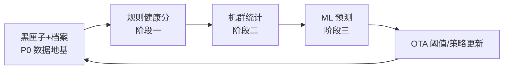

# 附录 C 立即行动清单与"电机安全健康引擎"路线图

> 本附录回答两个问题：**C.1** 现在马上能做什么（按是否需要源码分组，含"提供源码后可获得什么"）；**C.2** 全案中最有长期价值、可用于客户沟通、可持续迭代的能力——特别是模型与 AI 部分的三阶段路线图。

---

## C.1 立即行动清单

### C.1.1 不需要源码（今天可启动）

| 事项 | 耗时 | 产出 | 出处 |
|---|---|---|---|
| 返修机抢救取证：三相电阻对称性 + 冷态 $k_e$ + 拆机拍照分流 | ~30 min/台 | 根因统计；$k_e$ 低 >4% = 退磁棘轮实锤 | 附录 B P0-1 |
| 示波器量电机端子 PWM 电平 | 10 min | 裁决 140–180 VDC 架构问题 | §8.6 头号项 |
| 读固件实配：$f_{PWM}$、死区、采样拓扑、Q 值真实实现 | 半天 | 澄清会议矛盾 + 修正损耗账份额 | §12.1.3 |
| 供应商对齐会：142 W 红线、265 V 角点、油脂寿命曲线、磁环退磁电流 | 一次会议 | 规格合规 + 责任边界 | §8.3/§8.6 |
| 28/29 验证日增补三实验：恒功率 A/B、$f_{PWM}$ 扫频、死区 A/B | 并入既有排期 | 根因分账 + 最优载波 + 可回收瓦数 | 附录 B P0-3 |

### C.1.2 需要源码的立即优化（按性价比排序）

| # | 改动 | 规模 | 预期效果 |
|---|---|---|---|
| 1 | 恒功率钳位（全电压统一上限） | 几行 | 高压端 +20 W 当天消失，风险立降大半 |
| 2 | $f_{PWM}$ 高压端调度（48→64/96 kHz） | 配置级 | 马达侧回收 5–10 W，热从转子移到板 |
| 3 | 热模型替换"单秒 Q 值"（一阶模型 τ=180 s、$I_{cont}$=0.75 A rms 初值） | ~百行 | 分钟级热积累可见，会议待办第 1 项的正确实现 |
| 4 | 死区补偿 + 电流环 $U_{dc}$ 归一化（若缺失） | ~百行 | 再回收 1–3 W；高压端环路特性一致 |
| 5 | 上电三相对称自检 + 故障数据冻结（黑匣子最小版） | 各几十行 | 拦截带病启动；保住故障现场 |

### C.1.3 提供源码后可额外获得的

把固件源码（最少：MCU 型号与 SDK、FOC 中断服务、保护模块、参数头文件、电流采样拓扑）放入本仓库后，可交付：

1. 现有 Q 值/保护逻辑的**代码级审查报告**（会议中"跨秒与否"的矛盾一查便知）；
2. 上表 5 项优化的**可合入补丁**（含第 7 章 12 参数初值直接填入参数表）；
3. 观测器现状评估（是否表贴模型误用于凸极机、是否有延迟补偿）与 EEMF 改造方案；
4. 黑匣子完整版（环形缓存+故障冻结+趋势档案字段，按 §9.4 清单）。

无源码时的替代交付：按峰岹/凌鸥/中微类电机 SoC 典型结构编写的参考实现模块（C 语言），由固件工程师适配。

---

## C.2 "电机安全健康引擎"：最有长期价值的能力与 AI 路线图

### C.2.1 四个核心资产（客户沟通的骨架）

| 资产 | 一句话客户话术 | 技术实体 | 竞争壁垒 |
|---|---|---|---|
| **虚拟温度传感器** | "不加任何硬件，实时监测电机最脆弱两个部位的温度" | 电阻→绕组温度（±5–8 K）；磁链→磁体温度（规格书 −0.135%/K 两点标定反演） | 零 BOM 成本；物理可解释；§9.3 |
| **Thermal Governor** | "峰值性能是被验证和管理的能力，不是赌运气的标称值" | 冷机满血 110 krpm，热态 PI 稳温 105 °C 平台，−5% 转速换 −14% 发热 | 性能与安全兼得；§11.3 |
| **个体健康档案** | "每台机器认识自己：出厂指纹 + 每次开机自检 + 终身趋势" | EOL 基线写入、上电 3 秒自学习、跨开机 R₀/$k_e$/纹波谱档案 | 公差被软件消化；老化与退磁提前预警；§7.4/§9.4 |
| **黑匣子 + 机群飞轮** | "故障不再靠猜：单机留现场，机群出规律，阈值持续进化" | 故障冻结记录 + 批次统计 + OTA 阈值更新 | 数据护城河，越用越准；附录 B |

四句话合成一个叙事：**故障前可预防、故障中可保护、故障后可追溯、全生命周期可学习。**

### C.2.2 AI 三阶段路线图（安全永远由规则执行，AI 负责洞察）

**第一阶段：可解释规则健康分（现在就能做，MCU 端）**

- 输入 ≈20 个物理特征（§9 观测量矩阵）：R₀/$k_e$ 偏移、三相不平衡趋势、启动时长、同转速电流、温升速度、governor 介入时长、降载/过流/堵风次数、热循环数、I²t 越限统计；
- 输出健康分 + **人话解释**（"绕组一致性下降 12%""散热能力较出厂衰退 20%"），而非神秘数字；
- 全部在 MCU 端可算，特征同时写入档案——**为后续 ML 无成本地积累标注数据**。

**第二阶段：统计异常检测（黑匣子数据积累 3–6 个月后，App/云端）**

- 个体相对出厂基线的偏移分析、R₀/$k_e$ 趋势的变化点检测；
- 批次内离群识别（同批分布 z-score）→ 供应商质量管理的量化依据；
- 阈值回归优化：用机群真实分布替代拍脑袋门限，OTA 下发。

**第三阶段：ML 故障预测（有标注故障样本后）**

- 剩余健康等级（生存分析类模型）、故障模式分类（绕组/轴承/IPM/堵风缠绕）、批次系统性风险预警；
- 边界原则：**AI 输出风险评分与建议，停机/降载动作永远由可验证的物理规则执行**——这对审核严格的大客户（如戴森类）是可信度关键。

### C.2.3 数据飞轮的启动顺序（为什么 P0 是地基）

没有 P0 的黑匣子与个体档案，后面全部是空中楼阁（无标注、会被覆盖、无基线）——这正是附录 B 把"抢救返修机数据"排在所有事之前的原因。

### C.2.4 对客户的一段完整表述（可直接引用）

> 我们把传统的"故障后停机"升级为完整的电机安全健康引擎：产品在不增加任何传感器的前提下，实时软测量绕组与磁体温度；峰值性能由温度闭环管理——冷机全速、热态平滑整形，用户无感而温度永不越线；每台电机拥有出厂指纹与终身健康档案，老化与退磁在用户察觉之前就被预警；即使发生故障，黑匣子也会保留完整现场。所有这些数据汇入机群分析，让保护阈值和健康模型随着装机量持续进化。安全动作始终由可解释、可验证的物理规则执行，AI 负责预测与洞察——这是一套可以被最严格的客户审计通过的架构。

## 参考资料

本书第 7/9/11 章（技术实体）、附录 B（优先级依据）、第 12 章（行动清单框架）。
