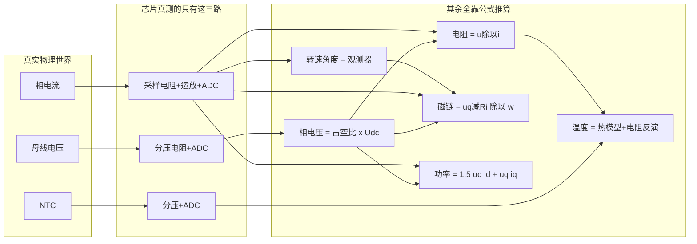
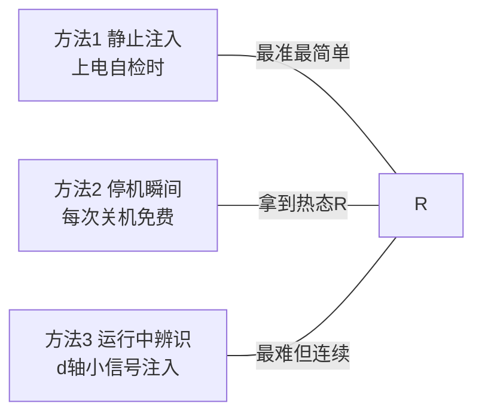
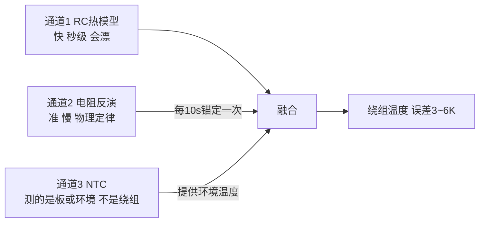

# 附录 D 物理量测量与估算手册：从万用表到固件

> 本手册把电机控制里的每一个物理量——电压、电流、电阻、磁链、转速、功率、温度、电感——逐个讲清四件事：**① 它是什么（比喻）；② 真实世界里怎么测量；③ 程序（固件）里怎么估算、有几种方法；④ 会引入什么误差、差多少、怎么修正**。所有数值以案例机为准（凌鸥 LKS32MC 平台、相电阻 6.1 Ω、110 000 rpm）。
>
> 开始前先建立一个总画面——**水路比喻**，后面每个量都能挂上去：
>
> | 电学量 | 水路比喻 |
> |---|---|
> | 电压 $U$ | 水压（水塔有多高）|
> | 电流 $I$ | 水流量（每秒流过多少水）|
> | 电阻 $R$ | 水管的细窄程度（越细越费劲、越发热）|
> | 功率 $P$ | 水冲水车的劲（$P=U\times I$：水压×水量）|
> | 磁链 $\psi_f$ | 转子磁铁的"力气大小" |
> | PWM | 每秒开关 48000 次的水龙头，用开:关的比例调平均水压 |
>
> 总原则一句话：**程序里几乎没有"直接测量"，大多是"少数几个真测量 + 物理公式推算"**。芯片真正测的只有三样：采样电阻上的电压（→电流）、分压后的母线电压、NTC 电阻（→板温）。其余全部是算出来的——所以每个算出来的量都要问一句"误差从哪来、差多少、怎么修"。

---

## D.1 电压 U —— 水压

### 真实世界怎么测

- **母线电压 $U_{dc}$**：万用表直流档，表笔搭母线电容两端。案例机：100 V 市电整流后 ≈141 V，230 V 后 ≈325 V。⚠️ 高压危险：单手操作、先断电放电再接线；
- **电机相电压**：万用表测不准！因为它是 PWM 斩出来的方波序列（每秒 48 000 个脉冲），万用表只会给一个意义不明的数。要看真相必须用**示波器 + 差分探头**——你会看到一串高度=母线电压的窄脉冲，脉冲的"宽窄比"（占空比）才是有效信息。

### 程序里怎么估

| 量 | 方法 | 公式 |
|---|---|---|
| $U_{dc}$ | 电阻分压后 ADC 采样 | $U_{dc}=\text{ADC读数}\times\dfrac{R_{上}+R_{下}}{R_{下}}\times\dfrac{V_{ref}}{4096}$ |
| 相电压 | **不测，重构**：程序知道自己发了多宽的脉冲 | $u=\text{占空比}\times U_{dc}$ |

参数解释：$R_{上}/R_{下}$=分压电阻（把 400 V 缩到 ADC 能吃的 3.3 V 以内）；$V_{ref}$=ADC 基准电压；4096=12 位 ADC 的满量程格数。

### 误差与修正

| 误差源 | 量级 | 修正方案 | 修正后 |
|---|---|---|---|
| 分压电阻精度（1% 电阻两只）| ±1.5% | 产线一点标定：接已知电压，写校准系数进 flash | ±0.5% |
| ADC 基准漂移 | ±0.5~1% | 同上标定吸收 | — |
| 母线纹波混叠（100 Hz 大波动）| 判故障误动作 | **双滤波双用途**：判过欠压用慢滤波值，PWM 归一化用当拍值——两个变量，别共用 | 消除 |
| **相电压重构的死区误差（重点！）** | 高压端 ~12 V/72 V ≈ **17%** | 死区补偿（按电流方向加回被吃掉的伏秒）| **2~3%** |

死区误差是什么：为防上下管同时导通"短路"，每次开关都留 0.8 μs 谁都不开的空档。这个空档每秒发生 48 000 次，平均"偷走"的电压 ≈ $U_{dc}\times t_d\times f_{PWM}$ 量级——母线越高偷得越多，**这就是高压端一系列问题的根源之一**，也是后面测电阻、估磁链全部要先做死区补偿的原因。

---

## D.2 电流 I —— 水流量

### 真实世界怎么测

- **不能**拿万用表串进相线——相电流是 1833 Hz 的交流+48 kHz 纹波，万用表带宽不够；
- 正确工具：**电流探头 + 示波器**（能看到波形好坏：正弦度、过零平顶、纹波毛刺——第 10 章 E-C 波形取证靠它）；
- 简易替代：万用表直流档串在**母线**上测平均母线电流，×母线电压 ≈ 逆变器输入功率，够用来对账。

### 程序里怎么估

电流流过一只很小的**采样电阻**（如 20 mΩ），产生微小电压（0.8 A × 0.02 Ω = 16 mV），运放放大约 100 倍后 ADC 读取：

$$I = \frac{\text{ADC电压} - V_{偏置}}{G \times R_{shunt}}$$

参数：$R_{shunt}$=采样电阻值；$G$=运放增益；$V_{偏置}$=零电流时的输出（通常设在量程中点，这样正负电流都能测）。

### 误差与修正

| 误差源 | 量级 | 修正方案 | 修正后 |
|---|---|---|---|
| 零漂（运放失调随温度变）| ±10~30 mA（对 0.8 A 是 2~4%）| **每次上电、发波前采 64 次平均作零点**（参考实现 P2）| ±3 mA |
| 增益误差（电阻+运放公差）| ±2~3% | 产线已知电流源标定一次写 flash | ±0.5~1% |
| **采样时刻错误（重点！）**：在开关瞬间采样会采到尖峰 | 可达 ±20% 且随机 | 采样触发对齐 **PWM 计数器中点**（离开关沿最远处）| 基本消除 |
| 某一相通道故障 | 保护失明 | 免费自检：**三相电流之和恒等于 0**（基尔霍夫定律白送的），持续偏离即报传感器故障 | fail-safe |

---

## D.3 电阻 R —— 水管的细窄程度（兼职免费温度计）

### 真实世界怎么测

万用表欧姆档搭电机两个端子——读到的是**线间电阻**（两相串联）：案例机 12.2 Ω → 相电阻 = 12.2/2 = **6.1 Ω**。注意：

- 表笔接触电阻几十 mΩ，对 12 Ω 影响 <1%，可忽略（对更小的电机要用四线法）；
- **热态电阻测不到**——停机后拆线的几十秒里绕组已经冷了。裁判方法是"停机瞬间法"：停机 1 秒内由驱动板自己注入小电流测（见下）。

### 程序里怎么估——三种方法

**方法 1/2（静止注入，参考实现 selftest.c）**：电机不转时，用电流闭环给绕组注入固定小电流（0.3 A），稳定后读"施加的电压 ÷ 电流"：

$$R = \frac{u_d}{i_d}\quad(\text{静止时没有反电动势、没有电感压降，信号 100\% 是电阻})$$

**方法 3（运行中）**：转起来后电压大头被反电动势占据（65.7 V 里电阻压降只有 ~7 V，占 10%）——会上"运行中估阻信噪比差"说的是这种情形，判断正确；但方法 1/2 完全绕开了它。

### 误差与修正（本手册最重要的一张表）

静止注入时的电压 $u_d$ 是**重构值**（占空比×$U_{dc}$），0.3 A×6.1 Ω 只有 1.8 V，而死区能偷走 0.5~1 V：

| 方案 | 误差 | 换算成温度误差 |
|---|---|---|
| 裸测（无任何修正）| **30~50%** ← 不可用 | ±80~130 K，荒谬 |
| + 死区补偿 | 5~8% | ±13~20 K |
| + **双电流点差分法**：测 0.2 A 和 0.4 A 两点，$R=\dfrac{u_2-u_1}{i_2-i_1}$——固定的死区偏差被减法消掉 | **2~3%** | **±5~8 K** ✓ |
| + 个体出厂标定 $R_0$（±10% 公差不标定 = ±13 K 幻影温度，仿真场景 C 实测）| 消系统偏差 | 温度计可用 |

电阻→温度的公式（铜的物理属性，全世界通用）：

$$T = T_0 + \frac{R/R_0 - 1}{0.00393}\qquad\text{铜每升温 1 度，电阻涨 0.393\%}$$

参数：$R_0$=该个体在温度 $T_0$（如 25 °C）时的标定电阻。**R 测准 1%，温度就准 2.5 K**——这就是"免费绕组温度计"的全部原理。

---

## D.4 反电动势常数 / 磁链 ke、ψf —— 磁铁的力气（兼职磁体温度计）

### 真实世界怎么测

**反拖法**：不通电，用外力（另一台电机、手电钻夹轴、甚至气流）带着转子转，示波器看端子上发出来的电压——转得越快电压越高，比值就是 $k_e$：

$$k_e = \frac{\text{相电压幅值}}{\text{机械角速度}}\qquad \text{供应商在 28\,000 rpm 下测得 } 0.0057\ \mathrm{V/(rad/s)}$$

本机 $p=1$，磁链 $\psi_f = k_e = 5.7$ mWb。**返修机测这个值是判退磁的一锤定音手段**（比出厂值低 4% 以上=磁体已受损）。

### 程序里怎么估

运行中反推（第 9 章磁链温度计）：

$$\hat\psi_f = \frac{u_q - R\,i_q}{\omega_e}$$

参数逐个讲：$u_q$=q 轴电压（重构值，反电动势的主要去向）；$R\,i_q$=电阻上消耗的那部分电压（~7 V，小头）；$\omega_e$=电角速度（观测器给出）。直觉：**总电压里扣掉电阻吃掉的，剩下全是磁铁产生的反电动势；除以转速就是磁铁力气**。

磁链→磁体温度（规格书两点标定：25 °C 时 0.0057、90 °C 时 0.0052 → 每度掉 0.135%）：

$$\hat T_{mag} = 25 + \frac{1-\hat\psi_f/\psi_{f,25}}{0.00135}$$

### 误差与修正

| 误差源 | 量级 | 修正 |
|---|---|---|
| $u_q$ 重构误差（死区）| 补偿后 ~2% → ψ 误差 ~2.2%（因 $u_q$ 是分子主项）| 死区补偿是前提 |
| $R$ 误差 10% | 只造成 ψ 误差 ~1%（因 $Ri_q$ 只占 10%）——高速下这个温度计天生皮实 | 用 D.3 的在线 R |
| 个体 $k_e$ 公差 ±10% | 不标定 = ±74 K，荒谬 | **个体出厂标定 $\psi_{f,25}$**（EOL 反拖测一次写 flash）|
| 综合绝对精度 | **±10~20 K** | 红线设计时留足裕量（105 °C 平台 vs 120 °C 红线）|
| 综合**趋势精度**（同一台自己跟自己比）| **±5 K** | 退磁棘轮监测用趋势模式，很灵 |

---

## D.5 转速与角度 ω、θ —— 转多快、转到哪

### 真实世界怎么测

- 激光转速计打反光贴——但 Φ8 mm 高速转子贴不上也不安全；
- **最实用的方法：示波器看相电流的频率**。本机 2 极（$p=1$），电流每变化一个周期=转子转一圈：$rpm = f_{电流}\times 60$。看到 1833 Hz 就是 110 000 rpm。

### 程序里怎么估

无传感器观测器（第 3 章）：把测到的电流、发出的电压代入电机方程，反解"转子现在指向哪"。像闭着眼睛推购物车——手上的力（电压）和车的反应（电流）能告诉你车头朝向。

### 误差与修正

| 误差源 | 量级 | 修正 |
|---|---|---|
| 稳态转速误差 | <0.5%（PLL 锁定后）| 无需 |
| **计算延迟角度差**：从采样到电压生效隔了 1.5 个 PWM 周期，转子已多转 | 本机 **21° 电角度**（若按初稿 4 极假设是 42°——极数搞错会灾难）| 一行补偿：$\theta += 1.5T_s\omega_e$ |
| 死区污染角度估计 | 数度级、随负载变 | 死区补偿 |
| 是否估准的**体检指标** | — | 稳态 $i_d\approx0$：角度准时 d 轴电流应为零，持续偏离=角度歪了 |

---

## D.6 功率 P —— 水冲水车的劲

### 真实世界怎么测

- **整机**：墙上插功率计（几十元的插座式即可）——供应商 PQ 报表的"功率"列就是它；
- **电机端**：需要功率分析仪（PWM 波形要求高带宽），一般公司不必买——用"整机功率 − 已知板损"够用；
- **轴功率（真正做的功）**：直接测要测功机；工程替代=同转速同风道下功率不变的性质（附录 A 的减法记账）。

### 程序里怎么估

$$P_{电} = \tfrac32\,(u_d i_d + u_q i_q)$$

系数 3/2 的来历：我们用的坐标变换保持"幅值不变"，三相功率换算到 dq 坐标要乘 3/2（第 1 章已注明全书约定）。误差=电压重构+电流测量的叠加 ≈ **3~5%**（补偿后）。修正与互校：若板上有母线电流采样，$U_{dc}\times I_{dc}$ 是第二本账，两本账持续对不上=某路传感器漂了（观测量自检，§9.5）。

---

## D.7 温度 T —— 最终要守的量

### 真实世界怎么测

| 方法 | 能测什么 | 注意 |
|---|---|---|
| 热电偶（K 型细丝）| 绕组端部/铁芯/IPM 壳——**标定实验的裁判** | 要点胶固定+电气绝缘；引线别被转子打到 |
| 红外测温枪 | 只能看外壳表面 | 内部绕组比壳热 10~20 K，勿直接当真 |
| **停机瞬间电阻法** | 绕组**平均**温度，最准的非接触裁判 | 停机 1 s 内完成（D.3 方法 2）|

### 程序里怎么估——三通道融合（参考实现 thermal_model.c，仿真验证误差 3.3 K）

好比：通道 1 是"根据吃了多少饭推算体重"（快但会越推越偏），通道 2 是"每 10 秒真上一次秤"（准但慢），互相校正后既快又准。误差预算：模型参数偏差 ±20% 时，纯模型漂 15.6 K，锚定后 **3.3 K**（仿真场景 C 实测）。

---

## D.8 电感 L —— 电流的"惯性"

### 真实世界怎么测

LCR 电桥，1 kHz 档测线间——**慢慢转动转子，读数会在 0.6 mH 和 1.27 mH 之间来回变化**：这就是凸极性（$L_d\ne L_q$）的直观证明，也是规格书给两个值的原因。

### 程序里怎么用

一般**不在线估算**，直接用出厂值。它影响两处：电流环增益 $K_p=L\omega_{cc}$（L 错 20% → 响应变快/慢 20%，但不失稳）；前馈解耦项（本机该项只有 ~9 V，小头）。**真正要紧的是别把凸极机当表贴机**——观测器模型要用 EEMF（§8.5），否则角度有系统性偏差。

---

## D.9 总表：一页看全

| 量 | 真实世界 | 程序世界 | 裸误差 | 修正后 | 关键修正手段 |
|---|---|---|---|---|---|
| $U_{dc}$ | 万用表直流档 | 分压+ADC | ±2~3% | ±0.5% | 一点标定 |
| 相电压 | 差分探头+示波器 | 占空比×$U_{dc}$ 重构 | ~17%(高压端) | 2~3% | **死区补偿** |
| 相电流 | 电流探头+示波器 | 采样电阻+运放+ADC | ±5~20% | ±1% | 零漂校准+中心采样+产线标定 |
| $R$ | 万用表(线间÷2) | 静止注入 $u/i$ | 30~50% | **2~3%** | 死区补偿+**双点差分**+个体标定 |
| $\psi_f/k_e$ | 反拖+示波器 | $(u_q-Ri_q)/\omega_e$ | ±10%+ | 趋势±5K级 | 个体标定+死区补偿 |
| $\omega,\theta$ | 电流频率×60 | 观测器 | 角度可差 21°+ | <0.5%, 数度 | 延迟补偿+EEMF |
| $P$ | 墙上功率计 | $1.5(u_di_d{+}u_qi_q)$ | 5~8% | 3~5% | 上游全部修正的红利 |
| $T$ | 热电偶/停机电阻法 | 三通道融合 | 漂 15K+ | **3~6K** | 电阻锚定 |
| $L$ | LCR 表(转转子看变化) | 用出厂值 | ±10~15% | — | 别当表贴机即可 |

**贯穿全表的三个"万能修正"**——值得背下来：

1. **死区补偿**：相电压重构、测电阻、估磁链、观测器角度的共同前提，一项修正救四个量；
2. **个体标定**（零漂/增益/$R_0$/$k_e$）：把 ±10% 的出厂公差从每个推算量里拔掉——"每台机器用自己的尺子"；
3. **双通道互校**：模型+测量、电功率+母线功率、三相和=0——**每个重要的量都要有第二条路来对账**，对不上就是有传感器在说谎。

## 参考资料

本书第 3 章（观测器与坐标变换）、第 7 章（P2/P3 参数与自检）、第 8 章（规格书实测值）、第 9 章（观测量矩阵与自检）、附录 A（能量账本）；参考实现 `ref-impl/`（selftest.c 双点差分接口、thermal_model.c 三通道融合，仿真 15/15 验证）。
