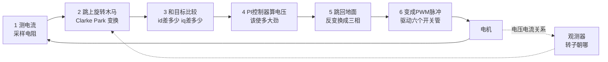
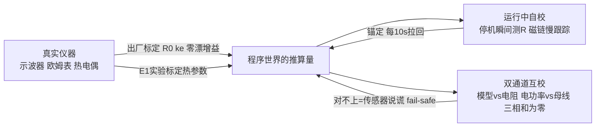

# 附录 E 小白版 FOC 与调参修误差手册

> 这一篇假设你从零开始。第一部分用比喻讲清 FOC 到底在干什么；第二部分把附录 D 的物理量变成**动手操作**：按顺序调哪些参数、每个参数的数值从哪个物理量来、怎么知道调对了、调错了长什么样；第三部分是一页速查表。全部数值用案例机实测参数（凌鸥平台、相电阻 6.1 Ω、$L_q$ 0.635 mH、110 000 rpm）。

---

## E.1 FOC 到底在干什么（零基础版）

### E.1.1 核心任务：用"胡萝卜"牵着磁铁跑

转子是一块磁铁。想让它转，办法只有一个：**在它前方制造一个吸引它的磁场，并且这个磁场要一直跑在它前面**——就像在驴前面吊胡萝卜。三个关键事实：

1. **拉力什么时候最大？** 胡萝卜在驴正前方偏 90° 时（磁场垂直于磁铁）。角度不对，一部分力气就浪费在"拽着驴原地打转"上；
2. **胡萝卜怎么造？** 定子上有三组线圈（三相），像三个人从三个方向推旋转门——只要三个人的力气按正弦规律此起彼伏，合力就是一个**可以指向任意方向的磁场箭头**；
3. **FOC 的全部工作**就是每秒几万次地回答一个问题：**"驴现在朝哪？把胡萝卜放到它前方 90° 去。"**

### E.1.2 两个天才发明：旋转坐标系和"没用/有用"分解

问题：三相电流是快速变化的交流量（本机每秒变化 1833 次），直接控制像在高速旋转的旋转木马边上给马喂食——手忙脚乱。

**发明一（坐标变换）：跳上旋转木马。** 数学上"跳到转子背上"看世界（Clarke/Park 变换），旋转的交流量瞬间变成两个安静的直流量——控制难度从"打移动靶"降为"打固定靶"。

**发明二（d/q 分解）：把电流分成"没用的"和"有用的"。**

| 分量 | 方向 | 作用 | FOC 的目标 |
|---|---|---|---|
| $i_d$ | 指向磁铁（径向）| 只会白白发热、还可能给磁铁退磁 | **压到 0** |
| $i_q$ | 垂直于磁铁（切向）| 全部变成转矩（就是那 90° 的拉力）| **刚好等于需要的大小** |

所以整个 FOC 可以概括成一句话：**每个瞬间搞清转子朝向，然后让电流"全部有用（$i_q$）、毫不浪费（$i_d$=0）"。**

### E.1.3 没有传感器，怎么知道转子朝哪？

本机没有位置传感器（无感）。办法是"闭眼推购物车"：你手上使的力（发出的电压）和车的反应（测到的电流）之间的关系，泄露了车头的朝向——转子转动时会发电（反电动势），这个"发的电"藏在电压电流方程里，观测器把它解出来，角度就有了。代价是三个先天弱点，也是后面调参的重点：**低速时发电太弱看不清**（所以要 I/F 盲启）、**计算有延迟**（所以要补 21°）、**电压是重构的**（所以死区补偿是命根子）。

### E.1.4 完整循环（每秒 48 000 次）

---

## E.2 调参手册：按这个顺序做，每步有验收标准

**总原则：先校尺子，再调快环，再调慢环，最后上保护。** 顺序错了，后面全是白调。

### 第 0 步 校准尺子（不校准，一切免谈）

| 做什么 | 怎么做 | 验收 |
|---|---|---|
| 电流零漂 | 上电、未发波时采 64 次取平均当零点（每次开机自动）| 静止时读数 = 0 ± 3 mA |
| 电流增益 | 产线用已知电流源标定一次写 flash | 误差 <1% |
| 母线电压 | 产线已知电压标一点 | 误差 <0.5% |
| 个体 R₀、$k_e$ | 产线测了写 flash（附录 D：不标定 = ±13 K 幻影温度）| 存档可查 |

**调错的症状**：低速电流波形不对称、转矩忽大忽小、同一批机器表现离散。

### 第 1 步 电流环 PI（系统的"手速"）

**公式与来历**（教科书零极点对消，第 7 章 P3）：

$$K_p = L \times \omega_{带宽},\qquad K_i = R \times \omega_{带宽}$$

- $L$：电流的"惯性"——惯性越大，需要越大的 $K_p$ 去推。本机实测 $L_q$=0.635 mH、$L_d$=0.30 mH，**凸极机 d/q 要分开调**；
- $R$：电阻决定稳态误差消除的快慢，配 $K_i$；
- $\omega_{带宽}$：你想要的"手速"，本机取 4 kHz（≈25 100 rad/s）——比电频率快一倍以上、比 PWM 慢十倍以上。

**本机代入**：$K_{p,q}$=0.635m×25 100≈**16 V/A**、$K_{p,d}$≈**7.5 V/A**、$K_i$=6.1×25 100≈**1.53×10⁵ V/(A·s)**。

**必做的一件事：除以当拍母线电压再写占空比**——不做的话，按低压端调好的手速到高压端会放大 2.4 倍（电流振铃、异响、多发热）。

**验收**：堵转下打 $i_q$ 阶跃，上升 ~90 μs、超调 <10%；**90 V 和 264 V 输入下响应曲线重合**。
**调错症状**：$K_p$ 大→高频啸叫/振铃；$K_p$ 小→加速软绵绵；没做电压归一→只在高压端出问题。

### 第 2 步 死区补偿（一项修正救四个量）

死区每次开关"偷"一点电压，高压端偷得凶（占需求的 17%）。按电流方向把偷走的伏秒加回去，过零 ±50 mA 内线性过渡。
**验收**：示波器看相电流过零——平顶消失、THD 回到低压端水平。
**不做的症状**：高压端电流畸变、观测器角度晃、测电阻/估磁链全部失准。

### 第 3 步 启动三参数（无感的"盲launch"）

| 参数 | 本机初值 | 来历 | 调错症状 |
|---|---|---|---|
| I/F 电流 | 0.4–0.5 A | 克服静摩擦 ×1.5 裕量 | 太小→偶发启动失败；太大→启动顿挫、白发热 |
| 频率斜坡 | 按 $T/J$ 的 30–50% | 转子跟得上的加速度 | 太陡→启动啸叫、失步 |
| 切换转速 | 15–20% 额定 | 反电动势 ≥3 倍死区失真时观测器才可信 | 太早→切换瞬间电流尖峰；太晚→I/F 段白热 |

### 第 4 步 观测器（"闭眼推车"的精度）

- **延迟补偿**：从采样到电压生效隔 1.5 个 PWM 周期，转子已多转 **21° 电角度**——一行代码补上 $\theta{+}{=}1.5T_s\omega_e$；
- **凸极修正**：本机 $L_q/L_d$≈2.1，观测器要用 EEMF 模型（把表贴机公式用在它身上=角度系统性歪）；
- **体检指标（背下来）**：稳态时 $i_d\approx0$。$i_d$ 持续不为零 = 角度歪了 = 正在白白发热。

### 第 5 步 保护参数（每个数字的来历一句话）

| 参数 | 本机值 | 来历 |
|---|---|---|
| 硬件逐拍限流 | 2.5 A | 正常峰值 1.13 A×2.2，且低于磁体退磁电流（§8.7 有大裕量）与 IPM SOA |
| 恒功率钳位 | 120 W（短期全电压统一）| 供应商 142 W 寿命红线 + Φ29/125 W 功率密度折算（§7.0.3）|
| 温度介入/平台/封波 | 95 / 105 / 115 °C | 磁体 120 °C 红线 −10 K 耦合裕量 −5 K 模型误差（§8.2.3）|
| 过压/欠压 | 400 / 110 V | 264 VAC 峰值 373 V 留纹波余量；90 VAC 谷值下限 |
| 堵转判据 | <5% 转速 & >80% 电流 & 0.5 s | 三条件与运算防误判 |

### 第 6 步 误差修正的"收敛闭环"（你上一轮总纲的操作版）

三层收敛，各管一段：**出厂标定**消个体公差（一次性）；**运行锚定**消模型漂移（持续，仿真验证 15.6 K→3.3 K）；**互校**抓传感器失效（兜底）。只要真实测量无偏（第一层保证）、锚定增益为正（第二层保证），误差就数学上必然收敛——这就是"估算算法足够好"的工程定义。

---

## E.3 一页速查表（贴工位版）

| # | 参数 | 本机初值 | 来源物理量 | 验收判据 | 调错症状 |
|---|---|---|---|---|---|
| 0 | 零漂/增益/R₀/$k_e$ 标定 | 产线写入 | 附录 D | 静止读零、档案在 | 波形不对称、批间离散 |
| 1 | $K_{p,q}$ / $K_{p,d}$ | 16 / 7.5 V/A | $L_q,L_d$×带宽 | 阶跃 90 μs 无振铃 | 啸叫(大)/绵软(小) |
| 2 | $K_i$ | 1.53×10⁵ | $R$×带宽 | 稳态无静差 | 电流爬不到目标 |
| 3 | 电压归一化 | ÷当拍 $U_{dc}$ | $U_{dc}$ | 90/264 V 响应重合 | 只在高压端振铃 |
| 4 | 死区补偿 | $t_d$=实配值 | $t_d,U_{dc}$ | 过零无平顶 | 高压端畸变、测R失准 |
| 5 | I/F 电流/斜坡/切换点 | 0.45 A / — / 15–20% | 摩擦、$J$、死区失真 | 20 连启成功 | 启动失败/尖峰/啸叫 |
| 6 | 延迟补偿 | 21° | $T_s,\omega_e$ | 全速段 $i_d\approx0$ | 高速电流偏大 |
| 7 | 逐拍限流 | 2.5 A | IPM SOA、退磁边界 | 堵转触发一次实测 | 炸管(高)/误触发(低) |
| 8 | 功率钳位 | 120 W | 142 W 红线、功率密度 | 两角点功率相等 | 高压端过热 |
| 9 | 温度三阈值 | 95/105/115 °C | 磁体 120 红线链 | 角点实验平台 ≤105 | 烧机(高)/性能损失(低) |
| 10 | 过欠压 | 400/110 V | 整流峰谷 | 拉偏实测 | 炸管/低压烧 |

**最后一句给小白的话**：这张表上每个数字都不是"经验值"，都是从某个物理量一步推出来的——**忘了数字没关系，记住推导路径，任何一台新电机你都能自己把表填出来**。这正是这本书想教会的事。

---

## E.4 无感估计的深入理解：MCU 里住着一台"数字双胞胎电机"

没有位置传感器时，观测器的本质是：MCU 内部用**预设的 R、L** 跑一台虚拟电机，施加与真机相同的电压，比较预测电流与实测电流——两者的差只可能来自模型里唯一未知的东西：**磁铁发的电（反电动势）**，其方向即转子角度：

$$\underbrace{e}_{磁铁发的电}=\underbrace{u}_{我发的电压}-\underbrace{R\,i}_{电阻吃掉的}-\underbrace{L\,\tfrac{di}{dt}}_{电感吃掉的}$$

**预设参数误差的传导预算**（本机数值，按危害排名）：

| 误差源 | 满速角度误差 | 低速切换区（15%）| 排名与对策 |
|---|---|---|---|
| 计算延迟不补偿 | **21°** | 3° | 头号——一行补偿必做 |
| 死区补偿缺失 | 数度且随负载变 | 更大 | 第二——电压重构的命根子 |
| **R 温度漂移**（冷热差 37%，远大于个体公差！）| 2.2° | **5.8°** | 第三——热模型算出 R(T) 喂回观测器 |
| R 个体公差 ±10% | 0.8° | 1.6° | EOL 标定消除 |
| L 公差 ±10% | 0.3° | 0.3° | 无感，用出厂值即可 |
| 凸极未建模（$L_q/L_d$=2.1）| 2×$f_e$ 摆动 | 同 | EEMF 模型消除 |

三个结论：**高速区天生鲁棒**（65.7 V 大信号面前参数误差都是小项）；**低速切换区最脆弱**（信号仅 ~10 V），切换点宁晚勿早；R(T) 在线更新形成漂亮的正循环（热模型→R→角度→磁链温度计），但须以停机瞬间实测 R 独立锚定，防"自己证明自己"。

### 安心定理：角度错 ≠ 电流失控

电流环闭的是**实测电流**的环——角度再歪，幅值永远被 $i_{s,max}$ 钳位与硬件逐拍限流兜住。**角度误差的代价是效率**（转矩打 $\cos\delta$ 折扣、同功率电流多 $1/\cos\delta$、多发热），**不是安全**。真正能让电流失控的只有三种情形，且各有专门防线：采样链失效（三相和≈0 自检）、彻底失步（残差检测→封波自由停车）、启动盲区（I/F 本身限流）。**安全靠钳位和防线，准度只影响效率和温度**——这句话值得写在白板上。

## E.5 id 指纹诊断表：调"准"的核心工具

角度质量的免费仪表：**稳态 $i_d$ 应恒等于 0**。不为零时，它的"长相"直接指认病因：

| $i_d$ 的样子 | 病因 | 药方 |
|---|---|---|
| 全速段恒定偏移、随电流变大 | R 不准 / 温度未更新 | 上电测 R + R(T) 在线更新 |
| 偏移随转速**线性增长** | 延迟补偿不对 | 校 $1.5T_s$ 系数 |
| 以 **2×$f_e$** 摆动 | 凸极未建模 | 换 EEMF 观测器 |
| 以 **6×$f_e$** 摆动 | 死区补偿残差 | 细调补偿曲线与过零过渡带 |
| 随温度缓慢漂移 | R(T) 更新通路失效 | 查热模型→观测器数据通路 |
| 高频随机抖动 | PLL 带宽过高 | 降到 $f_e/10$ 并随转速调度 |

**验收五步**：①死区补偿先行（过零无平顶）→ ②全转速扫描录 $i_d$ 曲线按上表逐项归零 → ③加减速看电流包络平滑（$i_d$ 偏离后 ~100 ms 内回零，回不去=PLL 带宽问题）→ ④扰动实验（半堵风口、母线拉偏）→ ⑤冷机到热机全程看 $i_d$ 温漂。五步走完 $i_d$ 全程贴零，无感估计即"准且稳"，其余交给防线。

## E.6 PLL 带宽：稳的最后一个旋钮

观测器角度经锁相环平滑输出。带宽取 **$f_e/10$ 量级并随转速调度**（固定带宽是常见错误）：太高→角度跟着电流谐波抖、电流环跟着抖、互相激励；太低→加速时角度滞后、$i_q$ 被迫加大，表现为"加速时电流莫名偏大"。判据仍是 $i_d$（见 E.5 第③步）。

## E.7 凌鸥平台对接注记（来自与凌鸥工程师的确认）

凌鸥 FOC 库"围绕 90° 偏转角计算"= 教科书 **id=0 控制**（E.1 的"胡萝卜吊在驴前方 90°"）。对接要点：

1. **零修改兼容**：全书公式与 `ref-impl/` 全部建立在 id=0 上（转矩、铜损、governor 的 $i_{q,max}$、磁链温度计），与库的控制目标一致；MTPA 本已评估为净亏不做，库不支持无损失；
2. **"90° 是指令目标不是事实保证"**：实际角度 = 90°−δ（估计误差），90° 的成色取决于 E.4 修正清单（延迟补偿、死区补偿、R(T) 更新）——一项不能少；
3. **凸极代价重新定量（修正前文"必须 EEMF"的说法）**：库若为表贴模型，误差电压 ≈ $(L_q{-}L_d)/2\times\omega_e I\approx2.2$ V 对 65.7 V 反电动势 → 满速角度摆动仅 **±2°**（2×$f_e$）、切换区 ±0.8°——本机绝对差值 0.33 mH 是小项。**先用 E.5 的 id 指纹实测，可接受就不必要求改库**；
4. **单 L 参数填 $L_q$ 相值 0.635 mH**（id=0 时系统看到的主要是 $L_q$；确认库期望相值还是线间值，线间为 1.27 mH）；副作用是 d 轴环增益偏高约一倍，d 轴指令恒零、影响很小，E.5 第③步可查；
5. **问凌鸥的六个问题**（按重要性）：①1.5$T_s$ 延迟补偿/角度超前参数在哪、默认多少；②死区补偿是否存在、默认开否、量在哪配；③库内 R 是常数还是运行时可写（热模型 R(T) 在线更新的挂点）；④观测器/PLL 带宽参数、固定还是随转速调度；⑤$i_q$ 限幅挂钩点（governor 的 `iq_limit_amp` 接入处）；⑥L 参数用于哪些计算、期望相值还是线间值。

## 参考资料

本书第 3 章（FOC 完整数学）、第 7 章（12 参数原版）、第 8 章（实测参数）、附录 D（物理量与误差）；参考实现 `ref-impl/`（上述参数的代码落点）。
