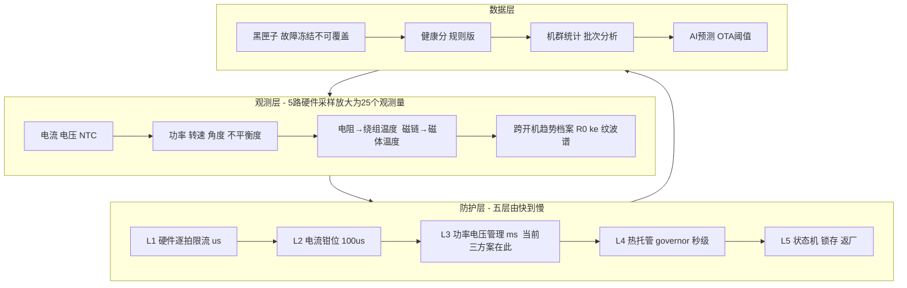

# 总体方案书：高速风筒电机安全与健康系统

> 本文是全书的**执行总纲**：一份可独立阅读的完整方案——背景结论、系统架构、四期实施计划（含当前进行中的工作）、定版参数表、实验计划、开放问题与资产索引。细节均有章节出处，本文只保留决策与执行所需的信息。
> 对象机：中驱 RIM.B02713100-04（Φ27 / 2 极 / 110 krpm / 相电阻 6.1 Ω / B 级绝缘 / 磁环 120 °C），平台：凌鸥 LKS32MC + 其 FOC 库（id=0 控制）。

---

## 1. 背景与已确证结论（一页读完）

**问题**：宽电压（85–265 VAC）旅行机高压端概率性烧马达、偶发 IPM 爆机；低压端从不发生。

**根因（已三重验证：物理推演 × 供应商 PQ 实测 × 现场温度）**：

1. 绕组按低压端设计（额定 140–180 VDC），高压端 325 V 母线下低调制比运行，**斩波损耗多 20–25 W**（同转速同风量，PQ 实测），其中 13–17 W 落在电机——高压端因此比低压端热约 20 K；
2. 高压端稳态 110–120 °C，**贴着材料红线跑**（磁环 120 °C、漆包线 130 °C）——均值贴线、公差尾部越线 = 概率性烧机；
3. 雪崩在正常风道下是收敛放大器（×1.17），真正的恶化路径是**堵风**（越堵越费电 +28 W 且散热崩塌）与**退磁棘轮**（磁体每次过热不可逆退一点、电流永久变大）；
4. IPM 爆响是能量学签名：高压端母线储能是低压端 5.8 倍，同样故障低压安静失效、高压放炮；
5. 265 VAC 角点 150–156 W **超过供应商 142 W 书面寿命红线**——软件限功率是规格合规要求，不是可选项；
6. 损耗型寿命不是短板：1000 h 验证底线，家用典型折算 ≈16 年；商用另立规格。

**设计总纲（三句话）**：真实世界校准程序世界（标定→锚定→互校，误差可收敛）；分层保护而非单点保护；接受体面退场（黑匣子留证→锁机→返厂，返修机变机群学习样本）。

## 2. 系统架构

各方案的输出（建议功率上限 / 停机请求）**统一进仲裁器取最严执行**——禁止策略互斥（附录 B/F 反复强调的教训）。

## 3. 四期实施计划

### 第一期（本周，进行中）：三方案上线 + 证据抢救

| 任务 | 状态 | 下厂前必改（附录 F）|
|---|---|---|
| 相电流不平衡→报故障停机（苏闯）| 已完成，0729 下厂 100 台 | 峰峰值指标改**整电周期 RMS**；动作分级；数据上电不可覆盖确认 |
| 超功率降转速 ≤142 W（范路阳）| 7/28 | 功率公式补 **3/2 系数**并统一功率定义；门限 **130 W**/迟滞 ±3 W；降 5k 无效 10 s → 升级停机 |
| I²t 防过热（张飞）| 7/28 | **换带散热项的一阶热状态**：$x{+}{=}\tfrac{\Delta t}{\tau}[(I/I_{cont})^2{-}x]$，τ 用 0728 温度曲线拟合，$I_{cont}$=0.75 A rms |
| 三方案仲裁器（几十行）| **待补** | 输出取最严；组合工况不留盲区 |
| 死区补偿确认/开启 | **待补（0 号任务）** | 决定方案 2/3 精度与未来测 R；E.7 六问之一 |
| **返修机抢救取证**（注销前）| **最急** | 三相电阻对称性 + 冷态 $k_e$（低 >4% = 退磁棘轮实锤）+ 拆机拍照分流 |
| 两个 10 分钟确认 | 待做 | 示波器量电机端子 PWM 电平（裁决 140–180 VDC 架构）；读固件实配 $f_{PWM}$/死区 |

### 第二期（2–4 周）：从"电流间接保护"升级到"温度直接保护"

| 任务 | 输入 | 输出与验收 |
|---|---|---|
| 热模型全量（双节点 + 电阻锚定，`ref-impl/thermal_model.c`）| 一期 τ 拟合数据、上电测 R | 估温 vs 热电偶误差 ≤±6 K（仿真已验证 3.3 K）|
| 温度红线保护：95 降额 / 105 平台 / 115 封波；磁链温度计守磁体 120 | 个体 $k_e$ 标定 | 265 VAC+45 °C+半堵风口，温度平台 ≤105 °C |
| $f_{PWM}$ 随母线调度 + 死区补偿正式版 | 扫频实验定最优载波 | 高压端输入功率下降 ≥5 W；电流过零无平顶 |
| 上电自检 v2（电流闭环注入 + 个体基线，`ref-impl/selftest.c`）| EOL 基线 | 健康放行/轻度降额/严重禁启；+15% 不平衡样机 100% 拦截 |
| 黑匣子完整版（环形缓冲 + 故障冻结 + 趋势档案）| 一期数据记录功能 | 故障注入后现场可导出、重新上电不覆盖 |
| 产线 EOL 四件套（R₀/$k_e$/零漂/增益写入）| 产线工装 | 每台档案可查；三相 R 不平衡 >3% 拦截 |

### 第三期（1–3 月）：性能与健康

- **Thermal Governor 全量**：恒功率钳位升级为温度闭环——冷机满血 110 krpm/140 W，热态稳温 105 °C（仿真：持续 126.8 W，比一刀切 120 W 多保 7 W 性能）；120–140 W 定义为受管理的 Boost 区；
- **健康分规则版**（~12 个物理特征加权 + 人话解释）+ 趋势预警（R 缓升=老化、$k_e$ 下降=退磁、governor 介入变长=散热衰退）；
- **供应商闭环**：带三样硬证据开会（142 W 红线与 265 V 角点实测、返修机 $k_e$ 统计、架构裁决结果）；索要磁环 Pc/装机退磁 FEA、油脂寿命曲线；
- **硬件补课决策点**（由二期数据裁决）：浸漆/漆膜等级升级（把材料红线 120/130 抬到 150+，硬件性价比最高）、必要时预降压级或重绕。

### 第四期（一季度起）：数据飞轮

机群平台（黑匣子汇聚）→ 批次统计与离群识别 → 阈值 OTA → ML 预测（失效分类、剩余风险分级）。铁律：**安全动作永远由可解释规则执行，AI 只做预测与洞察**。

## 4. 定版参数表（当前最优值，标 ▲ 者待实验精化）

| 参数 | 值 | 出处 |
|---|---|---|
| 恒功率门限（稳态/瞬态）| 130 W / 140 W ≤5 s | 附录 F（142 红线−误差−超调）|
| $I_{cont}$（I²t 基值）| 0.75 A rms ▲ | §7.0 / 附录 F |
| 热状态 τ | 150 s ▲（0728 曲线拟合替换）| §7.3 / 附录 F |
| 温度阈值 | 95 降额 / 105 平台 / 115 封波；磁体 120 硬线 | §8.2.3 |
| 硬件逐拍限流 | 2.5 A ▲（IPM SOA 复核后收紧）| §7.2 P1 |
| 三相不平衡 | 告警 3% / 停机 8%（RMS 基准，100 台分布修正）▲ | 附录 F |
| 过压/欠压 | 400 / 110 V | §7.2 P6 |
| 电流环 | $K_{p,q}$=16、$K_{p,d}$=7.5 V/A、$K_i$=1.53e5；÷当拍 $U_{dc}$ | §8.5 |
| 观测器 | 延迟补偿 21°；L 填 $L_q$ 相值 0.635 mH；PLL 带宽 $f_e$/10 调度 | E.6/E.7 |
| 启动 | I/F 0.45 A、切换 15–20% 额定转速 | §7.2 P8 |
| 故障管理 | 冷却 30 s、3 次锁存、禁止热重启 | §7.2 P10/P12 |

## 5. 实验与标定计划（合并版）

| 实验 | 一次完成的产出 | 状态 |
|---|---|---|
| E1 热标定（热电偶 + 多转速/多电压温升曲线）| τ、$R_{th}$、测点-热点温差、温度计精度验证 | 0728 已有一台，多台进行中 |
| 恒功率 A/B（高压钳 120 W 测温度回落）| 根因分账：功率 vs 纹波各占几成 | 方案 2 顺手可做 |
| $f_{PWM}$ 扫频（32/48/64/96 kHz 记输入功率）| 纹波账/板损账分离 + 最优载波 | 待排 |
| 死区补偿 A/B | 失真损耗账 + THD 对比 | 待排 |
| 故障注入全套（堵转/缺相/过压/超温/失步各触发一次）| 漏报率 + 触发值与响应时间归档 | **每条保护必须被真实触发过一次才算存在** |
| 100 台正常机分布 | 误报率 + 阈值分布依据 | 0729 下厂 |
| 返修机取证（R 对称性/$k_e$/拆机）| 根因统计、退磁棘轮裁决 | **最急，注销前** |

## 6. 开放问题（按影响排序）

1. **【头号】140–180 VDC 架构**：整机是否 325 V 直驱？若是=电机超规运行，寿命数据不可平移（10 分钟示波器实验裁决）；
2. 凌鸥库六问（E.7）：延迟补偿参数、死区补偿、**R 是否运行时可写**、PLL 带宽、$i_q$ 限幅挂点、L 单位约定；
3. 固件源码接入（决定参考实现"接管 vs 外挂"）；
4. 供应商待答：磁环成品 Pc 与装机退磁 FEA、轴承油脂寿命曲线、绕组线径与漆膜等级确认。

## 7. 资产索引（哪个问题查哪里）

| 要查什么 | 位置 |
|---|---|
| 原理与理论（电磁/FOC/工作过程）| 第 1–5 章 |
| 烧机根因与判定实验 | 第 6/10 章 |
| 参数整定与防线设计 | 第 7 章、附录 E |
| 实测数据（规格书/磁体/PQ）| 第 8 章 |
| 观测量与温度计 | 第 9 章 |
| 损耗账与热治理 | 第 11 章、附录 A |
| 小白讲解与行动清单 | 第 12 章、附录 E |
| 会议与执行表评审 | 附录 B/F |
| AI 路线与客户话术 | 附录 C |
| 测量与误差手册 | 附录 D |
| **可编译代码（15/15 仿真验证）** | `ref-impl/` |

## 8. 总验收标准（做到即结案）

1. 265 VAC + 45 °C 环境 + 半堵风口，连续运行温度平台 ≤105 °C，全程无封波，冷机 110 krpm 可达；
2. 任一电压任一工况，电机功率永不越 142 W（稳态 ≤130 W）；
3. 全部保护经故障注入真实触发并归档；100 台正常机零误报；
4. 每台出厂带个体档案（R₀/$k_e$/零漂），每次故障有黑匣子现场；
5. 烧机与 IPM 爆机现场归零；损耗型寿命回归 1000 h 包络（家用 ≈16 年）。
