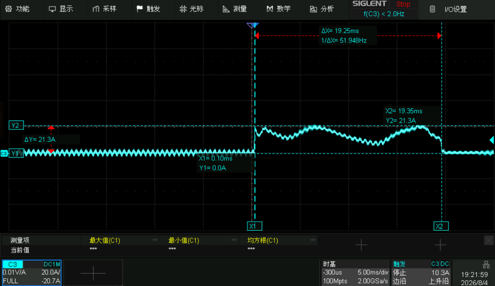
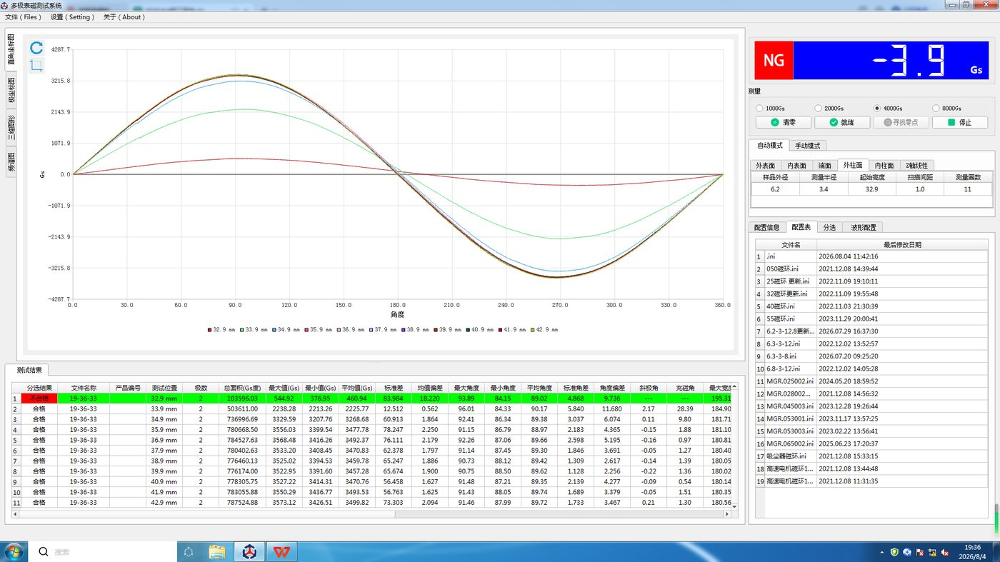
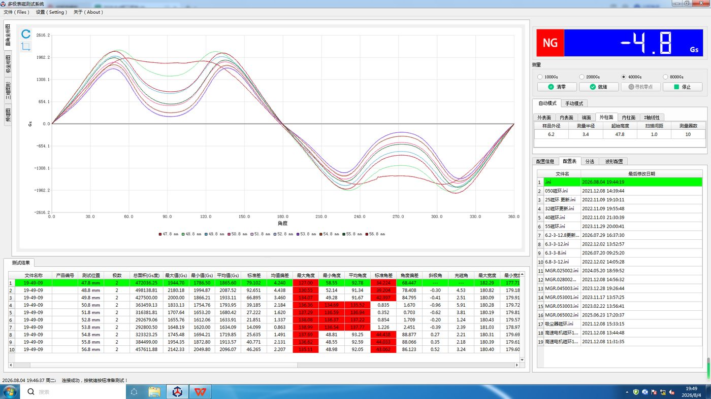
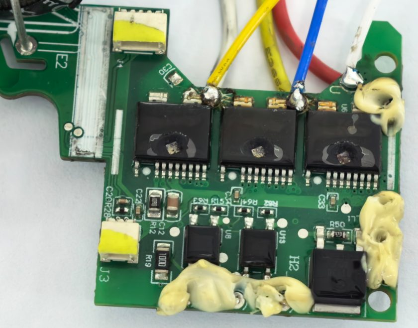

# 附录 K 中驱"大电流冲击退磁"实验解读：还原、定量重建与批判性分析

> 本附录由这份数据驱动：中驱（CND）2026-08-04 完成的模拟实验——"921 电机，PCBA 模拟换向错误，导致瞬间大电流冲击"。原始文件含 11 张图：良品表磁基线扫描、事故机表磁四视图（波形/极坐标/3D/频谱）、示波器故障电流波形、三颗 SPM 全部炸穿的板照。本文先把实验完整还原，再用第一性原理逐项重算，最后按证据台账纪律（附录 J）评定：它证明了什么、没证明什么、对根因案件的影响是什么。
>
> 写作纪律说明：本文全部定量结论都经过 8 路独立复核（每路一个专责物理审稿人，被要求"积极驳倒"），初稿中"19.25 ms=减速到堵转""外部电流反证槽内根因""退磁=板侧实锤"三处过度声称已在复核后撤回或加边界——正文即修订后版本，K.7 保留了修订记录。

## K.0 一句话总评

**这是一次高质量、高价值的实验：它在真实硬件上复现了"爆响"的终局解剖（die 热死 → 高压能量倾泻 → 封装爆裂），并建立了"板侧持续大电流事件"的电机侧签名基准（阻值正常 + 线包完好 + 磁体重退磁 + 电感升平至 Lq）。但必须读准它的边界：它演示的是一条被软件强制触发、保护被旁路、且在 19 ms 后因器件炸成开路而自行熄灭的路径；它对现场失效分布不构成任何频率性陈述，也不能仅凭签名断言"是电机先坏还是板子先坏"。它与 8D 主根因（槽内绝缘弱点）的关系是：一致性支持 + 补齐法医判别工具，不是谁反证谁。**

## K.1 实验还原

### K.1.1 实验条件（转述自 CND 报告）

- CND 生产的 100–240V 宽电压 PCBA，**修改软件程序**（强制开关状态，意味着正常保护逻辑被旁路——见 K.4.2）；
- 921 电机（即量产 J7U 电机：规格书文件名 DY-921-3C RIM.B02713100-004-3H，Φ27、1685 绕组，与我们全书分析的是同一台）。**拓扑钉死**（复核指出的自洽性要求）：表磁扫描"样品外径 6.2 mm、测量半径 3.4 mm"说明被扫的是 **OD≈6.2 mm 的内转子磁环**；"Φ27"是定子/机壳外径。若真是 Φ27 外转子，110 krpm 线速 155 m/s，烧结磁环早就飞了——内转子拓扑同时决定了退磁阈值的几何换算与转动惯量量级；
- AC 220V 正常运行 60 s（预热+确认正常）；
- 然后软件强制：**U 相上管开通，同时 V/W 相下管开通并保持**。

### K.1.2 这个开关状态在电路上是什么

U+/V−/W− 恰好是 SVPWM 的**基本有效矢量 V1(100)**——正常运行中每个 PWM 周期都会出现微秒级的这个状态；异常在于**把它锁定不放**。锁定后电路变成一个纯直流回路：

```
母线+ ──U相上管──> U相绕组(6.1Ω) ──> 中性点 ──> V∥W相绕组(3.05Ω) ──V/W下管──> 母线−
```

绕组回路电阻 ≈ 9.15 Ω（25 °C 相值），电气时间常数 τ = L/R ≈ 50–100 µs——电流在**亚毫秒内**冲到回路极限。

**它模拟的真实故障面比"换向错误"宽，但都有一个共同前提。**"换向错误"（选错扇区）是微秒级、开关仍在进行的事件，不是这个。能产生等效效果的真实故障至少有三类：①MCU 挂死且 PWM 寄存器冻结在有效矢量（看门狗未起效）；②栅极驱动闩锁把某只管子焊在常通（其余桥臂即使继续开关，等效也是反复施加大电流矢量）；③无传感器观测器冻结（估计角卡死）+ 电流环积分饱和无抗饱和 → 输出准静止的满调制矢量，效果与锁定矢量等价。**三类共同前提：过流保护链（硬件 ITRIP/比较器/软件 OCP）同时失效或不存在**——否则事件会在微秒-毫秒级被切断，走不满 19 ms。

### K.1.3 观测数据清单

| # | 数据 | 内容 | 等级 |
|---|---|---|---|
| O1 | 示波器电流波形 | 探头 0.01 V/A，20 A/div，5 ms/div：故障注入后电流跳升，游标峰值 **21.3 A**；包络叠加约 10 ms 周期的鼓包 ×2；**19.25 ms** 后电流骤降为零（IPM 爆裂开路） | A |
| O2 | 板照 | **三颗半桥 SPM 全部炸穿**（封装中央开坑） | A |
| O3 | 事后电测 | 绕组线阻 **12.25 Ω = 正常**（规格 12.2±10%，也说明事发时绕组接近冷态）；"Ld" 测得 **1.3 mH**（规格 0.6±10%）；线包外观正常 | A |
| O4 | 良品表磁基线（19:36 测） | 中段各高度峰值 ≈**3400–3570 Gs**（均值 ~3485，平台平坦 ±2.4%），极边界角 ≈90°，THD 4.35% | A |
| O5 | 事故机表磁（19:49 测，同日同机同探头） | 中段各高度峰值 ≈**1620–2150 Gs**：N 极损失 ≈44%、S 极 ≈49%（基线各高度离散仅 ~5%，夹具零点差解释不了 45% 量级的损失）；N/S 不对称 ~8.5%；THD **14.5%**，三次谐波达基波 12.5%（占 THD 功率 74%——极面中部塌陷/平顶化，是局部深退磁的形状签名）；波形呈"驼峰"畸变。峰值角 127–139° vs 基线 ~90° 的**绝对角度**对比需机械角度基准（键槽/标记）才有效，两次扫描若无索引应改用与夹具无关的形状量：N-S 边界间距（健康=180°）、极宽、峰-边界偏移 | A |


*O1 示波器原图：左段为正常运行电流（±2 A 包络），X1 处注入故障，X2（19.25 ms 后）电流归零 = 器件炸成开路。注意包络上两个 ~10 ms 周期的鼓包*


*O4 良品基线：各测量高度波形重合、正弦干净、极边界 90°*


*O5 事故机：整体幅值塌陷 44–49%，波形驼峰畸变、峰值角偏移*


*O2 三颗 SPM 封装中央全部开坑*

## K.2 定量重建：每个数字都能从物理算出来

### K.2.1 为什么是 21.3 A（而不是 34 A）——电流波形是一台自校准仪器

只算绕组：311 V ÷ 9.15 Ω = **34 A**。实测峰值 21.3 A，缺口本身携带信息：

1. **器件电阻被实测电流"标定"出来了**。由 21.3 A 峰反推回路总阻 = 311/21.3 ≈ 14.6 Ω：绕组热态 ~9.8 Ω + **器件与源阻抗合计 ~4.8 Ω**。小电流 SPM（1.5 A 级 FRFET）的热态 Rdson 每颗 ~2–3.5 Ω，两颗半导通路径正好吃掉大头；EMI 滤波电感、整流桥、NTC 分剩余。器件电阻与上游源阻抗的精确分配需要母线电压波形才能定夺，但量级自洽；
2. **母线在 100 Hz 上"呼吸"**。188 µF 电容在 21 A 放电下压降率 ≈113 V/ms——两个市电峰之间根本撑不住，母线深度跟随整流市电起伏。电流包络上那两个 ~10 ms 周期的鼓包正是 **100 Hz 整流纹波**直接写在电流上。定量排除另一种解释：故障窗口内转子电频率始终 >1 kHz（见 K.2.2），物理上产生不了 10 ms 周期的调制；
3. **量纲纪律**：与 21.3 A 峰对应的是纹波**波峰**处的母线（约 195–310 V 区间，取决于分配），母线**均值**在深度调制下要低得多；事件平均输入功率 ~2–3 kW，电流峰处回路瞬时耗散 ~6.6 kW（绕组 ~4.2 kW + 三管 ~2.4 kW）。"若母线硬撑 311 V"的反事实功率是 10.6 kW——无 PFC 架构的塌陷反而当了半个限流器；
4. **两个未闭合的缺口（诚实记录）**：
   - **21.3 A 应读作"该时刻峰值的下限"**。故障注入瞬间电容近满压（放电时间常数 R·C ≈ 1.7 ms ≫ τ_elec），理论首峰 26–34 A，反电动势最不利叠加时瞬时可到 ~45 A——5 ms/div 时基极可能欠分辨了这个亚毫秒首峰。另一候选是器件进入饱和区限流（若如此，管子瞬时耗散千瓦级，反而更强地解释 19 ms 死亡）。裁决需要原始波形与 SPM 数据手册输出特性（S7/S8）；
   - **100 Hz 鼓包有一个竞争解释要排除**：转子被直流磁场"俘获"前后的摆动振荡，频率 √(1.5ψf·I/J)/2π ≈ 124–215 Hz（取决于 J），与 100 Hz 同量级。现有数据的唯一旁证是**鼓包从故障一开始就存在**——高速段（>1 kHz 电频率）物理上不可能有俘获摆动，故整流纹波解释目前占优；复测时加母线电压通道 + 市电同步触发即可一锤定音（S7）。

**低压端外推**：170 VDC 下同类故障鼓包峰 ≈ 21.3×(170/311) ≈ **11.6 A**，但首峰可到 170/9.15 ≈ 18.6 A——这个数恰骑在退磁特征电流上，K.5 的对照实验设计因此要避开 120 V（见 S5）。

### K.2.2 为什么是 19.25 ms——это die 的存活时间，不是转子的

初稿曾把 19.25 ms 解读为"转子减速到堵转的时间"，复核驳回，修订如下：

- **电流归零的定义性含义**：若转子先停而管子还在导通，直流电流（母线/回路电阻）会持续存在。电流骤降为零只能意味着**导电路径断了**——die 炸裂/键合线熔断，失效为开路。所以 19.25 ms 按定义是**器件存活时间**；
- **die 的热死账**：U 相上管峰值耗散 ≈ 21.3²×3.2 ≈ **1.4 kW**（100 Hz 脉动，均值 ~720 W），打进毫克级硅片（热容 ~1–3.6 mJ/K），升温率 5×10⁵–10⁶ K/s 量级，计入瞬态热阻后 die 必死于毫秒-数十毫秒——**19.25 ms ≈ 两个市电波峰：die 死在第二个 100 Hz 加热波峰附近**，时序完全自洽。反向佐证：若是 IGBT 型 SPM（饱和压降 ~2 V），单管仅 ~43 W，热死要上百 ms——19 ms 的死亡时间本身就指认了 MOSFET(FRFET) 型器件；
- **转子当时多半还在转，但转多快取决于一个没测过的量**。发电短路电流（凸极修正后 ≈10 A 幅值）对应制动功率数百瓦；停转时间对转动惯量一阶敏感，而 J 只有估计值：本书基准机取 3×10⁻⁷ kg·m²（含风轮）→ 停转需 ~90 ms，19 ms 时仍 ~70–80% 转速；按 6.2 mm 磁环+轴+小风轮的几何重估 (0.3–1)×10⁻⁷ → 19 ms 恰可能接近停转俘获。**两种叙事（"die 死于第二个市电加热峰"与"die 死于停转俘获、EMF 归零、电流最大"）在 J 实测前不可裁决**，且它们对退磁形貌的预言完全不同（K.2.4）。**判决方法零成本**：回放示波器存储波形提取电流高频纹波的瞬时频率——它就是转子电频率，从 1833 Hz 起的衰减曲线即减速史，顺带反演出真实 J（S7）；
- **能量账的主次**：母线在 19 ms 内馈入回路 ~45–70 J，是主项；转子动能 ½Jω² ≈ 20 J 只部分释放，是次项。初稿"动能大部分倾入绕组"主次颠倒，已更正。

### K.2.3 为什么线包毫发无损——以及这个结论的适用边界

**U 相绝热温升**：以峰值电流和热态电阻计的严格上限 ΔT ≈ 130 K；按 100 Hz 深度调制的现实 RMS（10–17 A，取决于包络占空比）计 ≈ **25–85 K**。V/W 相各承一半电流，温升仅 U 相的 1/4。0.16 mm 线在 1.8 kHz 下无集肤效应（集肤深度 1.55 mm ≫ 线径）。叠加初始绕组温度（60 s 轻载后接近冷态，<50 °C），热点瞬时 <200 °C，经历高温的时间为亚秒级（加热 19 ms + 冷却弛豫 ~0.1–1 s）——B 级漆膜的热老化是小时-千小时尺度的化学过程，这点热冲击碰不掉它。**阻值正常、外观正常完全符合物理。**

**但这个"绕组免疫"有一条精确的边界，是本附录最重要的修订**：

- Φ0.16 mm 铜线的绝热熔断阈值（Onderdonk）≈ **30 A²s**。本次事件实际 I²t ≈ 4.4–8.7 A²s——距熔断只有 **3.5–7 倍**裕度；
- 这个裕度不是绕组挣来的，是**器件在 19.25 ms 炸成开路**送的——硅当了保险丝；
- 若事件形态稍变：器件失效为**短路态**（硅器件的常见失效方向）而市电经整流桥持续续流，34 A 只需 **~32–43 ms** 就把 0.16 线熔断如保险丝；~100 ms 级即可造成槽内绝缘热损伤。**因此"外部大电流事件烧不出现场绕组签名"只对"≤20 ms 自熄灭"这一子类成立**——初稿据此写下的"反证槽内根因"过度外推，已撤回（K.7）。判定现场"熔断开路"机器的归属，还需要事件时长的旁证：输入保险丝状态（M15）、IPM 失效模式（开路/短路）、烧点位置。

### K.2.4 为什么磁铁退磁 44–49%

**特征电流**：完全抵消定子磁链所需 |i_d| = ψf/Ld_ph = 5.7 mWb/0.30 mH ≈ **19 A**。两个反向修正让它是"特征量级"而非精确膝点判据：漏感不参与退磁（按 Lmd 算阈值略升）；深负 id 下 d 轴去饱和 + 热态 ψf 下降（有效阈值可低至 ~12–18 A）。

**电流够不够**：锁定矢量下电流空间矢量幅值 = 21.3 A 且方向固定，转子每个电周期都有一段磁弧面对最坏对准（id ≈ −21.3 A）＞特征电流。

**温度是承重墙**：42SH 的膝点核算（按规格书两点内插 HcJ：50 °C ≈17.4、80 °C ≈14.3 kOe；normal 曲线膝点 B 值 25 °C 为 −0.39 T、60 °C 为 −0.14 T、80 °C ≈ 0 T）给出：**25 °C 下压到 B=0 不会不可逆退磁；磁温 ≥ 约 60–80 °C 时"压过 B=0 并局部反向"才过膝**。60 s 满速运行后的磁温是 50 还是 80 °C，直接决定这算不算最坏情况——**照片里电机上明明缠着热电偶，数值却没进报告**（S4）。叠加槽口/边缘/空间谐波的 1.2–1.5× 局部场增强，44–49% 的实测损失定性可达。

**形貌的诚实解读（复核后重写）**：损失量级（−44~49%）稳健——基线各高度离散仅 ~5%，夹具差解释不了。但 **N/S 不对称 8.5% 是一个真正的物理问题而非"相容"细节**：高速旋转中两极每转交替暴露于同一静止退磁场，退磁必然对称；8.5% 的偶次分量只能来自三种候选——(a) 转子在断流前已减速到俘获/近停转，发生了定轴深退磁（要求 J 偏小，见 K.2.2）；(b) **U 相断流 ≠ 事件结束**：若 V/W 下管失效为短路态，V–W 回路仍在发电制动并定轴退磁——U 相探头上的"电流归零"看不见这条回路（S8 逐管测绘直接裁决）；(c) 该转子出厂固有不对称（无同转子故障前扫描，无法排除，S1 关闭）。THD 里三次谐波占功率 74%（极面中部塌陷）是局部深退磁的形状签名；建议 CND 补报 C2 与直流偏置分量，它们正对应 N/S 不对称的定量口径。

**排除性检查**（复核补强）：纯热退磁需磁体 >150 °C（与事后绕组冷态电阻矛盾）；可逆温度损失已被"同日冷态复测"排除；机械损伤与外观矛盾——**场+温协同的电枢反应退磁是唯一存活解释**。MMF 量级旁证：锁定矢量磁势 ~5100 At，除以有效双侧气隙 ≈14 kOe 量级 vs 热态 HcJ ~11–14 kOe——闭环。

### K.2.5 为什么"Ld"翻倍到 1.3 mH——退磁的电气指纹

事后测得 1.3 mH ≈ **Lq 规格值 1.27 mH**，不是巧合。本电机凸极比 2.1 的来源用排除法只剩饱和：几何凸极（磁环 μr≈1.05）上限 ~1.05，磁体各向异性上限 ~1.2，只有**磁钢磁通把 d 轴铁芯压进饱和**够量级。退磁 44–49% 后齿部磁密从深饱和（~1.6–2.0 T）跌到 ~0.9–1.1 T（远低于硅钢膝点），两轴均线性化 → 电感随转子角的调制塌掉，读数趋向不饱和值 ≈1.27–1.35 mH。实测 1.3 mH 正落此区间。

**方向判别（复核确认）**：匝间短路只会让测得电感**下降**（短路环反射阻抗）——但注意量级：单匝短路在 1 kHz 下 ΔL/L ≈ −3×10⁻⁵，仪表根本看不见；要整线圈级短路才降 ~25%。所以"电感上升"排除匝间短路是可靠的，配合直流电阻正常（12.25 Ω）双保险。

**判别实验升级为定量判据**：线电感 L(θ) 的极值严格等于 2Ld_ph 与 2Lq_ph，即健康机 0.60↔1.27 mH，**调制度（峰-峰/均值）≈72%**；退磁机预计跌到 **<10–15%**（不会完全平：N/S 不对称与磁体回复磁导各向异性留下百分之几残余）。操作要点：10–15° 步进转一整圈、三对线端都测、**与基线同 LCR 同频率同电平**（实心转子涡流屏蔽使读数随频率变，跨频率对比会引入 ±10% 假差）。单点 1.3 mH 与"健康机恰好测在 q 轴"完全简并——**必须测整条曲线才算数**（S3）。

## K.3 实验证明了什么（三条硬结论，各带边界）

### K.3.1 "爆响"终局解剖在真实硬件上复现

高压端持续 ~20 A 级桥臂电流 → die 热死 → 高压能量倾泻 → 封装爆裂，全过程 19 ms。第 21 章 H.6/H.7 的解剖从推理升级为演示过的事实，且有两处修正性深化：

- **爆裂能量的主项可能不是电容残能**（9.1 J @311 V，且每 10 ms 被市电重充），而是 die 失效短路后**市电经整流桥的续流**——直到键合线/走线烧断，可追加数十 J。这把 M15（输入保险丝/走线熔断特性）的地位再抬一级；
- **"三颗全炸"不需要级联剧本**：锁定矢量让三颗模块各有一颗 die 同时过载（U 上管 21.3 A ≈ 额定 14 倍；V/W 下管各 10.65 A ≈ 7 倍）——三颗独立热死即可解释全炸。但现场验尸的"驱动芯+上管跨多相"签名仍需耦合机制，最强候选是**共用 15 V 驱动电源/自举轨反灌**（首颗 die 栅-漏熔通后母线高压倒灌驱动轨）——这恰是 S8 验尸要查的（V/W 模块坏的是哪只管、驱动轨是否击穿）。

### K.3.2 "板侧持续大电流事件"的电机侧签名基准首次建立

| 检测项 | 板侧持续大电流（本实验基准） | 现场主流返修签名 |
|---|---|---|
| 三相电阻 | **正常且对称**（12.25 Ω） | 单相 −3 Ω（吃掉一只线圈）或开路 |
| 线包外观 | **正常** | 正常（熔断点极小）或局部烧蚀 |
| 对机壳绝缘 | 正常 | **9/18 塌方 ≤360 kΩ** |
| 表磁 | **−44~49% + 角度畸变** | 待普查（注意：绕组先失效路径**同样可能退磁**，见 K.6.2） |
| 电感 | **升平至 ~1.3 mH，调制度塌掉** | 短路型下降（整线圈级），开路型无法测 |
| IPM | 三管炸开路 | 短路型拖炸（71%），开路型多存活 |

**用法警告（复核修订）**：退磁本身**不是**板侧先失效的实锤——单线圈焊死短路（绕组先失效）后，7–9 A 感应电流持续数秒直至停转，退磁能力不弱于 19 ms 的 21 A；纯热失控（堵风/抱死，HcJ@120 °C 腰斩）也退磁。**组合判据才有判别力**：退磁 + 三相平衡完好 + 对壳 OL + 板侧驱动/上管损伤 + 轴承正常 ≈ 板侧先失效；缺一项都要存疑。

**退磁作为"故障拓扑指纹"（复核补强，比绕组免疫更有判别力）**：桥臂直通（同桥上下管同时导通）的短路电流**不经过电机绕组**——单模块炸、无退磁；锁定有效矢量的电流**全程流经绕组**——≥3 只管受流、有退磁。所以对失效板+电机做"炸了几颗模块 × 电机退磁与否"的二维分类，能直接区分两种板侧故障拓扑；现场验尸"真直通仅 1/17"可用返修电机的退磁普查交叉验证。

**"磁体事前健康"的现成旁证**：故障前 60 s 正常运行电流包络 ±2 A——若 ψf 事前已减半，同负载下电流应近翻倍。这一条免费封死"该电机磁体本来就弱"的质疑。

**ke 的预测数（供 S2 直接对照）**：基线 ke ≈ 0.73 V(线 rms)/krpm；按表磁损失 44–49% 预测事后 **0.37–0.42 V/krpm**。电机绕组完好、只是驱动板死了——外拖测 ke 十分钟就能对退磁量闭环。

### K.3.3 绕组免疫性给出的是"下界约束"，不是反证

本实验证明：**≤20 ms 内自熄灭的板侧大电流事件烧不出现场的绕组损伤签名**（I²t 只有熔断阈值的 1/4–1/7，K.2.3）。这排除了"短促板侧事件伪装成绕组失效"的可能，是对 8D 根因的**一致性支持**。但它**不能**排除"长板侧事件"（器件短路失效+持续续流，~30–100 ms 级）熔断绕组的可能——那类事件与绕组内部起弧在"熔断开路"签名上暂时无法区分，判别要素是：输入保险丝状态（M15）、该机 IPM 失效模式、烧点在槽内还是随机位置（V1 拆解）。**8D 主根因的支柱仍然是它自己的六条证据线**（17:1 电压闸门、对地塌方、Paschen、3–30 h、湿度梯度、槽几何），本实验没有动摇它们，也没有替它们作证。

## K.4 实验没有证明什么（读结论前必须过的清单）

1. **没有演示触发源**：软件强制 ≠ 现场自发。三类候选触发（K.1.2）的现场发生率，本实验不提供任何信息；
2. **保护被旁路**：21 A 流了 19 ms 无任何保护动作。**M5（生产件过流保护实况）由"待查"升级为"必查"**——它是把本实验映射到现场发生率的前置条件。还要补一个统计视角：板侧事件若被正常 OCP 掐断，不留任何电机签名——这类"未遂事件"在现场被系统性漏计；
3. **对现场失效分布不构成频率陈述**：返修 23 台中电气完好者仅 5 台（≤22%，且返修样本非随机）；爆响占总失效 32%；板尸检真直通仅 1/17——板侧自发先失效即使存在，占比受这些数字约束。注意"驱动芯+上管"损伤模式是双向的（既可能是果也可能是因），不能单独用来定方向；
4. **方法学缺口**：n=2 但只见到 1 台的表磁扫描；无 ke 前后对比；基线非同一台电机的前测（起始高度 32.9 vs 47.8 mm，夹具零点未复核——好在基线平台平坦 ±2.4%，44–49% 的损失量级稳健，但 8.5% 不对称的解读要缓行）；磁温未记录（热电偶就在电机上）；只测了 220 V 一个电压点。

## K.5 给 CND 的改进建议（都便宜，多数当天可做）

| # | 建议 | 成本 | 换来什么 |
|---|---|---|---|
| S1 | 试验电机**前/后同夹具**表磁扫描，n≥3 | 每台 +10 min | 44–49% 摘掉夹具不确定性帽子；8.5% 不对称能否作证得到裁决 |
| S2 | 前/后 **ke 测量**（定转速拖动测线 EMF） | 10 min | 直接给出控制方程里的 ψf 损失，8D 可引用 |
| S3 | **L–转子角整圈曲线**（前/后，同 LCR 同频同电平，10–15° 步进） | 20 min | 调制度 72%→<15% 是退磁专属指纹；单点 1.3 mH 升级为实锤 |
| S4 | 报告**磁体温度**（热电偶已在电机上） | 0 | 磁温 ≥60 °C 是退磁论证的承重墙（K.2.4），一个数字定乾坤 |
| S5 | **两条对照腿，避开 120 V**：①退磁零对照用 AC 60 V（首峰 9.3 A）或 48 V 限流直流（5.2 A）——预测表磁变化 <±3%、L 仍 0.6 mH、器件大概率存活可复测；②烈度对照用 AC 110–120 V——预测 die 仍死但慢（~30–60 ms 级），电容 2.7 J @170 V，**爆裂烈度显著下降但不保证安静**。120 V 单独做不了退磁对照：首峰 18.6 A 恰骑在 19 A 特征电流上，结果注定模糊 | 一天 | 退磁阈值与"烈度=f(Udc)"各得一条干净的 A 级证据；低压腿还免费送完整减速曲线 ω(t)（全程可观测），直接反演 J |
| S6 | **带量产固件+全部保护重跑** | 半天 | 直接回答 M5：保护链能否在 µs–ms 级掐断此路径；"现场为何 OCP 没动作"是把本实验映射到现场的唯一钥匙 |
| S7 | 导出示波器**原始波形数据**做三件事：①电流高频纹波瞬时频率分析（=转子电频率 1833 Hz 起的衰减史 = 减速曲线 + 反演 J，一举裁定 19.25 ms 的两种叙事与退磁形貌机理）；②检查故障注入后首毫秒有无 26–45 A 初始尖峰；③复测时加**母线电压通道 + 市电同步触发**，一锤裁决 100 Hz 鼓包归属（整流纹波 vs 俘获摆动） | 0（回放）+复测半天 | 三个悬而未决的问题当场关闭 |
| S8 | 三颗炸管**逐管曲线追踪**画出六管短/开映射 + 驱动轨验尸：V/W 模块坏的是上管还是下管？失效态是短路还是开路（若 V/W 下管短路，U 断流后 V–W 发电回路仍在定轴退磁——直接解释 N/S 不对称）？15 V 驱动轨/自举二极管是否击穿？ | 半天 | 同时裁决"独立热死 vs 驱动轨反灌"、N/S 不对称候选 (b)，并与现场"主芯+上管"签名逐项对照 |
| S9 | **备用转子直流脉冲阶梯退磁标定**：锁角、控温（25/60/80/100 °C），电流逐级 5→25 A，每级扫表磁 | 一天 | 用实测曲线取代解析估计，一张图给出"电流×温度→损失%"全地图——这是把 19 A/12–22 A 之争彻底关闭的唯一方法，也是软件退磁保护阈值（K.6.4）的标定依据 |

## K.6 对案件的影响

### K.6.1 证据台账新增 F13（A 级）

CND 2026-08-04 锁矢量冲击实验：21.3 A 峰/19.25 ms/三管炸开路/绕组完好（12.25 Ω）/表磁 −44~49%/电感升平 1.3 mH。**支持**：pop 终局解剖（H.6/H.7）、"烈度=f(Udc,Tj)"框架、die 热死时序（100 Hz 脉动加热，死于第二个市电峰）。**建立**：板侧持续大电流事件的电机侧签名基准（K.3.2 表）与"≤20 ms 自熄事件烧不断绕组"下界约束。**不改变**：P-A 槽内路径领先的排序——其六条证据线未被触动；本实验同时提醒"长板侧事件"（器件短路失效+续流）在"熔断开路"子集里尚未被排除，判别抓手是 M15 保险丝、IPM 失效模式与烧点位置。

### K.6.2 返修机普查协议立即加三项

1. 对 18+5 台全部补**表磁扫描 + L(θ) 曲线**（或至少 ke），重点是 5 台"良品"电机与"电机完好却爆响"的机器——按**组合判据**（退磁+绕组完好+对壳 OL+板侧上管/驱动损伤+轴承正常）分类，而不是"退磁=板侧"单指标；
2. 拆解 V1 增加一个锋利判别项（源自复核提出的竞争假设）：**被吃掉的那只线圈是"线端首线圈"还是"中性点端线圈"？**若 6/7 台系统性地是线端首线圈——指向 PWM du/dt 在串联线圈上的不均匀分布（首线圈承受不成比例的电压阶跃），这会把 8D 的"槽内随机弱点"细化为"线端首线圈+槽口弱点"，直接改变整改焦点（首线圈绝缘加强/进线布置），且与 17:1、对地塌方、湿度梯度全部相容——它是 P-A 的细化，不是否定；
3. "熔断开路"的 11 台：逐台记录**输入保险丝状态与 IPM 失效模式**（开路/短路），用于排除"长板侧事件"混入（K.3.3）。

### K.6.3 电压对烈度的作用链再获支持，但要说准

低压端同类故障：电流 ~11.6 A（die 仍会死，只是慢），电容储能 2.7 J @170 V、市电续流减半——**爆裂烈度显著下降、爆响概率大降，但"必然安静"说不出口**（2.7 J 仍在小封装开坑阈值之上）。这与现场"爆响 92% 集中在高压区、低压区总失效率仅 0.009%"继续自洽。注意逻辑方向：电压闸门筛的是**烈度与绝缘点火**，不筛"电机先坏还是板子先坏"——两条路径都被同一道闸门筛过，方向判定只能靠 K.3.2 的组合签名。

### K.6.4 软件防线新增明确需求：退磁检测与锁矢量免疫

1. **上电自检加退磁检测**：现有自检测 R（拦单线圈短路）；加 L 脉冲测量或 I/F 微转 EMF 采样估 ψf，对照出厂标定——被冲击过的电机（退磁 40%+、L 升平）拦在下一次上电。第 9 章"磁链温度计/退磁棘轮"的实战版；
2. **锁矢量免疫四件套**（对应 K.1.2 的三类触发+共同前提）：硬件级 ITRIP/比较器关断（不依赖软件活着）；看门狗超时把 PWM 置于全关安全态（LKS32MC071 的 Break 输入接过流比较器，M5 待查）；电流环抗饱和 + 观测器失效检测（估计角冻结 → 强制降级/停机）；驱动逻辑供电欠压锁定。**四件里任何一件在生产件上真实有效，本实验路径在现场就走不通**——逐一验证并写进测试规范，比争论"谁先坏"更有生产力。

### K.6.5 进入 8D Rev B 的位置与措辞

D4.1 失效链第 2–3 步标注："已由供应商破坏性表征试验在真实硬件上复现（2026-08-04）"。D4.3 新增板侧子模式及组合判据。关键行动清单追加：返修机表磁/L(θ) 普查、CND S5/S6/S7/S8、M5 保护链书面确认、V1 拆解增加"首线圈判别"。**对 CND 实验的中性表述模板**（供报告直接引用）："保护旁路条件下锁定有效矢量的破坏性表征试验：建立了该类事件的终局签名基准与检测方法，并给出'≤20 ms 自熄灭板侧事件不足以熔断绕组'的下界约束；不构成对现场失效分布的频率性陈述。"

## K.7 修订记录（本附录自身的批判性自查）

初稿三处过度声称，经 8 路独立复核后修订：

| # | 初稿声称 | 复核裁决 | 修订后 |
|---|---|---|---|
| 1 | "19.25 ms ≈ 转子减速到堵转的时间"，并反推 J 自洽 | 驳回：电流归零=器件开路而非转子停转；短路制动 19 ms 内停不下来；反推 J 是循环论证 | 19.25 ms = die 存活时间，死于第二个 100 Hz 加热波峰；转子爆裂时仍 ~60–85% 转速（J 待 S7 裁定） |
| 2 | "外部 21 A/19 ms 烧不出现场签名 → 现场主流失效**必须**起于绕组内部（反证）" | 驳回全称否定：仅对"≤20 ms 自熄"子类成立；器件短路失效+续流时 34 A/~40 ms 即可熔线 | 降级为"下界约束 + 一致性支持"；判别改靠保险丝/IPM 失效模式/烧点位置 |
| 3 | "返修机若退磁 = 板侧先失效**实锤**" | 驳回：绕组先失效（焊死短路数秒）与纯热失控同样退磁 | 改为五项组合判据（K.6.2） |

方法论教训与附录 J.6 相同：单条证据的"方向"容易读对，"强度"容易读过。所有"实锤/反证/必须"类词汇，必须先过"还有没有别的通路能产生同一观测"这一问。

## 参考资料

附录 J（证据台账，F13 并入）、附录 H.6/H.7（pop 解剖）、第 8 章 §8.7（42SH 退磁边界）、第 9 章（磁链温度计/退磁棘轮）、第 10 章（退磁棘轮机制）、附录 G（匝数与参数标度）；CND《大电流冲击后退磁实验》2026-08-04（原始 11 图）；IEC 60034-18-41（变频供电绝缘系统，首线圈电压分布背景）。
